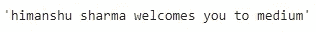
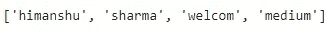
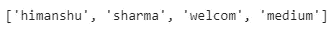

# 预处理文本数据

> 原文：<https://towardsdatascience.com/preprocessing-textual-data-c0527ef8b8c5?source=collection_archive---------28----------------------->

## 使用 Cleantext 清理文本数据集


[真诚媒体](https://unsplash.com/@sincerelymedia?utm_source=medium&utm_medium=referral)在 [Unsplash](https://unsplash.com?utm_source=medium&utm_medium=referral) 上拍摄的照片

如果您曾经处理过文本数据集，您必须意识到文本数据带来的垃圾。为了清理这些数据，我们执行某些预处理，这有助于清理和操作数据。预处理是一个重要的步骤，因为它有助于将正确的数据传递给模型，以便模型能够根据需求工作。

某些 python 库有助于执行文本数据集的预处理。一个这样的库是 Cleantext，它是一个开源 python 模块，用于清理和预处理文本数据，以创建规范化的文本表示。

在本文中，我们将探索 Cleantext 及其不同的功能。

让我们开始吧…

# 安装所需的库

我们将从使用 pip 安装一个 Cleantext 库开始。下面给出的命令可以做到这一点。

```
!pip install cleantext
```

# 导入所需的库

在这一步中，我们将导入清理和预处理数据集所需的库。Cleantext 在后端需要 NLTK，所以我们也将导入 NLTK。

```
import nltk
nltk.download('stopwords')
import cleantext
```

# 预处理数据

现在我们将使用 Cleantext 清理数据。我们将探讨清除数据文件或清除句子这两个选项。

```
cleantext.clean('Himanshu+-= S$harma WelC@omes!!! you to 123medium', extra_spaces=True, lowercase=True, numbers=True, punct=True)
```



来源:作者

现在让我们看看如何清理一个文本文件。为此，我们将导入一个文本文件并读取它来执行预处理。

```
file = open("/content/data.txt", 'rt')
text = file.read()
file.close()
cleantext.clean(text, all= True)
```


来源:作者

同样，我们也可以对句子中的单词进行清理。下面给出的代码将对单词进行清理。为了清理单词，我们可以使用某些参数，如您将在下面的代码中看到的。

```
cleantext.clean_words('Himanshu+-= S$harma WelC@omes!!! you to 123medium',
all= False, # Execute all cleaning operations
extra_spaces=True ,  # Remove extra white space
stemming=True , # Stem the words
stopwords=True ,# Remove stop words
lowercase=True ,# Convert to lowercase
numbers=True ,# Remove all digits
punct=True ,# Remove all punctuations
stp_lang='english'  # Language for stop words
)
```



来源:作者

如果我们想将所有这些参数设置为 true，我们可以通过将所有参数设置为 true 来实现，如下面的代码所示。

```
cleantext.clean_words('Himanshu+-= S$harma WelC@omes!!! you to 123medium', all=True)
```



来源:作者

在这里你可以看到我们如何使用 Cleantext 清理文本、句子和单词。这在创建 NLP 模型时会很有帮助，因为我们可以使用干净的文本，这不仅会提高性能，还会有助于实现更高的准确性。

继续尝试使用不同的数据集，并使用 Cleantext 执行预处理。如果您发现任何困难，请在回复部分告诉我。

本文是与[皮尤什·英格尔](https://medium.com/u/40808d551f5a?source=post_page-----c0527ef8b8c5--------------------------------)合作完成的。

# 在你走之前

***感谢*** *的阅读！如果你想与我取得联系，请随时通过 hmix13@gmail.com 联系我或我的* [***LinkedIn 个人资料***](http://www.linkedin.com/in/himanshusharmads) *。可以查看我的*[***Github***](https://github.com/hmix13)**简介针对不同的数据科学项目和包教程。还有，随意探索* [***我的简介***](https://medium.com/@hmix13) *，阅读我写过的与数据科学相关的不同文章。**