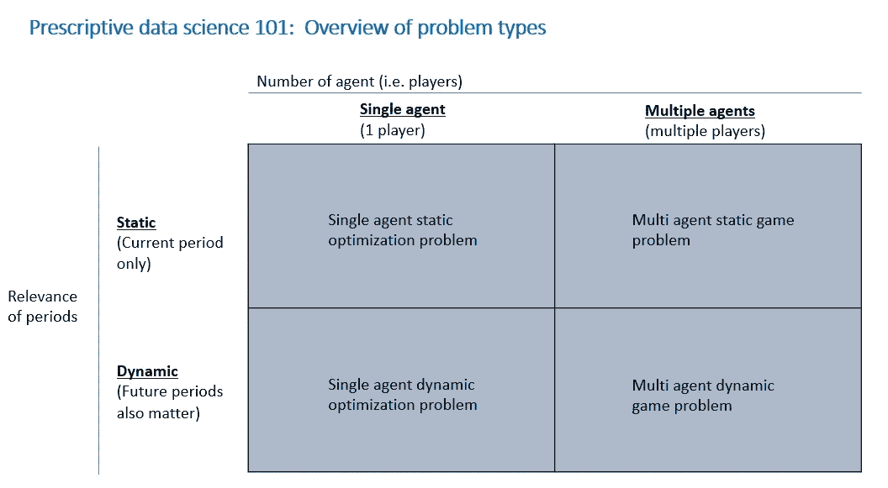

# 规范数据科学 101:问题类型

> 原文：<https://towardsdatascience.com/prescriptive-data-science-101-types-of-problems-and-methods-for-a-single-agent-case-e80cf879ccb6?source=collection_archive---------33----------------------->

## 关键维度:单个/多个代理|静态/动态问题

弗兰基·查马基在 [Unsplash](https://unsplash.com/?utm_source=medium&utm_medium=referral) 上拍摄的照片

欢迎回到关于规范数据科学的系列文章！在我的上一篇文章中，我谈到了[描述性、预测性和规范性数据科学](https://medium.com/@minha.hwang/prescriptive-data-science-beyond-predictive-data-science-51bde1900c1e)以及规范性数据科学所需的技能。今天，我将通过定义不同类型的规范性数据科学问题来帮助您。

请注意，本文中描述的方法在多个学科中有许多不同的名称——数学优化、控制理论、单代理动力学、多代理动态博弈、动态规划、马尔可夫决策过程或强化学习。在下一篇关于单个代理案例问题定义的关键要素的文章中，我将指出问题定义和方法的核心关键结构。请注意，在运筹学、经济学、营销科学、计算机科学、机器学习和人工智能等多个学科中，潜在的思想是共同的。

结束时，您将具备以下基本知识:

*   什么是**规定性数据科学**。
*   两个**关键维度**定义规范的数据科学问题:**代理数量**和**跨时间段的依赖性**

# 我们如何在规范数据科学中定义不同的问题类型？

规范数据科学是数据科学的一个子领域，它帮助我们获得诸如“我们应该做什么(在潜在的 X 的选择中)？”等问题的答案由于多学科的性质，它没有很好的定义。因此，我打算以一种更结构化的方式来定义它，并介绍将帮助您识别不同规范数据科学问题类型的关键维度。

要对不同类型的规范性数据科学问题进行分类，您需要考虑两个关键因素:(1)代理的数量；(2)跨时间段的依赖性。

1.  **代理数量。**与给定问题相关的代理数量可以是(1)单个(即只有一个代理)或(2)多个。这里的关键区别在于，你是否必须考虑和整合代理之间的(战略)交互来解决你的问题。单个智能体问题更简单，因为你不必考虑其他智能体的行动(即决策)。相反，当你有多个代理时，代理之间的(战略)交互需要成为问题解决的一部分。这将在博弈论中引入“均衡”的概念。此外，定义信息集(每个智能体的已知和未知)对于正确指定多智能体问题非常重要。退一步说，你可以立即看到多智能体问题比单智能体问题更难解决。

    举个例子，如果你正在为一个小镇上唯一的超市考虑软饮料的品类利润最大化定价，你不必担心其他超市的反应(即垄断情况)。在这种情况下，只要有一个需求模型(即来自预测数据科学的输出，它将单位体积(作为目标)映射到具有其他控制特征的定价和促销特征)，您就可以尝试非线性优化来找出一组价格，该组价格在一年的给定时间(例如，7 月 4 日的一周)最大化焦点超市软饮料类别中每种产品(即，SKU-库存单位)的类别利润。相比之下，如果你在一个小镇上有两家超市，事情就变得复杂多了，你现在需要考虑其他超市会如何做出价格决定。
2.  **跨时间段的依赖性。**跨时间段的依赖性可以是(1)静态的(即没有依赖性)或(2)动态的。这里的关键是你是否可以孤立地解决每个时期的问题(即可分离性)，或者你是否需要考虑多个时期来捕捉随时间的依赖性。

    作为一个例子，对于城镇中单个超市的类别利润最大化定价决策的情况，可以认为每个时期的定价决策可以被逐一解决，因为现在销售点的价格才是重要的，而不是其他时期的价格。请注意，为了简单起见，我假设了前瞻性消费者行为的潜在复杂性，即消费者可以预期未来的促销，并在价格有利时囤积商品(所谓的加速购买或提前购买)。在一个没有消费者远期购买的简化世界中，频繁购买商品的定价可以被视为一个“静态”问题，因为你可以独立地解决每周的子“定价”问题(即，没有依赖性。)

    相比之下，如果你考虑一个小镇上唯一的手机(即耐用消费品)店(如唯一的威瑞森店)，你很容易意识到 iPhone 12 Pro Max 当期的定价决策并不独立于从现在起 24 周内的定价决策。消费者非常熟悉耐用品价格会随着时间的推移而下降的事实。此外，还存在异质消费者群体:一些消费者愿意支付额外费用来快速采用新产品(即早期采用者)。其他消费者将等到价格变得有利(即落后者)。因此，使当期利润最大化的价格并不等于使整个时间范围内总利润最大化的最优价格。在这里，由于时间的依赖性，您需要解决问题的一个更“动态”的版本。我们将在本系列文章的后续版本中再次讨论“动态”问题。

如果你受过计量经济学或时间序列方面的培训，当你有滞后项(即以前时期的变量)时，可以引入时间相关性。在结构计量经济学的情况下(在经验工业组织中)，带有预期的结构消费者或企业行为模型也自然地随着时间的推移产生依赖性。在运筹学、计算机科学、机器学习和统计学中，隐藏(即潜在)状态模型(如隐藏马尔可夫模型、卡尔曼滤波)或序列模型(如递归神经网络、注意力模型或变压器架构)也会自然地导致长期和短期的时间依赖性。时间相关性的建模方式对后续优化或强化学习问题的解决算法也有重要影响。

下面的图 1 从(1)代理数量和(2)跨时间段的依赖性这两个维度总结了不同的数据科学规范问题。

图 1:图片由[黄敏哈](http://medium.com/@minha.hwang)拍摄

在随后的文章中，我将重点关注一个**“单个代理人”案例**和(1)描述关键结构以正确定义问题，这可以通过优化或人工智能算法来解决。此外，我将提供(2)解决“单一代理”问题的**关键方法**的高级概述。

如果读者对不同学科之间的联系感兴趣，下面显示的是一篇文章，它将 IO 中的结构计量经济学模型映射到 AlphaGo 等人工智能方法。

作为结构估计的人工智能:深蓝、Bonanza 和 AlphaGo