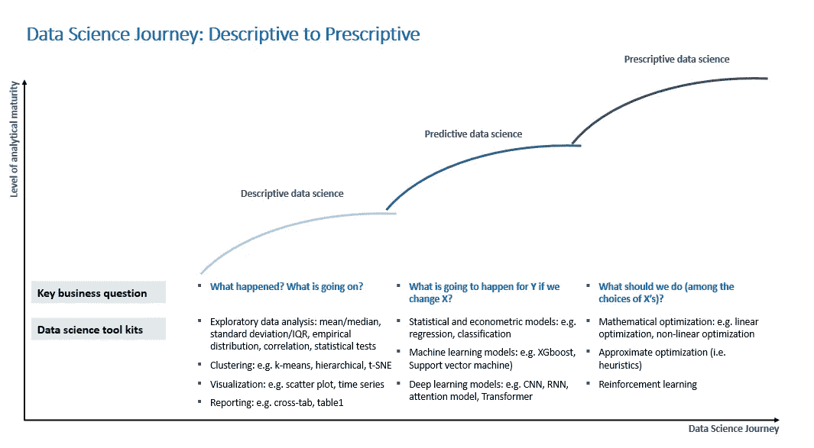
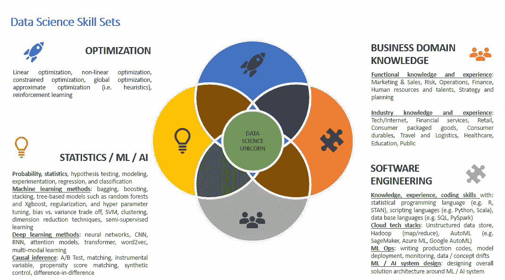
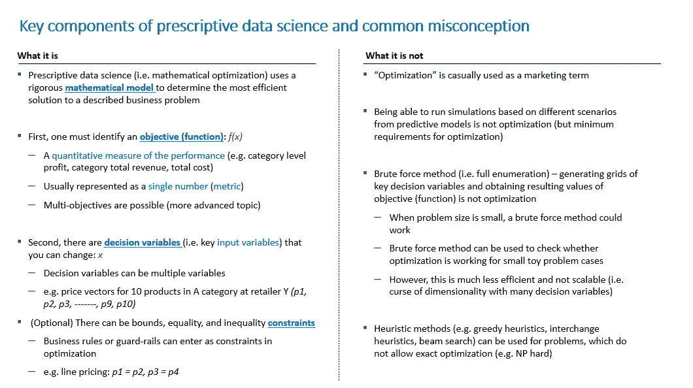

# 规范数据科学:超越预测数据科学

> 原文：<https://towardsdatascience.com/prescriptive-data-science-beyond-predictive-data-science-51bde1900c1e?source=collection_archive---------28----------------------->

## 数据科学问题类型|规范数据科学所需的技能集|规范数据科学的关键组成部分

卢卡斯·布拉塞克在 [Unsplash](https://unsplash.com?utm_source=medium&utm_medium=referral) 上的照片

数据科学和机器学习的重点主要是预测建模和数据工程。随着公司在数据科学和机器学习方面变得更加成熟和复杂，预测数据科学变得更加重要。在将数据科学和人工智能领域的领导者与其他公司区分开来方面，规范数据科学正变得越来越重要。越来越多的公司要求“做什么”的“规范性”建议传统上，“规范性决策建议”主要由运筹学和经济学政策研究者处理。然而，优化方法和强化学习现在被数据科学家和机器学习工程师作为超越预测建模的核心工具之一。

作为一个个人轶事，当我 7 年前第一次构建分类(即产品线)决策支持解决方案时，当我们添加或删除某些产品时，零售商拥有的产品组合的产品单位销售预测模型被认为是最先进的。业务用户很高兴能够基于预测模型运行场景分析和模拟，以进行批量转移。随着他们变得越来越老练，他们开始询问关于在货架空间限制下删除和添加什么产品的“说明性”建议。这表明，一旦业务最终用户熟悉了(预测性的)基于模型的模拟，就越来越需要推荐“做什么”。预测模型和用于说明性建议的优化方法之间也有密切的相互依赖性。因此，现在是学习更多关于规范数据科学和关键方法的好时机。

在本文中，我将讨论(1)不同类型的数据科学及其与数据科学和分析中的组织成熟度的相关性，(2)在规范数据科学中脱颖而出所需的技能集，以及(3)规范数据科学的关键组成部分和常见误解。

**1。数据科学之旅—描述性、预测性、规范性**

不同类型的数据科学的业务需求随着组织的分析成熟度而变化。最初，重点是为日常业务决策提供更多的“事实基础”。相关的业务问题是“发生了什么？”或者“这是怎么回事？”例如，一家零售商在过去开展了许多不同类型的促销活动，该公司希望了解每次促销活动的投资回报率，以及哪种促销类型带来了更多的增量利润。

一旦一个组织在其数据科学之旅中变得更加分析成熟，业务问题就演变为对未来的规划。这里的商业问题是“如果我们改变 X，Y 会发生什么？”例如，一家零售商正在计划黑色星期五促销活动，该公司可能会考虑一组促销方案作为候选方案。预测数据科学可以帮助在不同的推广场景下进行预测。

拥有预测能力固然很好，但大多数组织会意识到要考虑的选项太多了。在这个阶段，商业问题是“我们应该做什么(在 X 的选择中)？”例如，零售商希望有一个促销推荐引擎，该引擎给出关于以什么折扣级别(50%对 30%)、在什么时间(7 月的第二周)、在什么位置(丹佛)、以及什么产品(可口可乐普通 2L 单瓶)运行什么促销活动(例如，买 2 送 1 50%)的推荐。

下面的图 1 总结了组织在数据科学方面的成熟度。请注意，相关的数据科学工具包也会在这个过程中发生变化，如此图所示。

图一。图片由[黄敏哈](http://medium.com/@minha.hwang)

**2。规范性数据科学:所需技能组合**

当公司越来越关注“规范的数据科学”时，数据科学家需要哪些技能许多读者可能已经熟悉数据科学家的 3 个技能要求圈:(1)业务领域知识，(2)统计/机器学习(ML) /人工智能(AI)，以及(3)软件工程。对于“规范的数据科学”，要成为更有影响力的数据科学家，还需要“优化”方面的额外技能。“最优化”通常属于“运筹学”或“工业工程”的范畴请注意，典型的数据科学课程不会深入讨论这个主题。下面的图 2 显示了下一代数据科学家技能要求的 4 个主要方面，每个方面都有更多详细信息。

图二。图片由[黄敏哈](http://medium.com/@minha.hwang)提供

**3。规范数据科学的关键组成部分和常见误解**

什么是“优化？”说明性数据科学的“(数学)优化”的关键组成部分是什么？关于“规范数据科学”或“优化”的定义有很多混乱如果读者还不太熟悉(数学)优化，我将在下面描述优化的关键组成部分。此外，我还展示了什么不是“规定的数据科学”

*   (1) **目标**(功能):这是业务用来评估业务成果的性能的量化度量。大多数时候，总利润(即底线)和总收入(即最高收入)是优化中经常出现的目标。但是，根据相关的时间范围和业务问题的性质，也可以考虑其他业务指标，如客户终身价值。另请注意，可能有多个重要性不同的目标(例如，80%的利润+ 20%的收入)
*   (2) **决策变量**:这是公司可以改变的一组变量。例如，在零售商的“联合价格优化”(即，定价优化)中，给定类别中 10 种产品(例如，糖果)的一组价格是决策变量。
*   (3) **约束**:通常情况下，企业有一套业务规则或防护栏，需要考虑这些规则或防护栏，以便对业务活动提出最终建议。在优化的初始尝试之后应用这些规则是非常常见的，这具有超越优化结果的意外后果。更合适的方法是将这些规则集作为“约束”合并到约束优化中。这些规则可以作为“上限/下限”约束、“相等”约束或“不相等”约束进入。例如，在“联合价格优化”问题中，由于零售商和制造商之间的合同协议，或者由于简化商业决策的需要，一组产品可能需要具有相同的价格，即所谓的“系列定价”该行定价规则可以作为“约束定价优化”问题的“等式”约束输入。如果产品 1 的价格应该与产品 2 的价格相同，这可以指定为:价格(产品 1) =价格(产品 2)。如果零售商不愿意在当前价格水平上提价 10%以上，这可以作为提价的上限:即价格(产品 1) ≤ 1.10 x 当前价格(产品 1)。

下面的图 3 总结了“规范数据科学”(即数学优化)的关键组成部分。)此外，还说明“不是什么。”

图 3。图片由[黄敏哈](http://medium.com/@minha.hwang)提供

我希望这篇文章能帮助您更好地理解数据科学之旅，了解组织在数据科学方面的成熟度、规范数据科学的附加技能集、“预测数据科学”的关键组成部分是什么，以及不是什么。在下一篇文章中，我将概述不同类型的优化方法以及可用的数学和分析技术。如果您是一名 Python 数据科学家，那么 SciPy 是“规范数据科学”的一个很好的起点。优化库。

*   SciPy。优化链接

<https://docs.scipy.org/doc/scipy/reference/tutorial/optimize.html> 