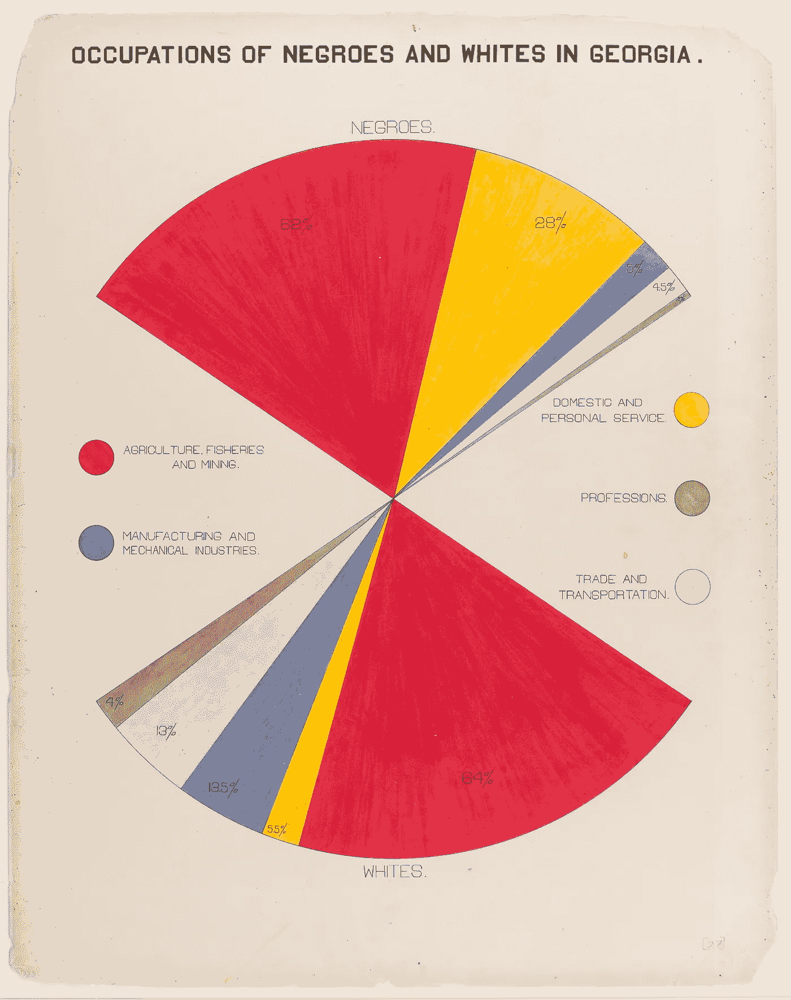
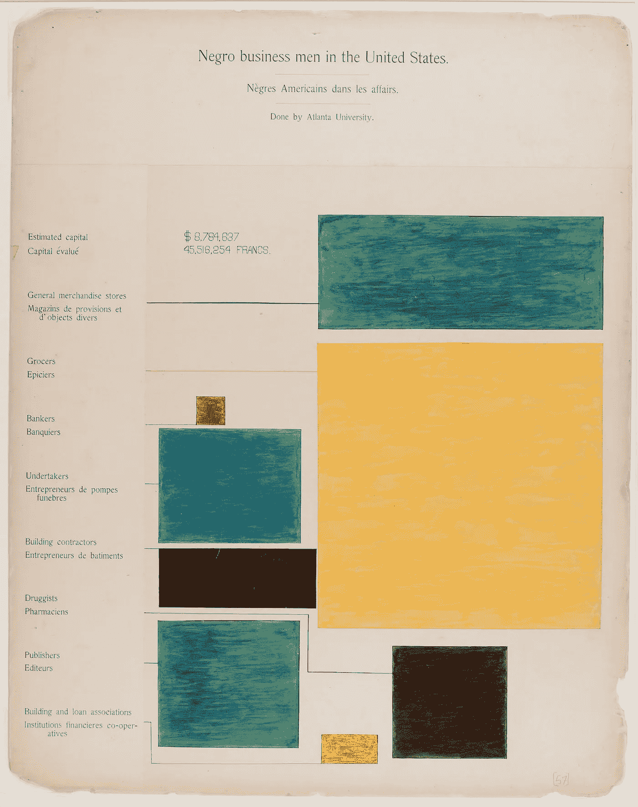
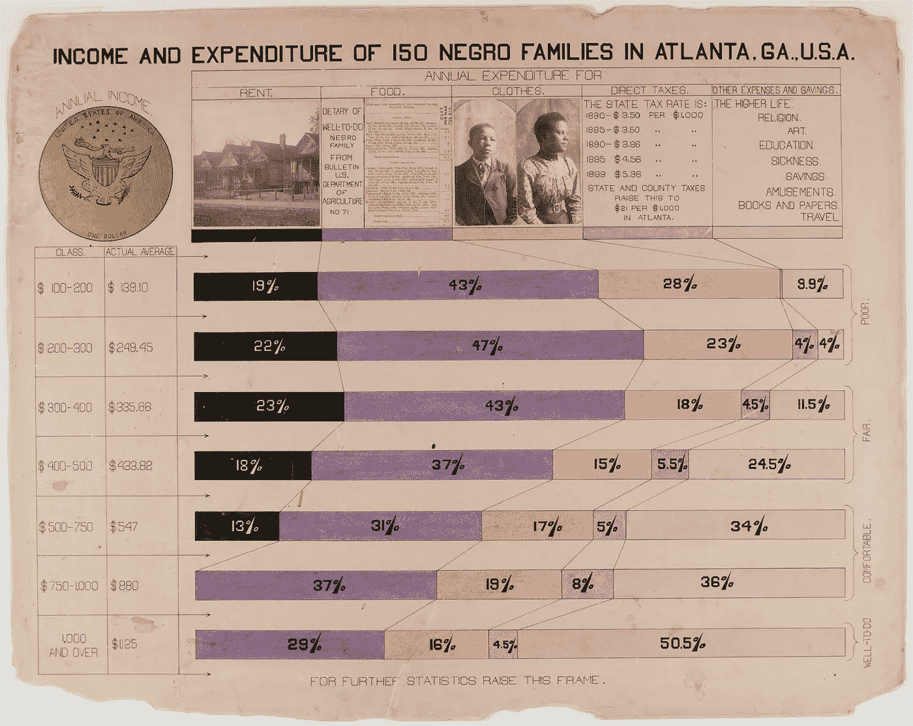

# 从杜波依斯的数据可视化中得到的教训

> 原文：<https://towardsdatascience.com/present-to-persuade-lessons-from-the-data-visualizations-of-w-e-b-du-bois-a50775f0fa90?source=collection_archive---------26----------------------->

[去向不明的就业数据](https://www.thinknum.com/resources/casestudy/workforce-analytics?utm_source=abdus&utm_medium=email&utm_campaign=talent)是代表真实劳动力的必要数据

杜波依斯用数据提供了一个不同于普遍观点的观点，即黑人和白人是不平等的。他成功地以新颖、引人注目的方式获取并展示数据，以改变观众的视角。

意识到传统图表的局限性，他设计了非典型的数据可视化形式来展示他的案例。这使他能够影响大量的欧洲和全球观众。对于任何旨在与其他团队(从不同部门到执行委员会)建立凝聚力的数据科学专业人员来说，这都是必不可少的历史研究。

> 二十世纪的问题是肤色界限的问题，是关于种族差异——主要表现在皮肤的颜色和头发的质地上——会在多大程度上成为剥夺世界上一半人最大限度地分享现代文明的机会和特权的基础的问题——w·e·b·杜·博伊斯

我主持了与麦肯锡公司 COVID 响应中心交互数据可视化总监 Jason Forrest 以及富国银行业务系统和运营数据分析师 Jarrett Hurms 的炉边谈话。

他们讨论了 Du Bois 在社会进步背景下对数据科学领域的长期贡献，以及他以新颖、引人注目的方式获取和呈现数据的策略，这些方式影响了我们的现代社会氛围。

*如果还需要* [*观看网上研讨会*](https://www.thinknum.com/resources/webinar/present-to-persuade?utm_source=abdus&utm_medium=webinar&utm_campaign=dubois) *。*

数据可视化是人类和机器交流大量复杂信息的工具。这种形式的交流延伸到各个行业，从非营利组织和政府实体到商业组织和医疗保健。

数据可视化最有力的例子之一是 120 年前由 W.E.B. Du Bois 领导的一个非裔美国人小组做出的，当时美国奴隶制刚刚结束 37 年。

下面，我重述一下 Jason 和 Jarrett 讨论的核心主题，作为对进一步研究杜波依斯开创性工作感兴趣的人的介绍。

杜波依斯以一种能被不同种族和经济背景的人所理解的方式展示数据。杜波依斯为非裔美国人提供了另一种视角，试图通过展示黑人加强美国的能力来启发他的观众。他意识到传统形式的图表的局限性，并热衷于使用不寻常的数据呈现形式来吸引观众的注意力。

杜波依斯的开创性工作在 1900 年的巴黎博览会上展出。请记住,《解放宣言》是在 1863 年刚刚签署的。该博览会是为了庆祝 19 世纪的成就，并寻求在下一世纪加速创新。包括美国在内的 56 个国家建造了代表各自文化的展馆。参观者达 5000 万人，展品首次展示了许多发明，如摩天轮、柴油机、自动扶梯，甚至有声电影。

就在博览会开幕前四个月，美国国会图书馆助理馆长丹尼尔·默里和他的团队从美国国会获得 15000 美元。杜波依斯被选为首席策展人，并于 1899 年 12 月 28 日和他来自亚特兰大大学的学生一起开始快速编纂这部作品。

美国黑人的展览分为两部分，展示了杜波依斯的数据可视化:

*   佐治亚州的黑人，集中在佐治亚州，拥有第二大非裔美国人。*对于一些额外的背景:“佐治亚州黑人”是一个社会研究汇编 32 手工图表。*
*   一系列统计图表显示了现居住在美利坚合众国的前非洲奴隶后裔的状况。

杰森指出，这次展览是一次有针对性的尝试，旨在影响世界科学精英承认美国黑人，并试图影响美国国内外的文化变革。

在晚年，杜波依斯回忆了围绕完成世界博览会作品的意外事件和困难，以及几乎阻止他参加自己展览的财务状况:

“用很少的钱、有限的时间和不太多的鼓励，精确地完成这 50 多张彩色图表的细节是非常困难的。在我完成之前，我就受到了神经衰弱的威胁，我几乎没有钱去买去巴黎的机票，也没有一个船舱可以出售。但是如果我不去，展览就会失败。所以在最后一刻，我买了统舱的通道，过去安装工程。”
—杜波依斯

然而，他还是及时赶到，迅速布置好展览，并从评委那里赢得了一枚金牌。当美国黑人媒体兴高采烈地报道这次展览时，欧洲媒体只是顺便提及这次展览，而美国白人媒体完全忽视了这次展览。美国公众从来不知道美国黑人展览的存在。

杜博伊斯在社会科学和数据可视化方面的作用与他更伟大的成就相比仍未得到充分发掘。他看到了种族隔离的复杂性，这从根本上改变了美国黑人的代表性。

他通过用严格的科学方法收集令人信服的证据来支持社会进步。他综合了来自多个来源的数据，并使用生动的数据画像，用定性事实来说明他的论点。他的展览不仅仅是一份科学报告；他们通过终结陈规定型观念，展现了一个现代的、成功的、受过良好教育的黑人形象，体现了“有针对性地试图影响世界精英阶层”的努力。

如果您有兴趣了解更多关于 W.E.B. Du Bois 数据可视化的信息，请查看以下资源:

*   [由 Thinknum Alternative Data 主办的杜波依斯网络研讨会录制](https://www.thinknum.com/resources/webinar/present-to-persuade?utm_source=abdus&utm_medium=webinar&utm_campaign=dubois)
*   [杜波依斯的数据可视化和研究，由杰森·福里斯特策划](https://medium.com/nightingale/w-e-b-du-bois-staggering-data-visualizations-are-as-powerful-today-as-they-were-in-1900-64752c472ae4)

*再次特别* ***感谢*** *杰森和贾勒特(Jsquared)。有了他们勤奋的研究和评论，这篇文章就不会存在了。谢谢先生们！让我们继续对话，传播福音。*

[我们来连线](https://www.linkedin.com/in/abdusm/)！

杜·博伊斯为 1900 年巴黎世界博览会美国展区的黑人展览绘制的图表，展示了解放以来美国黑人的经济和社会进步。

由 [LinkDap](https://linkdap.com/t/new) 为您带来的基础知识回顾。