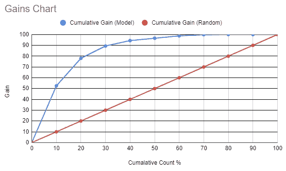
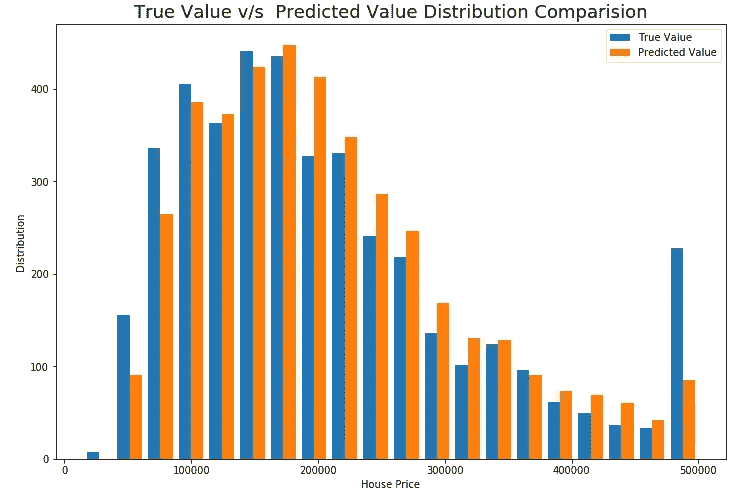
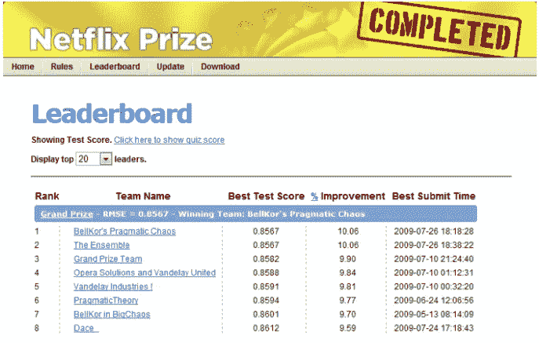
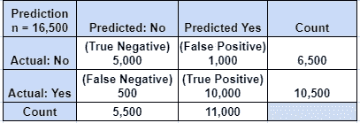
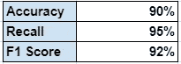
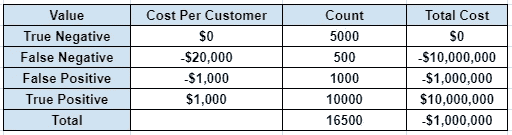
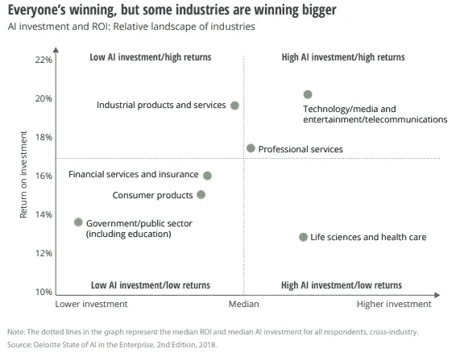

# 将机器学习模型结果呈现为业务洞察

> 原文：<https://towardsdatascience.com/presenting-machine-learning-model-results-as-business-insights-b42309c5e974?source=collection_archive---------10----------------------->

## [行业笔记](https://towardsdatascience.com/tagged/notes-from-industry)

## 如何将机器学习模型的性能作为可操作的见解提供给企业。

*雷雨云下的麦田*，1890 年，荷兰阿姆斯特丹([来源](https://en.wikipedia.org/wiki/Vincent_van_Gogh#/media/File:Vincent_van_Gogh_-_Wheatfield_under_thunderclouds_-_Google_Art_Project.jpg))

机器学习和深度学习是我们这一代最具革命性的技术，有可能从根本上重新定义我们的生活方式。随着围绕技术堆栈的大肆宣传，它通常会有自己的生命，并且很容易忘记它最终只是为我们以客户为中心的业务增加价值的另一个工具。

作为一名机器学习工程师，我已经在世界上最大的银行之一工作了两年多，如果我能用几句话来总结我的经验，那就是。

> “如果你不能用一句话写下你的信息，你就不能在一个小时内说出来。”-缔安娜·布赫

对于任何与他们的企业或客户一起工作的工程师来说，他们既不关心你使用了什么样的技术，也不关心你的解决方案有多复杂，而只关心这个解决方案能给他们的企业增加多少价值。

在这个意义上，通过这个指南，我将努力向你介绍一些我在向企业介绍我的工作时经常使用的方法，这些方法取得了一定程度的成功。

# 第 1 部分:秀出来，不说出来。

**Salesforce** 花费超过 150 亿美元收购一个名为 **Tableau 的数据可视化/报告工具是有原因的。随着时间的推移，一张图的价值远非千言万语所能表达。**

让我们看看几种展示您的结果的方法。

## 收益图表

增益图表表示模型的累积错误捕获率。(图片由作者提供)

当您处理产生连续概率得分的模型时，增益图是一个非常有用的工具，因为这些值可以排序和累积，以显示与随机情况相比，您使用该模型能够捕获多少**事件**。

例如，在这种情况下，我们可以看到我们的模型能够捕获前 20%得分数据中的 **80%的事件，**这意味着如果一个企业只关注总得分前 20%的观察，它可以使用您的模型捕获高达 80%的事件。

这有助于企业了解你的模式带来的价值，以及它如何帮助他们做出更好的决策。

## 真实值与预测值分布。

绘制预测值的分布与真实值的分布。(图片由作者提供)

当使用回归模型时，向业务团队展示您的模型结果通常会很棘手，因为您不希望他们经历所有的残差分析和多元分析。

真实值与预测值的重叠分布直方图是一种很好的方式来展示模型结果与现实的比较。这将有助于企业了解您的模型是否足以取代现有的系统。

# 第 2 部分:测量机器学习模型中的投资回报率

仅仅因为你有一个伟大的模型，一个惊人的技术堆栈和一个完全可靠的产品设计，并不意味着企业欠你批准资金来建造它，我学到了痛苦的方式，你不应该。

向企业展示任何产品设计或模型设计时，都要进行成本效益分析。不管你的模型有多酷或有多有创意，如果它不能证明成本是合理的，没有人会批准它。

2006 年，网飞花费 100 万美元资助了一项竞赛，旨在为他们的电影推荐系统寻找一种改进的解决方案，但最终甚至没有使用所展示的最先进的解决方案，因为“额外的工程和维护成本并不能证明准确性的提高”。

网飞竞赛。([来源](https://netflixtechblog.com/netflix-recommendations-beyond-the-5-stars-part-1-55838468f429))

## 理解混乱的代价

要计算简单二元分类器的成本与收益，您可以查看混淆矩阵并为每个像元赋值。

客户流失预测模型的混淆矩阵(图片由作者提供)

分类报告(图片由作者提供)

考虑一下这个例子，您的任务是为一家信用卡公司构建一个模型来预测客户流失。你很兴奋，很受鼓舞，继续为他们建造一个美丽的作品，结果和这个差不多。

现在一些商业分析师为你做成本收益分析，让我们看看他们发现了什么。根据他们的分析，公司在预测期内每个客户的收入损失和其他成本约为 20，000 美元(误报成本),一旦模型到位，公司试图留住客户的成本约为 1，000 美元(误报和真报成本)。让我们看看你的模型做得怎么样。

你的公司最终将亏损 100 多万美元。(图片由作者提供)

现在，当然我操纵了一些数字来得到结果，但重点仍然是，我仍然忽略了整个事情的工程和维护成本。关键是，有时机器学习不是解决方案，或者至少不是最可行的解决方案。

作为一名机器学习工程师，如果你学会如何在项目早期计算出最低可行性能，将会对你有很大帮助。

AI 在企业中的状态([来源](https://www2.deloitte.com/content/dam/insights/us/articles/4780_State-of-AI-in-the-enterprise/DI_State-of-AI-in-the-enterprise-2nd-ed.pdf)

# 第 3 部分:成为解决方案的一部分

不管你的最终结果是什么，总是要提供一份关于下一步的建议清单。你的工作是解决问题，而不仅仅是发现和评估问题。这也显示了你超越自己工作领域的能力。

如果你的模式可行并且在经济上可行。

1.  建议产品开发路线图和时间表。
2.  如何让现有团队/基础架构参与进来以降低成本。
3.  未来的版本可能会带来哪些改进？

如果你的模式不可行。

1.  推荐几款市面上现成的产品。
2.  与模型相比，基于规则的解决方案的表现如何。

# 结论

除非你是 ML/DL 研究员，否则展示你的解决方案将是你工作的一大部分，就像任何其他工作一样，这是你将通过实践学习的东西。你越早掌握演讲技巧，你的旅程就越顺利。

如果你喜欢这篇文章。

> 留下评论让我知道你的想法。
> 
> 在 [Twitter](https://twitter.com/agni_akash) 、 [Linkedin](https://www.linkedin.com/in/agni25/) 、 [Github](https://github.com/akash-agni) 或 [Medium](https://agniakash25.medium.com/) 上与我联系。
> 
> 与你的网络分享这篇文章。