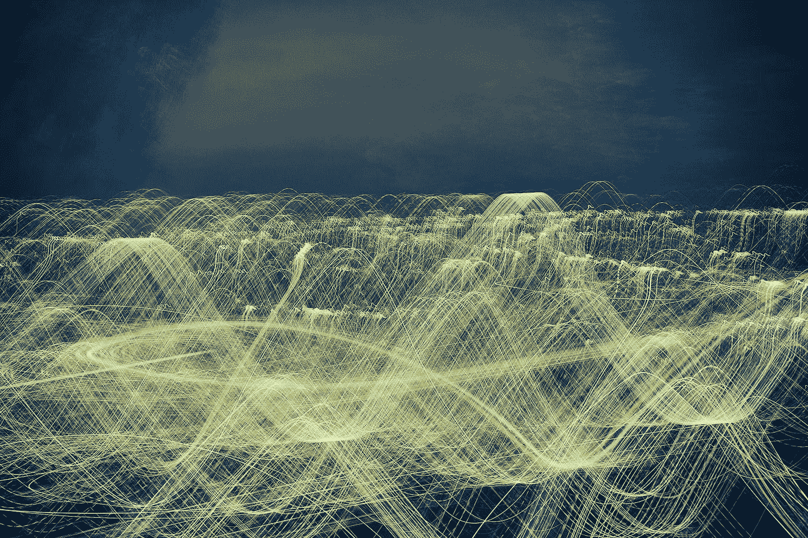
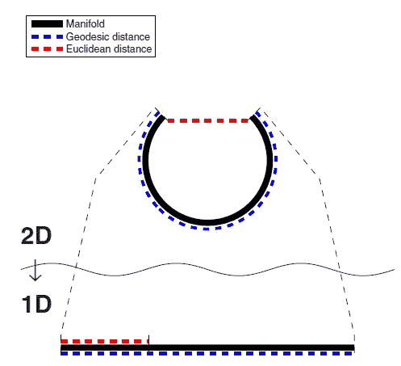
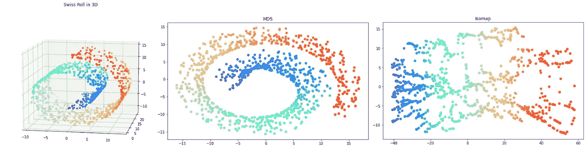
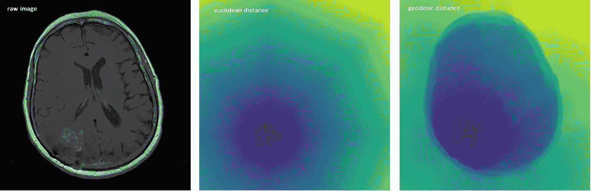
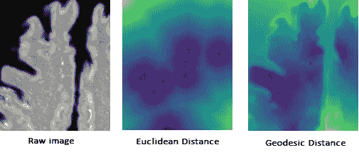
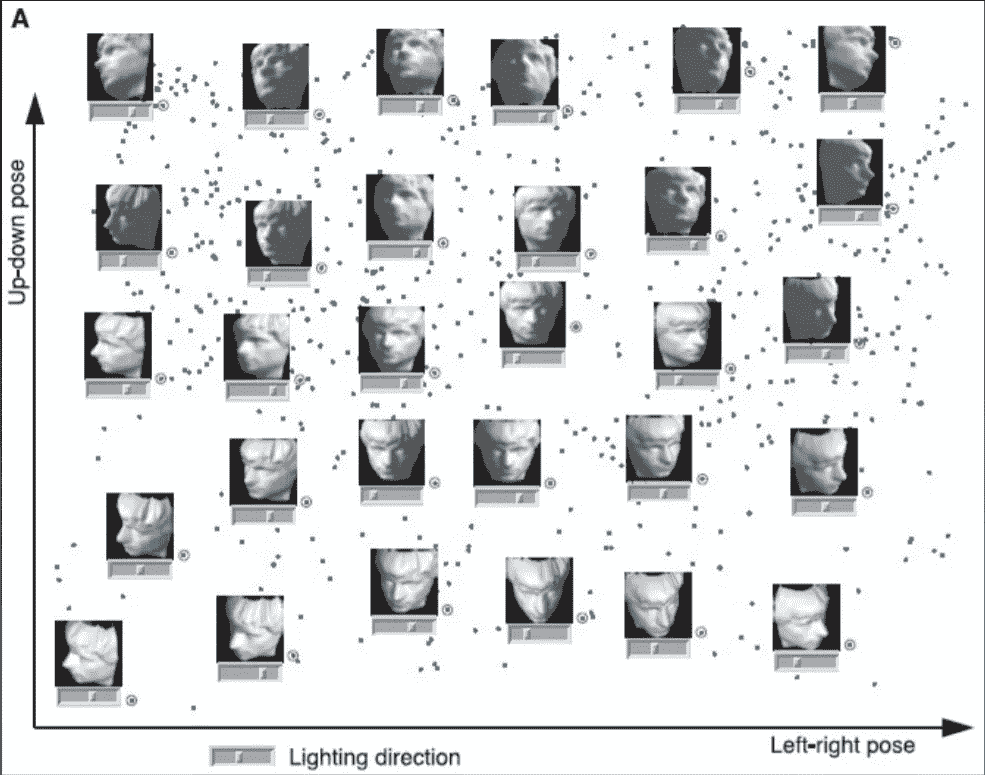
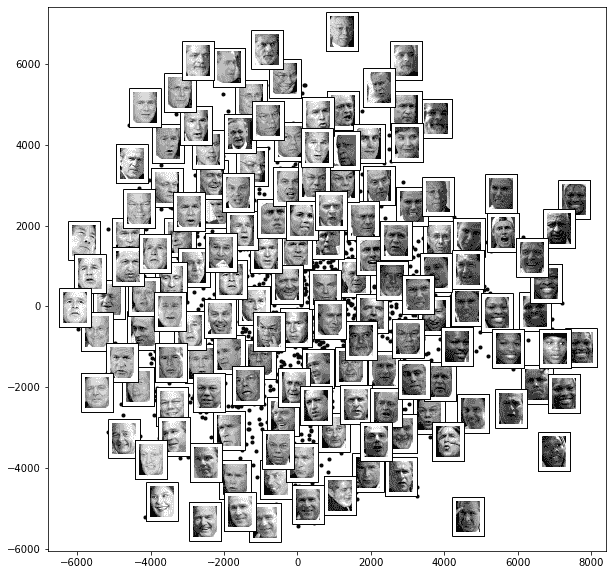
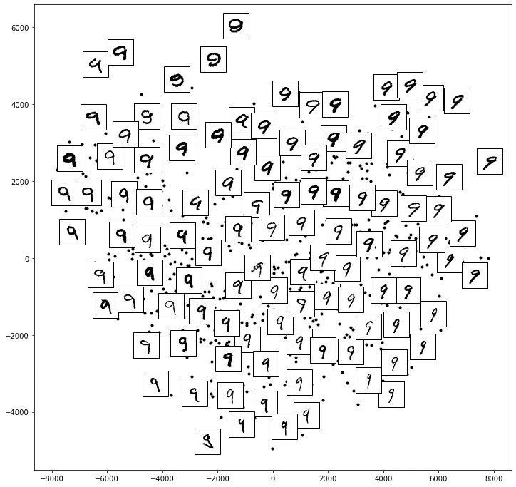

# 保持非线性数据集的测地线距离:ISOMAP

> 原文：<https://towardsdatascience.com/preserving-geodesic-distance-for-non-linear-datasets-isomap-d24a1a1908b2?source=collection_archive---------15----------------------->

## [思想和理论](https://towardsdatascience.com/tagged/thoughts-and-theory)

## 等距特征映射的解释和说明

降维方法可视化数据集并减小其大小，以及揭示数据集中的不同特征。对于非线性数据集，可以在各种子标题下检查降维，例如距离保持(*等映射*)、拓扑保持(*局部线性嵌入*)。本文解释了等距特征映射的理论部分，这是一种距离保持的非线性降维方法，并包括降维后获得的数据集的解释和使用范围。python 实现丰富了研究。



照片由[大流士巴沙尔](https://unsplash.com/@dariusbashar?utm_source=medium&utm_medium=referral)在 [Unsplash](https://unsplash.com?utm_source=medium&utm_medium=referral) 上拍摄

```
***Table of Contents* 1\. Isometric Feature Mapping (ISOMAP)
-  Geodesic Distance vs Euclidean Distance
-  Interpretation of the result of ISOMAP
2\. ISOMAP Algorithm
3\. Use Cases
4\. Python Tutorials
5\. References**
```

# 1.等距特征映射(ISOMAP)

Isomap 是一种非线性降维方法，是度量 MDS 的不同版本，在保持**测地线距离**的同时降维。公制 MDS 和 ISOMAP 最明显的区别:*欧氏距离在公制 MDS 中保持不变，而测地线距离在 ISOMAP 中保持不变*。**那么，我们为什么需要它呢？保留测地线距离是否更有效？**让我们看看图 1，比较测地线距离和欧几里德距离作为降维技术。



图一。欧几里德距离与测地线距离[1]

欧几里德距离通过忽略数据集的形状仅计算距离**，测地线距离通过传递数据集上的最短路径来计算。在这种情况下，我们可以粗略地说，测地线距离和欧几里德距离的区别；虽然**测地线距离考虑了与这些数据**相邻的数据，但在欧几里德距离中，它仅计算最短的线性路径。当然，由于我们的目标是以最小的损失降低数据集的维数，因此根据数据集使用测地距离可以获得更有效的结果。以下代码块显示了 isomap 在 Swiss roll 数据集上的基本实现:**

查看 ISOMAP 和 MDS 结果，可以看到瑞士卷可以通过使用 ISOMAP 展开。



图二。通过使用 MDS 和 ISOMAP 展开瑞士的角色，图片由作者提供

红色数据点在图 2(右)中显示为 ISOMAP 结果，考虑了它们之间的邻域距离。当计算两点之间的欧几里德距离时，获得最短的距离(直线距离)。在测地距离中，获得经过数据集的最短路径。为了找出这一点，确定 k 的某个值，并且通过邻居将 **k 最近的**彼此连接，并且链继续。在 Sklearn 库中提供的 ISOMAP 中，可以用`n_neighbors=5`来设置。默认值为 5。寻找最短路径的另一种方法是以初始数据为中心画一个圆，并通过一条边将每个数据点连接到圆内的所有其他数据点。

## 测地线距离与欧几里德距离

为了总结测地距离和欧氏距离的区别，我们来看看它们的变换形式。图 3 示出了应用欧几里德距离和测地线距离的肿瘤组织的比较。



图 3。肿瘤的 CT 扫描(左)，欧几里德距离(中)，测地距离变换(右)，[2]

在图 4 中，相同的程序被应用于受损的大脑区域并进行比较。



图 4。欧几里德距离和测地线距离的比较[2]

从上面的图像中可以看出，在图像数据集中，测地线距离可以比欧几里德距离更有效地进行区分。在图 4 中，测地线距离已经应用于大脑区域图像，但是可以看出，由于图像的结构，测地线距离变换可以非常方便地用于 google earth、street 和 city 数据集。

## 对 ISOMAP 结果的解释

ISOMAP 应用于合成人脸数据集，结果如图 5 所示。



图 5。应用 Isomap 后的合成图像数据集[3]

当查看图表时，可以看到图表右侧的图像看向右侧，左侧的图像看向左侧，上侧的图像向上看，下侧的图像向下看，因此面部转向光线方向。另一种方法是，当查看此图时，可以很容易地确定拍摄照片的相机的位置。例如，在图表的左侧，摄像机在右侧，在右侧，摄像机在左侧，在顶部，摄像机在底部，在底部，摄像机在顶部。当然，这些方法对于该数据集是可接受的，并且每个数据集被单独解释。简而言之，也是解释 ISOMAP 数据集的一种非常方便的方式。

# 2.ISOMAP 算法

1.  如上所述，首先构建加权图-找到每个样本的最近邻居-这通过两种方式完成:

*   k 个最近邻居
*   固定半径，定义半径值，并对半径值内的样本进行分组。

在应用上面的其中一个后，最近邻通过加权边连接。这些权重(在邻居之间)将是欧几里得距离。到目前为止，创建了样本之间的全连接加权图。

2.使用 Floyd Warshall 算法或 Dijkstra 算法，使用测地线距离计算全连通加权图中所有样本对的成对距离。

3.应用多维标度(MDS)来获得低维版本。

> 以下视频解释了如何使用 Floyd- Warshall 算法找到最短路径:

作为算法的一个限制，如果 k-最近邻或固定半径太小，加权图可能会中断而不是完全连通。如果 k 值或固定半径太高，这一次加权图可能太密集；这会导致在流形中选择错误的距离。

# 3.用例

Isomap 可用于医疗领域，使超声和超声心动图图像在消除噪声后更易于解读。流形学习算法被应用于二维超声心动图图像，以发现心脏运动的连续周期的帧之间的关系。[4]在这种方法中，每个图像可以通过 Isomap 算法由重建的二维流形上的一个点来描述，并且相似的点可以根据周期性心跳周期的性质与相似的图像相关联。[4]

在一项研究中，ISOMAP 用于在视频帧之间插入图像。通过将 ISOMAP 应用于视频中的每一帧，在低维中提取有意义的特征。为了在 2 帧之间插入新图像，从原始数据集中选择图像，这些图像被映射到与这 2 帧相同的区域中。[5]

> 可以阅读参考资料中引用的文章，以了解有关上述用例的更多信息。

# 4.Python 教程

*   在下面的代码块中，Isomap 应用于`fetch_lfw_people`数据集中的面，结果如图 6 所示。

数据集许可: [BSD-3 条款许可](https://scikit-learn.org/stable/modules/generated/sklearn.datasets.fetch_lfw_people.html)

与上面的合成数据集示例一样，人脸根据光线进行分类。



图 6。ISOMAP 后的影像数据集，按作者分类的影像

*   在下面的代码块中，Isomap 已经被应用于`MNIST` 数据集中的数字 9，结果如图 7 所示。

数据集许可: [BSD-3 条款许可](https://scikit-learn.org/stable/auto_examples/linear_model/plot_sparse_logistic_regression_mnist.html#sphx-glr-download-auto-examples-linear-model-plot-sparse-logistic-regression-mnist-py)

可以看到，图表左侧数字 9 的尾部向右倾斜，当您在图表中向右移动时，数字 9 的尾部从右向左移动。同样，虽然尾巴在顶部很短，但从顶部到底部会变长。



图 7。应用 ISOMAP 后数字 9 的定位，图片作者

[](https://ibrahimkovan.medium.com/machine-learning-guideline-959da5c6f73d) [## 机器学习指南

### 所有与机器学习相关的文章

ibrahimkovan.medium.com](https://ibrahimkovan.medium.com/machine-learning-guideline-959da5c6f73d) 

# 5.参考

[1] M. Jordan 和 J. Kleinberg，*非线性降维*。2007.

[2]“kimvwijnen/Geodesic _ Distance _ Transform:(测地线)距离变换遵循 Toivanen 等人(1996 年)。”https://github.com/kimvwijnen/geodesic_distance_transform[(2021 年 10 月 25 日访问)。](https://github.com/kimvwijnen/geodesic_distance_transform)

[3]“非线性降维的全局几何框架|请求 PDF。”[https://www . researchgate . net/publication/285599593 _ A _ Global _ Geometric _ Framework _ for _ Nonlinear _ Dimensionality _ Reduction](https://www.researchgate.net/publication/285599593_A_Global_Geometric_Framework_for_Nonlinear_Dimensionality_Reduction)(2021 年 10 月 25 日访问)。

[4] P. Gifani，H. Behnam，A. Shalbaf 和 Z. A. Sani，“使用 Isomap 算法降低超声心动图图像的噪声”， *2011 年第一届中东会议。生物医学。英语。MECBME 2011* ，第 150–153 页，2011，doi:10.1109/mec BME . 2003032005

[5] S. ROBASZKIEWICZ 和 S. EL GHAZZAL，“使用非线性降维在视频帧之间内插图像”，第 x 期，第 5 页，[在线]。可用:[http://cs 229 . Stanford . edu/proj 2012/ElGhazzalRobaszkiewicz-interpolatingimagesbetweendideoframesusinglinearityreduction . pdf .](http://cs229.stanford.edu/proj2012/ElGhazzalRobaszkiewicz-InterpolatingImagesBetweenVideoFramesUsingNonLinearDimensionalityReduction.pdf.)