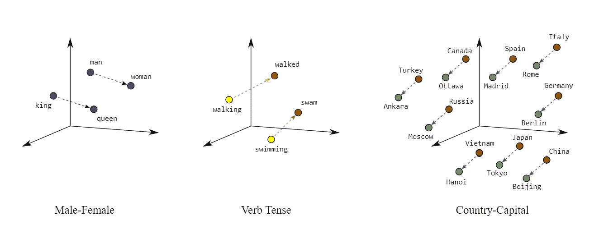

# 使用 SpaCy 和 Keras 文本矢量化的预训练单词嵌入

> 原文：<https://towardsdatascience.com/pretrained-word-embeddings-using-spacy-and-keras-textvectorization-ef75ecd56360?source=collection_archive---------6----------------------->

在 Keras 深度学习模型中使用 [SpaCy](https://spacy.io/) 预训练的嵌入向量进行迁移学习。此外，奖金，如何使用[文本矢量化](https://www.tensorflow.org/api_docs/python/tf/keras/layers/experimental/preprocessing/TextVectorization)添加一个预处理层到您的模型，以标记化，矢量化，并在嵌入层之前填充输入。

照片由[亚历山德拉](https://unsplash.com/@alex_tsl?utm_source=medium&utm_medium=referral)在 [Unsplash](https://unsplash.com?utm_source=medium&utm_medium=referral) 拍摄

在本文中，您将学习如何使用 [SpaCy](https://spacy.io/) 嵌入向量为 Keras 中的自然语言处理模型创建预训练嵌入层。这减少了 NLP 模型的训练时间，并转移了从更大的模型中学习单词及其关系。

# 话

词汇构成了我们大多数人生活的世界的大部分。如果你正在读这篇文章，我敢打赌你每天大部分时间都在和文字打交道，无论是写作、阅读、口语还是听力。我可能是错的，但这对我们许多人来说是真的。随着 AI 学会与人类互动(为我们服务，记住，永远为我们服务！)它必须学会理解我们的语言。

我们的语言是由单词组成的。我谅你也不敢想象没有语言的生活。灯不是灯，天不是天，人没有名字。我甚至不知道没有文字我怎么能把一个想法联系起来！词语将我们与世界联系在一起，并给我们一些符号来代表我们对世界的看法。“树”正在“倒下”。有数十亿棵树，但在我们为它们创造一个词之前，它们都是独一无二的。用“树”这个词，我可以概括为任何树。用‘坠落’这个词，我可以向你传达对你来说很重要的东西。让开！

# 自然语言处理

计算机不像我们一样用文字思考，而是用数字思考。不要纠结于计算机是否会“思考”；这不是我的重点。为了让计算机能够使用预测模型的语言…或者你可以说“理解”单词，这些单词必须被翻译成数字。

NLP 研究人员很聪明，是跨学科的。他们必须了解语言学家和工程师，他们已经开发了几种将单词转化为数字的方法。这个过程被称为“向量化”，将语言转化为向量(一维数组)。单词嵌入是做到这一点的一种方法。

# 我的项目

让我告诉你一些我正在做的项目，这样你就能理解我在这篇文章中所做的选择。我正在构建一个回归变量，来估计一篇学生作文的适当分数。我说的年级不是指 A、B、C、D、f，我指的是幼儿园、一年级、二年级等等。

这个项目的数据收集一直很慢，我的数据集少得可怜。然而，我的模型惊人地准确，许多估计平均在学生实际成绩的 2 个等级内。这是一个开始。我在下面的要点中包含了一个到我当前数据的链接，但是这个数据集将会增长(希望如此)。对于您自己的项目，您可能会找到更好的数据，所以只需调整`text = pd.read_csv(<link here>)`以指向您的数据所在的位置。

# 矢量化和嵌入

计算机模型不理解文字，只理解数字。我们的文档需要从字符串转换成向量。

有几个很好的策略可以将文档转化为向量。count-vector 通过文档中有多少单词来描述文档，而 TF-IDF 矢量化使用浮点数来描述每个单词对该文档的具体程度。因为我的项目是关于写作风格本身，而不是写作的内容，但是，我不会使用这些。虽然他们保留了每个文档中使用的词汇的信息，但这些策略抛弃了单词之间的顺序和关系。

## 把...嵌入

另一方面，在单词嵌入中，单词被“嵌入”在 n 维空间中，其中 n 是开发者定义的值。由向量数组中的每个位置表示的每个维度都映射到单词之间的某种关系。如果你查看下图，你可以看到高维嵌入空间的 3D 切片，突出显示特定的单词关系。左边的一个维度代表“二元性别”，右边的另一个维度代表国家和首都之间的关系。

图片来自[谷歌机器学习速成班](https://developers.google.com/machine-learning/crash-course/embeddings/translating-to-a-lower-dimensional-space)

单词嵌入理想地保留了单词之间的语义关系，并允许深度学习模型按顺序考虑文本。然而，还有另外一个步骤。

# **为嵌入准备数据:标记化、矢量化和填充序列(一步完成！):**

在我们的嵌入层可以嵌入我们的单词之前，我们需要准备它们。每个文档都需要作为固定长度的向量整数传递给嵌入层。

## 符号化

照片由[莎伦·麦卡琴](https://unsplash.com/@sharonmccutcheon?utm_source=medium&utm_medium=referral)在 [Unsplash](https://unsplash.com?utm_source=medium&utm_medium=referral) 拍摄

为建模准备文本的第一步是标记文档。在这一步中，通过将包含许多单词的文本字符串(如句子或文档)转换为单个单词的列表来分离单词。

标记时:

`'A machine will never replace a teacher.'`

将被替换为

`['A', 'machine', 'will', 'never', 'replace', 'a', 'teacher.']`

在这一点上，删除标点符号，使单词小写，删除常见的单词，如“the”和“a ”,以及类似的其他文本特定的转换通常是有用的，这将有助于模型专注于重要的内容。否则，模型会对每个单词进行不同的处理。你的模型知道‘a’和‘an’，‘Run’和‘Run’，或者‘之间的区别并不总是很重要和“:”。如果在这一点上它们没有被标准化，它们可能会分散以后模型的注意力，并增加计算负荷。

因为我想在模型的输入向量中包含语法信息，所以我不想删除停用词或使词词条化。我的模型需要知道学生如何使用单词，以及他们使用的单词的形式。

## 矢量化

接下来，需要将标记化的单词编码为整数。当编码序列被传递到嵌入层时，它们将被用作索引来查找单词在嵌入层中的正确嵌入。

在这一步中，我想要的是:

`['a', 'machine', 'will', 'never', 'replace', 'a' 'teacher']`

替换为类似于:

`[2, 427, 34, 67, 89, 2, 245]`

这里有趣的一点是，嵌入层实际上会给表示文档的向量增加一个维度。想象一下，输入序列中的每个整数“单词”,即编码的文档，在表示该单词的嵌入向量的一侧长出一条尾巴。所以，这是一个向量的向量，一个矩阵。

## 填充序列

大多数模型的所有输入都必须具有相同的形状，但是我们语料库中的文档都有不同的长度。作为人工智能工程师，你需要决定你想要用来表示你的文档的序列的长度。它可能是最大文档长度，或者平均文档长度，或者对您的用例有意义的其他选择。我的学生文本不是特别长，所以我将使用最大文件长度作为我的序列。如果矢量化序列的长度小于最长的文档，此图层将截断过长的文档。对于短于序列长度的文档，层将用 0 填充空白空间。0 是“无字”的专用保留代码。

假设我将序列长度设置为 15。由于上面的文档示例只有 7 个单词，

`'A machine will never replace a teacher'`

它将被编码和填充为:

`[2, 427, 34, 67, 89, 2, 245, 0, 0, 0, 0, 0, 0, 0, 0]`

我们实际上可以就停在那里，这将是一个非常可行的方法来矢量化我们的文档以移交给模型。技术上不需要进一步的嵌入层。许多 NLP 问题可以通过传递这些填充序列来解决。然而，我想在单词之间嵌入预先训练的语义关系，以帮助我的模型更好地考虑单词的含义。

## Keras 文本矢量化图层

Keras 有一个实验性的文本预处理层，可以放在嵌入层之前。总之，它允许将各种大小的文档传递给模型。 [TextVectorization](https://www.tensorflow.org/api_docs/python/tf/keras/layers/experimental/preprocessing/TextVectorization) 层将标记化、矢量化并填充表示那些要传递给嵌入层的文档的序列。它也可以用作整数索引来告诉嵌入层哪些整数编码字代表哪些嵌入向量。

通常需要更广泛的预处理，比如词汇化、词干化、词性标注等等。如果我想做比上述更多的预处理，我会使用自然语言工具包或 [NLTK](https://www.nltk.org/) 包。毕竟，NLP 的真正艺术在于预处理。

但是对于我们的目的来说， [TextVectorization](https://www.tensorflow.org/api_docs/python/tf/keras/layers/experimental/preprocessing/TextVectorization) 提供的服务已经足够了。

# 嵌入层

## 可训练嵌入

既然我们的文本存储在单词索引的填充序列中，就可以传递给嵌入层了。嵌入层可以通过与模型其余部分相同的学习算法来学习文档语料库中单词之间的关系。它们通常是深度 NLP 模型的工作马，可以有数百万个权重(词汇长度*嵌入向量长度)。

## **转移嵌入**

但是…我们为什么要做训练一个嵌入层的工作呢？事实上，已经有几个高性能的嵌入式词典问世了。Word2Vec 、 [GloVe](https://nlp.stanford.edu/projects/glove/) 和 [SpaCy](https://spacy.io/) 是一些要考虑的。这些都是在比我们拥有的更大的计算机上训练出来的，花费的时间也比我们可能愿意投入的要多。这里的问题是你希望你的嵌入矩阵表示什么样的语义表示？您希望嵌入是特定于您的语料库的，还是更普遍地适用于整个语言？还要考虑你用于训练的时间和计算资源。

如果你能处理或受益于更一般的嵌入，预训练嵌入将大大减少你的训练时间。从本质上来说，每一个都是从单词到向量的字典。字典的大小取决于你想要嵌入多少单词以及你想要嵌入向量的长度。斯坦福大学的天才们在淫秽电脑上训练了多年的最大的字典几乎有 10 亿字节。

## 将嵌入字典转换到嵌入层

如果您想要在您的模型中使用其他人训练过的嵌入，您将需要从单词索引创建一个映射， [TextVectorizer](https://www.tensorflow.org/api_docs/python/tf/keras/layers/experimental/preprocessing/TextVectorization) 层使用该映射将您的词汇表编码为来自您的嵌入字典的单词嵌入向量。

嵌入层将查看由[文本矢量器](https://www.tensorflow.org/api_docs/python/tf/keras/layers/experimental/preprocessing/TextVectorization)传递的中每个单词的索引整数，使用它来查找嵌入，然后将输入序列中每个单词的嵌入传递给下一层。TextVectorizer.get _ vocabulary()返回的词汇表中每个单词的索引位置也是[text vector](https://www.tensorflow.org/api_docs/python/tf/keras/layers/experimental/preprocessing/TextVectorization)将为每个单词返回的编码。接下来，我们将创建权重矩阵，用于初始化嵌入层。我们通过循环使用[文本矢量器](https://www.tensorflow.org/api_docs/python/tf/keras/layers/experimental/preprocessing/TextVectorization)词汇表和嵌入字典中的单词来实现这一点。来自[文本矢量器](https://www.tensorflow.org/api_docs/python/tf/keras/layers/experimental/preprocessing/TextVectorization)的每个单词编码将是权重矩阵中的一个行索引，该单词的向量将是我们选择的嵌入字典中的向量。

我将使用[空间](https://spacy.io/)，因为嵌入比[手套](https://nlp.stanford.edu/projects/glove/)加载快得多。代码将类似于:

`for i, word in enumerate(vectorizer.get_vocabulary()):
embedding_matrix[i] = embedding_dictionary[word]`

您将把这些权重设置为不可训练的，以减少计算量。

# [空间](https://spacy.io/)

Spacy 太牛逼了！！它能做的事情太多了，从词汇化和嵌入到为单词创建词性标签和为句子创建句法树。我只是在这里使用它训练过的单词嵌入，但它做得更多。例如，对于另一个项目，我可能会通过使用 [SpaCy 的](https://spacy.io/)内置方法来使用句子级嵌入向量(单词向量的平均值)。一定要看看 [SpaCy](https://spacy.io/) 能为你的 NLP 项目做些什么！

下面是完整的代码，带你从零开始预测学生的成绩水平(中等成功)。

# 偏见

这有点离题，但我认为是重要的。我们讨论了一个单词的嵌入如何定义它与其他单词的关系，作为概念化的一种替代。研究人员发现，自然语言处理模型往往带有种族主义和/或性别歧视，因为种族主义和性别歧视根植于我们的语言和我们使用语言的方式中。这种偏见真正吸引人的地方在于它是可以量化的！熟练的建模者可以找到种族主义的维度并将其展平，从而有效地降低嵌入向量的维度。这有助于消除嵌入空间中有偏见的单词关系。事实上，从伦理上讲，这是每个聊天机器人开发者都应该考虑的问题。

Jerry Wei 在他们的文章中对此做了更多的讨论:[自然语言处理(NLP)中的偏见:一个危险但可以解决的问题](/bias-in-natural-language-processing-nlp-a-dangerous-but-fixable-problem-7d01a12cf0f7)

# 总结:

在本文中，您学习了如何使用 [SpaCy](https://spacy.io/) 和 [Keras](https://keras.io/) 构建一个带有文本矢量化层和预训练嵌入层的自然语言处理模型。你也看到了我的项目的一个片段，教一个阅读学生写作的模型，作为 Github 的要点，让你开始自己的 NLP 项目

请享受以上要点，并把它作为你自己项目的起点。我的 NLP 项目还没有完成，所以我不会把它链接到你，但是如果你够聪明的话，你可以根据我在这里提供的提示自己找到它。

一如既往，请让我知道你的想法，这对你的启发，以及你的任何问题或评论。快乐造型！

# 进一步学习:

**为什么要使用嵌入层超过 NLP:** [https://towardsdatascience . com/deep-learning-4-embedding-layers-F9 a 02d 55 AC 12](/deep-learning-4-embedding-layers-f9a02d55ac12)

**如何从 NLTK 中获得更多:** [https://www.guru99.com/nltk-tutorial.html](https://www.guru99.com/nltk-tutorial.html)

**空间的魔力:** [https://real python . com/natural-language-processing-SpaCy-python/](https://realpython.com/natural-language-processing-spacy-python/)