# 美化熊猫数据框

> 原文：<https://towardsdatascience.com/prettifying-pandas-dataframes-75c1a1a6877d?source=collection_archive---------6----------------------->


照片由[帕韦尔·切温斯基](https://unsplash.com/@pawel_czerwinski?utm_source=medium&utm_medium=referral)在 [Unsplash](https://unsplash.com?utm_source=medium&utm_medium=referral) 拍摄

## [入门](https://towardsdatascience.com/tagged/getting-started)

## 通过颜色编码来增强你的数据框架

你知道我们可以通过访问`.style`属性来美化熊猫数据帧吗？这里有一个例子，我们设计了一个数据帧，使其类似于热图:

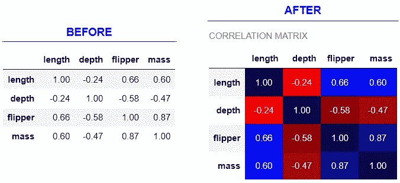

作者图片|造型前后的关联矩阵

造型后，看起来更加明显和直观，以看到积极和消极的相关性以及相关性的强度。通过颜色编码，我们可以更容易地解释和分析数据框架。在这篇文章中，我将展示 4 种美化数据框架的有用方法。


Anna Kolosyuk 在 [Unsplash](https://unsplash.com?utm_source=medium&utm_medium=referral) 上的照片

# 0.数据📦

在这篇文章中，我们将使用[企鹅数据集](https://github.com/mwaskom/seaborn-data/blob/master/penguins.csv)。让我们导入库和数据:

```
import numpy as np
import pandas as pd
pd.options.display.precision = 2
from seaborn import load_dataset# Load sample data
columns = {'culmen_length_mm': 'length', 
           'culmen_depth_mm': 'depth',
           'flipper_length_mm': 'flipper',
           'body_mass_g': 'mass'}
df = load_dataset('penguins').rename(columns=columns)
df.head()
```

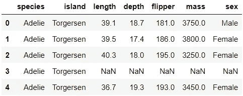

加载数据时，为了简洁起见，列名被重命名。

# 1.美化✨的数据框架

为了样式化数据帧，我们需要访问返回 Styler 对象的`.style`属性:

```
type(df.style)
```

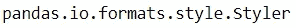

[这个 Styler 对象创建了一个 HTML 表格，可以使用 CSS 对其进行进一步的样式化](https://pandas.pydata.org/pandas-docs/stable/user_guide/style.html)。在接下来的章节中，我们将使用 Styler object 的内置方法以及一点 CSS 语法来定制格式。我们不需要知道 CSS 来样式化数据帧，因为我们将只做一些 CSS 引用。为此，像[和](https://htmlcheatsheet.com/css/)这样的备忘单可以帮助我们获得基本信息。

在下面的部分中，我们将一个接一个地链接多个方法。这使得代码非常长。为了以更易读的方式格式化代码，我们将把长代码分成几行，并使用 `*()*` *来包装代码。*

## 1.1.梯度🌈

让我们先来看看前面的热图是如何创建的。我们将使用`.background_gradient()`方法创建关联矩阵的热图。

```
correlation_matrix = df.corr()
(correlation_matrix.style
    .background_gradient(cmap='seismic_r', axis=None))
```

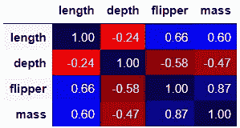

添加背景渐变只需要一行额外的代码。通过传递`axis=None`，颜色渐变将应用于整个表格，而不是特定的轴。所需调色板的名称被传递给`cmap`参数。对于这个参数，我们可以使用任何 [Matplotlib colourmap](https://matplotlib.org/tutorials/colors/colormaps.html) 。这里有一个关于色彩映射表的有用提示:如果你需要翻转色标，在色彩映射表名称上加上`_r`后缀就可以了。例如，如果我们用`'seismic'`而不是`'seismic_r'`，负相关将会是蓝色，正相关将会是红色。

前面的例子看起来和本文开头的例子不太一样。它需要更多的定制才能看起来一样:

```
(correlation_matrix.style
     .background_gradient(cmap='seismic_r', axis=None)
     .set_properties(**{'text-align': 'center', 'padding': '12px'})
     .set_caption('CORRELATION MATRIX'))
```

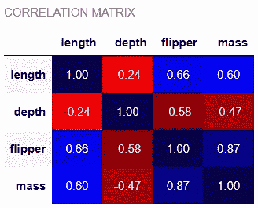

我们将值(`{'text-align': 'center'}`)居中对齐，并用`.set_properties()`增加了行高(`{'padding': '12px'` )。然后，我们用`.set_caption()`在桌子上方加了一个标题。在这个例子中，我们对背景应用了颜色渐变。我们也可以使用`.text_gradient()`对文本应用颜色渐变:

```
(correlation_matrix.style
     .text_gradient(cmap='seismic_r', axis=None))
```

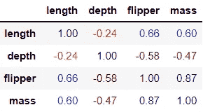

如果有用的话，我们也可以链接两种类型的渐变:

```
(correlation_matrix.style
     .background_gradient(cmap='YlGn', axis=None)
     .text_gradient(cmap='YlGn_r', axis=None))
```

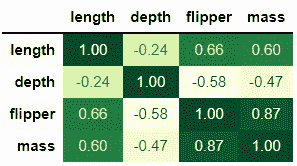

在我们结束这一部分之前，我想展示一个更有用的例子。假设我们有一个简单的混淆矩阵:

```
# Create made-up predictions
df['predicted'] = df['species']
df.loc[140:160, 'predicted'] = 'Gentoo'
df.loc[210:250, 'predicted'] = 'Adelie'# Create confusion matrix
confusion_matrix = pd.crosstab(df['species'], df['predicted'])
confusion_matrix
```


我们可以做一些修饰，让它更有用、更漂亮:

```
(confusion_matrix.style
     .background_gradient('Greys')
     .set_caption('CONFUSION MATRIX')
     .set_properties(**{'text-align': 'center', 
                        'padding': '12px', 
                        'width': '80px'})
     .set_table_styles([{'selector': 'th.col_heading', 
                         'props': 'text-align: center'},
                        {'selector': 'caption', 
                         'props': [('text-align', 'center'),
                                   ('font-size', '11pt'),
                                   ('font-weight', 'bold')]}]))
```

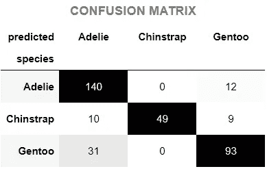

这看起来漂亮，有用，简约。你不喜欢这个混乱矩阵的样子吗？

既然我们已经熟悉了前几个例子中的前 5 行代码，那么让我们来看看剩下的代码在做什么:
◼️ `.set_properties(**{'width': '80px'})`:增加列宽
◼️ `.set_table_styles([{'selector': 'th.col_heading', 'props': 'text-align: center'}])`:居中对齐列标题
◼️ `.set_table_styles([{'selector': 'caption', 'props': [('text-align', 'center' ), ('font-size', '11pt'), ('font-weight', 'bold')]}])`:居中对齐标题，增加其字体大小并加粗。

## 1.2.颜色条📊

现在，让我们看看如何将数据条添加到数据帧中。我们将首先创建一个数据透视表，然后使用`.bar()`创建数据栏:

```
# Create a pivot table with missing data
pivot = df.pivot_table('mass', ['species', 'island'], 'sex')
pivot.iloc[(-2,0)] = np.nan# Style
pivot.style.bar(color='aquamarine')
```

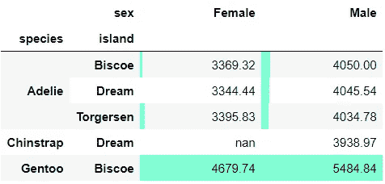

这可以像前面的例子一样进一步设计:

```
(pivot.style
     .bar(color='aquamarine')
     .set_properties(padding='8px', width='50'))
```

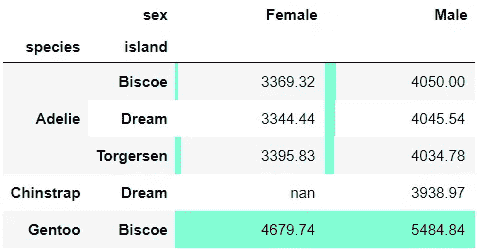

之前我们熟悉了这种格式:`.set_properties(**{'padding': '8px', 'width': '50'})`。上面的代码显示了将参数传递给`.set_properties()`的另一种方法。

如果您有正值和负值，您可以通过传递两种颜色(`color=['salmon', 'lightgreen']`)并在中间对齐条形(`align='mid'`)将数据格式化如下:

```
# Style on toy data
(pd.DataFrame({'feature': ['a', 'b', 'c', 'd', 'e', 'f'],  
               'coefficient': [30, 10, 1, -5, -10, -20]}).style
   .bar(color=['salmon', 'lightgreen'], align='mid')
   .set_properties(**{'text-align': 'center'})
   .set_table_styles([{'selector': 'th.col_heading', 
                       'props': 'text-align: center'}]))
```

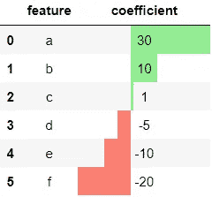

这里，我们还确保列标题和值居中对齐。

## 1.3.突出🔆

有时候，根据条件突出显示值会很有用。在本节中，我们将学习一些突出特殊值的函数。

首先，我们可以突出显示每列的最小值，如下所示:

```
pivot.style.highlight_min(color='pink')
```

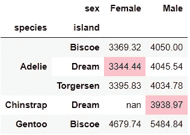

最大值有一个等价函数:

```
pivot.style.highlight_max(color='lightgreen')
```

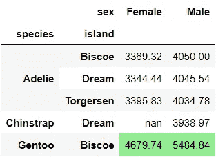

我们可以像这样将这些高亮功能链接在一起:

```
(pivot.style
     .highlight_min(color='pink')
     .highlight_max(color='lightgreen'))
```

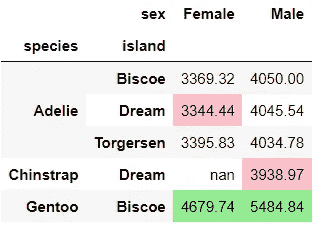

还有一个突出显示缺失值的功能。让我们将它添加到前面的代码片段中:

```
(pivot.style
      .highlight_min(color='pink')
      .highlight_max(color='lightgreen')
      .highlight_null(null_color='grey'))
```

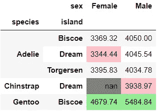

这些内置函数很容易使用，不是吗？在结束本节之前，让我们再看两个函数。我们可以突出显示如下范围内的值:

```
pivot.style.highlight_between(left=3500, right=4500, color='gold')
```

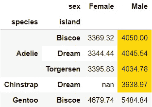

我们还可以突出分位数:

```
pivot.style.highlight_quantile(q_left=0.7, axis=None, 
                               color='#4ADBC8')
```

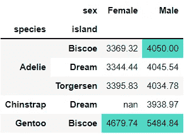

这里，我们突出显示了前 30%。

到目前为止，我们已经使用了几种不同的颜色。如果你想知道你还可以使用什么颜色名称，请查看[这个颜色名称资源](https://matplotlib.org/3.1.0/gallery/color/named_colors.html)。如上例所示，您也可以使用十六进制颜色，这将使您获得更广泛的选择(超过 1600 万种颜色！).这里是我最喜欢的探索十六进制颜色代码的资源。

## 1.4.自定义颜色代码🎨

在这最后一节中，我们将看看其他一些使用自定义函数对数据帧进行颜色编码的方法。我们将使用以下两种方法来应用我们的自定义样式函数:
◼️ `.applymap()`:元素式
◼️ `.apply()`:列/行/表格式

## **元素式应用:。applymap()**

让我们通过从数字列中截取前 8 行来创建一个小的数字数据。我们将使用 lambda 函数将 190 以上的值着色为蓝色，其余部分为灰色:

```
df_num = df.select_dtypes('number').head(8)
(df_num.style
    .applymap(lambda x: f"color: {'blue' if x>190 else 'grey'}"))
```

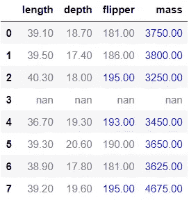

让我们看另一个例子:

```
green = 'background-color: lightgreen'
pink = 'background-color: pink; color: white'
(df_num.style
       .applymap(lambda value: green if value>190 else pink))
```

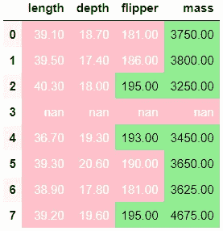

我们可以将 lambda 函数转换成常规函数，并将其传递给`.applymap()`:

```
def highlight_190(value):
    green = 'background-color: lightgreen'
    pink = 'background-color: pink; color: white'
    return green if value > 190 else pinkdf_num.style.applymap(highlight_190)
```

## 行/列/表方式应用程序:。应用()

让我们看看如何使用`.apply()`进行同样的格式化:

```
def highlight_190(series):
    green = 'background-color: lightgreen'
    pink = 'background-color: pink; color: white'
    return [green if value > 190 else pink for value in series]df_num.style.apply(highlight_190)
```

我们也可以像前面的函数一样链接它们:

```
(df_num.style
       .apply(highlight_190)
       .applymap(lambda value: 'opacity: 40%' if value<30 
                 else None))
```

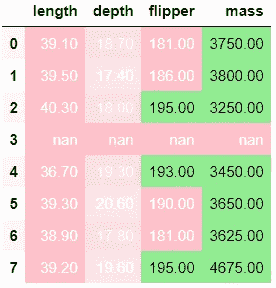

知道如何同时使用`.apply()`和`.applymap()`很有用。这里有一个例子，我们可以使用`.apply()`，但不能使用`.applymap()`:

```
def highlight_above_median(series):
    is_above = series>series.median()
    above = 'background-color: lightgreen'
    below = 'background-color: grey; color: white'
    return [above if value else below for value in is_above]
df_num.style.apply(highlight_above_median)
```

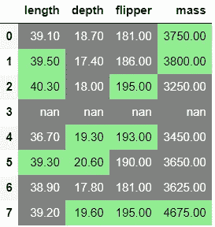

我们找到每一列的中间值，用绿色突出显示高于中间值的值，用灰色突出显示其余的值。我们还可以使用`.apply()`根据条件来设计整列的样式:

```
def highlight(data):
    n = len(data)
    if data['sex']=='Male':
        return n*['background-color: lightblue']
    if data['sex']=='Female':
        return n*['background-color: lightpink']
    else:
        return n*['']df.head(6).style.apply(highlight, axis=1).hide_index()
```

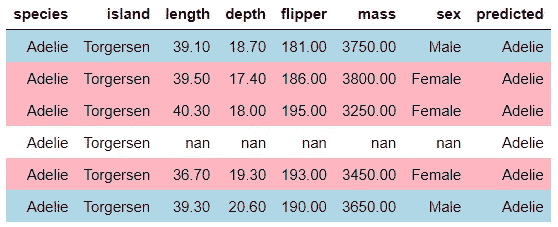

这里，我们用`.hide_index()`隐藏了 DataFrame 的索引，以获得更清晰的外观。如果需要，您也可以使用`.hide_columns()`隐藏列。

最后，我们在这篇文章中看到的大多数函数都采用可选参数来定制样式。下面两个参数是常见的，知道它们非常有用:
◼ ️ `axis`用于沿哪个轴操作:列、行或整个表
◼️ `subset`用于选择要样式化的列的子集。


卢卡斯·本杰明在 [Unsplash](https://unsplash.com?utm_source=medium&utm_medium=referral) 上拍摄的照片

希望你喜欢学习通过颜色编码美化数据帧的有用方法。样式化的数据框架有助于更轻松地探索和分析数据，并使您的分析更具可解释性和吸引力。如果你热衷于学习更多关于造型的知识，看看熊猫的这个有用的文档。

*您想要访问更多这样的内容吗？媒体会员可以无限制地访问媒体上的任何文章。如果您使用* [*我的推荐链接*](https://zluvsand.medium.com/membership)*成为会员，您的一部分会费将直接用于支持我。*

感谢您阅读这篇文章。如果你感兴趣，这里有我关于熊猫的一些其他帖子的链接:
◼️️ [从熊猫到 PySpark](/from-pandas-to-pyspark-fd3a908e55a0)
◼️️ [在熊猫中编写 5 个常见的 SQL 查询](/writing-5-common-sql-queries-in-pandas-90b52f17ad76?source=your_stories_page-------------------------------------)
◼️️ [在熊猫中编写高级 SQL 查询](/writing-advanced-sql-queries-in-pandas-1dc494a17afe?source=your_stories_page-------------------------------------)
◼️️ [给熊猫用户的 5 个提示](/5-tips-for-pandas-users-e73681d16d17?source=your_stories_page-------------------------------------)
◼️️ [在熊猫中进行数据聚合的 5 个提示](/5-tips-for-data-aggregation-in-pandas-7eaa8476dc75?source=your_stories_page-------------------------------------)
◼️️ [如何在熊猫数据框架中转换变量](/transforming-variables-in-a-pandas-dataframe-bce2c6ef91a1?source=your_stories_page-------------------------------------)

再见🏃 💨