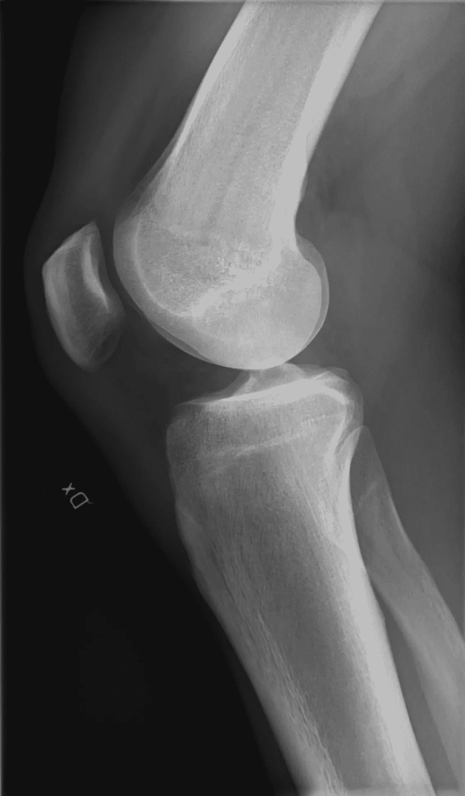

# 预防黑色疼痛:深度学习揭示数十年之久的膝盖疼痛之谜

> 原文：<https://towardsdatascience.com/preventing-black-pain-deep-learning-illuminates-decades-long-knee-pain-mystery-d512499d43bc?source=collection_archive---------48----------------------->

## 深度学习可以减少医疗偏见并改善服务不足社区的结果吗？

最近的深度学习模型采取措施解决一个长期存在的谜团。具体来说，**为什么黑人患膝骨关节炎的痛苦更多**？为什么他们**不太可能接受膝关节置换手术**？

医生通常用 KLG 的 Kellgren-Lawrence 分级来确定骨关节炎的严重程度。KLG 是几十年前在英国白人中发展起来的一种方法。相反，这个 ***研究团队直接在 x 光片上训练了一个卷积神经网络来预测病人的疼痛*** 。

图片来自[维基共享资源](https://commons.wikimedia.org/wiki/File:X-ray_of_a_normal_knee_by_lateral_projection.jpg)

该数据集包括 4，172 名患有或处于患膝骨关节炎高风险的美国患者。X 射线用于预测膝关节损伤和骨关节炎结果评分(KOOS)，该评分来自患者完成的调查。因此，KOOS 让病人而不是医生来充当真相的仲裁者。

结果如何？卷积神经网络比 KLG 更好地预测了病人的疼痛。卷积神经网络解释了 43%的种族痛苦不平等，是 KLG 解释的 4.7 倍。它还更好地解释了其他得不到充分服务的人群中的不平等，包括低收入和教育程度低的患者。

为什么这很重要？虽然这种早期的网络并不能解释种群间的全部差异，但它可能是第一步。这里研究的三个社区——黑人、低收入和低教育水平社区——接受膝盖手术的可能性低 63%—85 %,接受阿片类药物的可能性高一倍。**适用于所有人群的模型可能会减少疼痛和止痛药的过度使用。**

当看到谁有资格用这个模型做膝盖手术时，团队发现*有两倍多的黑人患者有资格做膝盖置换*。这些患者可能正在服用阿片类药物。通过更好地预测疼痛，可以为患者带来更好的结果。

然而，更有趣的是对未来研究的总结。

# 未来

我们可以为未来的医学模式吸取一些教训:

**1。使用多样化的数据。**作者发现，从训练数据中去除黑人、低收入或低教育水平的患者仍然比 KLG 减少了疼痛差异——但幅度要小得多。

**2。小心选择你的输入和输出。** X 射线、核磁共振成像和其他无偏倚的图像数据可以导致类似的偏倚减少。然而，这些并不是每个病人和每种情况都可以得到的。

在某些情况下，来自患者结果的数据可能是很好的输出。我很想看到这种卷积神经网络被训练用于其他存在医疗不平等的领域。例如，诊断跨[性别](https://chadd.org/for-adults/women-and-girls/)、[种族](https://www.ncbi.nlm.nih.gov/pmc/articles/PMC3691530/)、[社会经济地位](https://pubmed.ncbi.nlm.nih.gov/26266467/)的 ADHD。

**3。可解释性是一件大事。虽然该模型能够很好地识别人群中的疼痛，但这种神经网络还无法显示哪些因素参与了决策。特别是在医学应用中，这种透明性和可解释性将补充人类知识，并增加网络中的信任。**

# 结束语

通过**将 X 射线数据映射到自我报告的患者结果**，研究人员**更好地预测了患者自我报告的疼痛**，特别是在服务不足的群体中。这种方式的训练模型可以改善患者的结果，并减少医疗应用中的治疗差异。

这项研究为深度学习团队提供了一条美好的前进道路。团队可以将不同的数据从无偏见的输入映射到自我报告的患者数据。因此，*高性能预测模型可以补充传统工具和知识库。*