# 防止机器学习中过拟合的套索、脊和弹性网正则化

> 原文：<https://towardsdatascience.com/preventing-overfitting-with-lasso-ridge-and-elastic-net-regularization-in-machine-learning-d1799b05d382?source=collection_archive---------13----------------------->

使用 L1 和 L2 正则化的线性回归用于机器学习中的偏差-方差权衡


照片由 pexels 上的 Ikbal Alahmad 拍摄

∘ [线性回归的缺点](#2059)∘[正则化回归](#663a)∘[1。拉索回归](#620f)
∘ [2。岭回归](#f457)
∘ [3。弹性网回归](#6a43)
∘[L1 和 L2 之间的差异处罚](#31f9)
∘ [结论](#e6b4)

线性回归模型很受欢迎，因为它们易于理解和解释。然而，在实践中，线性模型无法有效表达 [*非线性关系*](https://www.statology.org/nonlinear-relationship-examples/) 。当有*多个特征*时，它们也很容易[过度拟合](https://elitedatascience.com/overfitting-in-machine-learning#overfitting-vs-underfitting)，尤其是如果这些特征不是目标特征的有用预测者。

Lasso、Ridge 和 Elastic-net 算法是线性回归的修改，应用 l1 或 l2 正则化导致特征选择或特征收缩，从而减少过度拟合。

## 线性回归的缺点

**1。线性回归不能有效地表达非线性关系。**

在本节中，我们将使用模拟数据集来演示非线性关系中线性表达式的行为。让我们从一个简单的线性模型开始，它对一个独立(输入)特征和一个从属(目标)特征之间的关系进行建模。

我们将使用一个[模拟数据集](https://github.com/suemnjeri/medium-articles/blob/main/regularization/Cosine%20curve%20simulation.ipynb)，类似于我在[这篇文章](/what-is-model-complexity-compare-linear-regression-to-decision-trees-to-random-forests-7ec837b062a9)中使用的数据集。[数据集](https://github.com/suemnjeri/medium-articles/blob/main/regularization/cosine_df.csv)包含 x 和 y 两列，每列有 100 个值，绘制时显示余弦**曲线模式**。

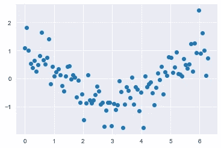

按作者划分的 x 和 y 值散点图

下面是真正的余弦曲线。

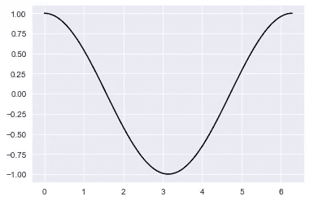

作者的真实余弦曲线

在导入了`numpy`、`pandas`、`matplotlib`和`seaborn`库之后，我们读入我们的数据帧。

```
df = pd.read_csv(‘cosine_df.csv’)
df.head()
```

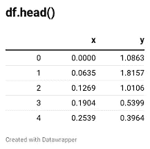

接下来，我们将训练一个线性回归模型并预测余弦数据集的结果。记住底层模式是一条*曲线*，一个简单的线性回归模型通过数据拟合出一条*直线*。

下面的函数接收*数据*和一个*模型的实例。*它将数据集分成*目标*和*特征*，*符合*模型，对训练数据进行*预测*，并且*绘制*预测。然后，它返回训练好的模型。

```
def model_fitter(data, model):
    features = data.drop('y', axis = 1)
    target = data['y']
    model.fit(features, target)
    preds = model.predict(features)
    plt.scatter(data.x, data.y)
    plt.plot(data.x, preds, 'k--')
    plt.show()
    return model
```

**简单线性回归**

现在，让我们使用我们的`model_fitter`函数在我们的数据上训练一个线性回归模型，但是首先，我们*从 sci-kit learn 导入*库。

```
from sklearn.linear_model import LinearRegressionlm = model_fitter(df, LinearRegression())
```

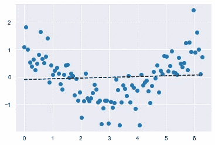

作者的简单线性回归

结果是预期的直线线性回归线，它转化为不代表数据集曲线的**欠拟合**模型。

让我们显示估计的 y_intercept ( *β* 0)和输入特征系数 x *(β* 1)

```
print(lm.intercept_)
print(lm.coef_)### Results
-0.09248137706996012
[0.02712842]
```

**2。线性回归模型在很多特征的情况下容易过度拟合**

增加线性回归模型复杂性的一种方法是增加输入要素。

这里，我们将使用模拟数据集的[修改版本](https://github.com/suemnjeri/medium-articles/blob/main/regularization/cosine_df_extra_columns.csv)。除了我们的 2 列(x 和 y)之外，我们添加了 99 个其他列(s1 到 s99 ),它们包含没有预测影响的随机值，并且与我们的 2 个重要特征 x 和 y 没有任何关系。

下面的代码加载数据集`(suspect_df)`并显示前 5 行。

```
suspect_df = pd.read_csv('cosine_df_extra_columns.csv')
suspect_df.head()
```

**多元线性回归**

接下来，我们拟合一个**多元线性回归**，因为有多个输入特征。更多关于那篇文章中的[。我们使用与上面相同的函数，并将模型保存为`lm_s`。](/fundamentals-of-linear-regression-for-machine-learning-87d684007dee)

```
lm_s = model_fitter(suspect_df, LinearRegression())
```

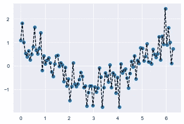

作者拥有 100 个输入列的多元线性回归

哇！我们的模型完全超负荷了。有了 100 个输入要素和 100 个观测值(行)，模型就有足够的系数组合来记忆每个单独的观测值，从而创建一个完美的过拟合模型。这个模型在新的未知数据上表现不佳。

**注:**在现实世界的数据集中，分析师收集并保留大量特征只是为了安全起见，或者在特征工程期间开发许多特征是很常见的。如果这些特征不能作为预测器，可能会导致过度拟合。

以下是 100 个特征(包括 x)的系数。

```
print(lm_s.coef_)
```

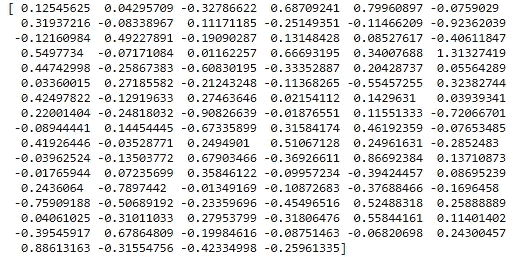

## 正则回归

线性回归模型的任务是减少[成本函数](https://ml-cheatsheet.readthedocs.io/en/latest/linear_regression.html#cost-function)并得出代表数据中真实模式的 *β* 0 和 *β* 1 系数的最佳估计值。

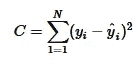

成本函数 MSE

**在线性回归的背景下，正则化**是*惩罚*模型系数的技术，从而减少过度拟合。这是通过向成本函数添加惩罚因子(*成本函数+对系数*的惩罚 y *)来最小化成本函数和惩罚。λ值，或 *λ* ，控制我们最小化惩罚因子的程度，并控制模型的拟合程度。*

正则化有两种类型；L1 和 L2。每一个都受到不同的惩罚，导致不同的行为。从下面的公式中，我们可以看到惩罚是如何改变成本函数的。

**L1 正则化。**这种方法不利于系数的**绝对**大小。

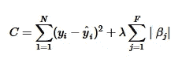

L1 正则化

**L2 正规化。**这会影响系数的**平方**大小。


L2 正则化

正则化会导致系数缩小或在某些情况下减少到零，从而完全移除该特征及其对模型的影响，解决[多重共线性](https://statisticsbyjim.com/regression/multicollinearity-in-regression-analysis/)问题。系数越高的特征对目标变量的影响越大。可以通过调整 *λ常数来调整罚函数。*

我们将在本帖中描述的正则化算法在应用于成本函数的 **l1** 或 **l2** 惩罚的*量*上有所不同。

**正则化回归算法。**

## **1。拉索回归**

LASSO 代表 **L** 东**A**b**S**h**S**选举 **O** 操作员。这完全依赖于 **L1 惩罚**，它可以将系数的大小减小到 0，从而导致自动特征选择(系数为 0 的特征不会影响模型)。

由于 *λ* (惩罚的“强度”)可以并且应该被调整，所以更强(更大)的惩罚导致更多的系数被推到零。

我们将使用 [sci-kit learn 的](https://scikit-learn.org/stable/modules/generated/sklearn.linear_model.Lasso.html) [Lasso](https://scikit-learn.org/stable/modules/generated/sklearn.linear_model.Lasso.html) 类，并运行我们的`model_fitter`函数来实例化 Lasso 模型，拟合它，绘制预测并返回模型。这涉及到一些随机化，因此我们将一个`random_state`值传递给模型实例。

```
from sklearn.linear_model import Lassolasso = model_fitter(suspect_df, Lasso(random_state=2021))
```

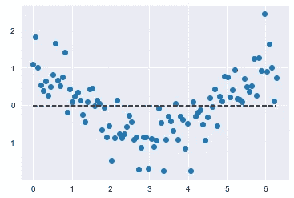

作者的 Lasso 回归模型

结果模型是一条欠拟合水平回归线，或[均值模型](https://www.theanalysisfactor.com/assessing-the-fit-of-regression-models/)(该线位于目标特征的均值)。让我们显示模型系数。

```
print(lasso.coef_)
```

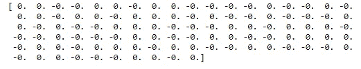

我们看到所有系数都被强制降为零，包括预测 x 特征。

解决这个问题的方法是在 sci-kit learn 中调整惩罚强度 *λ* 和*，这个参数称为`alpha.`，默认值为`alpha=1.0`。因此，我们应该减少它，因为如前所述，更高的 *λ* 值导致更多的系数被强制为 0。*

让我们用`alpha=0.1`观察结果。

```
lasso_point1 = model_fitter(suspect_df, Lasso(random_state=1234, alpha=0.1))
```


alpha=0.1 的套索模型

现在这个模型正趋向于过度拟合。这里是`alpha 0.1`的系数。

```
print(lasso_01.coef_)
```

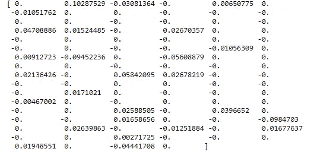

我们现在看到大约三分之二的系数是 0。该模型进行了**特征选择。**在 Lasso 中，不同的系数以不同的速率到达零，并且根据模型，最后被置零的特征是最重要的特征。

我们可以运行一个`for-loop`来研究 0.1 和 1.0 之间不同`alpha`值的影响，并确定最佳模型。

```
values = [0.1, 0.3, 0.5, 1.0]
for n in values:
    plt.title('Alpha value: {}'.format(n))
    model_fitter(suspect_df, Lasso(random_state=2021, alpha = n))
```

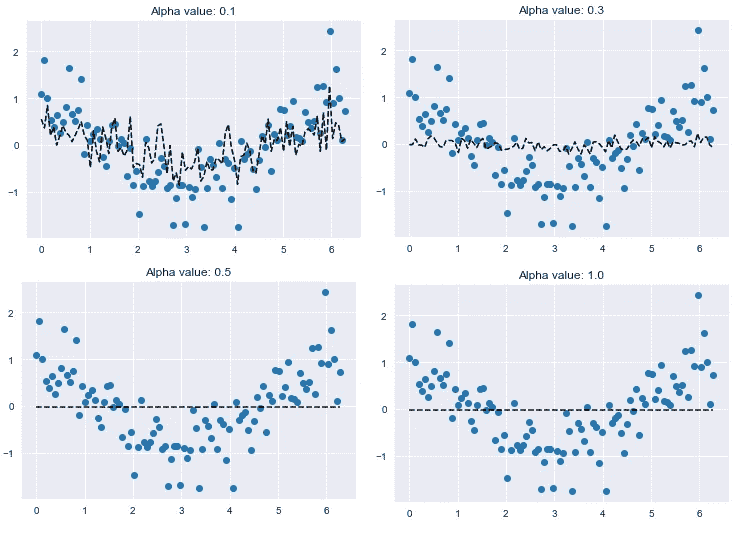

作者使用不同 alpha 值的套索模型

我们看到模型的复杂性随着 alpha 值的增加而降低。注意截距不受λ(`alpha` 值)的影响。

当`alpha`值接近 0 时，该模型为线性回归模型(参考我们上面过度拟合的多元线性回归模型)。随着 alpha 的增加，方差减少，而偏差增加，模型成为全局平均值。

## **2。岭回归**

里奇(不是首字母缩写)完全依赖于 **L2 罚函数**，这导致系数更接近于零，但不是完全为零。这导致特征收缩。

更大的 *λ* ，或惩罚强度，导致更多的系数接近零。

我们首先从`sklearn.linear_model`导入`Ridge`类。然后我们调用我们的函数`model_fitter`，传入`suspect_df`和一个`Ridge`回归模型的实例。默认的 alpha 值是`alpha=1.0`。

```
from sklearn.linear_model import Ridgeridge = model_fitter(suspect_df, Ridge(random_state=2021))
```

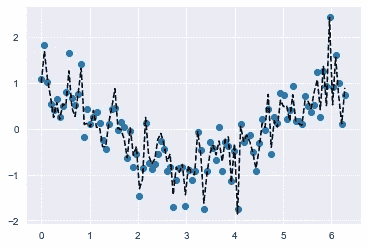

作者使用默认值的岭回归

我们立即注意到模型过拟合。让我们看看模型系数。

```
print(ridge.coef_)
```

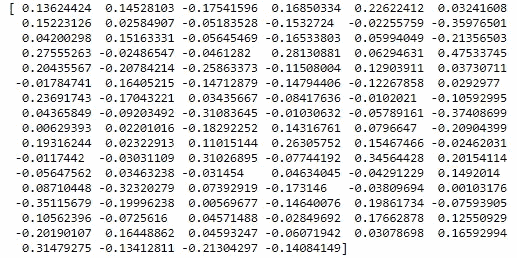

这些系数似乎相当高，因此，我们需要通过增加`alpha`值来*缩小*它们。这降低了噪音柱对模型的影响。

让我们用一个`for-loop`来考察五个`alpha`值对不同岭回归模型的影响。alpha 值为 1，1000，3000，5000 和 50000。

```
values = [1, 1000, 3000, 5000, 50000]
for n in values:
    plt.title('Alpha value: {}'.format(n))
    model_fitter(suspect_df, Ridge(random_state=2021, alpha = n))
```

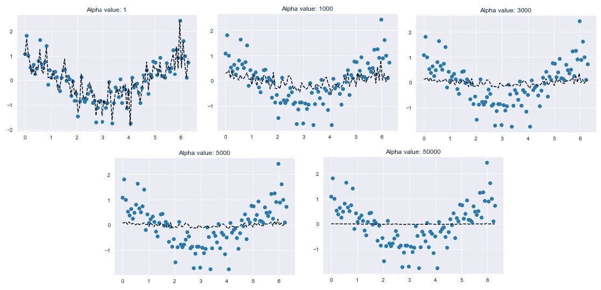

作者使用不同 alpha 值的岭模型

我们注意到，随着 alpha 值的增加，模型偏差也会增加(变得过于笼统，忽略了相关关系)。在最高 alpha 值为 50000 时，回归线是目标特征的平均值，或[平均值模型](https://www.theanalysisfactor.com/assessing-the-fit-of-regression-models/)。

```
print(df.y.mean())###Results
-0.007254917297325034
```

让我们检查一下`alpha=30000`处的系数。

```
ridge_30000 = model_fitter(suspect_df, Ridge(random_state=2021, alpha = 30000))print(ridge_30000.coef_)
```

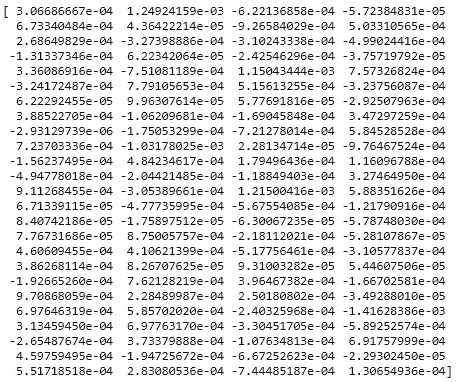

α= 30000 的岭回归系数

请注意数值中的高负幂。随着 alpha 值的增加，越来越多的系数接近零。这解释了先前讨论的**特征收缩**方面。

## **3。弹性网回归**

弹性网回归模型是套索和山脊之间的妥协。它通过应用一个比率来结合套索和山脊惩罚。在 sci-kit learn 中，这个比率被称为`l1_ratio`，它定义了应用于模型的 L1 惩罚的比例。`l1_ratio`和`alpha`(或处罚力度)应该一起调整。

如果你设置比率完全偏向前者(`l1_ratio = 0`)或后者(`1`)，那么山脊和套索回归就是弹性网的特例。

**注意:**如果你希望*结合*套索和脊的功能，使用弹性网回归。如果调整得当，这会带来更好的性能。您可以将比率(`l1_ratio`)设置为 1(套索)或 0(脊线)，但在这种情况下，sci-kit 的 elastic-net 实现并不是最好的。如果数据集支持岭回归或套索回归，请使用单独的岭类或套索类来获得最佳结果，并且它们也更容易调整。

为了实现弹性网回归模型，我们需要首先从`sklearn.linear_model`导入`ElasticNet`类。然后我们将调用我们的`model_fitter`函数并传入`suspect_df`数据帧和一个`ElasticNet`模型的实例。默认值为`alpha=1.0`和`l1_ratio=0.5.`

```
from sklearn.linear_model import ElasticNetenet = model_fitter(suspect_df, ElasticNet(random_state=2021))
```


作者默认的弹性网模型

该模型似乎是欠拟合均值模型，类似于`Lasso (alpha=1.0)`。让我们显示系数。

```
print(enet.coef_)
```

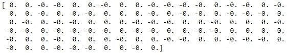

具有默认系数的弹性网

同样，就像套索一样，系数被强制为零。对于任何大于 0.5 的`l1_ratio`，观察到类似的结果。

随着比率越来越接近零，岭回归的 L2 惩罚越来越受青睐。下面是模型。

```
enet_point1 = model_fitter(suspect_df, ElasticNet(random_state=2021, l1_ratio = 0.1))
```

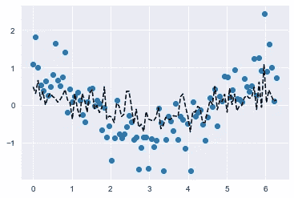

l1_ratio=0.1 的弹性网模型

以下是比率为 0.1 时的系数。

```
print(enet_point1.coef_)
```

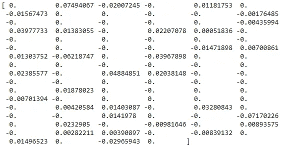

类似于具有低`alpha`值的 Lasso 回归，该模型应用了一些特征工程。这是因为 0.1 的`l1_ratio`意味着仍然有一些 L1 罚值导致一些系数为 0。然而，进一步将`l1_ratio`向 0 减小(例如 0.01、0.001 等。)应用更多的 L2 惩罚，导致非零系数。

## **L1 和 L2 点球的区别**

L1 范数对于异常值更稳健，但是对于不同的λ值不稳定，因为模型随着不同的λ值而显著变化。

如果异常值很重要，则 L2 更好，因为系数的平方会导致这些要素的成本呈指数增长。

此外，L1 有一个内置的特征选择，将系数缩小到 0，而 L2 将系数缩小到接近 0，从而降低了稀疏度。

## 结论

这是对用于减少机器学习的线性回归中的过拟合的正则化技术的基本介绍。我们使用了套索、脊和弹性网模型，这些模型将 L1 或 L2 罚函数应用于成本函数，以减少系数的大小，从而减少模型方差。

当调整超参数如`alpha`和`l1_ratio` 以获得最佳模型时，具有单独的训练集和测试集来分别训练模型和测试训练模型的效率是可行的。您可以采用交叉验证机制进行超参数优化，并选择性能最佳的模型，记住偏差-方差权衡。

我希望你喜欢这篇文章。每当我发表新的文章时，如果想收到更多这样的文章，请在这里订阅。如果你还不是一个媒体成员，并且愿意支持我成为一个作家，请点击[这个链接](https://medium.com/@suemnjeri/membership)，我将获得一小笔佣金。感谢您的阅读！