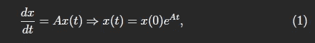
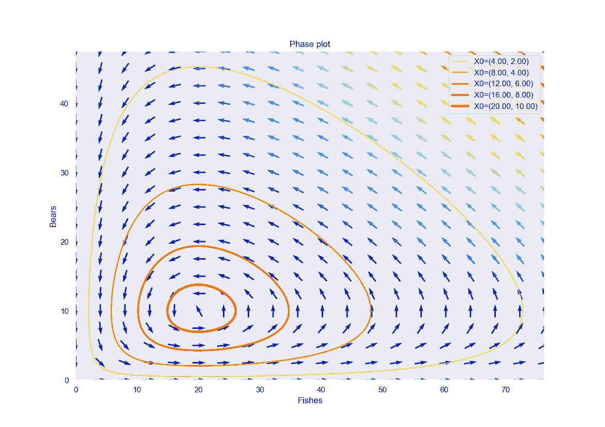

# 猎物和捕食者——生物系统动力学模型

> 原文：<https://towardsdatascience.com/prey-and-predators-a-model-for-the-dynamics-of-biological-systems-747b82d2ea9e?source=collection_archive---------17----------------------->

## Lotka-Volterra 微分方程组综述

让·维默林在 [Unsplash](https://unsplash.com/s/photos/gazelle?utm_source=unsplash&utm_medium=referral&utm_content=creditCopyText) 上拍摄的照片

> “在非洲，每天早上都有一只瞪羚醒来。它知道它必须跑得比最快的狮子还快，否则就会被杀死。每天早上一只狮子醒来。它知道它必须跑得比最慢的瞪羚快，否则它会饿死。不管你是狮子还是瞪羚。当太阳升起的时候，你最好跑起来。”

生态系统是自然的集合体，其中生物和非生物种群**相互作用**。但是，是什么规律支配着这些复杂而迷人的系统的动力学呢？尤其是，捕食者和被捕食者是如何相互作用的？

在 1925-1926 年间，两位数学家 Alfred Lotka 和 Vito Volterra 研究了这个问题，并独立地开发了一个**微分方程模型**来解决由两个动物物种组成的生态系统的情况:一个作为捕食者物种，另一个作为其猎物:猎物-捕食者模型。

# 洛特卡-沃尔泰拉模型

Lotka-Volterra 模型背后的一般思想是考虑一个理想的场景，其中**只有两个物种共存**:捕食者和它们的猎物。有一些潜在的假设:

*   捕食者只能以猎物种群为食；
*   捕食者在单位时间内消耗的食物总量(即吃掉的猎物数量)与猎物和捕食者之间发生的相遇次数成正比；
*   猎物和捕食者相遇的次数与双方种群的大小成正比；
*   在单位时间内，每个捕食者都需要最少量的食物才能生存和繁殖；
*   每种猎物都有取之不尽的食物来源，这使得它们可以在没有捕食者的情况下繁殖。

Monika Sojáková在 [Unsplash](https://unsplash.com/s/photos/ecosystem?utm_source=unsplash&utm_medium=referral&utm_content=creditCopyText) 上拍摄的照片

如果猎物的食物供应是无限的，合理的假设是这个种群的增长率， *x，*将与其当前的
大小成比例(给定更多的潜在耦合):

其中*A*0 为增长系数，即人均出生率。

没有捕食者，种群数量会随着时间无限增长。但是对于捕食者来说，它会随着捕食者数量 *y* 乘以猎物数量 *x* 成比例减少，因为这两个物种之间的互动数量**。**

****

**致命相互作用发生的速率。**

**对于捕食者来说，我们必须假设在没有猎物的情况下，种群数量会随着食物供应的减少而减少:**

****

**另一方面，捕食者也会随着两个物种的相互作用而成比例地增长，也就是说:**

****

**其中 *C* 是两个物种之间的相互作用速率。**

**综上所述，我们得到了描述两个种群 *x* (猎物)和 *y* (捕食者)的**增长率的微分方程组:****

****

# **系统平衡**

****

**希瓦·史密斯·达·佩克斯**

**当两者在一段时间内保持恒定水平时，种群达到一个平衡点，即:**

****

**在这种情况下，增长率(即导数)为零。通过替换，我们得到平衡时的方程:**

****

**我们有两种可能的解决方案:**

****

**在第一种情况下，这两个物种都灭绝了。**

**相反，第二种情况对应于这样一种情况，即猎物的数量正好与保持捕食者数量不变的食物数量相对应。稍后将详细介绍。**

# **熊和鱼**

**举个例子吧。我们假设开始时有两个种群，5 只熊(捕食者)和 10 条鱼(猎物)。通过数值积分求解模型后，我们分析了物种的时间演化。**

****

**福托迪[安 H](https://www.pexels.com/it-it/@ann-h-45017?utm_content=attributionCopyText&utm_medium=referral&utm_source=pexels) 达[佩克斯](https://www.pexels.com/it-it/foto/peluche-orso-bruno-2815377/?utm_content=attributionCopyText&utm_medium=referral&utm_source=pexels)**

**特别是，我们使用 *scipy.integrate* 模块[1]来集成 ode。该模块提供了一个方便的方法， *odeint* 来对常微分方程组进行积分: *odeint* 可以使用 FORTRAN 库 odepack 中的 **lsoda 来解一个常微分方程组，它适用于一阶刚性和非刚性系统。****

****

**人口的时间行为——作者图片**

**该模型呈现出**周期模式**。事实上，猎物的增加带动了捕食者的增长。然而，当捕食者增加时，猎物的数量减少并达到最低，因此捕食者也减少了。当掠食者减少时，新的猎物就会出现，如此等等。这种动态因此导致了**增长和衰退的持续循环**。**

****相位图**也很好地说明了周期性行为，该相位图根据不同的初始群体规模进行了参数化，并在下图中进行了描述。曲线闭合的事实表明了两个变量之间的周期性关系。**

****

**轨迹和方向图——作者图片**

# **结果分析**

**到目前为止，我们可以问自己:**

*   **一个物种能独立于另一个物种灭绝吗？**
*   **人口能稳定下来并达到一个平衡点吗？**

**至于第一个问题，答案来自平衡解，它告诉我们，只有当另一个种群也为零时，每个种群才能为零:物种不可能在不同的时间灭绝，它们必须同时灭绝。但是轨迹的封闭形式表明这种情况从未在模型中出现过(不幸的是，与现实世界不同)。**

**类似地，也不会达到**稳定状态**。这个系统循环往复，而一个趋向平衡的解决方案会呈现一个向内的螺旋图。**

****

**照片由 [Soheb Zaidi](https://unsplash.com/@msohebzaidi?utm_source=unsplash&utm_medium=referral&utm_content=creditCopyText) 在 [Unsplash](https://unsplash.com/s/photos/ball?utm_source=unsplash&utm_medium=referral&utm_content=creditCopyText) 上拍摄**

**验证系统行为的更严格的方法是通过一种叫做**线性稳定性分析**的技术。线性稳定性分析的基本步骤如下:**

1.  **找到系统的平衡点；**
2.  **考虑一个非常接近平衡点的点，以便在系统中再现一个小扰动；**
3.  **在这一点上求解方程，仅考虑具有相同数量级的附加扰动的项，以便隔离存在小振动时的系统行为；**
4.  **检查振动幅度是否增大、衰减或两者都没有。**

**使用这种方法，有可能证明食饵-捕食者模型既不是渐近稳定的，也不是不稳定的，因为，正如我们已经认识到的，它的解是周期的。**

## **笔记**

**[1]你可以在这里找到 API 文档:[https://docs . scipy . org/doc/scipy/reference/generated/scipy . integrate . odeint . html](https://docs.scipy.org/doc/scipy/reference/generated/scipy.integrate.odeint.html)**

**用于生成本文所用情节的代码可以在我的个人 github 上获得:[https://github . com/Andrea-ci/misc-stuff/tree/master/lot ka-Volterra](https://github.com/andrea-ci/misc-stuff/tree/master/lotka-volterra)。**