# 加密货币市场中订单不平衡的价格影响

> 原文：<https://towardsdatascience.com/price-impact-of-order-book-imbalance-in-cryptocurrency-markets-bf39695246f6?source=collection_archive---------2----------------------->


詹·西奥多在 [Unsplash](https://unsplash.com/s/photos/scale?utm_source=unsplash&utm_medium=referral&utm_content=creditCopyText) 上的照片

## 从 190 万订单簿观察中我们能学到什么？

我们调查不平衡的订单是否会导致价格向薄的一面变化。也就是说，根据这一假设，当限价委托单在要价方相对于出价方有较大的交易量时，价格下降，如果在出价方委托单更多，则价格上升。我们测试这一假设，并评估是否可以利用订单不平衡信息来预测 ETHUSD 市场的价格变动。

# 订单不平衡

我们根据文献，例如*卡特亚等人(2015)* ，将订单簿不平衡定义为

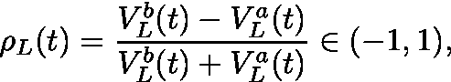

**等式 1**

其中 *t* 表示时间， *V* 表示 bid(上标 *b* 或 ask(上标 *a* )的成交量， *L* 为计算ρ *所考虑的订单深度级别。*图 1 显示了如何计算给定订单簿的不平衡 *ρ* 的示例。

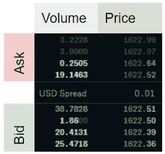

**图 1:订单簿不平衡。**ETHUSD 的限价订单示例，基于比特币基地网站的截图，显示深度 L=4。L=1 的不平衡计算为(38.7828–19.1463)/(38.7828+19.1463)≈0.33。根据我们在本文中研究的假设，大于零的值对应于价格上涨压力。对于 L=2，我们将两个最佳价格的成交量相加来计算失衡，即(38.7828+1.86–19.1463-0.2505)/(38.7828+1.86+19.1463+0.2505)≈0.36。

当做市商在相对于出价量的要价处发布大量交易时，获得接近-1 的ρ值。ρ值接近 1 意味着订单簿的出价方相对于要价方有较大的交易量。不平衡度为零时，订单簿在给定水平 *L* 处完全平衡。该假说认为，低失衡数(< 0)意味着负回报，高失衡数(> 0)意味着正回报，即价格向失衡 *ρ* 的方向移动。

## 研究人员从股市数据中得出什么结论？

*Cont et al. (2014)* 利用美股数据表明，订单流失衡存在价格影响，且“订单流失衡”与价格变化之间存在线性关系。作者将订单流失衡定义为供应和需求之间的失衡，通过在给定时期内汇总收到的订单来衡量。他们的线性模型有大约 70%的 R。该研究考虑了过去的订单流(这导致了一个不平衡的衡量标准),并将其与同一时期的价格变化进行比较。因此，结论不是订单流不平衡预测未来价格，而是在一个历史时期计算的订单流不平衡解释了同一时期的价格变化。因此，这项研究没有揭示当前订单流不平衡对未来价格的直接影响。 [Silantyev (2018)](https://medium.com/@eliquinox/order-flow-analysis-of-cryptocurrency-markets-b479a0216ad8) 在他的媒体文章中证实了使用 BTC-美元订单数据的研究结果。

*利普顿等人(2013)* ，使用 *L=1* 测量 *ρ* ，发现直到下一个报价点的价格变化可以很好地用订单簿不平衡的线性函数来近似，但是请注意
(1)变化远低于买卖价差，并且
(2)该方法“本身没有为直接的统计套利提供机会”。

*Cartea 等人(2018)* 发现，通过 *ρ* 衡量的较高订单账面失衡会导致市场订单量增加，这种失衡有助于预测市场订单到达后的价格变化。

在他们的书中， *Cartea 等人(2015)* 提出，对于一只特定的股票，过去的失衡和价格变化的相关性是体面的(10 秒间隔约为 25%)。

*Stoikov (2017)* 定义了一个中间价调整，该调整包含
订单不平衡和买卖价差。他发现由此产生的
价格(中间价加调整)比中间价和数量加权中间价更能预测中间价的短期变动。在本研究中，订单簿不平衡与我们的略有不同，具体来说，等式(1)将通过从提名者处移除请求量并将级别 *L* 固定为 1 来进行调整。该方法根据当前信息估计未来中间价的预期，并且是独立于时间范围的。根据经验，对于被评估的股票，预测最准确的时间范围是 3 到 10 秒。调整后的中间价存在于所提供数据的买价和卖价之间，这表明该方法本身并不是一种统计套利的方法，但正如作者所指出的，可以用来改进算法。

这些研究考虑了最佳买卖价格( *L=1* )，
下的分笔成交点水平数据，我们着眼于更长的时间跨度，深入到 5 的深度来计算订单
的不平衡。这些研究中的数据使用了股票市场数据，其中
的 *Silantyev (2018)* 是一个明显的例外，而我们研究的是加密货币订单。

# 数据

订单簿数据可以通过公共 API 从加密交换中查询。除蜡烛线数据之外的历史数据通常不可用。因此，我从 2019 年 5 月到 12 月(2019–05–21 01:46:37 到 2019–12–18 18:40:59)以 10 秒的间隔从比特币基地收集 ETHUSD 的订单数据，直到 5 个级别的深度。这相当于 1，920，617 次观察。数据中存在一些缺口，例如，由于我们在分析中考虑到的系统停机时间。我们统计了 592 个间隙，其中两个后续订单簿观察之间的时间戳差异大于 11 秒。数据中两个订单簿之间的时间戳并不正好是 10 秒，因为我使用重复的 REST 请求收集数据，而不是连续的 Websocket 流。

# 订单不平衡的分布

在查看价格变化和订单不平衡之间的关系之前，我们先来看看不同订单水平的不平衡分布。

我们根据等式 1 计算所有观察值和 5 个不同级别的订单簿不平衡 *ρ* ，并发现以下特性。

1.  在 *L=1* 时，不平衡通常非常明显或者根本不存在。 *L* 越高，平衡订单簿越频繁(即 *ρ≈0)* 的观察值越多)。
2.  不平衡是自相关的。等级 *L* 越深，自相关性越高

我们在图 2 和图 3 中展示了第一个发现，在图 4 中展示了第二个发现。

图 2 显示了 1 级订单不平衡的直方图。我们观察到，在这个水平上，订单簿大部分是平衡的(接近 0)，或者是高度不平衡的(接近-1 或 1)。

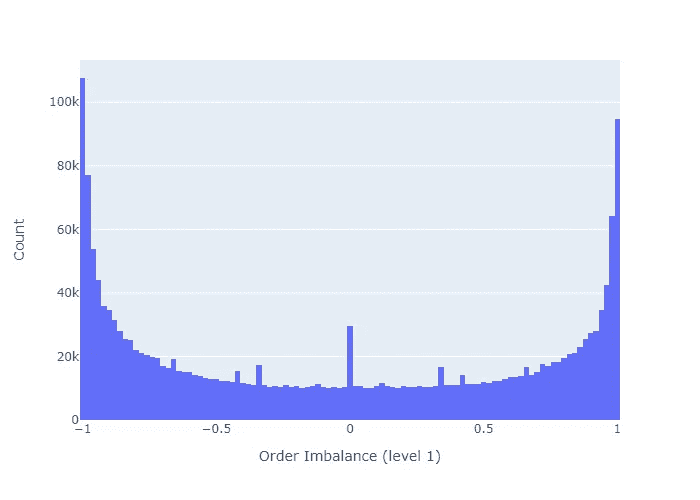

**图 2:订单簿不平衡直方图。**此图显示了第 1 级的不平衡，即仅考虑最佳买价和最佳卖价来计算不平衡。

当我们增加订单簿深度来计算不平衡时，订单簿变得更加平衡，如图 3 所示。

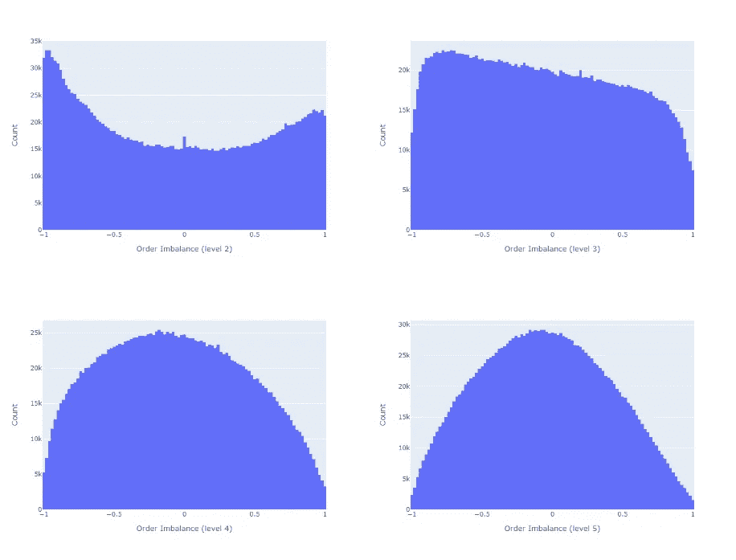

**图 3:不同订单深度的订单不平衡。此图显示了第 2 级(左上)、第 3 级(右上)、第 4 级(左下)和第 5 级的不平衡。当更多层次的深度被考虑时，秩序册更加平衡。**

图 4 显示了自相关函数(ACF)。与*一致，Cuartea et al. (2015)* 我们发现失衡高度自相关。给定滞后的相关性往往越高，用于不平衡计算的订单簿深度 *L* 越大。

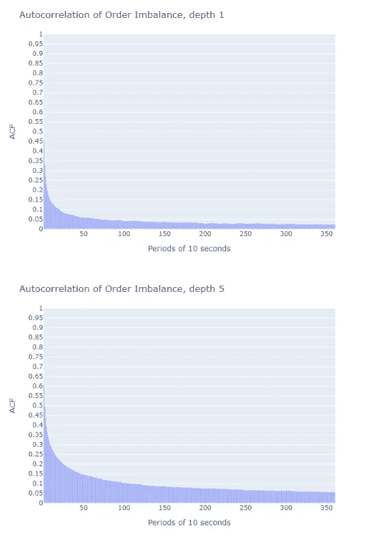

**图 4:粘性订单簿不平衡。**上图显示了在第 1 级计算的不平衡的自相关函数，下图显示了第 5 级的自相关函数。如果我们增加计算不平衡的深度，我们观察到更高的订单簿不平衡自相关。

# 订单不平衡有助于预测价格变动吗？

我们现在研究ρ和未来中间价的相关性。中间价被定义为最高买价和最低卖价的平均值。

我们首先计算每个订单不平衡观察的中期价格的 p 期提前对数收益。然后，我们计算这些回报与期初观察到的订单失衡之间的相关性。我们删除了 p 周期平均长于 11 秒(1 个周期≈ 10 秒)的观测值。

图 5 和图 6 显示了未来回报和失衡的相关性，作为衡量回报的时期的函数。我们的结论如下。

1.  相关性很低。
    例如， *Cont 等人(2014)* 报告称，在同一时期，价格影响与其衡量的订单流不平衡之间的 R 约为 70%。对于线性单变量回归模型，这个 [R 意味着 sqrt *(0.70)=0.84 的相关性*](https://en.wikipedia.org/wiki/Coefficient_of_determination)。然而，作者测量的是*同期*的价格增长，因为订单流不平衡，因此该方法不提供价格预测
2.  失衡度量 *ρ* 对更接近失衡观察的价格更具预测性(相关性随着 p 的增加而降低)
3.  考虑计算不平衡的订单簿的深度级别 *L* 越高，不平衡度量与未来价格变动的相关性就越大

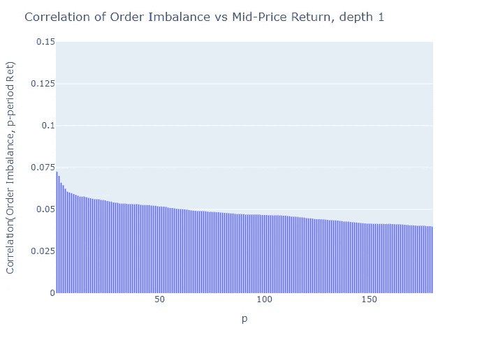

**图 5:p 期提前中间价收益与订单不平衡的相关性(L=1)。**对于近期价格，失衡指标与回报的相关性最高。

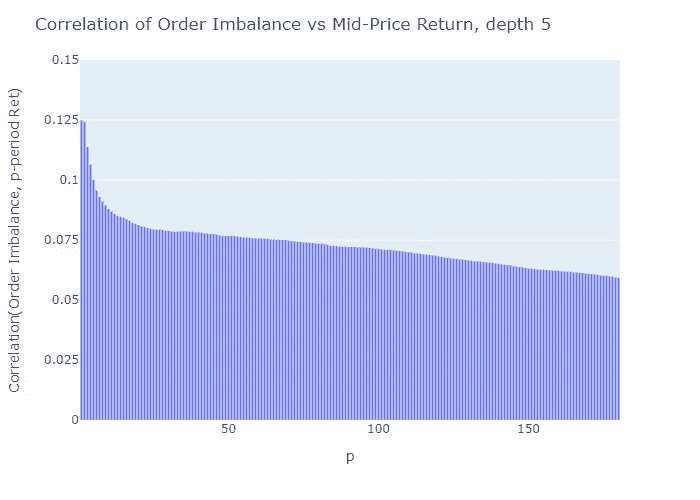

**图 6:p 期提前中间价收益与订单不平衡的相关性(L=5)。**与图 5 相比，数据表明，用更深的订单簿级别(L)计算的订单簿不平衡比用低 L 计算的不平衡是更好的价格预测器。

深度 *L=2* 到 *4* 的相应曲线与这些发现一致，为了简洁起见，我没有显示这些曲线。有关这些图的 Python 代码，请参见附录 A2。

## 价格不确定性

上述相关性表明，用较高的 *L* 计算的失衡比用较低的 *L* 计算的失衡与价格上涨的相关性更好。近期价格越多，与ρ的相关性越高。基于此，我们继续分析仅一个时期的未来预测(≈10s)。

相关性是一个平均指标，那么中间价变动的不确定性呢？

图 7 和图 8 分别绘制了 *L=1* 和 *L=5* 的 1 周期对数收益与周期开始时观察到的不平衡的关系。当不平衡很大(接近-1 或接近 1)或 0 时，1 级不平衡图(图 7)看起来似乎有更高的对数回报变化，这在 5 级不平衡中我们没有观察到(图 8)。然而，图中这种看似较大的变化源于这样一个事实，即我们在边界和零点对 L=1 有更多的观察结果(如图 2 和 3 中的直方图所示)，计算回报率的标准差并不能证实在极端情况下有更高的方差，正如我们在下一段中看到的那样。

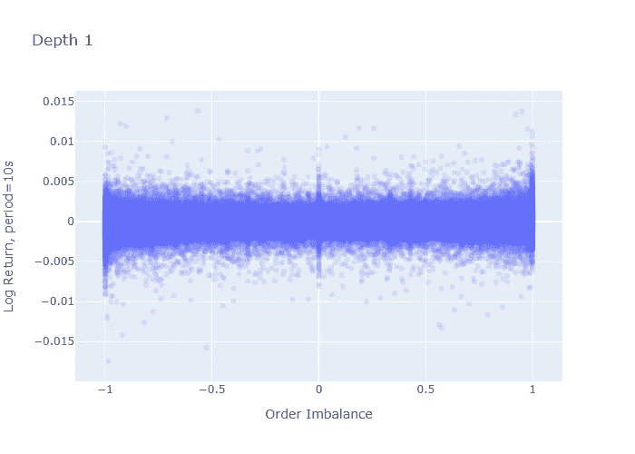

**图 7:L = 1 时的一期回报与失衡。**图中的每个点代表观察到订单不平衡(x 轴)后一段时间内观察到的退货(y 轴)

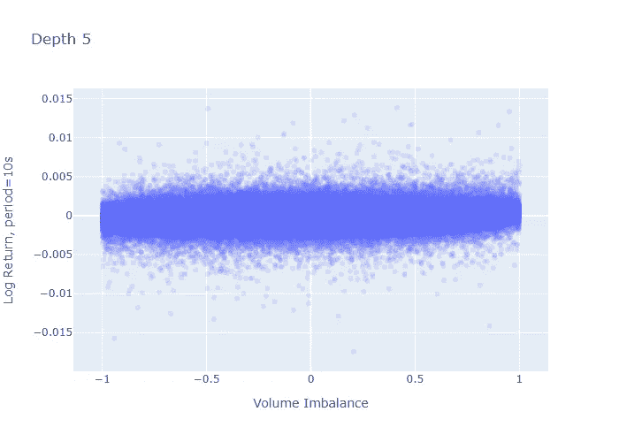

**图 8:L = 5 时单周期回报与不平衡的关系。**

## 不平衡制度

我们遵循 *Cartea et al. (2018)* 的方法，将我们的不平衡度量分成五个区域，这些区域被选择为沿点等距分布

*θ = {-1，-0.6，-0.2，0.2，0.6，1}* 。

也就是说，制度 0 的价格不平衡在-1 和-0.6 之间，制度 1 的价格不平衡在-0.6 和-0.2 之间，依此类推。表 1 显示了所有 5 种机制的 1 期远期价格回报的标准差。

**表 1:每个制度的 1 期中间价回报率的标准差。**

表 1 解决了上一段中的问题:极端失衡(状态 0 和状态 4)下的中间价差异对于订单深度级别 L=1 比级别 5 高*而不是*。

现在我们进一步分析，通过构建置信区间来估计给定区域中预期中间价回报的概率界限。我在附录 A1 中提供了这一计算的详细信息。

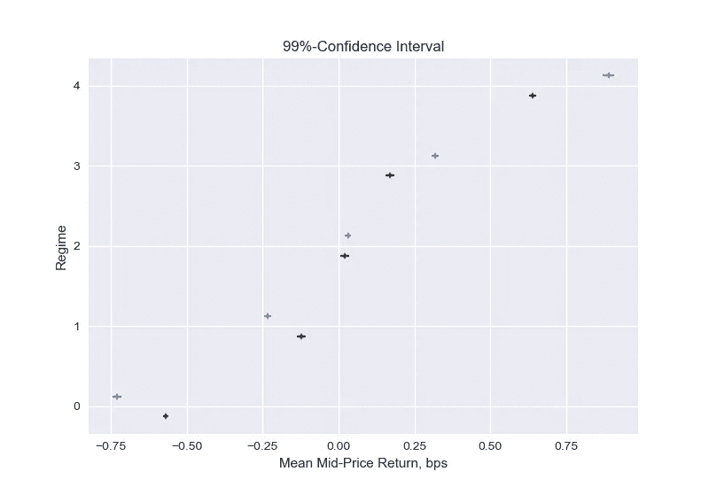

**图 9:1 级(暗)和 5 级(亮)失衡的预期中间价格回报的置信区间。**垂直标记表示预期收益的点估计，水平线表示预期收益的 99%置信区间的边界。黑线表示不平衡等级 1 的间隔，亮线表示不平衡等级 5 的间隔。

图 9 显示了给定制度下预期中间价回报的置信区间。我们可以看到，实际上，低不平衡数(状态 0 和 1)的平均回报为负，高不平衡数(状态 3 和 4)的平均回报为正。当不平衡以更高水平构建时，均值更多地向订单不平衡方向移动，例如，在状态 4 中，当不平衡以 *L=1* (黑线)计算时，1 期提前回报的均值小于在水平 *L=5* (亮线)的深度执行计算时的均值。请注意，显示的置信区间反映了期望值的不确定性。表 1 中的标准差告诉我们这个期望值附近的收益的不确定性。

这一分析证实了相关性分析的结果:失衡与 1 期未来回报之间存在正相关但相关性较弱，更深的水平(L)导致更具预测性的失衡指标。

## 经验概率

知道我们处于哪种失衡状态，下一阶段中间价上涨、持平或下跌的概率是多少？

为了看到这一点，我们将每个订单不平衡划分为 0-4 的范围，然后计算负退货、零退货和正 1 期退货的数量，并将该数量除以观察次数，以估计中间价变动的概率。

图 10 和图 11 给出了分别针对 *L=1* 和 *L=5* 计算的不平衡的经验概率。这些数字证实了我们最初的假设:

> 在订单不平衡值较低的地区，中间价下跌的可能性更大，反之亦然。

当计算只有 1 个水平(图 10)或 5 个水平(图 11)的失衡时，我们发现经验概率在定性上没有差异。我们观察到，较高级别的概率 *L=5* 比 *L=1* 更具歧视性，这是一个期望的属性。

在附录 A3 中，我们还显示了以观察非零价格变动为条件的概率。我们发现，如果价格变动，第 5 级不平衡比第 1 级不平衡的预测略好。

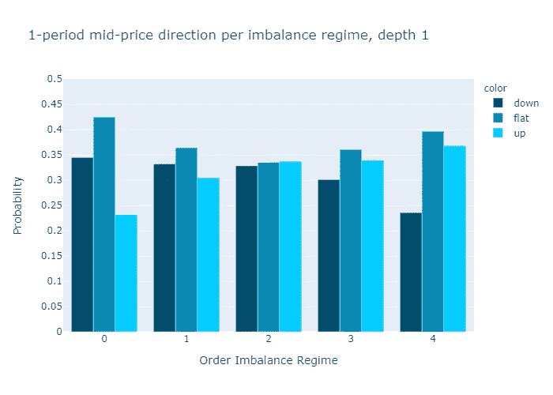

**图 10:L = 1 时中间价变动的经验概率。**

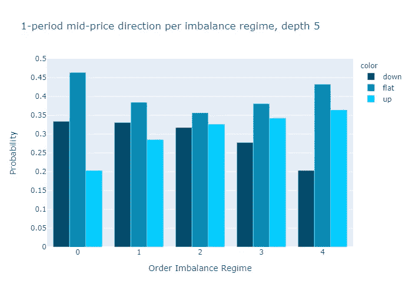

**图 11:L = 5 时中间价变动的经验概率。**

## 收益性


[乔丹·罗兰](https://unsplash.com/@yakimadesign?utm_source=unsplash&utm_medium=referral&utm_content=creditCopyText)在 [Unsplash](https://unsplash.com/s/photos/coins?utm_source=unsplash&utm_medium=referral&utm_content=creditCopyText) 上的照片

许多加密交易所的交易费用大约为 10 个基点(我们将执行 2 笔交易)。我们从置信区间(图 9)中看到，在所考虑的 10 秒期间，中间价回报低于 10 个基点。因此，从不考虑差异的预期回报来判断，我们可以得出结论，订单失衡本身并不直接意味着盈利策略，甚至不需要调查买卖价差。

为了证实这一发现，我们从另一个角度来看盈利能力，并计算价格波动大于 10 个基点的经验概率，类似于图 10 和图 11。也就是说，我们将绝对值低于 10 个基点的所有变动都视为持平。表 3 显示，对于订单水平为 1 和 5 的不平衡计算，在所有制度中，大多数交易的绝对回报都低于 10 个基点。这证实了该策略本身不允许统计套利。

**表 3:每个订单簿不平衡制度的经验概率。**此表显示了在订单簿不平衡观察(状态 0 至 4)后的一段时间内，向上移动、向下移动或相对移动小于 10 个基点(持平)的经验概率。列概率 L1 显示了为 1 级订单簿不平衡计算的经验概率，L5 显示了为 5 级订单簿不平衡计算的经验概率。

# 结论

我们对 ETHUSD 订单簿和中间价变动的分析与股票市场订单簿失衡文献中的发现一致:

*   当失衡接近-1 时，存在卖出压力，中间价更有可能在近期下跌，当失衡接近 1 时，存在买入压力，中间价更有可能上涨。
*   失衡措施的价格影响是短暂的，随着时间的推移会迅速恶化。
*   不平衡测量本身不能直接用于统计套利，但是，它可以用于改进算法。

除了文献中引用的有关订单簿失衡的内容，我还分析了使用多达 5 个级别计算的订单簿失衡，并发现失衡度量与未来价格变动的相关性随着级别的增加而增加(对于评估的 5 个级别)。然而，从图 9 中的期望值及其置信区间，我们看到，较高的水平确实只是略微改善了回报方向，并且我们观察到，当处理较高水平的订单簿深度时，经验概率只是稍微更具歧视性。因此，来自更深层次(L>1)的附加值可能无法证明更高的复杂性是合理的(对于高频算法，处理更深层次通常更耗时)。

最后，我们发现失衡和价格变动之间最强的关系出现在数据中可用的最短时间(10 秒)内。因此，我得出结论，与本文中研究的 10 秒周期长度相比，研究分笔成交点数据可以揭示更多的见解。

# 参考

Cartea，a .，R. Donnelly 和 S. Jaimungal (2018 年)。用指令簿信号增强交易策略。*应用数理金融学* 25 (1)，1-35。

Cartea，a .，S. Jaimungal 和 J. Penalva (2015 年)。*算法和高频交易。*剑桥大学出版社。

Cont，r .，A. Kukanov 和 S. Stoikov (2014 年)。订单事件的价格影响。*金融计量经济学杂志*第 12 卷第 1 期，第 47-88 页。

Lipton，a .，U. Pesavento 和 M. G. Sotiropoulos (2013 年)。限价订单簿中的交易到达动态和报价不平衡。 [*arXiv 预印本 arXiv:1312.0514*。](https://arxiv.org/pdf/1312.0514.pdf)

Paolella，硕士(2007 年)。中间概率:一种计算方法。约翰·威利的儿子们。

Silantyev，E. (2018)。[加密货币市场的订单流分析](https://medium.com/@eliquinox/order-flow-analysis-of-cryptocurrency-markets-b479a0216ad8)。*中等*。

Stoikov，S. (2017 年)。未来价格的高频估计者。可致电 SSRN 2970694 查询。

# 附录

## A1。置信区间

我们感兴趣的是在给定状态下对数收益的均值。我们构建了置信区间，使我们能够在给定的制度下估计预期中间价回报的概率界限。我们在此提出的方法是标准的，例如，参见 Paollela 2017。

由[中心极限定理](https://en.wikipedia.org/wiki/Central_limit_theorem)，样本均值

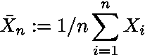

方程式 A.1

随机变量中的*I . I . d .*Xi*都是正常的:*

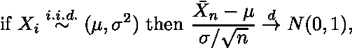

方程式 A.2

其中 *Xi* 表示从具有均值 *μ* 和标准差 *σ* 的分布中提取的 *i=1，…，n* 个观察值，上标有 *d* 的箭头表示分布收敛，N(0，1)表示标准正态分布。我们可以将等式 A.2 非正式地表示为

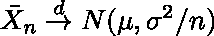

方程式 A.3

这导致了均值和方差的估计

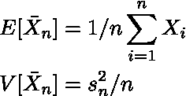

方程式 A.4

其中 *s* 为样本标准差。现在，水平(1-α)的置信区间由下式给出

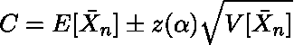

方程式 A.5

*z(α)* 代表标准正态密度曲线 x 轴上的点，使得观察到大于 *z(α)* 或小于- *z(α)* 的值的概率等于α。

为了应用这种形式的中心极限定理，中间价回报必须是 *i.i.d.* 。中间价回报的自相关性低于 1%(另见 A2)，并且没有迹象表明它们应该源于不同的分布或具有相关性中未反映的其他相关性，因此我们可以假设 *i.i.d.* 属性成立，并使用等式 A.4

```
import scipy.stats as st
import numpy as npdef estimate_confidence(shifted_return, 
                        vol_binned, 
                        volume_regime_num, 
                        alpha=0.1):
    *"""
    Estimate confidence interval for given alpha* ***:param*** *shifted_return: array of returns for which we calculate       
                           the confidence interval
                           of its mean, can contain NaN* ***:type*** *shifted_return: float array of length n* ***:param*** *vol_binned: volume regimes. Entry i corresponds to the 
                       volume regime associated with 
                       shifted_return[i]* ***:type*** *vol_binned:  float array of length n* ***:param*** *volume_regime_num: equals np.max(vol_binned)+1* ***:type*** *volume_regime_num:  int* ***:return****: confidence intervals for mean of the returns per regime* ***:rtype****:  float array of size volume_regime_num x 2
    """* confidence_interval = np.zeros((volume_regime_num, 2))
    z = st.norm.ppf(1-alpha)
    for regime_num in range(0, volume_regime_num):
        m = np.nanmean(shifted_return[vol_binned == regime_num])
        s = np.nanstd(shifted_return[vol_binned == regime_num])
        sqrt_n = np.sqrt(np.sum(vol_binned == regime_num))           
        confidence_interval[regime_num, :] = [m - z * s/sqrt_n, 
                                              m + z * s/sqrt_n]
    return confidence_interval
```

## A2。绘制自相关函数

下面的 Python 代码片段计算自相关和绘图。该计算考虑了时间序列中大于 11 秒的(硬编码)间隙。

```
import numpy as np
from datetime import datetime
import plotly.express as pxdef shift_array(v, num_shift):
    *'''
    Shift array left (num_shift<0) or right num_shift>0* ***:param*** *v: float array to be shifted* ***:type*** *v:  array 1d* ***:param*** *num_shift: number of shifts* ***:type*** *num_shift: int* ***:return****: float array of same length as original array,
             shifted by num_shifts elements, np.nan
             entries at boundaries* ***:rtype****:  array
    '''* v_shift = np.roll(v, num_shift)
    if num_shift > 0:
        v_shift[:num_shift] = np.nan
    else:
        v_shift[num_shift:] = np.nan
    return v_shiftdef plot_acf(v, max_lag, timestamp):
    *'''
    Create figure to plot autocorrelation function* ***:param*** *max_lag: when to stop the autocorrelation 
           calculations (up to max_lag lags)* ***:param*** *timestamp: timestamp array of length n 
           with entry i corresponding to timestamp of
           entry i in v, used to remove time-jumps
           v: array with n observation* ***:return****: plotly-figure
    '''* corr_vec = np.zeros(max_lag, dtype=float)
    for k in range(max_lag):
        v_lag = shift_array(v, -k-1)
        timestamp_lag = shift_array(timestamp, -k-1)
        dT = (timestamp - timestamp_lag) / (k+1)
        msk_time_gap = dT > 11000.0
        mask = ~np.isnan(v) & ~np.isnan(v_lag) & ~msk_time_gap
        corr_vec[k] = np.corrcoef(v[mask], v_lag[mask])[0, 1]
    fig_acf = px.bar(x=range(1, max_lag+1), y=corr_vec)
    fig_acf.update_layout(yaxis_range=[0, 1])
    fig_acf.update_xaxes(title="Lag")
    fig_acf.update_yaxes(title="ACF")
    return fig_acf
```

## A3。条件经验概率

图 A1 和 A2 显示了在观察到非零回报的情况下，中间价上移/下移的经验概率。第 5 级不平衡显示了更好的区分能力，也就是说，在制度 0 和 5 的概率比在第 1 级更极端。

如果中间价移动，L=5 的不平衡比 L=1 的不平衡更能反映价格方向。

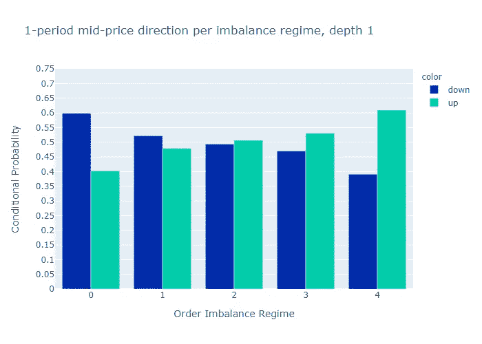

**图 A1:中间价变动的条件经验概率(不平衡深度 1 级)。**

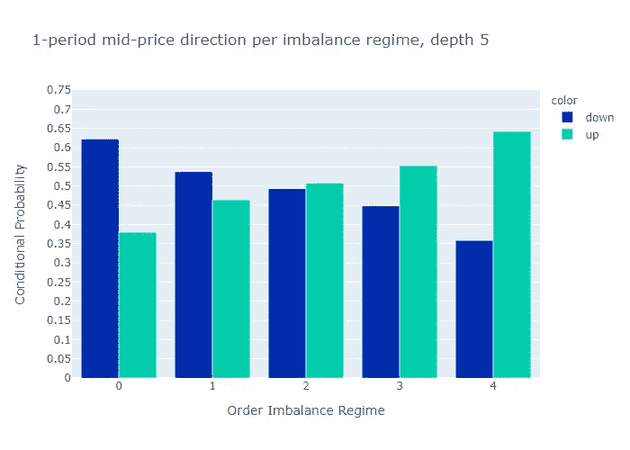

**图 A2:中间价变动的条件经验概率(不平衡深度级别 5)。**

***来自《走向数据科学》编辑的注释:*** *虽然我们允许独立作者根据我们的* [*规则和指南*](/questions-96667b06af5) *发表文章，但我们并不认可每个作者的贡献。你不应该在没有寻求专业建议的情况下依赖一个作者的作品。详见我们的* [*读者术语*](/readers-terms-b5d780a700a4) *。*