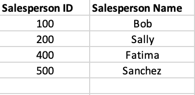
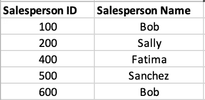
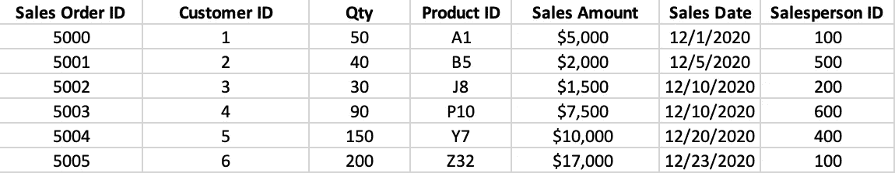
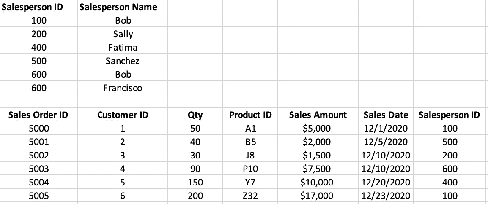
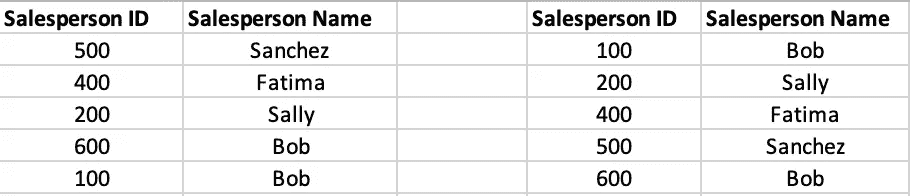

# 主键和聚集索引

> 原文：<https://towardsdatascience.com/primary-key-and-clustered-index-bf85f7f87b60?source=collection_archive---------6----------------------->

## SQL 的组织能力、独特性和速度

由 [Unsplash](https://unsplash.com?utm_source=medium&utm_medium=referral) 上的[Cup 先生/杨奇煜·巴拉](https://unsplash.com/@iammrcup?utm_source=medium&utm_medium=referral)拍摄的照片

我的一个朋友让我澄清数据表中主键和聚集索引的区别。在我们的谈话之后，我开始思考这些年来我教过的许多 SQL 课程，以及学生们在掌握这些概念之后的恍然大悟。然后我回忆起在指导同事和数据工程师正确使用这些物品后，我曾无数次看到同样的结果。如果你不确定它们之间有什么不同，或者你为什么要使用它们，不要感到难过。你在一个好公司里。本文简要解释了每种方法以及在您自己的数据表世界中何时使用它们。

## 限制

主键和聚集索引都属于 SQL 约束类别。约束是对表中的数据施加的规则。约束可以应用于表中的列，也可以应用于整个表。我们可以使用其他几个约束，比如 NOT NULL、UNIQUE、CHECK、DEFAULT 和 FOREIGN KEY。但是主键和聚集索引约束是最常见的，也是我们将要讨论的。

## 主关键字

Primary Key 约束使一列成为表中每一行的唯一标识符。它将某些属性应用于选择作为主键的列。此列不能为空。用数据术语来说，这意味着*不为空*。并且该列的每一行的值必须是唯一的。在数据方面，这意味着*没有重复*。

让我们用一个类比来进一步解释这一点。我们公司有一个销售部。每个销售人员在被雇用时都会被分配一个标识号。这些 id 对每个销售人员来说都是唯一的。鲍勃的识别号是 100，莎莉的是 200，法蒂玛的是 400，桑切斯的是 500。如果您列出一个销售人员的列表，以及他们的标识号，您将得到一个与此类似的列表。

[拉杆脚轮](https://medium.com/u/4d32c78bd7f8?source=post_page-----bf85f7f87b60--------------------------------)

数据量如此之少，在某些方面，甚至不需要这些 id。名单上的每个人都有一个独特的名字。但是我们的销售部门正在发展。我们为西北地区雇佣了一名新的销售人员。嗯，他的名字是鲍勃。但是等等！我们已经有一个鲍勃了。现在大家都会很迷茫。更重要的是，数据会令人困惑。幸运的是，我们已经给每个销售人员分配了 id，并且 id 是唯一的。赢了！鲍勃，新的鲍勃，将有一个 600 的识别号。所以，现在我们的桌子看起来像这样。

[拉杆脚轮](https://medium.com/u/4d32c78bd7f8?source=post_page-----bf85f7f87b60--------------------------------)

使用 ID 号，可以唯一地识别每个销售人员。我们的销售人员简表易于使用，便于快速查阅。我们注意到列表中的 id 有两个方便之处。首先，没有重复的 id。第二，每个人都有身份证。ID 列中没有重复和空值。

当然，我们的顶级销售团队开始做销售。我们意识到跟踪我们的销售是个好主意。当我们开始跟踪销售订单时，我们习惯于记录每个订单的细节。我们也非常喜欢销售人员 ID 的想法，我们决定为每个订单创建一个订单标识号。同样，它们是唯一的，*没有重复*，并且每个订单都有一个，*没有空值*。我们还想知道是哪个销售人员完成了销售。因此，除了每个订单的其他细节，我们还包括销售人员的 ID 号。我们的新销售订单列表可能如下所示。

[拉杆脚轮](https://medium.com/u/4d32c78bd7f8?source=post_page-----bf85f7f87b60--------------------------------)

然后我们注意到，我们可以很容易地使用销售订单列表中的销售人员 ID 号将每个订单与销售人员列表中相应的销售人员姓名联系起来。这恰好是使用键的全部意义。我们将来自不同列表或数据表的信息连接在一起。这是因为即使销售人员 ID 在销售订单列表中出现多次，它在销售人员列表中只出现一次。如果该 ID 在我们的销售人员列表中多次出现，那么它将失去将订单与销售人员联系起来的能力。这会造成一种不明确的情况。在下面的例子中，谁在 2020 年 12 月 10 日卖出了 7500 美元？是鲍勃还是弗朗西斯科？除非我们的销售人员 id 是惟一的并且不为空，否则我们永远不会知道。

[拉杆脚轮](https://medium.com/u/4d32c78bd7f8?source=post_page-----bf85f7f87b60--------------------------------)

当然，您可能会想“这很好，但是我真的需要将一个列声明为主键来获得这些结果吗？”没错。我们的列表很小也很简单。但是如果我们的销售部门很庞大呢？或者即使有一个小的销售团队，我们销售的广大产品呢？每个产品都分配有唯一的产品 ID。我们有数千种产品。更糟糕的是，我们列表中产品的排列顺序没有特定的顺序。产品 id 按名称的字母顺序排列在列表中，它们对应的标识号没有特定的顺序。

设想一个老式的基于纸张的归档系统。每件产品我们都有一个悬挂文件夹。在里面，我们存储了大量我们出售的每件商品的信息。您的经理打电话给您，指示您立即将产品 ID XY79443 上的信息带到会议室。你打开文件柜。

我们在每个文件夹顶部的小标签上写了产品 ID，但是抽屉里的文件夹没有特定的顺序。你盯着抽屉看了一会儿，开始翻阅每个文件夹，一个一个地看标签。

当你找到正确的文件夹时你会知道吗？是啊！

会很好找吗？我表示怀疑。

这是一个主键。这对于唯一识别信息非常有用。它使每一行都清晰可辨。它还帮助我们将不同来源的信息联系起来。但是它没有对数据施加特定的顺序。即使我们知道我们要找的是什么——针 XY79443，也可能要花很长时间才能大海捞针。

## 聚集索引

聚簇索引来拯救！如果主键擅长唯一标识数据表中的每一行，那么聚集索引则擅长快速找到特定的行。聚集索引实际上使用指定列中的值对表进行排序。当应用聚集索引时，表中的行被物理地重新排序，并以这种排序方式存储。

如果我们回到文件柜的类比，主键就是在每个文件夹标签上写产品 ID 的同义词。应用于产品 ID 的聚集索引将对文件夹进行组织，使最低的产品 ID 排在抽屉的最前面，最高的 ID 排在最后。对于大量的文件夹，我们也可以想象添加小分隔线来指示分类范围。

“哦，老板要 XY79443 号文件？”没问题！我们寻找带有 X-Z 标签的小分隔线。我们直接去下面第三个抽屉里的那个区域。然后我们看到 XX88100 在抽屉前面盯着我们的脸。我们翻阅了几个文件夹，大概到后面一半的地方，XY79390。再往后看一些，我们发现文件夹 XY79443 就在它应该在的地方——在 XY79442 和 XY79444 之间。答对了。

下面的两个列表描述了我们的销售人员列表的理论上的前后情况，首先没有聚集索引，然后对销售人员 ID 列应用了聚集索引。

左侧列表没有聚集索引，右侧列表有聚集索引— [Rod Castor](https://medium.com/u/4d32c78bd7f8?source=post_page-----bf85f7f87b60--------------------------------)

我们可以对同一表中的不同列或同一列应用主键约束和聚集索引约束。将聚集索引应用于主键是一种常见的做法。因为主键经常用于连接数据，所以它经常用于搜索。使用主键搜索数据将有助于确保您拥有正确的信息，但不能确保快速的搜索结果。聚集索引将快速执行我们的搜索。一些数据库系统，如微软的 SQL Server，在我们使用主键时会创建一个聚集索引。这是默认行为。如果我们决定不这样做，我们必须显式地创建不带聚集索引的主键，或者随后删除聚集索引。

## 摘要

这两个约束不难理解。由于在表中的同一列上使用这两种约束是常见的做法，并且这是 SQL Server 的默认设置，所以数据人员经常偷懒，使用术语主键来表示这两种约束。我认为这种术语上的捷径和微软对两者的隐性联系导致了更广泛的数据工作领域的混乱。但毫无疑问，无论是单独使用还是一起使用，这两者都是强大的工具。

至于我们为什么要使用这些约束，我想上面的例子已经很清楚了。但是，我可能过高地估计了自己通过书面文字清晰交流的能力。因此，为了尽可能清楚，让我重申一下每一个的用例。

使用主键来唯一标识表中的每一行。主键约束将强制指定列中的值是唯一的，即没有重复，并且不允许出现 null 值或空值。主键有助于连接多个表之间的数据。

使用聚集索引来提高对表的查询速度。搜索包含数百万行的表可能需要几分钟或更长时间才能返回结果。聚集索引可以将等待时间减少到秒。我见过查询运行几天才完成。然后，在对表格应用适当的索引后，结果在几秒钟内就返回来了。

在大多数情况下，您需要在每个数据表上实现一个主键和一个聚集索引。通常，两个约束都应用于同一列。但是每一种情况都是不同的，必须根据自己的情况进行评估。

***罗德蓖麻*** *帮助公司获得正确的分析！他帮助国际组织和小型企业改善他们的数据分析、数据科学、技术战略和技术领导力。除了咨询，Rod 还喜欢公开演讲、教学和写作。你可以在*[*rodcastor.com*](https://rodcastor.com/)*和通过他的* [*邮件列表*](https://rodcastor.com/newsletter/) *了解更多关于 Rod 和他的工作。*