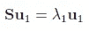

# 成功浏览主成分分析

> 原文：<https://towardsdatascience.com/principal-component-analysis-93b96b35ddc?source=collection_archive---------26----------------------->

## 实践教程

## 处理非常大的数据集可能很难获得有意义的结果。出于这个原因，降维可能是一个简单而又相对快速的尝试。这就是 PCA 派上用场的地方，有几种可能的方法让你的数据进入低维。

## 本文提供了一个简洁的概述，并浏览了投影的数学基础，考虑了特征值/特征向量、奇异值分解(SVD)以及主成分分析(PCA ),并展示了如何在 Python 中通过计算实现降维。


美丽图案由[米切尔罗](https://unsplash.com/@mitchel3uo?utm_source=medium&utm_medium=referral)

PCA 是很多，但无论如何，这不是什么新鲜事。在大多数情况下，当谈到图像的有损压缩、降维以及当前机器学习宣传的特征提取时，人们会提到 PCA。即使人们最终可能不会使用这样的投影数据，PCA 也可以快速地将数据集减少到几个维度，然后可以用于在简单的散点图上可视化。

等待...使用一个 N *x* M 的数据集，并将其简化为一个 N *x* 2 的数据集，可以在二维空间中绘制——这听起来是不是非常有趣？绝对的！让我们从一个简洁而轻松的理论回顾开始。

# **理论背景**

首先，让我们看一个相当简单的正交投影例子。假设我们想将一个数据点 x 投影到一条简单的直线上(因此，是一个一维空间)。


x 在线 L 上的投影—来源:[交互式线性代数](https://textbooks.math.gatech.edu/ila/linear-transformations.html)

我们的目标是找到蓝点(x 在 L 上，“xl”)，如上图所示。

为此，在快速浏览投影时，我们需要记住以下两个标准:

```
Given
I.  cu: sometimes denoted λ*u # scaling u, where λ is unknown
II. (x-cu)*u = 0 # due to orthogonality
```

结合上面这两个条件，我们得到:

```
(x - cu) * u = 0 # again, orthogonality
where u*u is the norm² of u
```

简单的代数然后让我们到达 *c* :

```
c = ux / |u|² # or
  = ux / uu
```

最终我们通过用 *c* 缩放 *u* 得到 *xl* 。

我们刚刚掌握了将 x 投影到 *L* 的线上，或者换句话说，将**投影到标量值**上。让我们进一步把这个想法推广到更高维度的空间。我们认为我们的矩阵*是一个*一个 N *x* M 矩阵，而 *W* 是 *A* 的列空间，或者简单地说是跨越 *A* 空间的所有向量(通常也称为具有枢轴位置的向量)。因为我们的目标是将数据点 *x* 投影到我们的超平面 *W* 上。

正如我们之前看到的(*请始终考虑转置上标，这些上标在*下面的代码框中被遗漏了):

```
(x-cu)*u = 0 is now defined as: (x-Ac)*A = 0
= Ax - AAc = 0 
= Ax = AAc
```

将所有这些放在一起，我们可以使用给定的定理来概括这种投影行为:


因此 W 中的 x 等于 Ac

从这一步我们可以了解到， *Ac* 等于 *W* 中的投影 *x* ，因此我们在求解常数 *c* 时找到了 *W* 中的投影点 *x* 。

如果我们把我们刚才所做的当作一个例子或一般的食谱:

```
1\. Given matrix A and data point x
2\. Calculate the matrix multiplication AA
3\. Calculate the matrix transformation Ax
4\. Form an augmented matrix for AA|Ax and do a row reduction to obtain pivot positions for AA. This gets us to c.
5\. Look at c and 🎉
```

现在，让我们跳回 PCA。我们已经找到了一种投射数据的方法，如果我们把它投射到一条线上，我们已经处于一个较低的维度，那么这和 PCA 有什么联系呢？在 PCA 中，我们试图以一种捕捉到数据中的**最大方差**的方式来投影数据。听我说:

在机器学习中，我们经常试图最小化数据中的方差，在这种情况下，情况完全相反。当我们降低数据的维度时，我们希望捕捉尽可能多的可变性。举个例子，如果你发现前两个主成分(我们很快就会谈到这一点，只要想想*的前两列*)捕获了 95%的数据可变性，我们可以说其他 N 列(把它想象成[任意定义的] 20 个附加列)只解释了我们数据中 5%的方差。

令人困惑。让我们继续前进，让烟雾散去。

正如我们刚才所说的，我们关心方差，因此我们创建一个矩阵来捕捉方差。方差(和协方差)的矩阵称为协方差矩阵，这里表示为 *S* 。


x-bar 是平均值，x *n* 个体 x 值，S 是协方差矩阵- [来源](https://ucilnica.fri.uni-lj.si/pluginfile.php/892/course/section/510/bishop-pca.pdf)

同样，我们希望看到投影数据中的最大方差，这显然需要一个**最大化问题—** 换句话说，我们希望相对于 u 最大化 *uSu* 。请注意，由于 u 是一个单位向量，我们必须强制两个单位向量的乘积等于 1。

这是一个典型的问题，我们的老朋友娄祖钰用他的拉格朗日乘数对此进行了解释。


协方差矩阵+单位向量约束



推导第一个等式并将其设置为零

这个方程对许多人来说非常熟悉，它是特征值/向量计算中的典型例子。如果我们现在从左边乘以 u，我们求解λ的方程:


目标:找出最大的特征值及其最大的特征向量

根据我们刚刚发现的，我们可以总结为我们正在寻找**个最大特征值及其相关特征向量，因为它们为我们提供了投影数据**的最大方差。回到我之前提到的，PCA 上下文中的**特征向量被称为主成分**。要更深入地了解这篇文章的理论部分，请随意查阅这篇[的伟大工作论文](https://ucilnica.fri.uni-lj.si/pluginfile.php/892/course/section/510/bishop-pca.pdf)。

在我们讨论 PCA 的实现之前，我想概述一下线性代数的一个重要概念，它也用在 PCA 的上下文中，即奇异值分解(SVD)。

SVD 将形状为 *M* x *N* 的矩阵分解成三个矩阵，一个酉矩阵 U、一个矩形对角矩阵适马和另一个酉矩阵 V:


分解矩阵 M

在五氯苯甲醚的世界里，这与我们有什么关系？因为 u(左奇异值)是 M*M^T 的本征向量，v 也是 M^T*M.的本征向量(右奇异值)，所以 Sigma 是一个对角矩阵，包含与 u 和 v 相关的各自的本征值，因此您可以看到它的发展方向。

如果你找不到任何关于网飞的好东西，我完全可以推荐你去看 Gilbert Strang 教授(麻省理工学院)关于奇异值分解的课——你不会后悔的:

# PCA 的技术实现

显然，在处理数据时，我们不会手动完成所有这些，因此我将提供一个关于如何在 Python 中使用 PCA 的简要指南。让我们通过 scikit-learn 中的 Scipy 和 implmentations 来看看 PCA 的以下选项:

*   主成分分析
*   德拉贡诺夫狙击步枪（Snayperskaya Vinyovka Dragunov 的缩写）
*   特征向量/值

在接下来的几个段落中，我们将对一个数据示例执行降维，并将有损图像转换回其原始形状。

下面的篮球图像被选为我们的数据集，它将进一步用于应用主成分分析，或者在这种特殊情况下进行压缩。最终我们将使用 PCA 的思想来提供低维图像，并进一步将图像转换回原始空间。

换句话说，我们执行降维，然后将图像转换回原始维度(“逆”)—如果我们只想将数据投影到一个更低的维度上—回想一下我在一开始提到的散点图—我们希望最终得到一个 *Nx2* 矩阵(显然，这对图像不是很有用)。


献给 2021 年 ACC 冠军🏆— GT 男子篮球队—图片由[本·赫尔希](https://unsplash.com/photos/5nk3wSFUWZc)提供

## 主成分分析

Scikit-learn 的 PCA 实现使用 SVD 来投影到一个更低维度的空间，**为你居中数据**，但是不缩放。由于居中，PCA 非常方便，因为它节省了另一行代码，而且还提供了简单的转换函数，可以毫无麻烦地链接起来。

scikit learn 中的超级简单 PCA

仅仅两行“PCA-code”就让我们得到了一个更低维的数据集/压缩图像，这不是很神奇吗？顺便说一下，如果我们删除代码中的*逆变换*部分，我们会得到更低维度的数据。

40 个组件的结果有损耗，但令人印象深刻:


使用 40 个主成分的压缩图像

仅参考我之前的陈述，如果我们不讨论图像，而是数据集，我们可能希望将数据减少到只有 2 个组件(并绘制它们)。我任意选择了 40 个组件，让压缩后的图像更加赏心悦目。

## 奇异值分解

请注意，截断的 SVD 不会使**的数据**居中，所以为了得到我们刚刚得到的结果，您需要扣除平均值——mu，就像代码中被截断的希腊字母一样。

sklearn 的 SVD 实现

或者，我们可以简单地使用 Numpy 版本的 SVD，如果我们想要获得 U、适马和 V.T .的三个分解矩阵，这是非常有用的。


分解矩阵 M

下一个实现准确地返回三个矩阵，这些矩阵可用于重构矩阵 M(的简化版本)。

Numpy 奇异值分解

结果与我们在 PCA 实施中已经看到的没有什么不同:


奇异值分解下的压缩图像

顺便提一下，如果你的矩阵不是半正定的( **psd** ，所以所有特征值都大于或等于**0【因此是“半”】)，我不会使用 SVD，而是使用下面 PCA 方法中概述的“特征值”。关于 psd 矩阵的奇异值分解的有趣讨论可在此处找到:**

<https://math.stackexchange.com/a/3818408>  

## 特征值/特征向量

> 在你开始研究这个之前，如果你只是想得到一个较低维度的数据集(或者在这个例子中是图像)，那么**只要跳回到 PCA/SVD** 就可以了，不要理会下面显示的手动步骤。

作为第一步，我们需要获得我们之前看到的协方差矩阵。为此，取我们的初始矩阵 A，从矩阵中的所有值 x 中减去平均值。这为我们提供了一个**新的居中矩阵*一个*** *。*

下面的块只是使用特征向量分解来获得一个压缩图像——如此简单！

当我们这样做的时候:“特征”在机器学习中几乎无处不在，所以重温这些从来都不是一个坏主意。如果你感兴趣，可以在这里找到更多的建议:

</identify-well-connected-users-in-a-social-network-19ea8dd50b16>  

# 结论

主成分分析是一种非常有用的方法，可以降低数据集的复杂性。只需要一点理论和几行代码，我们就能在一个简单的散点图中展示甚至更高维的数据。PCA 的概念当然可以被增强到各种更深入的概念，例如主成分回归，其可以启发对另一天的展望。

{照顾好自己，如果可以的话，也照顾好别人}

*—借用史蒂芬·都伯纳*