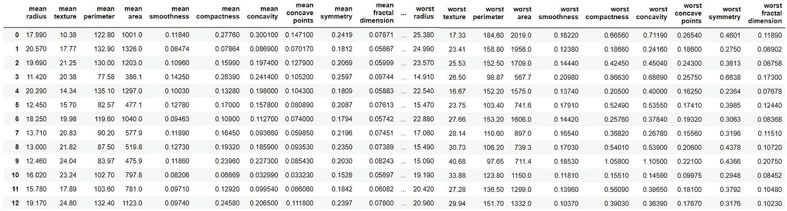
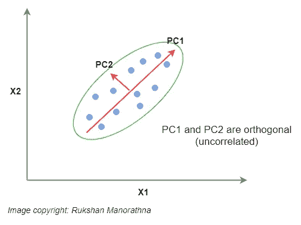
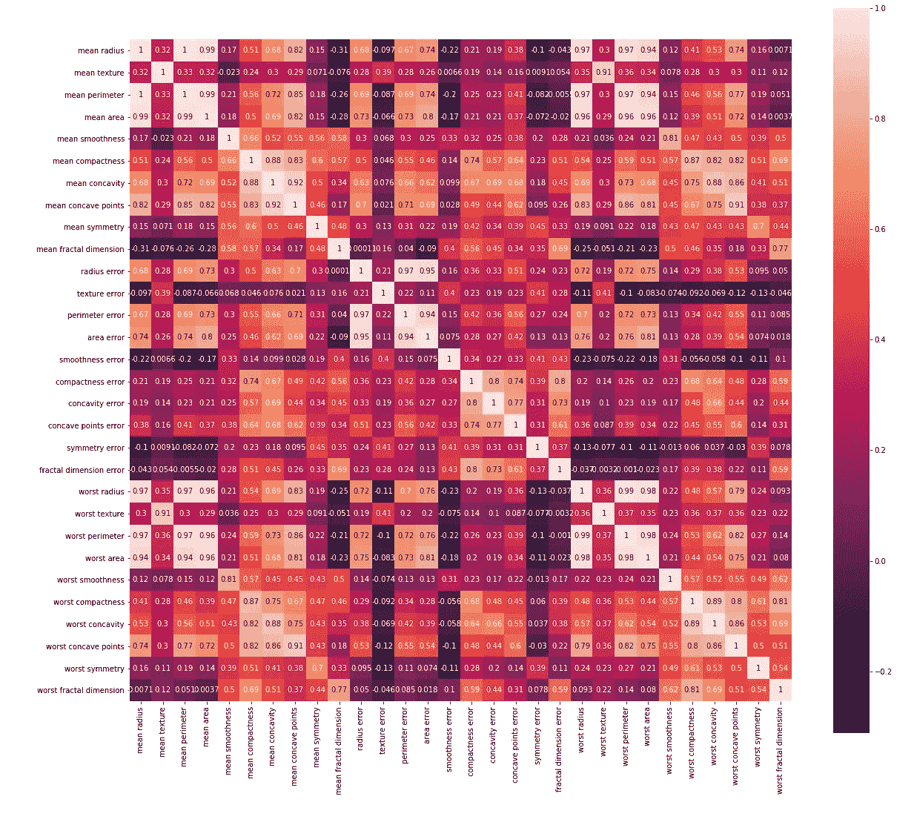
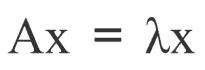
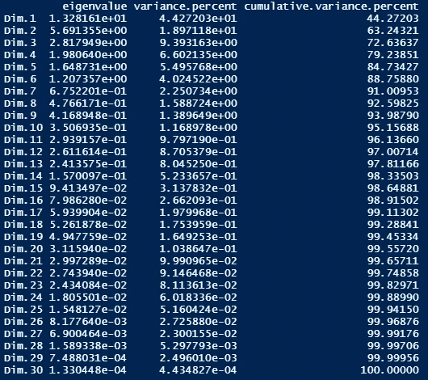
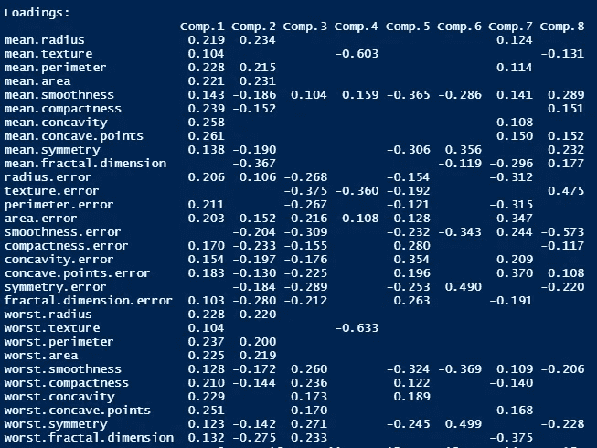
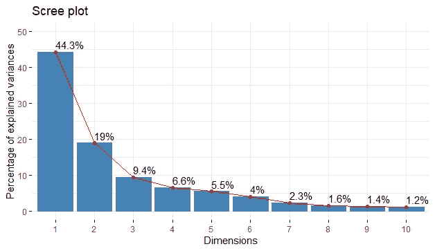
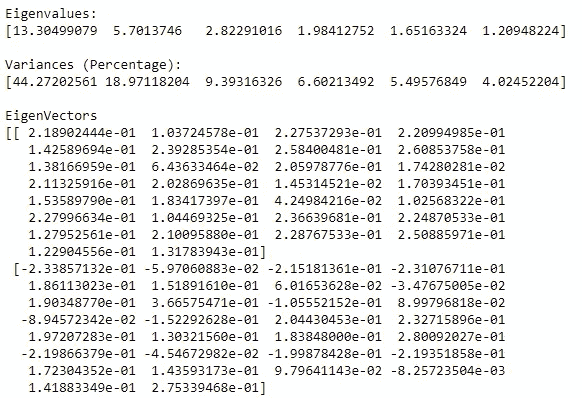
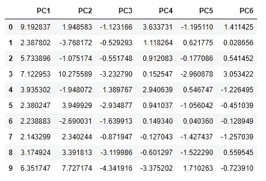

# 基于 R 和 Python 的乳腺癌数据主成分分析

> 原文：<https://towardsdatascience.com/principal-component-analysis-for-breast-cancer-data-with-r-and-python-b312d28e911f?source=collection_archive---------9----------------------->

## 无监督机器学习降维算法

蕾妮·费希尔在 [Unsplash](https://unsplash.com/s/photos/love?utm_source=unsplash&utm_medium=referral&utm_content=creditCopyText) 上的照片

又见面了。今天，我们讨论每个数据科学家最常用的机器学习算法之一— ***【主成分分析(PCA)*** 。之前，我为这个话题写过一些内容。如果您尚未阅读，也可以通过以下网址阅读:

*   [**用 Scikit 进行主成分分析——学习**](/principal-component-analysis-pca-with-scikit-learn-1e84a0c731b0)
*   [**PCA 背后的统计和数学概念**](https://medium.com/data-science-365/statistical-and-mathematical-concepts-behind-pca-a2cb25940cd4)

在本文中，将更多地强调我们用来执行 PCA 的两种编程语言(R 和 Python)。在本文的最后，您将看到 R 和 Python 在执行 PCA 方面的区别。

我们用于 PCA 的数据集可在 Scikit-learn 中直接获得。但这不是我们想要的正确格式。所以，我做了一些操作，把它转换成一个 CSV 文件([下载这里](https://drive.google.com/file/d/1Uzq4kCoqyrlqEQxW46HIrt9gPn_j7b69/view?usp=sharing))。该数据集包含 569 名女性的乳腺癌数据(观察值)。数据集的维数是 30。这意味着在数据集中每个女性(观察)有 30 个属性(特征)。

乳腺癌数据集的一部分(图片由作者提供)

在进行 PCA 之前，我们先讨论一下 PCA 的一些理论背景。

# 主成分分析的理论背景

## 什么是 PCA？

基本上，PCA 是一种线性降维技术(算法)，它将一组相关变量(p)转换成较小的 k (k <

*主成分* ，同时尽可能多地保留原始数据的变化。在机器学习(ML)的背景下，PCA 是一种无监督的机器学习算法，其中我们发现重要的变量，这些变量可用于进一步的回归、聚类和分类任务。

## PCA 是如何工作的？

主成分分析考虑变量之间的相关性。如果相关性非常高，PCA 会尝试组合高度相关的变量，并在高维数据中找到最大方差的方向。下图显示了第一个主成分(PC1)具有最大的可能方差，并且与 PC2 正交(即不相关)。

作者图片

## 相关矩阵和方差-协方差矩阵

PCA 可以使用相关或方差-协方差矩阵来执行(这取决于我们稍后讨论的情况)。

**相关矩阵**

**相关矩阵**是显示变量之间相关系数的表格。表格的对角线总是包含 1，因为变量和它本身的相关性总是 1。我们数据集的相关矩阵是:

乳腺癌数据集的相关矩阵(图片由作者提供)

**方差-协方差矩阵**

一个 ***方差-协方差矩阵*** 是包含与几个变量相关的**方差**和**协方差**的矩阵。矩阵的对角线元素包含变量的**方差**，非对角线元素包含所有可能变量对之间的**协方差**。

## **特征值和特征向量**

设 **A** 是一个*n×n 矩阵*。标量 **λ** 称为 **A** 的 ***特征值*** 如果有一个非零向量 **x** 满足下式:

作者图片

向量 **x** 称为 **λ** 对应的 **A** 的 ***特征向量*** 。

**非常重要:**相关矩阵或方差-协方差矩阵的特征向量表示主成分(最大方差的方向)。相应的特征值表示由每个分量解释的方差的量。

## PCA 中的特征缩放

PCA 方向对数据的规模高度敏感。如果变量不是在相似的尺度上测量的，我们需要在对我们的数据运行 PCA 之前进行特征缩放。我们可以应用 ***z-score 标准化*** 让所有变量进入同一个量表。

**非常重要:**从相关矩阵导出的主成分(PCs)与从标准化变量的方差-协方差矩阵导出的主成分(PCs)是相同的(我们将在后面验证这一点)。当我们使用相关矩阵时，我们不需要对我们的数据进行明确的特征缩放，即使变量不是在相似的尺度上测量的。

理论够了！让我们写 R 和 Python 代码来执行 PCA。

# 使用 R 对乳腺癌数据执行 PCA

## 为数据集选择最佳的电脑数量

R 中有几个内置函数来执行 PCA。这里，我们使用 **princomp()** 函数对我们的数据集应用 PCA。

**princomp()** 函数的第一个参数是我们执行 PCA 的数据帧。下一个论点非常重要。其默认值为**假**。通过设置 **cor = TRUE** ，PCA 计算应该使用相关矩阵而不是协方差矩阵。从相关矩阵导出的主成分(PCs)与从标准化变量的方差-协方差矩阵导出的主成分相同。因此， ***通过设置 cor = TRUE，数据将在分析前居中并缩放，即使变量没有在相似的尺度上测量，我们也不需要对数据进行明确的特征缩放。***

让我们把特征值，方差比例，方差累计比例都放到一个表格里。为此，我们可以使用 **factoextra** 库中的**get _ environment()**函数。该函数需要一个参数，该参数是 **princomp** 类的一个对象。

输出是:

作者图片

正如您在输出中看到的，仅第一台 PC 就捕获了大约 44.27%的数据可变性。前六个 PC 一起捕获了大约 88.76%的数据可变性。

让我们得到特征向量。下面一行代码给出了可变载荷矩阵，其列包含特征向量。

产量很大。我们只显示前 8 个特征向量。有些值缺失是因为它们非常小。

作者图片

让我们创建 scree 图，它是特征值的可视化表示。为了可视化特征值，我们可以使用 **factoextra** 库中的 **fviz_eig()** 函数。

Scree plot(图片由作者提供)

仅第一台 PC 就捕获了约 44.3%的数据可变性，第二台 PC 捕获了约 19%的数据可变性。弯曲大致发生在对应于第三特征值的点处。根据 ***凯泽法则*** ，建议保留特征值大于 1.0 的分量。我们得到了特征值，只有前六个大于 1.0。因此， ***我们保留前六个 PC，它们一起解释了数据*** 中约 88.76%的可变性。

# 使用 Python 对乳腺癌数据执行 PCA

在 Python 中，可以通过使用 Scikit-learn 机器学习库中的 **PCA** 类来执行 PCA。在这里，我们获得了相同的结果，但采用了不同的方法。我们不使用相关矩阵，而是使用方差-协方差矩阵，并且在运行 PCA 算法之前手动执行特征缩放。然后，我们将标准化(缩放)数据提供给 PCA 算法，并获得相同的结果。

为了执行 PCA，我们需要通过指定超参数的相关值，从 **PCA()** 类创建一个对象(称为 ***pca*** )。最重要的超参数是 ***n_components*** 。既然我们已经决定只保留六个组件，我们可以将 ***n_components*** 设置为 6。然后，我们调用 ***pca*** 对象的 **fit()** 方法来执行 pca。我们向 **fit()** 方法提供缩放数据。然后我们调用 ***pca*** 对象的各种方法和属性来获取我们需要的所有信息。输出是 numpy 数组的形式。我们可以使用几个 **print()** 函数来很好地格式化输出。最后，我们调用 ***pca*** 对象的 **transform()** 方法来获取组件得分。然后，我们将它们存储在一个 CSV 文件和一个 Excel 文件中，以备将来使用。新的(缩减的)数据集的维度是 569 x 6。只有 6 列(以前是 30 列)。这是因为我们决定只保留六个成分，它们共同解释了原始数据中约 88.76%的可变性。通过执行 PCA，我们将原始数据集缩减为六列(约为原始维度的 20%)，同时保持了 88.76%的可变性(只有 11.24%的可变性损失！).

以下 Python 代码为我们的数据集执行 PCA。

只有前两个特征向量的输出部分是:

运行下面的代码块后，组件得分被保存在一个 CSV 文件([***breast _ cancer _ 89 _ var . CSV***](https://drive.google.com/file/d/1PDjuUO5ufp36oeFzd6NxRT46oZ_TJxA-/view?usp=sharing))和一个 Excel 文件([***breast _ cancer _ 89 _ var . xlsx***](https://drive.google.com/file/d/1DymAombnqYMMI_vAvUmBaepqxz642Llf/view?usp=sharing))中，这两个文件将被保存在当前工作目录中。新的(减少的)数据的尺寸是 569×6。这是因为我们决定只保留六个成分，它们共同解释了原始数据中约 88.76%的可变性。

下图显示了新(缩减)数据集中的前 10 个观测值。 **PC1** 代表主成分 1， **PC2** 代表主成分 2，以此类推。数据集的形状是 569 x 6。

进行 PCA 后的部分乳腺癌数据集(保留了 88.76%的可变性)

我们可以使用新的(精简的)数据集进行进一步分析。

# 结论

R 和 Python 都有很好的执行 PCA 的能力。r 有一个很好的 PCA 可视化库( **factoextra** )。它非常容易使用。输出的格式很好，易于阅读。r 的 **princomp()** 函数也很好用。它为您提供了两个选项来选择相关或方差-协方差矩阵来执行 PCA。因此，只需几行 R 代码就可以轻松执行 PCA。Python 还提供了 **PCA()** 函数来执行 PCA。你可以用 Python 编写清晰易读的语法。它的语法非常一致。

我通常更喜欢使用 Python 来完成数据科学和机器学习任务。但是 ***对于 PCA*** ，我个人更倾向于使用 R，原因如下。

*   r 的输出格式很好。
*   只用一行 R 代码就能轻松画出高水平的图。
*   r 的函数提供了更多的定制选项。

这些都是我个人的喜好。你可以走自己的路。

感谢阅读！

本教程由[*Rukshan Pramoditha*](https://www.linkedin.com/in/rukshan-manorathna-700a3916b/)*，*数据科学 365 博客作者设计创作。

## 本教程中使用的技术

*   **Python & R** (高级编程语言)
*   **熊猫** (Python 数据分析与操纵库)
*   **Scikit-learn** (Python 机器学习库)
*   **factoextra** (R 的多元数据分析和可视化库)
*   **Jupyter 笔记本& RStudio** (集成开发环境)

## 本教程中使用的机器学习

*   **主成分分析**

## 本教程中使用的统计概念

*   **相关矩阵**
*   **方差-协方差矩阵**

## 本教程中使用的数学概念

*   **特征值和特征向量**

2021–01–09