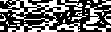
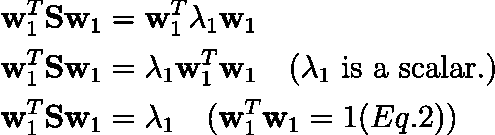

# 主成分分析第 1 部分:不同的公式。

> 原文：<https://towardsdatascience.com/principal-component-analysis-part-1-the-different-formulations-6508f63a5553?source=collection_archive---------1----------------------->

## 什么是主成分分析？PCA 的最大方差和最小误差公式有哪些？我们如何使用主成分分析降低维数？

图 1:以(1，3)为中心的多元高斯的主成分。图片来源:[3]。

我们都知道主成分分析是降维中使用的标准方法之一。有多个帖子详细介绍了 PCA 的代码和实现；然而，在本帖中，我们将探究 PCA 是如何形成的，以及我们如何得出 PCA 算法。众所周知，主分量是对应于协方差矩阵的最大特征值的特征向量；这篇文章将探究为什么会这样，以及解决方案是如何得出的。这篇文章的内容将基于[1]和[2]的第 12 章提供的材料。

在我们进入 PCA 之前，知道什么是特征值和特征向量是很重要的。设 **A** ∈ **R** ^{n×n}为一个 **n×n** 矩阵。然后，向量 **x** ∈ **C** ^n 称为 **A** 的特征向量，如果

情商。1:特征值和特征向量

λ ∈ **C** 称为**a**的特征值

主成分分析(PCA)问题可以用两种方式公式化:**最大方差公式化**和**最小误差公式化**。在最大方差公式中，目标是找到数据到低维线性空间的正交投影，使得投影数据的方差最大化。在最小误差公式中，PCA 被定义为最小化数据点和它们的投影之间的平均投影成本(均方误差)的线性投影。我们将在下面的章节中看到，这两个公式导致相同的解决方案。

# PCA:最大方差公式

给定一组观察值{ **x** _n}，n = 1，2，…，n 和 **x** _n ∈ **R** ^D，根据最大方差公式，我们的目标是找到 **x** _n 到维度为***m<***的空间的正交投影。

现在让我们考虑最简单的情况，其中 **M** =1。我们定义一个向量**w1**∈**r**^d**作为低维空间的方向。由于我们只对空间的方向感兴趣，我们将 **w1** 设为单位长度。即，**

****

**等式 2: **w1** 是单位矢量。**

**那么数据观察值 **x** _n 可以被投影到这个新的空间上**

****

**等式 3:**x**_ n 在 **w1** 定义的新空间上的投影。**

**如果 **x̄** 是原始空间中数据观测值的平均值，那么投影空间中样本的平均值由下式给出**

****

**情商。3:将 **x̄** 投影到由 **w1** 定义的新空间上。**

**现在，我们可以将投影数据的方差写成**

****

**情商。4:**x̂**的方差。**

**其中 **S** 是原始高维空间中观测数据的协方差矩阵。**

****

**情商。6:**x**的协方差。**

**现在，根据最大方差公式定义，我们需要最大化 **x̂** 的方差。这可以通过最大化情商来实现。4.情商。4 有一个平凡解当|| **w1** || → ∞时。为了防止这种情况，我们利用之前在等式 2 中设置的单位范数约束。为了解决这一问题，我们引入了拉格朗日乘数λ1，并将我们的优化目标表述如下:**

****

**情商。7:最大方差优化问题。**

**设置等式的导数。7 w.r.t **w1** 为 0 时，我们得到一个驻点，**

********

**情商。8:设置等式的导数。7 w.r.t **w1** 归零。**

**这说明在驻点处， **w1** 一定是 **S** 的一个特征向量，λ1 是特征值。对应特征向量 **w1** 。将等式 7 与 **w1** ^T 相乘，我们可以看到最大方差等于特征值λ1。**

****

**情商。9:低维空间的最大方差等于特征向量 **w1** 对应的特征值。**

**我们可以通过选择使方差最大化同时又与现有方向正交的方向来识别额外的主成分。对于低维空间为 **M** 维为 **M < D，**的一般情况，主成分为对应 M 个最大特征值λ1，λ2，…，λm 的特征向量 **w** 1， **w** 2，… **w** m**

# **PCA:最小误差公式**

**设{ **x** _n}，n = 1，2，…，n 和 **x** _n ∈ **R** ^D 是数据观测值的集合，那么根据 PCA 的最小误差公式，我们的目标是找到使重建误差最小的变换:**

****

**情商。10:最小误差目标**

**其中 **x̃** 是从低维潜变量生成的重建。这里，我们有一个完整的 D 维正交(正交和单位长度)基 **w** _i，其中 i= 1，2，… D。然后我们有**

****

**情商。11:标准正交基。**

**δᵢⱼ是克罗内克三角洲。由于基是完整的，我们可以把任何向量表示为基向量的线性组合**

****

**情商。12**

**因为我们有标准正交基，所以我们有α_ni 的解，它是 **x** _n 和 **w** _i 的点积。12 作为**

****

**情商。13 这方面的证据可以在[4]中找到**

**通过降维，我们的目标是通过将 D 维数据投影到更低维的空间上，为 D 维数据(带有 ***M < D*** )找到 M 维表示。我们可以用前 M 个基向量来表示这个 M 维空间**

****

**情商。14**

**并且剩余的(D-M)基由所有数据点共享(共享偏移)。在 Eq 中。14， *z_ni* 依赖于单个数据点，而 b_i 是所有数据点共享的常数。**

**来自 Eq。13 和 Eq。14 我们可以将 **x** _n 和 **x̃** _n 之间的差值计算为**

****

**情商。15:**x**n 与**x̃**n 的区别**

**现在，我们可以用 Eq 来代替。等式中的 15。10 得到目标函数为:**

****

**情商。16**

**对 w.r.t *z_nj* 求导并设为零，我们得到**

****

**情商。17**

**对 w.r.t **b** _j 求导并设为零，我们得到**

****

**情商。18**

**现在，我们可以用 Eq 来代替。17 和 Eq。等式中的 18。16 和得到**

****

**情商。18**

**我们的目标是最小化 J( **w** )，但是我们观察到当 **w** = 0 时，这个问题存在一个平凡的解。为了克服这一点，我们再次利用正交基的性质，并设置归一化约束|| **w** || **=** 1。**

**现在，我们来看一个简单的例子，其中 D=2，M=1。我们必须选择一个方向，这样我们可以最小化下面的目标**

****

**情商。19**

**如前所述，对 w.r.t **w2** 求导并设置为 0，我们得到**

****

**情商。20**

**其中 **w2** 为特征值λ2 对应的特征向量。代入等式。情商 20。19、我们得到 ***J = λ2*** *，*即 **J** 在我们选择特征值最小的特征向量时最小化。在一般情况下，当我们有 ***M < D*** 时，重构的最小误差 **J** 通过选择对应于***【D-M】***最小特征值的特征向量 **w** _i 获得，该最小特征值由下式给出**

****

**情商。21**

**最小重构误差(失真测量)由下式给出**

****

**情商。22**

*****【D-M】***特征值之和。因此，我们的目标是使用 M 个最大的特征值，以便使失真测度 **J、**现在构成的 ***(D-M)*** 最小的特征值最小化。因此，我们可以得出结论，最小化重建误差最大化了投影的方差。**

# ****使用主成分分析进行降维****

**既然我们已经看到 M 个主分量是对应于协方差矩阵的 M 个最大特征值的 M 个特征向量，我们继续看如何应用 PCA 来降低维数。**

**使用主成分分析进行降维包括 4 个步骤:**

****1。数据居中** 第一步是计算并减去数据点的平均值，使数据以 0 为中心，因此平均值为零。**

****

**情商。23:居中数据 **X̂****

****2。计算协方差矩阵****

****

**情商。24:协方差矩阵**

****3。使用特征值分解计算特征值和向量** PCA 的目标是坐标系统的变换，使得新轴之间的协方差为 0。**

****

**图 PCA 的目标是找到空间 W，使得新轴之间的协方差为 0。**

**因此我们对协方差矩阵 **S** 进行特征值分解**

****

**情商。25:协方差矩阵的 EVD。**

**这里，γ∈ℝ^(dxd)是特征向量的矩阵，而λ∈ℝ^(dxd)是包含特征值的对角矩阵。
4**。降维** 现在我们有了特征向量γ，为了降维，我们可以通过只保留最大 M 个特征值对应的列(特征向量)来截断γ。我们称截断的γ矩阵为γ’。则缩减空间中的表示由下式获得**

****

**情商。26:降维**

## **代码:使用 PCA 进行降维**

**代码:用主成分分析法降维。**

## ****具有 EVD 的 PCA 的性能****

**使用特征值分解(EVD)的 PCA 非常昂贵，复杂度为 O(D ),其中 D 是输入数据的维数。EVD 计算所有的特征值和特征向量对，通常我们只需要对应于 M 个最大特征值的特征向量。因此，在实践中，许多有效的迭代方法，如幂迭代法，被用来计算特征向量。**

## ****PCA 和数据标准化[2]****

****

**图 3 主成分分析可能被非标准化数据误导。(a)主成分是偏斜的，因为 PCA 被非标准化数据误导。(b)当比额表标准化时的 PCA。从[5]处的代码生成的图像。**

**PCA 的主方向是方差最大的方向。因此，主成分分析可能会被方向误导，沿着这些方向，仅仅因为测量尺度，方差就显得很高。我们可以在图 3(a)中看到这一点，其中主成分没有正确对齐，因为它被非标准化的标度误导。图 3(b)显示了当量表标准化时的正确主成分。因此，需要注意将数据标准化，以避免此类问题。**

# **结论**

**在这篇相当长的文章中，我们深入研究了 PCA 的两个公式:最大方差和最小误差公式。我们看到两个公式具有相同的解决方案/算法——选择对应于数据协方差矩阵的 M 个最大特征值的特征向量作为新的基础。我们看到了 PCA 如何用于降维，以及如何在 python 中实现。最后，我们简要地研究了标准化数据的重要性以及它如何影响算法。这篇文章到此结束，这仅仅是 PCA 系列的第一部分。接下来的部分将涵盖概率 PCA、奇异值分解、自动编码器以及自动编码器、PCA 和 SVD 之间的关系。**

**跟随 [Aadhithya Sankar](https://medium.com/u/82053676fe58?source=post_page-----6508f63a5553--------------------------------) 获得下一个零件可用时的通知！**

**如果您发现任何错误，请留下评论，我会修复它们！🙏🏽 ✌🏽**

# **参考**

**[1] [Bishop，Christopher M .模式识别与机器学习。纽约:斯普林格，2006 年。](https://www.microsoft.com/en-us/research/uploads/prod/2006/01/Bishop-Pattern-Recognition-and-Machine-Learning-2006.pdf)**

**[2] [墨菲，凯文 P. *机器学习:概率视角*。麻省理工学院出版社，2012 年。](http://noiselab.ucsd.edu/ECE228/Murphy_Machine_Learning.pdf)**

**[3][https://commons . wikimedia . org/wiki/File:gaussianscatterpca . SVG #/media/File:gaussianscatterpca . SVG](https://commons.wikimedia.org/wiki/File:GaussianScatterPCA.svg#/media/File:GaussianScatterPCA.svg)**

**[4]https://www.math.ucdavis.edu/~linear/old/notes21.pdf**

**[5] [墨菲，k .，索利曼，m .，杜兰-马丁，g .，卡拉，a .，梁昂，m .，雷迪，s .，&帕特尔，D. (2021)。概率机器学习的 PyProbML 库[计算机软件]。](https://github.com/probml/pyprobml)**

# ****资源****

**这里有一些资源可以帮助更好地理解这个主题**

1.  ****PCA:最大方差公式(阿姆斯特丹大学)****

****2。PCA 最小误差公式(阿马斯特达姆大学)****

# **作者的更多作品**

**如果你喜欢这篇文章，你可能也会喜欢下面的文章:**

** [## 使用深度学习的实时艺术品生成

### 用于任意内容样式图像对之间的样式转换的自适应实例标准化(AdaIN)。

towardsdatascience.com](/real-time-artwork-generation-using-deep-learning-a33a2084ae98)  [## 阿特鲁卷积和深度可分卷积的初步研究

### 什么是萎缩/扩张和深度方向可分卷积？与标准卷积有何不同？什么…

towardsdatascience.com](/a-primer-on-atrous-convolutions-and-depth-wise-separable-convolutions-443b106919f5)  [## 揭秘:瓦瑟斯坦·甘斯(WGAN)

### 什么是瓦瑟斯坦距离？用 Wasserstein 距离训练 GANs 背后的直觉是什么？怎么样…

towardsdatascience.com](/demystified-wasserstein-gans-wgan-f835324899f4)**