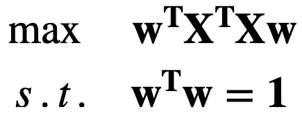

# 主成分分析

> 原文：<https://towardsdatascience.com/principal-component-analysis-pca-79d228eb9d24?source=collection_archive---------11----------------------->

## 直觉、数学和石头

这是关于**主成分分析(PCA)** 和 [**独立成分分析(ICA)**](https://shawhin.medium.com/independent-component-analysis-ica-a3eba0ccec35) 的两部分系列文章的第一篇。虽然它们有相似之处(如它们的名字)，但它们各自完成不同的任务。在这篇文章中，我将描述 PCA 是什么，它是如何工作的，并作为一个例子使用它来定义一个标准普尔 500 指数基金。示例代码和其他相关资源可以在本文的最后一节找到。

主成分分析的视觉类比。图片作者。

# 主成分分析

想象一个大约有 20 名成员的大型摇滚乐队。它以吉他手、背景歌手、钢琴家、键盘手、圆号乐队、鼓手、打击乐手等为特色。大乐队需要大舞台。这对于麦迪逊广场花园或者温布利球场这样的场馆来说不是问题，但是如果他们才刚刚起步，只能打咖啡店呢？

不是三把吉他，可能只有一把。一个人可以演奏手鼓，而不是两个鼓手和一个打击乐手。一名成员可以演奏键盘，而不是舞台上的钢琴、电钢琴和合成器。你不会得到每首歌的全部细节，但这些歌曲仍然可以在 MTV 不插电的方式下播放。

这正是**主成分分析(PCA)** 所做的，但我们有一个数据集，而不是乐队，我们有变量，而不是歌曲，我们有*数据集代表什么*。数据通常有冗余的播放器，比如有 3 个背景歌手。有时你需要它们，但大多数时候它们都站在周围，看起来很漂亮(歌手的恐吓信来了)。 **PCA 重写音乐，这样就有更少的表演者可以演奏同一首歌**。

PCA 的可视化。图片作者。

换句话说， **PCA 通过以最大化方差的方式组合原始变量来减少维度和冗余度**。这在输入空间中定义了一个新的轴，沿着该轴的方差最大化，如上图所示。使用 PCA 时，自动调整输入变量至关重要。通过**自动缩放**我的意思是，**减去每个变量的平均值并除以其标准偏差**。这确保了每个新轴的中心，即 0，对应于平均值。

虽然一开始可能不明显，但从数学上讲，这相当于对由原始变量定义的协方差矩阵进行特征向量分解。我将在下一节中尝试给出一个清晰的推导。如果你不关心它是如何工作的，可以直接跳到文章末尾的例子。

## 它是如何工作的？

如前所述，PCA 通过以方差最大化的方式组合原始变量来创建新变量。数学上我们可以这样写，

根据最优化问题编写的单分量 PCA 问题。

这只是下面这个问题的数学写法:****w****的什么值最大化了* ***t*** *服从于* ***w*** *的范数平方等于 1 的约束？*其中， **t** 是我们根据原始数据定义的新变量， **X，**和最优权重向量， **w** 。这里 **t** 的具体形式由下式给出:*

**

*分数向量的函数形式或者我称之为主成分。*

*上面表达式的最右边将矩阵乘法改写为求和。 **X** 的第 j 列(一个向量)乘以 **w** 的第 j 个元素(一个数)。这个求和留给我们一个向量，更具体地说是**得分向量**，我称之为主分量。*

*让我们回到问题上来。 ***的 W *帽子值 w**** *最大化* ***t*** *服从* ***w*** *的范数平方等于 1 的约束？*我们首先可以问的是 **t** 的方差是多少。这是以通常的方式定义的，*

**

***t** 的方差。*

*请注意，当 **t** 的平均值为零时，其方差与其范数的平方成比例，即**t**t**t .**其中“”表示点积。*这就是自动缩放数据的重要性！*因此，使 **t，**的方差最大化的向量 **w** 就是使 **t** 的范数平方最大化的向量。因此，我们可以将 PCA 优化问题重新表述为，*

**

*主成分分析优化问题的重构。*

*使用上述 **t** 的定义，这变成:*

**

*根据 **X** 和 **w** 重新表述 PCA 优化问题。*

*信不信由你，这是一个很容易解决的问题。不要让向量和矩阵分散你的注意力，这就像解决一个入门微积分问题。我们只需要采用拉格朗日乘数的**方法。这是一种从优化问题中去除约束的**技术。**这很有帮助，因为它定义了一个新的目标函数，该函数具有*内置的*约束，允许我们简单地求导并获得最优解。如果这些都是胡言乱语，不用担心。我们只需要以下相关等式:***

**

*单变量优化问题和 N 个约束的拉格朗日方程和相关方程。*

**L(x)* 被称为拉格朗日函数，它定义了一个等价的(但希望更简单的)优化问题。现在，为我们得到的 PCA 问题构造拉格朗日函数，*

**

*主成分分析优化问题的拉格朗日方法。*

*这给了我们两个未知数的两个方程(即 **w** 和λ)，*

**

*拉格朗日乘子法产生的方程。*

*第二个等式只是重申了我们的约束，即 **w** 的范数平方是 1。第一个等式很有趣。重新排列我们得到的术语，*

**

*重新排列拉格朗日乘子法的第一个方程，得到特征值问题。*

*原来这第一个方程是一个特征值问题，这是线性代数中的一个标准问题。接下来的问题是:*左边的这个矩阵是什么？*好吧，既然我们自动缩放了我们的数据，它就相当于 **X** 的协方差矩阵。它有两个很好的性质:1)它是对称的，2)它是正定的。这意味着我们总能解决这个特征值问题！然后，对应于最大特征值的特征向量将给出用于定义我们的单个主分量的最优权重。*

*这自然延伸到多个主成分。我们可以从最大到最小对特征值进行排序，而不是停留在最大的特征值。这些排序后的特征值的特征向量定义了主分量，使得与较大特征值相关联的主分量包含更多关于 **X** 的信息。这产生了一组有序的新变量，使得后续变量包含关于原始数据集的更少信息。*

*虽然这可能比你阅读网络博客时的胃口更数学，但我希望 PCA 的*什么*和*如何*更清楚。在**要点**下给出了几个可带回家的要点。接下来，我针对常设仲裁院的*为什么*问题，举一个具体的例子。下面的例子使用 PCA 创建了一个标准普尔 500 指数基金。*

## *要点*

*   *新变量由原始变量的线性组合定义*
*   *每个随后的新变量包含较少的*信息**
*   ***应用**:降维、聚类、离群点识别*

*</independent-component-analysis-ica-a3eba0ccec35>  

# 例如:标准普尔 500 指数基金

首先，我想披露，我不是财务顾问，我从未上过金融课，这绝不是如何投资*你的*钱的建议。这只是 PCA 能做什么的一个有趣的例子。Jupyter 笔记本的例子可以在 [**GitHub repo**](https://github.com/ShawhinT/YouTube/tree/main/pca) 中找到。

这里的目标是创建一个标准普尔 500 指数基金。**指数基金**是一种**投资组合，旨在匹配或跟踪特定市场**【2】。例如，如果你认为石油市场是一项伟大的投资，那么投资每一家石油公司是不可行的。这就是指数基金的优势所在，因为它们(理论上)将模拟市场波动，而无需投资每家公司的成本。如果我们仔细想想，这就是 PCA 做的事情。*它试图用尽可能少的变量捕捉变化。*

第一行代码获取实际的标准普尔 500 数据。yfinance python 模块用于获取更新的收盘价格[3]。标准普尔 500 股票的名字取自维基百科。

导入模块和跑马灯名称。图片作者。

接下来，我们使用 yfinance 提取 2020 年的股票数据。

使用 yfinance 提取股票数据。图片作者。

价格接近的熊猫数据帧预览。行是日期。列是股票代号。图片作者。

现在，我们导入 sklearn，使用内置的 PCA 功能。请注意，在我们运行 PCA 之前，我们需要**自动缩放**数据，这是之前定义的。我们还打印每个主成分的解释方差，这是一个关于数据集包含多少信息的度量。

导入 sklearn。自动缩放数据。应用 PCA。打印解释的差异。图片作者。

接下来，我们将前 3 个主成分的权重相加，并根据相对权重使用前 61 个变量定义一个指数基金。

定义指数基金。图片作者。

我们可以用柱状图来展示投资组合。

投资组合中股票的相对权重。图片作者。

将实际标准普尔 500 波动与指数基金进行比较。

随着时间的推移，比较标准普尔 500 与指数基金的收盘价。图片作者。

计算每只基金的回报率，标准普尔 500 在 2020 年的实际回报率约为 20%，指数基金的回报率约为 25%。

# 结论

**主成分分析(PCA)** 是数据科学中一个流行而强大的工具。它提供了一种减少一组变量中冗余的方法。我们已经看到，这相当于数据协方差矩阵的特征向量分解。PCA 的应用包括降维、聚类和异常值检测。在我的[下一篇文章](https://shawhin.medium.com/independent-component-analysis-ica-a3eba0ccec35)中，我将讨论一种相似但完全不同的技术，**独立成分分析(ICA)。**

</independent-component-analysis-ica-a3eba0ccec35>  

# 资源

**本系列更多** : [独立成分分析](https://shawhin.medium.com/independent-component-analysis-ica-a3eba0ccec35) | [GitHub 回购](https://github.com/ShawhinT/YouTube/tree/main/pca)

**连接** : [我的网站](https://shawhint.github.io/) | [预定电话](https://calendly.com/shawhintalebi) | [消息我](https://shawhint.github.io/connect.html)

**Socials**:[YouTube](https://www.youtube.com/channel/UCa9gErQ9AE5jT2DZLjXBIdA)|[LinkedIn](https://www.linkedin.com/in/shawhintalebi/)|[Twitter](https://twitter.com/ShawhinT)|[Tik Tok](https://vm.tiktok.com/TTPdSmDMNT/)|[insta gram](https://www.instagram.com/shawhintalebi/)|[Pinterest](https://pin.it/UroNJRv)

**支持** : [给我买杯咖啡](https://www.buymeacoffee.com/shawhint?source=about_page-------------------------------------) ☕️ | [成为会员](/membership?source=about_page-------------------------------------) ⭐️

<https://shawhin.medium.com/membership>  

# 参考

**【1】r . Bro，A. K. Smilde** ，Anal。方法:2014， **6** ，2812–2831

**【2】**【https://www.investopedia.com/terms/i/indexfund.asp】T2

【3】[【https://pypi.org/project/yfinance/】](https://pypi.org/project/yfinance/)

**【4】**[https://medium . com/rich-bytes/5-lines-of-python-to-automate-the-s-p-500-95a 632 e5e 567](https://medium.com/wealthy-bytes/5-lines-of-python-to-automate-getting-the-s-p-500-95a632e5e567)

**【5】****金色，R** 。(2020).统计机器学习:统一框架。博卡拉顿:CRC 出版社 c。*