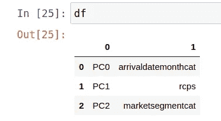
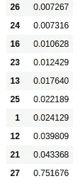

# 主成分分析与提取树分类器

> 原文：<https://towardsdatascience.com/principal-component-analysis-vs-extratreesclassifier-d0217bbcc9a8?source=collection_archive---------19----------------------->

## 一种特征选择方法比另一种更好吗？


来源:图片来自 [Pixabay](https://pixabay.com/illustrations/question-mark-important-sign-1872665/)

主成分分析(PCA)的目的是识别在训练集中表现出最大变化量的特征。

这被用作特征选择方法，以识别影响结果变量的最重要的属性，从而允许丢弃没有显示出太多变化的变量。

在本文中，研究了一个酒店取消数据集，以确定 1)根据 PCA 分析，哪些特征显示出最大的变化(因此是最重要的),以及 2)使用这些特征的分类模型的准确性结果与 extra tree 分类器选择的结果相比如何。

# 主成分分析

在 Antonio，Almeida 和 Nunes (2019)提供的原始酒店取消[数据集](https://www.sciencedirect.com/science/article/pii/S2352340918315191)中，如果客户取消其酒店预订，酒店取消(IsCanceled)的结果变量被列为 **1** ，如果客户不取消，则列为 **0** 。

此外，还为每个客户提供了一系列不同的功能，其中包括:

*   交付周期(从预订到顾客入住酒店之间的时间)
*   原产国
*   细分市场
*   存款类型
*   抵达月份

目的是识别数据集中显示与结果变量(酒店取消)相关的最易解释的差异的要素。

为此，PCA 用于识别解释 95%的变化的成分的数量，或者换句话说，总计 95%的变化的维度的数量。

```
>>> from sklearn.decomposition import PCA
>>> pca = PCA()
>>> pca.fit(x1_train)
>>> cumsum = np.cumsum(pca.explained_variance_ratio_)
>>> d=np.argmax(cumsum >= 0.95) + 1>>> d
3
```

在 **d=3** 的情况下，这表明所有列出的特征中的三个特征估计会贡献 95%的方差。

现在已经获得了 **d** 的值，可以再次运行具有三个指定组件的 PCA 模型，并识别最重要的特征。

```
>>> model = PCA(n_components=3).fit(x1_train)
>>> X_pc = model.transform(x1_train)>>> # number of components
>>> n_pcs= model.components_.shape[0]
```

现在，特征名称被指定为[生成](https://stackoverflow.com/questions/47370795/pca-on-sklearn-how-to-interpret-pca-components)一个指示最重要特征的数据帧。

```
>>> most_important = [np.abs(model.components_[i]).argmax() for i in range(n_pcs)]
>>> most_important[1, 23, 11]>>> initial_feature_names = ['leadtime','arrivaldatemonthcat','arrivaldateweekno','arrivaldatedayofmonth','staysweekendnights','staysweeknights','adults','children','babies','mealcat','countrycat','marketsegmentcat','distributionchannelcat','isrepeatedguestcat','previouscancellations','previousbookingsnotcanceled','reservedroomtypecat','assignedroomtypecat','bookingchanges','deposittypecat','dayswaitinglist','customertypecat','adr','rcps','totalsqr','reservationstatuscat']>>> most_important_names = [initial_feature_names[most_important[i]] for i in range(n_pcs)]
>>> dic = {'PC{}'.format(i): most_important_names[i] for i in range(n_pcs)}
>>> df = pd.DataFrame(dic.items())
>>> df
```



来源:Jupyter 笔记本输出

根据以上所述，抵达月份、所需的停车位和市场细分解释了酒店取消的 95%的变化。

使用这些特征，建立了 SVM(支持向量机)分类模型，并比较了验证集和测试集的预测精度。

## 验证结果

使用 PCA，总体上获得了 59%的准确率，而获得了 73%的召回率。73%的召回率表明，在取消预订的所有客户中，该模型正确识别了 73%。在这点上，在这种情况下，该度量被认为比整体准确性更重要。

```
>>> from sklearn import svm
>>> clf = svm.SVC(gamma='scale', 
>>>             class_weight='balanced')
>>> clf.fit(x1_train, y1_train)  
>>> prclf = clf.predict(x1_val)
>>> prclfarray([0, 0, 1, ..., 0, 0, 1])>>> from sklearn.metrics import classification_report,confusion_matrix
>>> print(confusion_matrix(y1_val,prclf))
>>> print(classification_report(y1_val,prclf))[[3950 3316]
 [ 755 1994]]
              precision    recall  f1-score   support

           0       0.84      0.54      0.66      7266
           1       0.38      0.73      0.49      2749

    accuracy                           0.59     10015
   macro avg       0.61      0.63      0.58     10015
weighted avg       0.71      0.59      0.61     10015
```

## 试验结果

当将预测与测试结果进行比较时，获得了 55%的准确率和 81%的召回率。

```
>>> a = np.column_stack((t_arrivaldatemonthcat,t_marketsegmentcat,t_rcps))
>>> a = sm.add_constant(a, prepend=True)
IsCanceled = h2data['IsCanceled']
>>> b = IsCanceled
>>> b=b.values>>> prh2 = clf.predict(a)
>>> prh2array([1, 1, 1, ..., 1, 1, 1])>>> from sklearn.metrics import classification_report,confusion_matrix
>>> print(confusion_matrix(b,prh2))
>>> print(classification_report(b,prh2))[[ 9028 37200]
 [ 6274 26828]]
              precision    recall  f1-score   support

           0       0.59      0.20      0.29     46228
           1       0.42      0.81      0.55     33102

    accuracy                           0.45     79330
   macro avg       0.50      0.50      0.42     79330
weighted avg       0.52      0.45      0.40     79330
```

# 树外分级机

正如我们已经看到的，标准 PCA 方法旨在将特征数量 *n* 减少到更少数量的主成分 *d* 。

然而，值得注意的是，还可以使用其他特征选择方法。在这种情况下，我们将探讨**提取树分类器**的特征选择方法。

ExtraTreesClassifier 是一种形式的**集成**方法，其中许多随机决策树适合数据，这实质上是将许多弱学习者组合成一个强学习者。

使用 x 和 y 数据，每个特征的重要性可以通过分数来计算。通过将这些分数分类到一个数据框架中，可以按升序查看每个分数的重要性。

```
>>> from sklearn.ensemble import ExtraTreesClassifier
>>> model = ExtraTreesClassifier()
>>> model.fit(x, y)
```



来源:Jupyter 笔记本输出

最重要的特征被确定为 1、12、13、21、23、25(交付周期、原产国、市场细分、存款类型、客户类型和所需停车位)。特征 27(预订状态)因不相关而被丢弃，因为该变量本质上揭示了客户是否取消了预订，并且具有误导性。

使用这些特征再次运行 SVM 模型，并且在如下分类矩阵中输出相对于测试集的准确度:

```
[[34581 11647]
 [11247 21855]]
              precision    recall  f1-score   support

           0       0.75      0.75      0.75     46228
           1       0.65      0.66      0.66     33102

    accuracy                           0.71     79330
   macro avg       0.70      0.70      0.70     79330
weighted avg       0.71      0.71      0.71     79330
```

使用提取树分类器指定的特征，获得了 71%的准确率和 66%的召回率。注意，当使用 PCA 指定的特征时，获得了 55%的准确率和 81%的召回率。

# 比较

那么，主成分分析或提取树分类器在选择最相关的特征方面做得更好吗？

在这种情况下，虽然我们不希望整体准确性太低，但回忆是一种更好地表明该模型在预测取消酒店预订的客户方面有多准确的指标。在数据集本身，大多数客户没有取消。因此，准确性本身会产生误导，因为高准确性可能表明该模型非常擅长预测那些没有取消**的客户，但不太擅长预测那些取消**的客户。

鉴于此，有人可能会认为 PCA 在此基础上表现得更好——因为召回率更高，而模型使用更少的特征来解释酒店取消的大多数变化。

也就是说，理解每个特性的理论相关性是很重要的。在这方面，运行多种特性选择方法并确定哪种方法最适合特定的用例始终是一种好的做法。

# 结论

在本文中，您已经看到:

*   如何实现 PCA 模型
*   在数据集中选择正确要素的重要性
*   主成分分析和树外分类器在特征选择中的比较

非常感谢您的宝贵时间，非常感谢您的任何问题或反馈。您还可以在这里找到这个例子[的相关 GitHub 库。](https://github.com/MGCodesandStats/hotel-modelling)

# 参考

*   [安东尼奥、阿尔梅迪亚、努内斯(2019)。酒店预订需求数据集。](https://www.sciencedirect.com/science/article/pii/S2352340918315191)
*   Aurélien Geron (O'Reilly Media):使用 Scikit-Learn 和 TensorFlow 进行机器学习
*   [堆栈溢出:sklearn 上的 PCA 如何解释 pca.components_](https://stackoverflow.com/questions/47370795/pca-on-sklearn-how-to-interpret-pca-components)
*   [走向数据科学:Python 中的特征选择技术——预测酒店取消预订](/feature-selection-techniques-in-python-predicting-hotel-cancellations-48a77521ee4f)

*免责声明:本文是在“原样”的基础上编写的，没有任何担保。它旨在提供数据科学概念的概述，不应被解释为专业建议。本文中的发现和解释是作者的发现和解释，不被本文中提到的任何第三方认可或隶属于任何第三方。作者与本文提及的任何第三方无任何关系。*