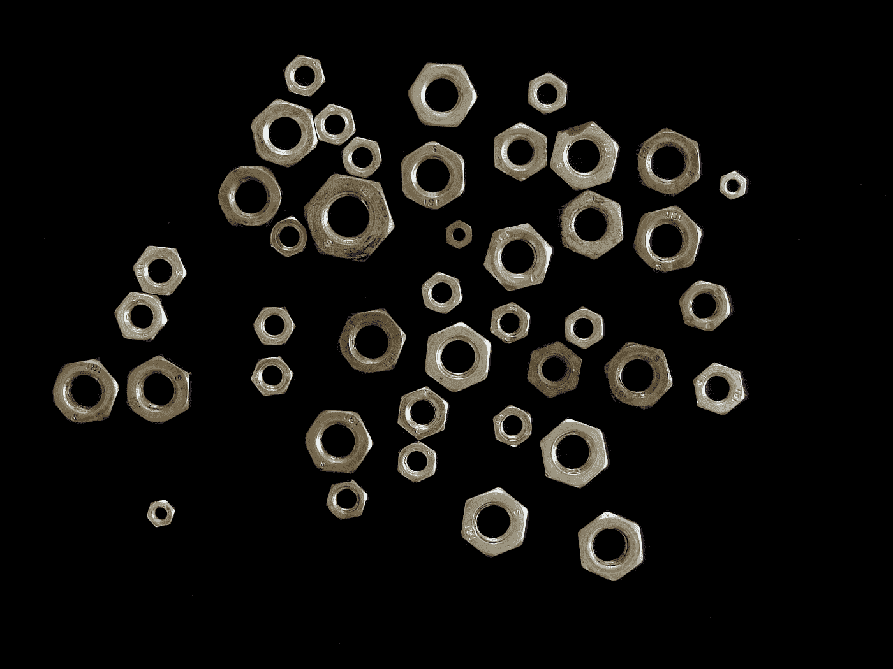

# 主要成分:艾伦·雅各布森关于构建数据科学工具

> 原文：<https://towardsdatascience.com/principal-components-alan-jacobson-on-building-data-science-tools-16cae3681aff?source=collection_archive---------40----------------------->

## *Alteryx 首席数据和分析官 Alan Jacobson 谈论领先的数据科学家，他们创造的工具可供其他数据科学家使用。*

[迪奥戈·努内斯](https://unsplash.com/@dialex?utm_source=medium&utm_medium=referral)在 [Unsplash](https://unsplash.com?utm_source=medium&utm_medium=referral) 上的照片

Alteryx 的首席数据和分析官 Alan Jacobson 参加了我们的 Data Science Mixer 播客，讲述了他领导的数据科学家团队的工作，他们自己构建了其他数据科学家使用的工具，包括 Alteryx 平台和开源 Python 库 EvalML、Featuretools、women work 和 Compose。

Alan 与我们分享了如何组成一个可靠的数据科学团队，他如何看待模型的可解释性，以及如何清晰地交流数据科学。以下是我们谈话中的三个“主要组成部分”,它们将引导您思考该领域的这些重大问题。

# **多样化的人才带来更好的数据科学成果。**

> *我曾经共事过的一些最优秀的数据科学家有着令人难以置信的不同背景。*

建立一个成功的团队——这不仅适用于数据科学；我要说，对大多数团队来说都是如此——做得好的艺术之一是建立一个极其多样化的团队。这方面的科学非常清楚:多元化会给团队带来更好的结果。

毫无疑问，当你在处理我们每天都要处理的各种问题时，拥有许多不同背景的人肯定会有所帮助。我曾经共事过的一些最好的数据科学家有着令人难以置信的不同背景:地质学家、工程师、英语专业。他们都有不同的经历。我认为这是建立优秀团队的关键之一——拥有多元化的人才。

# **模型透明性可以通过可理解的解释来实现。**

> 你想乘哪架飞机？

假设你要登上一架飞机，我可以向你展示我们设计飞机的所有数学模型。我可以完全透明地展示所有的公式和数学。太好了。或者，我可以告诉你，我们让飞机飞了一百万次，我们有一个模型在所有时间都工作正常。你想坐第 1000001 次航班吗？

你可以选择一架有一百万次工作经验的飞机，它从来没有出错过——或者是一架从未飞行过的飞机。它没有历史，但我可以向你展示所有的数学。你想乘哪架飞机？就我个人而言，我会选择已经飞行了一百万次并且每次都成功的那个。

机器学习在某种程度上使用了大量的历史数据，并建立了与历史数据相匹配的模型，而不是使用公式的统计计量经济学方法。所以有不同的方法。但是当谈到实际的透明度时，一旦你建立了模型，用机器学习来理解模型如何工作以及其中有什么是非常容易的。想看公式可以看公式。我不知道看到公式就一定让它更容易理解。我真的认为艺术不在于透明——我能看到盒子里的所有东西吗——而是，我是否让它变得足够容易理解，让你能真正理解发生了什么？

# 数据科学应该成为每个人教育和工作的一部分。

> *去掉行话，用我们日常生活中都能想象的例子。*

数据科学，总的来说，真的没那么难。当然，数据科学中有些概念比其他概念更难理解。但是一个实践数据科学家所做的大部分事情——不是热力学。热力学是一门非常难的课程。至少对我来说，那是一门很难的课程。多维微积分。这是一件非常抽象，难以描绘的事情。

我发现大多数数据科学原理都可以用非常简单的术语来解释。我有两个孩子。他们是中学生和高中生，他们能理解这些概念。通常，当我训练这些概念时，我会试着去掉术语，并试着使用我们在日常生活中都能想象到的例子。

我真的热情地认为，数据科学是一个最终应该成为每个人工作的一部分的领域。不仅仅是博士数据科学家做数据科学。是数学。这是给所有人的。这并不是说不会有你需要数据科学家来处理的最复杂的事情，但是我真的很希望看到每个人在日常工作中都能够利用这些东西。

*为了篇幅和清晰起见，这些采访回复被稍微编辑了一下。*

*播客节目笔记和完整的文字稿可在* [*Alteryx 社区*](https://community.alteryx.com/t5/Data-Science-Mixer/Building-data-science-tools-for-data-scientists-Alan-Jacobson/ba-p/764385?utm_source=tds) *上获得。*