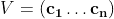
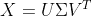
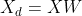

# 用 Python 在 5 分钟内完成主成分分析(PCA)

> 原文：<https://towardsdatascience.com/principal-components-analysis-pca-in-python-in-under-5-minutes-26baacb797f8?source=collection_archive---------17----------------------->


弗兰基·查马基在 [Unsplash](https://unsplash.com?utm_source=medium&utm_medium=referral) 上拍摄的照片

## 简明扼要的演练

# 先决条件

*   线性代数和矩阵分解的现有知识
*   Python 3 编程熟练程度

# 什么是主成分分析？

简而言之，对于具有大量特征的数据集，PCA 可以说是最流行的降维算法。它用于移除高度相关的特征和冗余的特征，并修剪掉数据中的噪声。

最近的机器学习(ML)算法和神经网络可以很好地处理高维数据集，通常具有数十万或超过一百万个特征。请注意，由于计算技术(PCs/GPU)的最新发展，处理高维数据的效率越来越高，而无需因计算限制而降低其维数。然而，像 PCA 这样的降维算法仍然用于各种考虑，例如通过消除具有高相关性的特征、通过创建连续最大化方差的新的不相关变量来减少 ML 模型的过拟合。

# 获取主成分

## “手动”方式

回想一下文献，我们可以通过奇异值分解(SVD)获得主成分矩阵 V，这是一种矩阵分解技术。在这里，我们有



其中 *V* 中有 **n** 个主成分。

换句话说，SVD 将数据矩阵 *X* 分解成三个矩阵:



其中 *U* 由左奇异向量组成，σ是与包含奇异值的 *X* 具有相同维数的对角矩阵， *V* 包含右奇异向量/主分量。

在 Python 中，我们利用 Numpy 的 **svd()** 函数来获得 *X:* 的所有主成分

```
U, S, V_T = np.linalg.svd(X)# transpose to get V, with number of components as V.shape[1]
V = V_T.T# first component
c1 = V[:, 0]# last (n-th) component
cn = V[:, -1]
```

现在，我们准备使用找到的组件来减小 *X* 的尺寸！为了将维度减少到 *d* ，我们必须将数据投影到由第一个 *d* 组件定义的超平面上。这样做导致超平面尽可能多地保留方差。在数学上，我们用矩阵 *W* 计算 *X* 的乘积，该矩阵由第一个 *d* 主成分组成:



在 Python 中，我们有以下内容:

```
W = V[:, :d] # d is the number of components
X_d = X.dot(W) 
```

## “Scikit-learn”方式

幸运的是，Scikit-learn Python 库已经为我们设置好了这一切。假设我们之前已经定义了 *d* 和 *X* 。然后，我们可以使用下面的代码，通过利用第一个 *d* 主分量来获得降维后的结果 *X* 矩阵:

```
from sklearn.decomposition import PCApca = PCA(n_components = d)
X_d = pca.fit_transform(X)
```

要访问单个组件，则略有不同。我们必须使用**组件 _** 变量:

```
# first component
c1 = pca.components_.T[:, 0]
```

这里有一个补充说明，组件是水平向量，所以你必须用一个**来转置它们。T** 同上。

# 选择正确的维度数量

通常的做法是选择一定数量的维度，这些维度加起来构成方差中足够大的一部分。通常，惯例是保留 95%的方差，但这取决于您的需求。例如，如果你试图减少维度来更好地可视化数据，你将不得不把它减少到 2 维或最多 3 维，因为人类不能在视觉上阅读超过 3 维。

## “手动”方式

在这种方法中，我们迭代通过由组件解释的方差比例，直到达到某个阈值——解释为要保留的期望方差比例。我们使用以下函数来实现这一点:

```
def get_pca_components(pca, var):
    cumm_var = pca.explained_variance_ratio_
    total_var = 0.
    N_COMPONENTS = 0
    for i **in** cumm_var:
        N_COMPONENTS += 1
        total_var += i
        if total_var >= var:
            break
    return N_COMPONENTS
```

这里， **cumm_var** 包含每个分量解释的方差的比例，从最大到最小(第 n 个分量)。接下来，我们将 **PCA()** 对象与数据 *X* 相匹配，并提取分量数，以保留 95%的方差:

```
pca = PCA().fit(X)
n_components = get_pca_components(pca, 0.95)
```

最后，我们可以转换数据以降低其维度:

```
pca = PCA(n_components=n_components)
X_d = pca.fit_transform(X)
```

## “Scikit-learn”方式

幸运的是，Scikit-learn 让我们的生活变得更加简单。我们只需要两行代码:

```
pca = PCA(n_components=0.95)
X_d = pca.fit_transform(X)
```

在 **PCA()** 对象中，您可以将 **n_components** 指定为 0 到 1 之间的浮点，以指定要保留的方差比率。如果您希望以这种方式进行降维，您还可以将组件的数量指定为一个正整数，最大为 *d* 。

# 后续步骤

现在您已经获得了转换后的数据 **X_d** ，您可以继续对其进行分析/可视化，并在其上拟合一个 ML 模型！