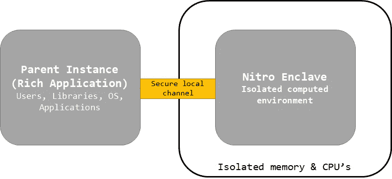
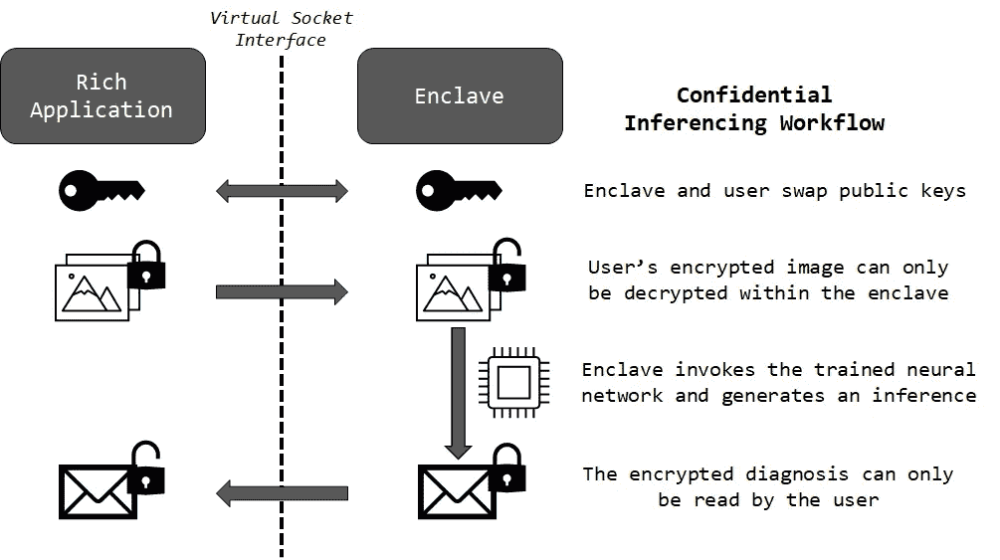
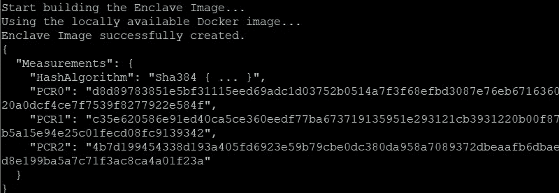
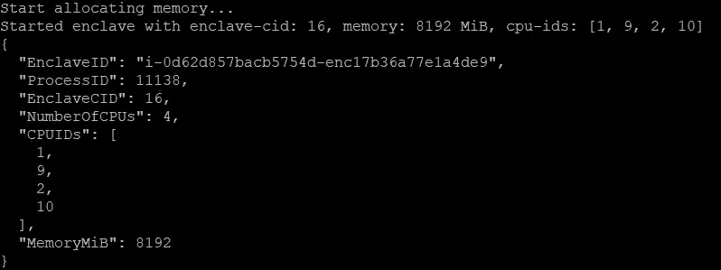
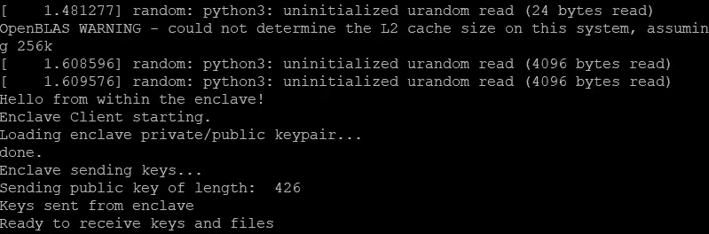
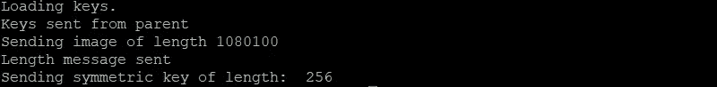
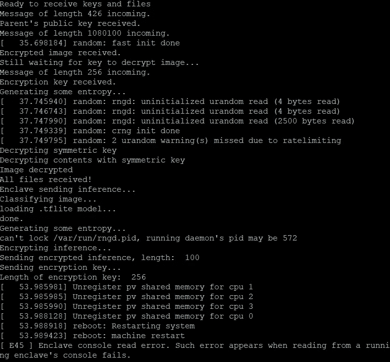
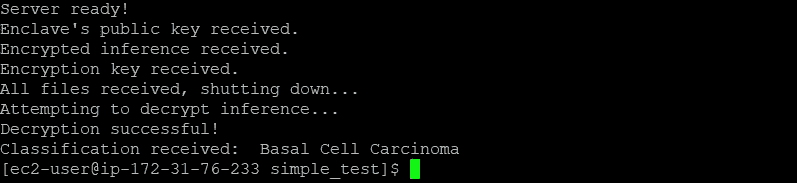

# 使用 AWS Nitro Enclaves 保护隐私的深度学习

> 原文：<https://towardsdatascience.com/privacy-preserving-deep-learning-with-aws-nitro-enclaves-74c72a17f857?source=collection_archive---------21----------------------->

## 在不泄露用户数据的情况下生成机密推断

杰森·登特在 [Unsplash](https://unsplash.com?utm_source=medium&utm_medium=referral) 上拍摄的照片

不断扩大的机密计算领域本质上可归结为两个主要属性:

1.  **保密性**:我们如何对敏感的用户数据(如健康记录和信用记录)进行计算操作，而不会“看到”未加密形式的数据？
2.  **完整性**:如果我们能够完成(1)，我们如何*向用户证明*他们的隐私得到了保护？

AWS 认为他们在 Nitro Enclave 产品中找到了答案，该产品利用现代处理器上的[可信执行环境](https://en.wikipedia.org/wiki/Trusted_execution_environment) (TEE)来创建可验证的应用程序，这些应用程序不会被外部网络甚至主机操作系统篡改。TEE 提供了机密性和完整性，但是众所周知它们很难使用。在本教程中，我们将使用 Nitro Enclave 平台完成一项相对复杂的任务(按照机密计算标准):根据用户提供的图像对卷积神经网络进行安全评估。

## “抬起并移动”

AWS 将 Nitro Enclaves 吹捧为一种“[提升和转移](https://press.aboutamazon.com/news-releases/news-release-details/aws-announces-general-availability-nitro-enclaves)”解决方案，但 TEE 引入了一些我们必须在应用中解决的特质。好消息是标准的 docker 图像可以转换成“Enclave 图像文件”(。EIF)的格式。我们可以构建相对丰富的程序，而不局限于某种语言或 OS，我们可以将几乎所有的主机内存和 CPU 资源分配给 TEE。使用 [Nitro CLI](https://github.com/aws/aws-nitro-enclaves-cli) ，许多低级操作被抽象成一些简单的命令。

虽然这些特性极大地降低了开发机密应用程序的学习曲线(尤其是与遗留平台相比)，但这并不意味着您可以将未经修改的 docker 映像放入一个飞地，并期望它能够工作。最显著的区别是网络接口——Nitro Enclave 与所有外部连接完全隔离，除了允许它与主机实例通信的本地套接字。虽然这导致了一个防篡改的计算环境，但这也意味着我们将不得不求助于低级协议(例如 Python 的[套接字](https://docs.python.org/3/library/socket.html)库)来传输数据进出飞地。

Nitro Enclaves 只能通过安全的虚拟套接字与父实例通信(图片由作者提供)

飞地孤立的另一个有问题的副产品是它们很难产生熵。普通的个人计算机从物理现象如旋转的磁盘驱动器、键盘敲击或鼠标点击中捕获随机字节的缓冲区。这种熵随后被用在依赖真正随机性的操作上，比如加密和密钥生成。相比之下，enclaves 被设计为安全且可预测地启动，以便创建可靠的证明文档，这使得熵成为一种珍贵的商品。为了让我们的应用程序顺利运行，我们必须想出一种方法来“填满”我们的随机缓冲区。

## 机密分类场景

医疗领域为机密计算提供了一个极好的用例，因为多个利益相关者希望他们的数据是私有的。在这个例子中，我们考虑一个应用程序，其中患者可以查询一个经过训练的[卷积神经网络](https://github.com/aryanmisra/Skin-Lesion-Classifier)，以查看他们是否患有皮肤癌。用户希望确保他们的输入和诊断永远不会透露给开发人员，而开发人员希望避免与用户共享他们的专有模型。下图显示了我们的机密推理工作流程。

我们的机密推理工作流程，它将允许用户获得皮肤癌诊断，而无需向应用程序(图片由作者提供)透露输入(皮肤病变的图像)。

## 设置父应用程序

为了清楚起见，我们将把父应用程序分成两个主要进程:发送和接收数据。让我们从`VsockListener`类开始，它是通过虚拟套接字从 enclave 接受消息的服务器进程:

在`recv_data_parent`函数中，我们定义了一个处理输入内容的简单协议。通常，您会添加一些头字节或其他预定义的编码来告诉服务器传输中包含什么类型的信息，但我们将只使用消息的大小来确定它可能包含什么数据。加密的推断(一个可以映射到诊断标签的数字)大约为 100 字节，enclave 的公钥大约为 400 字节。加密的对称密钥介于两者之间，大约 256 字节。在这里看看[对我们正在实现的](https://security.stackexchange.com/questions/10949/encryption-should-i-be-using-rsa-or-aes/10953#10953)[混合加密协议的解释](https://github.com/evandiewald/nitro-enclave-tensorflow/blob/main/crypto_utils.py)。

现在，让我们来看看父节点如何将*信息传输到飞地。*

我们将等到收到 enclave 的公钥后再调用这个类，因为我们需要它来不对称地加密我们的图像。注意，在我们发送图像或密钥之前，我们发送后续消息的长度，以便 enclave 知道预期有多少字节(在使用套接字几天之后，您将再也不会认为 HTTP 是理所当然的了！).

我们将使用参数解析器从命令行运行这些处理程序，例如`python3 vsock-parent.py server <port-in>`(用于监听器)和`python3 vsock-parent.py client <enclave-cid> <port-out>`(用于客户端)。

现在让我们来看看 enclave 应用程序代码。

## 建立飞地

enclave 应用程序与父应用程序非常相似，只是我们将使用一个程序来处理发送和接收数据。[查看 Github 资源库中的脚本](https://github.com/evandiewald/nitro-enclave-tensorflow/blob/main/vsock-enclave-bidirectional.py)。我想强调几个关键的区别。首先，在我们尝试任何加密或解密之前，使用 rng-tools 包生成一些熵是至关重要的，原因在简介中讨论过。我们可以用`subprocess.run(‘rngd -r /dev/urandom -o /dev/random’, shell=True)`从 python 脚本中启动守护进程。如果没有这一行，应用程序[只会在需要随机性的步骤无限期挂起](https://github.com/aws/aws-nitro-enclaves-sdk-c/issues/41)。

为了在我们的 enclave 映像中节省宝贵的内存，我选择了 [Tensorflow Lite 运行时](https://www.tensorflow.org/lite/guide/python)，而不是成熟的 Tensorflow 安装(单独安装就可能超过 2–3GB)。只要有可能，尽量限制你的 enclave 的计算开销，就像你在为微控制器或 Raspberry Pi 开发应用程序一样。调用 Tensorflow Lite 解释器并生成推理的代码可以在[这里](https://github.com/evandiewald/nitro-enclave-tensorflow/blob/main/predict_tflite.py)找到。

最后，让我们看一下 docker 文件，它包含了构建我们的映像的指令。

安装依赖项、复制文件以及用`ssh-keygen`生成我们的 RSA 密钥对应该相对简单。在最后一行，我们使用命令行参数启动 python 应用程序；父实例的 CID 是 **always** 3，我们将使用端口 5005 和 5006 来发送和接收数据。

设置完成后，让我们来谈谈实现。

## 逐步演示

启动一个与 Nitro Enclave 兼容的 EC2 实例，比如一个 m5.4xlarge，并确保在设置过程中启用 Enclave 选项。请记住，我们需要足够的内存和 CPU 内核来运行父设备和 enclave。虽然您可以使用大多数基于 Linux 的平台，但我推荐 Amazon Linux 2——否则，您将不得不自己构建 Nitro CLI。通过 SSH 登录到您的实例，并使用

`sudo yum update`

我们还需要安装 docker 和 Nitro CLI。

`sudo amazon-linux-extras install docker aws-nitro-enclaves-cli aws-nitro-enclaves-cli-devel -y`

启动 docker 服务。

`sudo service docker start`

提升 docker 和 nice 编辑器的用户权限。

`sudo usermod -aG ne ec2-user && sudo usermod -aG docker ec2-user`

接下来，我们需要配置 enclave 能够访问的资源(CPU 内核和内存)。编辑`/etc/nitro_enclaves/allocator.yaml`文件，将缺省值增加到 8192 MB RAM 和 4 个内核(尽管我相信你可以少用一些)。要提交这些更改，请运行

`sudo systemctl start nitro-enclaves-allocator.service && sudo systemctl enable nitro-enclaves-allocator.service`

此时，**重启**您的实例，让各种更新生效。

重新启动后，克隆公共存储库

`git clone [https://github.com/evandiewald/nitro-enclave-tensorflow.git](https://github.com/evandiewald/nitro-enclave-tensorflow.git)`

和`cd`进入回购目录。构建 docker 映像，使用

`docker build -t enclave-tensorflow .`

成功创建映像后，我们使用 Nitro CLI 将其转换为 EIF 文件:

`nitro-cli build-enclave --docker-uri enclave-tensorflow:latest --output-file enclave-tensorflow.eif`

如果一切顺利，您将看到一个包含 3 个 SHA 散列的证明文档，它们对应于 enclave 映像、内核和应用程序。

build-enclave 命令的输出，显示了 enclave 映像、linux 内核和您的应用程序(由作者创建的映像)的散列。

在运行 enclave 之前，我们需要确保我们的父实例正在监听连接。打开一个新的终端并运行

`python3 vsock-parent.py server 5006`控制台应打印`Server ready!`

回到第一个终端，让我们最终执行 enclave 应用程序。同样，我们将使用 Nitro CLI

`nitro-cli run-enclave --eif-path enclave-tensorflow.eif --memory 8192 --cpu-count 4 --enclave-cid 16 --debug-mode`

一个成功的输出将显示一些关于 enclave 及其资源的基本元数据。

run-enclave 命令的输出，显示哪些 CPU 内核和多少内存已经分配给我们的安全 enclave(图片由作者提供)。

记下 EnclaveID，您将在下一步中需要它。一旦 enclave 启动，另一个终端中的服务器应该会打印出`Enclave's public key received.`，但是出于调试的目的，最好能知道我们的 enclave 中发生了什么。由于我们包含了`--debug-mode`标志，Nitro CLI 公开了一个控制台，允许我们查看应用程序的输出，并确保它正常运行。

`nitro-cli console --enclave-id $ENCLAVE_ID`

您将会看到一长串描述引导操作的打印输出，但是在底部您应该会看到一些来自 python 应用程序的消息。

enclave 的控制台输出，仅在调试模式下可用。在将其公钥发送给父实例后，我们的应用程序监听传入的消息(图片由作者提供)。

此时，打开第三个终端，将用户数据从 parent 发送到 enclave

`python3 vsock-parent.py client 16 5005` (16 是飞地 CID)

该终端应该表明它正在发送父级的公钥、加密图像和对称密钥。

通过虚拟套接字从父实例向 enclave 发送消息后 vsock-parent.py 的输出(图片由作者提供)。

回到 enclave 控制台，在对图像进行分类、加密推理并将其发送回父服务器之前，应用程序将确认收到并解密了消息。此时，enclave 将关闭，给出一个连接错误。

回到 enclave 控制台，我们的独立应用程序现在已经接收到加密的图像，使用训练好的模型对其进行分类，并向用户发送加密的推断。所有敏感数据在不在 TEE 中时都受到保护(图片由作者提供)。

最后，服务器将接收推断，解密，并打印出结果！

皮肤损伤的输入图像被正确地分类为基底细胞癌的例子。该诊断对应用程序开发人员不可见，只对患者可见(图片由作者提供)。

不要忘记终止您的 EC2 实例，以防止进一步的费用。

## 最后的想法

在本教程中，我们看到了 **TEE 如何使两个分布的利益相关者共享数据，而不需要假设明确的信任。**Nitro enclave 是硬件、软件和高级加密技术的胜利，但一旦你加入一点复杂性，它们就会引起一些独特的头痛。我以前从未担心过套接字或熵，与标准 docker 容器相比，调试 enclave 映像是一个痛苦的过程。完成这个项目后，我并不惊讶，我能找到的唯一其他教程是“hello world”应用程序。虽然这个演示远非最佳，但我希望它可以作为您自己的健壮的*安全多方计算*平台的一个有用的起点。

在我的 [Github 页面](https://github.com/evandiewald/nitro-enclave-tensorflow)查看完整的项目代码。

## 参考

Nitro Enclaves 用户指南:[https://docs . AWS . Amazon . com/enclave/latest/User/nitro-enclave . html](https://docs.aws.amazon.com/enclaves/latest/user/nitro-enclave.html)

Github 上的 AWS VSock 示例:[https://Github . com/AWS/AWS-nitro-enclaves-samples/tree/main/VSock _ Sample/py](https://github.com/aws/aws-nitro-enclaves-samples/tree/main/vsock_sample/py)

经过训练的皮肤损伤分类器模型(我将 h5 模型权重转换为 TFLITE 模型):[https://github.com/aryanmisra/Skin-Lesion-Classifier](https://github.com/aryanmisra/Skin-Lesion-Classifier)