# 使用 Azure 的数据科学专用 Docker 存储库

> 原文：<https://towardsdatascience.com/private-docker-repositories-for-data-science-with-azure-cccb2b37a647?source=collection_archive---------50----------------------->

## 机器学习工程师基础知识——如何设置私有容器库，保护它们，在云中使用 Azure 进行部署和共享


[伊恩·泰勒](https://unsplash.com/@carrier_lost?utm_source=medium&utm_medium=referral)在 [Unsplash](https://unsplash.com?utm_source=medium&utm_medium=referral) 上拍照

# 介绍

如果你已经在你的数据科学项目中使用 Docker，那么很好——你现在可能想学习如何私下管理和共享你的容器。这篇文章将向你展示如何在 Azure 中建立并运行私有存储库。

## 要求

对于本教程，您需要安装以下软件:

*   Docker —可以在这里找到
*   Azure CLI —可以在[这里](https://docs.microsoft.com/en-us/cli/azure/install-azure-cli)找到

如果您不确定从哪里开始使用 Docker，我已经写了两部分的系列文章，包括启动和运行，然后在这两篇文章中部署端到端的机器学习服务:

[](/docker-for-data-scientists-part-1-41b0725d4a50) [## 面向数据科学家的 Docker 第 1 部分

### 最基本的。数据科学家和机器学习工程师快速入门指南

towardsdatascience.com](/docker-for-data-scientists-part-1-41b0725d4a50) [](/docker-for-data-scientists-part-2-7655c02fe975) [## 数据科学家的 Docker 第 2 部分

### 开发机器学习模型、编写 API、打包到 Docker 中、在任何地方运行、分享的完整指南…

towardsdatascience.com](/docker-for-data-scientists-part-2-7655c02fe975) 

第一部分介绍了如何使用 Docker，所以如果您还没有准备好，请随时进入并准备好。

我在 Windows 机器上工作，因此安装 Azure CLI 非常简单:

```
choco install azure-cli
```

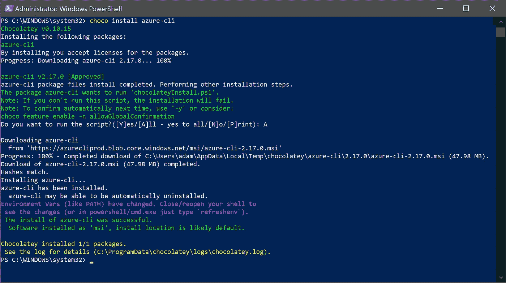

用 Chocolatey 安装 Azure CLI(图片由作者提供)。

## 设置 Azure CLI

安装了 CLI 后，我们现在需要进行设置。首先，我们需要从我们的机器登录。如果你还没有账户，你可以在这里注册免费试用。

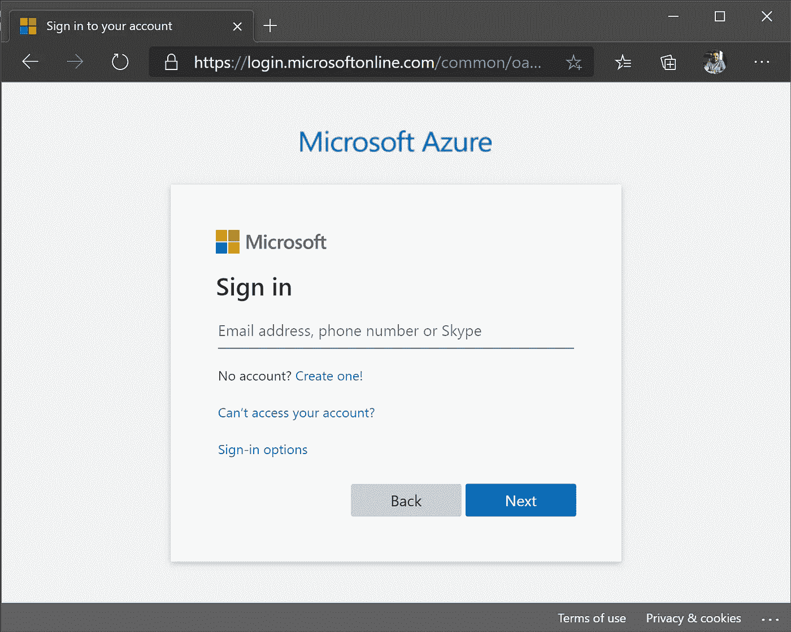

az 登录命令的 Azure 登录页面(图片由作者提供)。

您应该会看到这样的响应:

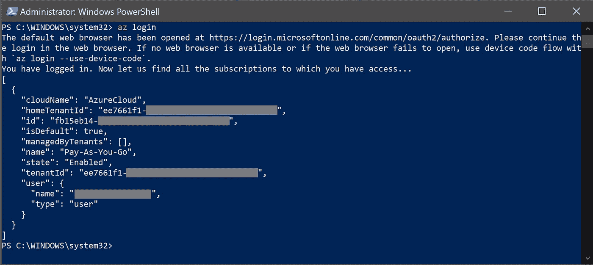

一旦你成功登录，你应该有类似的东西，包括你的 GUIDs 和订阅细节(图片由作者提供)。

## 资源组

下一步是创建一个新的资源组来运行所有的东西。这有助于我们在运行它们时跟踪它们，并允许我们在完成教程后删除所有内容。使用以下语法创建资源组非常简单:

```
az group create --location <desired_location> --name <resource_group_name>
```

我将使用英国西部地区，并将我的资源组称为`asrokademos`。这将给出以下输出，我们可以通过点击 Azure [这里的](https://portal.azure.com/#blade/HubsExtension/BrowseResourceGroups)来检查资源组在门户中是否存在:

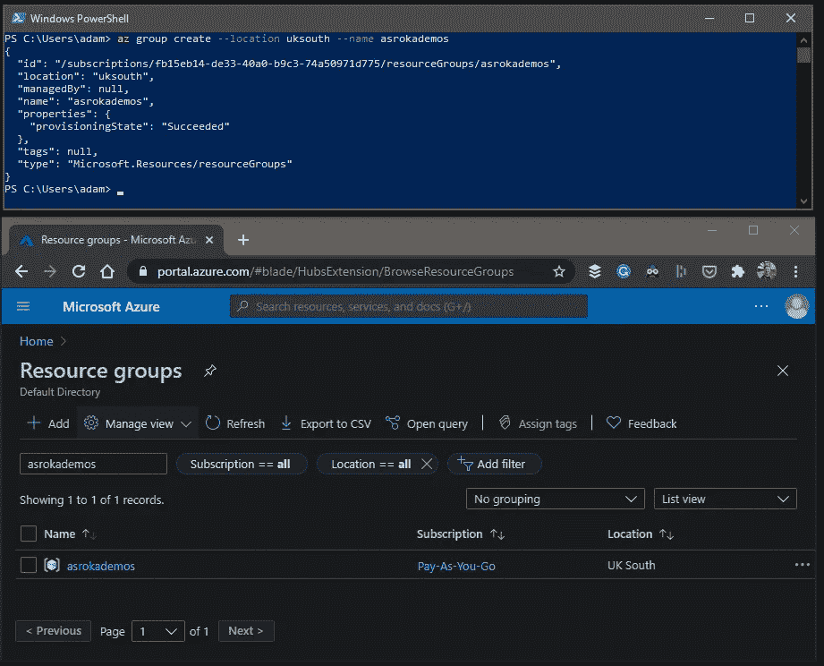

使用 CLI 创建我们的资源组，并检查它在门户中是否成功(图片由作者提供)。

## 集装箱登记处

现在让我们在这个资源组中创建一个 Azure 容器注册中心(ACR)。语法如下:

```
az acr create --resource-group <resource_group_name> --name <acr_name> --sku <sku_type>
```

你为你的 ACR 选择的名字在 Azure 中必须是唯一的，我称这个名字为`asrokadfds`。我们将它放在刚刚创建的资源组中，并使用`--sku Basic`。同样，我们可以检查终端(将会很长)和门户[的输出，这里是](https://portal.azure.com/#blade/HubsExtension/BrowseResourceBlade/resourceType/Microsoft.ContainerRegistry%2Fregistries):

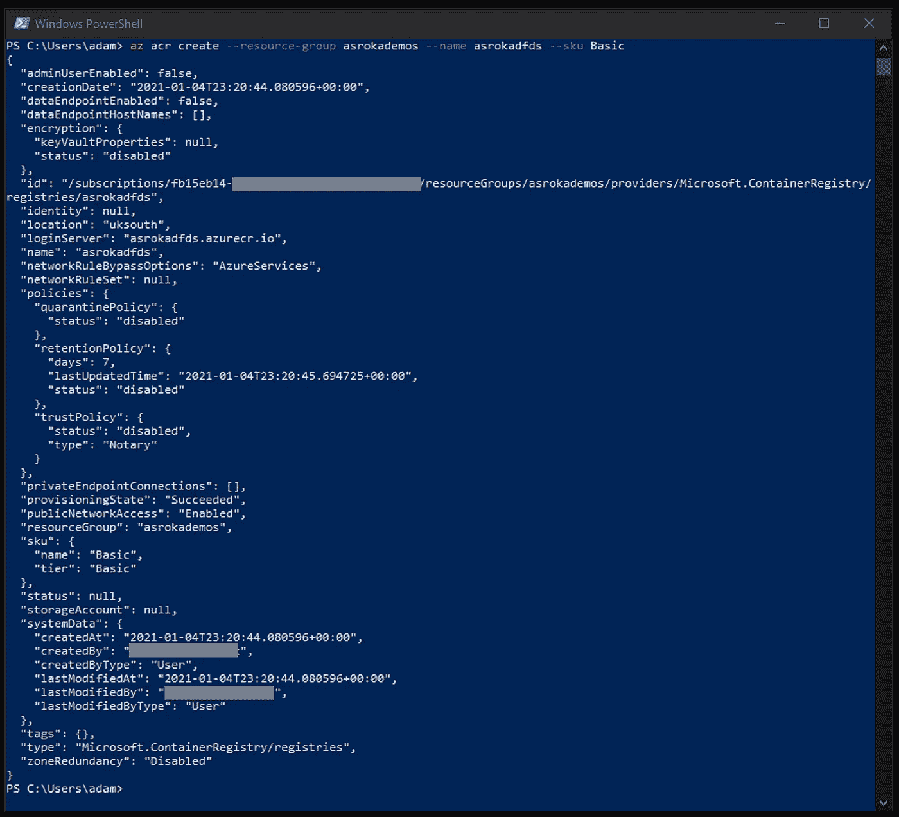

在 CLI 中创建我们的 Azure 容器注册表。

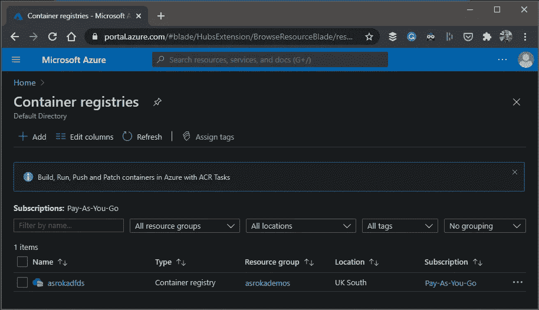

我们的 Azure 容器注册表现在在门户中可见(图片由作者提供)。

然后，我们需要登录我们的 ACR 来验证我们是否被允许部署映像。然后，我们可以使用第二个查询来获得 ACR 的完整路径，我们需要开始向它部署容器。注意，如果你在 Windows 上运行，确保 Docker 正在运行，否则会出错。

```
az acr login --name <acr_name>
az acr show --name <acr_name> --query loginServer --output table
```

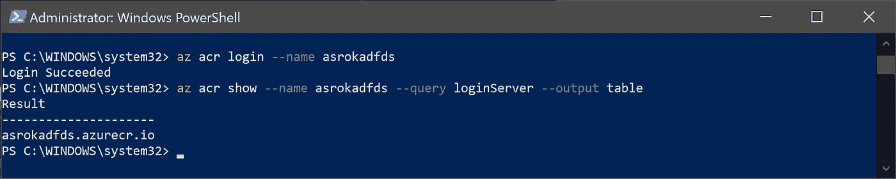

CLI 显示我们成功登录到 Azure container registry，并返回准备好映像部署的完整路径(image by author)。

## 将图像推送到我们的容器注册表

下一步是将我们的图像共享到注册中心。这很简单，遵循与将图像推送到 [DockerHub](https://hub.docker.com/) 相同的模式。我们需要确保我们的图像首先被标记，语法如下:

```
docker tag <repo_name>/<image_name>:<version><acr_name>/<image_name>:<version>
```

我将把我在 [Docker 中为数据科学家创建的 Iris Flask 应用程序—第 2 部分](/docker-for-data-scientists-part-2-7655c02fe975)推送到新的 ACR。

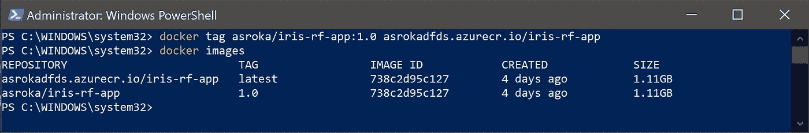

使用 Docker(按作者分类的图像)将现有图像标记到新的存储库中。

注意，从命令末尾开始保留标签会导致 Docker 自动追加`latest`标签。显式使用标记是明智的，因为它使您能够将容器注册表用作工作图像的版本控制。

既然图像已被标记，我们可以将它推送到 ACR，并使用以下命令检查它是否在那里:

```
docker push <acr_name>/<image_name_on_acr>:<version>
az acr repository list --name <acr_name> --output table
```

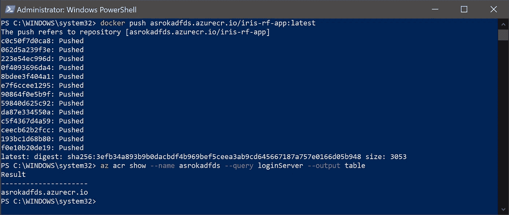

我们的本地容器图像被成功地推送到 Azure 容器注册中心。

因此，现在我们在云中有了这个容器，我们可以执行它，与其他可以访问 ACR 的人共享它，或者将其作为构建其他容器的基础——这是一个重要的功能，因为它允许我们开始模板化我们数据管道的复杂部分。

## 安全地共享我们的注册表

要访问我们的 ACR，我们需要创建一个服务主体—我们可以这样做，创建一个密钥库，并在其中存储服务主体，所有这些都使用 CLI。如果你对此不熟悉或者遇到困难，这里的文档[非常有用。](https://docs.microsoft.com/en-us/cli/azure/ad/sp?view=azure-cli-latest#az-ad-sp-create-for-rbac)

首先，使用以下语法创建密钥库

```
az keyvault create --resource-group <resource_group_name> --name <keyvault_name>
```

在 Azure 中,`<keyvault_name>`应该是唯一的。我这里用的是`asrokdademoskeyvault`:

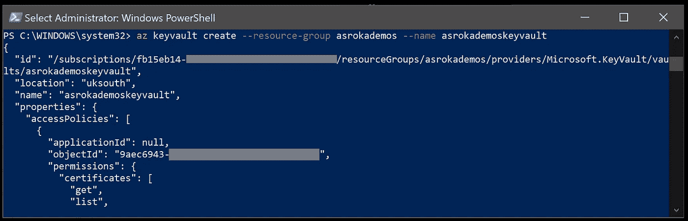

使用 Azure CLI 创建用于存储我们的秘密和凭证的密钥库(图片由作者提供)。

然后，我们需要获得 ACR 的 ID、服务主体 ID 和服务主体密码。因为您将在周围传递它们，所以建议将它们保存到变量中——我将使用`ACR_ID`作为 ACR ID，`AZ_SP_ID`作为服务主体 ID，`AZ_SP_PW`作为密码。获取 ACR ID 的语法是:

```
az acr show --name <acr_name> --query id --output tsv
```

然后，我们可以使用以下命令获取密码:

```
az ad sp create-for-rbac --name http://<full_acr_name>-pull scopes <acr_id> --role acrpull --query password --output tsv
```

您的终端应该如下所示:

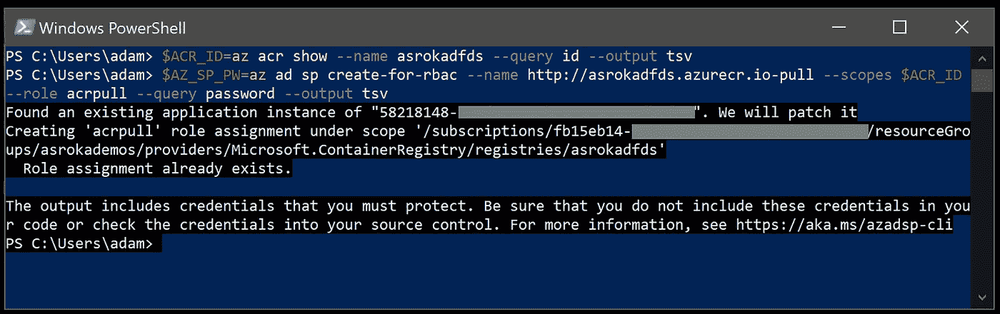

创建 ACR ID 和密码，并将它们保存到变量中以备后用(图片由作者提供)。

然后，我们可以使用以下语法生成服务主体 ID:

```
az ad sp show --id http://<full_acr_name>-pull --query appId --output tsv
```

对我来说是这样的:


使用 Azure CLI 获取服务主体 ID 的命令(图片由作者提供)。

最后一步是将这些凭证存储在我们创建的密钥库中，以便可以安全地访问和共享它们。对于服务主体密码，可以通过运行以下命令来完成:

```
az keyvault secret set --vault-name <keyvault_name> --name <acr_name>-pull-pwd --value <service_principal_password>
```

如果成功，您应该会看到类似这样的内容:

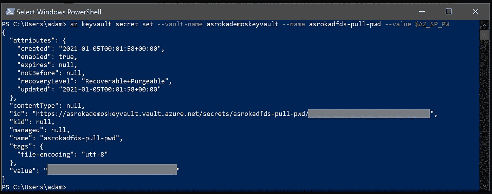

服务主体已添加到密钥库中(图片由作者提供)。

同样，对于应用程序 ID 使用:

```
az keyvault secret set --vault-name <keyvault_name> --name <acr_name>-pull-usr --value <service_principal_app_id>
```

我们现在已经成功创建了一个 Azure key vault，并在其中存储了两个秘密:

*   `<acr_name>-pull-usr` 保存服务主体 ID，它将被用作容器注册用户名
*   `<acr_name>-pull-pwd` 持有将用于安全访问容器注册中心的服务主体密码

现在，如果您的内存中没有`<service_principal_password>`或`<service_principal_app_id>`，您可以使用以下命令来调用它们:

```
$AZ_SP_ID=az keyvault secret show --vault-name $<keyvault_name> -name $<acr_name>-pull-usr --query value -o tsv)$AZ_SP_PW=az keyvault secret show --vault-name $<keyvault_name> -name $<acr_name>-pull-pwd --query value -o tsv)
```

## 在 Azure 上部署

现在一切都设置好了，让我们在 Azure 上部署容器。使用 Azure CLI 和我们的密钥库，这就像运行以下命令一样简单:

```
az container create --resource-group <resource_group_name> \
    --name <container_name> \
    --image <repo_name>/<image_name>:<tag> \
    --registry-login-server <acr_full_name> \
    --registry-username <service_principal_app_id> \
    --registry-password <service_principal_password> \
    --dns-name-label <container_name>-$RANDOM \
    --query ipAddress.fqdn
```

其中`<container_name>`是您要创建的容器的名称——任何合适的名称都可以。

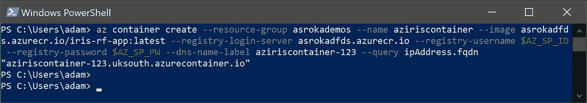

我们使用 Azure CLI 创建的 Docker 容器

`--query ipAddress.fqdn`选项会返回当前正在运行的容器的完全限定地址。如果您检查门户中的资源组，您会看到现在有一个正在运行的实例。现在您将能够 SSH 到容器中，或者如果您已经向端口 80 公开了一个 API，您将能够从 URL 直接访问它。

> 注意——记得清理！如果你只是把它当作一个教程来玩，记得删除你的资源组以避免不必要的费用。

# 结论

我们已经创建了一个 Azure 容器注册中心，上传了一个 Docker 映像，并存储了从任何地方安全访问和部署该映像所需的凭证。这使您能够开始私下共享您的 Docker 容器，并构建您自己的图像库，而无需依赖 Docker Hub。

对于希望看到自己的模型投入生产的机器学习工程师和数据科学家来说，这是一项重要的技能。Docker 和容器注册表是现代部署方法中的一个基本构建模块 Kubeflow、Kubernetes 和 Helm 等工具正在成为将机器学习项目集成到可扩展服务中的首选方式。使用这种方法，您的模型可以根据需求进行扩展，并且可以轻松地与您的客户和团队共享。

我希望这是有用的，如果您有任何反馈，请告诉我—联系:

*   www.twitter.com/adzsroka[的推特](http://www.twitter.com/adzsroka)
*   www.linkedin.com/in/aesroka[的 LinkedIn](http://www.linkedin.com/in/aesroka)
*   或者在[www.adamsroka.co.uk](http://www.adamsroka.co.uk/)

如果你对我写的其他话题感兴趣，请告诉我！