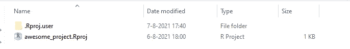
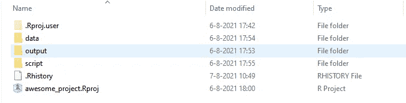
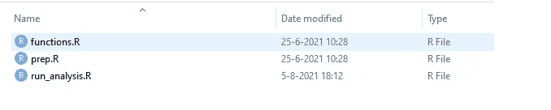
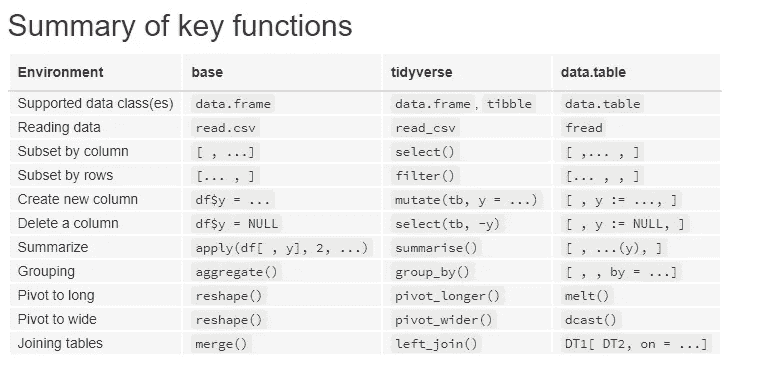
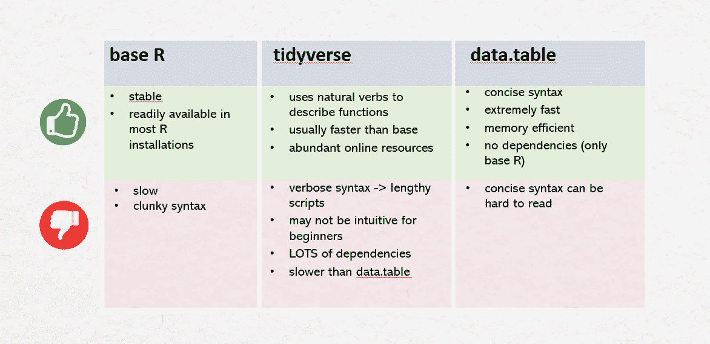
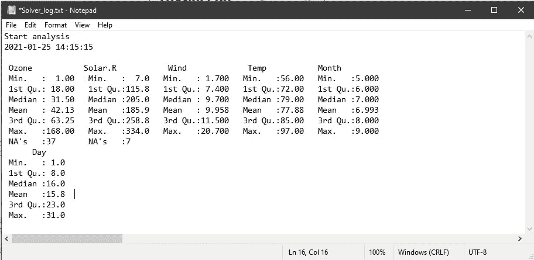

# R 中数据分析的专业技巧

> 原文：<https://towardsdatascience.com/pro-tips-for-data-analysis-in-r-45848bf48de9?source=collection_archive---------6----------------------->

## 为了更好的工作流程——基于我 5 年争论数据的经验。

约翰·施诺布里奇在 [Unsplash](https://unsplash.com?utm_source=medium&utm_medium=referral) 上的照片

r 和 Python 是最流行的数据分析编程语言之一。作为一名数据科学顾问，我在工作中的许多项目中都在研究开发。有很多事情我希望我能早点知道！在这篇文章中，我想和你分享一些我学到的最重要的技巧，当你开始在 r 中工作时，这些技巧可以改善你的工作流程。

****注:如果你更喜欢看这篇文章的视频版本，你可以查看下面我的 Youtube 频道上的视频。***

# **提示 1:使用 R 项目**

让我告诉你一些事情。在使用 R 好几年后，我意识到我犯了一个非常非常严重的错误。那个错误就是我没有用 R 项目。你可能不常在 R 编程在线课程和编程书籍中看到 R 项目的介绍。但是这是一种耻辱，因为有很多很好的理由说明为什么 R 项目可以让你的工作流程变得更加干净和流畅。

如果你不知道 R 项目是什么，它只是一个用。RProj 文件。你可以通过进入*文件>新建项目* >在 RStudio 中创建新的 R 项目，然后你可以在给定的目录中创建新的项目。

一个空 R 项目。作者图片

但是，好吧，你可能会问，使用 R project 的好处是什么，而不是把你的代码和所有东西都放在一个普通的文件夹里。以下是原因:

*   首先，R 项目**消除了设置工作目录**的需要，因为一切都变成了项目文件夹的相对文件路径。这意味着你不需要设置绝对路径，所以你可以与任何人共享你的项目文件夹，他们仍然可以运行它。我曾经在代码中设置了绝对路径，犯了一个严重的错误，每次当我将它发送给同事或推送到 Github 时，我的同事都不得不费力地更改路径，以使它在他的计算机上工作。
*   这就引出了第二点，那就是项目**改善**既**再现性**又**协作**。给定 R 项目文件夹，每个人都可以运行您的代码，而无需设置工作目录。因为项目文件夹将始终是该文件夹中代码的默认工作目录。
*   r 项目也是**方便的**,因为它可以选择用 Git 进行**版本控制**。所以您不需要在以后为您的项目初始化 Git repo。

# 技巧#2:构建分析文件夹

如果我告诉你，你需要组织你的项目文件夹，这可能看起来有点琐碎。但我向你保证，这会让你的工作流程变得更有效率。

让我给你展示一个我的项目文件夹的简单设置。这是一个适用于许多不同类型项目的模板，但它当然可以根据您的需求进行调整:

我的分析模板文件夹。作者图片

*   **数据**——这是我保存所有源文件的子文件夹，我需要将这些文件读入 R 以进行分析或可视化。这些可以是 Excel / CSV 文件中的任何内容，或者。RDS 文件，这是存储 R 对象的文件类型。
*   脚本 —这是我保存所有 R 脚本和 RMarkdown 文件的地方。我发现将所有的 ***函数*** 保存在一个独立于我的主分析脚本的脚本中很方便，因为它帮助我的主分析脚本更干净。我只需要将这些函数读入我的分析脚本，而不是将它们都放在一个大脚本中，这样会使代码变得混乱和笨拙。 ***run_analysis*** 文件是我运行所有分析的主要分析 R 脚本。由您决定是使用一个分析脚本还是多个脚本来执行不同的任务。如果您有一个 ***R markdown*** 文件，您也可以将其保存在该文件夹中。

*   **输出**——在这个文件夹中，我保存了我所有的输出，包括绘图、HTML 和数据输出。拥有这个输出文件夹有助于其他人轻松识别哪些文件是代码的**输出**。它还可以帮助您更快更容易地找到输出。

当您开始处理具有许多不同脚本和输入输出文件类型的更复杂的项目时，这种结构将帮助您组织起来，并帮助团队中的新成员理解项目。这种结构也将你的函数从分析运行中分离出来，从输出文件中分离出输入，当有一天你想从你的代码中创建一个 R 包时，这是非常有用的。一般来说，你设置了什么样的子文件夹并不重要，只要它们是合理的。您可以决定设置子文件夹，以便它们与分析步骤而不是文件类型保持一致。

# 技巧 3:Base R vs tidy verse vs data . table——我使用什么

您可以在 R 中使用不同的库或生态系统，它们为操作数据提供不同类型的语法，有些更快，有些更慢。3 个最常见的包/生态系统是:

*   碱基 R
*   Tidyverse (dplyr 是主包之一)
*   数据表

而如果你不知道用什么，我在这里稍微宠一下你:**我大概 95%的时间都用 data . table**，主要是因为简洁的语法和它处理大数据集无与伦比的速度。久而久之就上瘾了！我太喜欢它了，我写了一篇文章，我写了一整篇关于前一段时间的文章。

让我们对这些包做一个小小的比较，让您有一个大概的了解。在下面的图片中，你可以看到每个库中关键函数的摘要。

来源:[https://mgimond.github.io/rug_2019_12/Index.html](https://mgimond.github.io/rug_2019_12/Index.html)

你可以看到语法看起来有点不同。尤其是`tidyverse`比其他两个更加冗长。`data.table`有这种典型的数据操作语法。

来源:[https://github.com/Rdatatable/data.table/wiki](https://github.com/Rdatatable/data.table/wiki)

这些生态系统各有利弊:

生态系统的利与弊。作者图片

但是不管你采用什么样的库和语法，在一个脚本中坚持使用其中的一种是一个很好的实践，这样其他人更容易理解你的代码。

# 技巧 4:在 RStudio 中使用调试器工具

编程中最重要的事情之一就是学习如何调试你的代码。我们人类并不完美，我们会犯错误，所以如果你在用 R 或 Python 做数据分析，调试你自己的代码可能是你大部分时间要做的事情。我后悔没有早点使用 Rstudio 中的调试器工具。

在早期，我只是手动进入每个函数并打印出每个步骤的输出。这没什么错，但它很快就会变得令人困惑，需要花费大量的时间和精力。我鼓励您学习如何使用 Rstudio 中的调试器工具。

Rstudio 文档有一篇关于这方面的非常好的文章，一定要去看看！否则你也可以在[我的视频](https://www.youtube.com/watch?v=Y0c6cdbs4og)中看到教程。

# 额外提示#5:保存分析运行的日志文件

有时，您正在处理的数据集会每天或定期更新，这可能会影响您的分析结果。创建一个带有时间戳的小日志文件，在其中存储分析的关键信息，如数据的描述性统计和分析的主要结果，这将非常方便。您可以只为自己跟踪数据的变化(以及随后的分析)。

R 中有一个名为`sink()`的小函数，它可以将所有的打印结果指向一个文本文件。

示例日志文件。图片作者。

我希望这些建议和技巧对你有所帮助，并在下面的评论区告诉我你的想法和你想分享的其他建议。感谢您的阅读！

***如果你喜欢我关于数据科学的内容(偶尔还有与技术相关的东西和个人成长)，别忘了在 Medium 上关注我，注册我的邮件列表。***

***想要连接？*** *你可以通过*[*LinkedIn*](https://www.linkedin.com/in/thu-hien-vu-3766b174/)*，*[*Youtube*](https://www.youtube.com/c/Thuvu5/videos)*，或者*[*GitHub*](https://github.com/thu-vu92)*联系到我。我随时欢迎快速聊天或虚拟咖啡:)。*