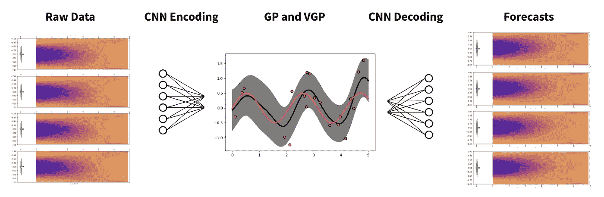
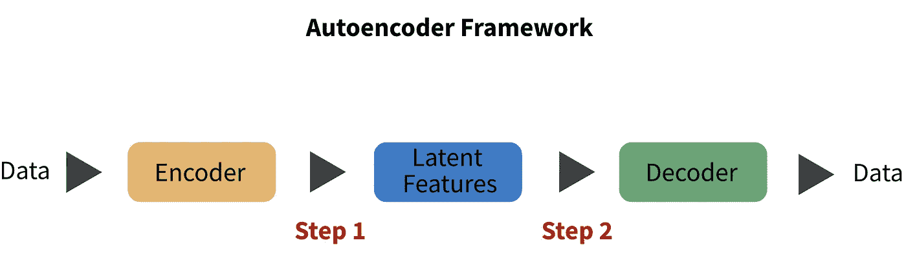
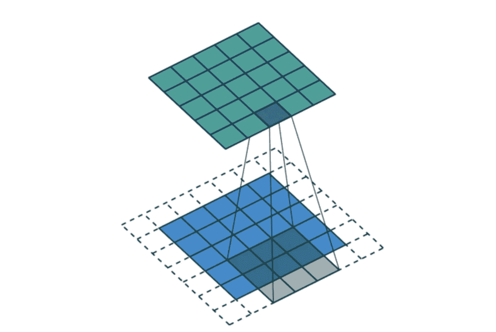
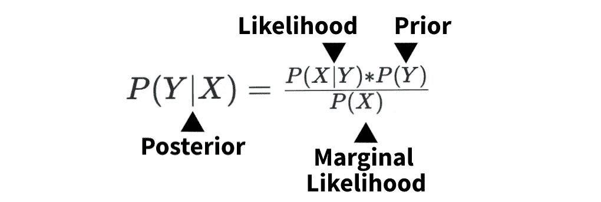
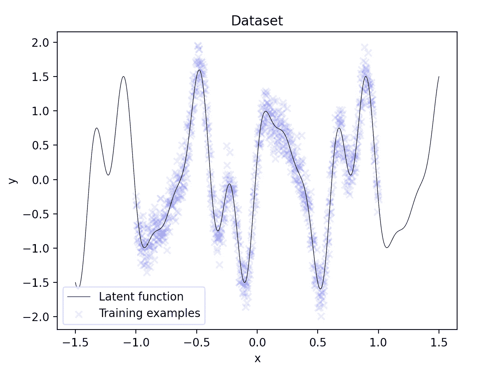
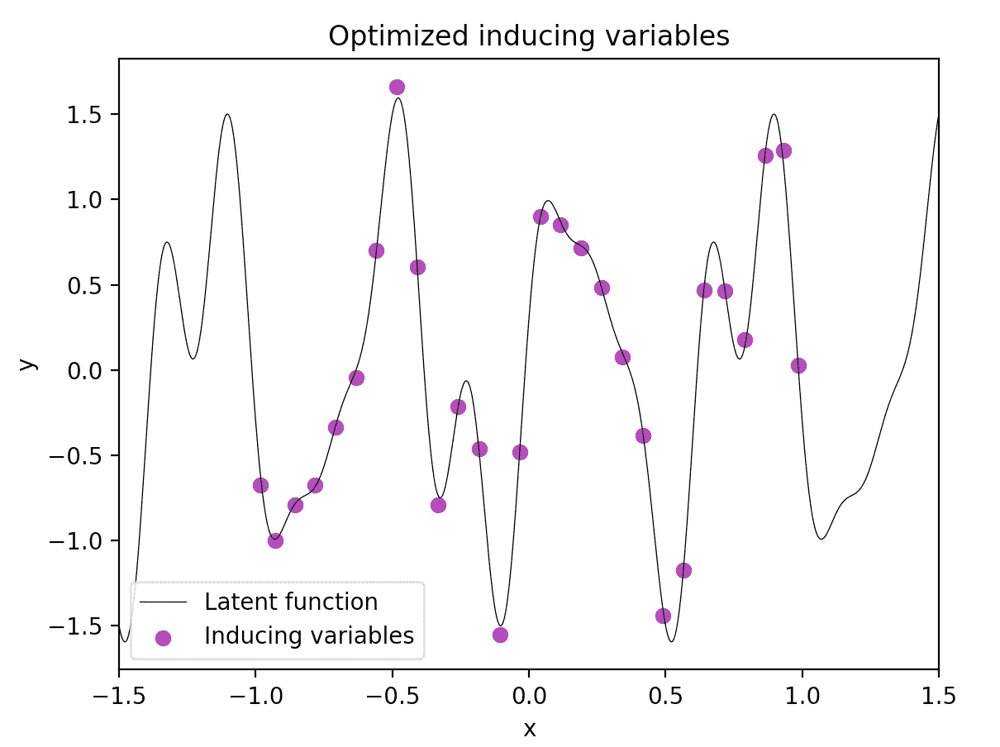
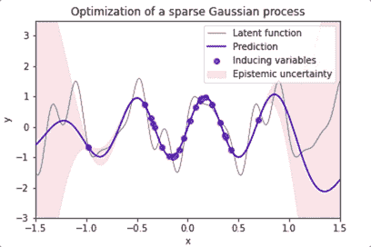

# 风力涡轮机的概率深度学习

> 原文：<https://towardsdatascience.com/probabilistic-deep-learning-for-wind-turbines-b8ea00fabe30?source=collection_archive---------28----------------------->

## 如何对大数据应用高斯过程

在大型数据集上，模型速度可能是一个决定性因素。利用实证研究，我们将着眼于两种降维技术，以及它们如何应用于高斯过程。

图 1:方法概述。CNN 是卷积神经网络，GPR/VGPR 是不同的高斯过程回归。图片作者。

关于该方法的实现，任何熟悉条件概率基础的人都可以开发高斯过程模型。然而，要充分利用框架的功能，需要相当深入的知识。高斯过程的计算效率也不是很高，但是它们的灵活性使它们成为小生境回归问题的常见选择。

事不宜迟，我们开始吧。

# 技术 TLDR

高斯过程(GPs)是非参数贝叶斯模型。对数据点之间的协方差进行建模，因此对于大于 10，000 个数据点的数据集是不切实际的。然而，他们的灵活性是无与伦比的。

为了在大型数据集上运行 GPs，我们概述了两种要素缩减方法。第一种是学习潜在特征的卷积神经网络。该论文引用了将 2501 个特征减少到 4 个，这使得该问题在计算上易于处理。在此基础上，他们利用稀疏高斯过程减少了所需的数据点数量，进一步提高了建模速度。

总体而言，高斯过程观察到最高的准确性，但是稀疏高斯过程表现出相似的准确性和更快的运行时间。

这是纸。

# 但是实际上是怎么回事呢？

让我们稍微慢下来，讨论一下特征约简方法是如何工作的。

## 1 —背景

当创建风电场时，它只是一系列的风力涡轮机，涡轮机的位置非常重要。从涡轮机折射的空气会显著影响后续涡轮机的效率。为了优化这种配置，我们求助于计算流体动力学。

由[尼古拉斯·多尔蒂](https://unsplash.com/@nrdoherty?utm_source=medium&utm_medium=referral)在 [Unsplash](https://unsplash.com?utm_source=medium&utm_medium=referral) 上拍摄的照片

大多数流体(空气、水等。)模拟依赖于经验数据和物理方程。然而，许多数据集包含大量嘈杂和复杂的数据。在我们的案例中，论文中引用的数据集是从德克萨斯州的一个风电场收集的，历时两年，包含每个涡轮机的 2501 个特征。行数没有透露。

如果我们希望开发实时优化，我们必须简化我们的数据。这就是自动编码器的用武之地。

## 2 .1 —自动编码器

自动编码器是编码器-解码器框架的一个子集，用于维护特征结构。简单来说，我们希望执行两个步骤。

图 2:自动编码器框架。关键是数据输入和输出结构是相同的。图片作者。

首先，我们将数据编码成少量的潜在变量。这些潜在变量可用于训练我们的模型，从而大幅减少训练时间。在这篇论文中，作者能够将 2501 个原始特征编码成 4 个潜在特征。

第二，**我们将那些潜在变量解码回我们数据的原始结构。**我们需要这一步，因为我们无法处理潜在变量，我们必须有真实的预测。

注意，这里我们使用自动编码器来减少特征，但是还有许多其他用例，其中一些包括[异常检测](/extreme-rare-event-classification-using-autoencoders-in-keras-a565b386f098)和[数据“清理”](/deep-inside-autoencoders-7e41f319999f)。

## 2.2—卷积自动编码器

最流行的自动编码器框架之一利用了卷积神经网络(CNN)。

图 3:卷积示例— [src](/intuitively-understanding-convolutions-for-deep-learning-1f6f42faee1) 。图片作者。

CNN 是一个简单的神经网络，其中“窗口”在数据集上重复移动。它们很受[图像分类](/convolutional-autoencoders-for-image-noise-reduction-32fce9fc1763)的欢迎，因为它们很有效，也很容易理解。然而，当扩大到二维数据之外时，CNN 仍然非常有效。

我们将 CNN 自动编码器框架应用于我们的风数据集，最终得到一个明显更小的数据集。我们现在已经准备好去适应“真实的”模型了。

## 3 —高斯概率回归

在本节中，我们将提供高斯概率(GP)模型的高级解释。该论文还实现了一个多层感知器和主动学习模型，但都显示出较低的准确性或计算效率相对于 GP 模型。

**最精确的方法——精确高斯过程**

精确高斯过程是非参数贝叶斯模型。我们从关于数据的先验假设开始，然后利用数据点之间的协方差来更新我们的先验假设。最后，根据我们的潜在特征(X ),我们得到了因变量(Y)的概率估计。这个概率也叫后验概率。

图 4:按组件分解的贝叶斯定理。图片作者。

对于我们的示例应用程序，我们希望找到在给定 4 个潜在特征的情况下观察到风力涡轮机流量的概率。图 4 中的贝叶斯定理分解了整个概率。

右侧的三个组件都可以估计，但是需要一些工程设计的主要组件是先验。

先验概率分布，通常被称为“先验”，是在查看 X 值之前，Y 变量的概率分布。为了计算这个基线，我们只需假设它是正态分布的，并使用我们的 Y 估计平均值和标准差。

对其他两个组件的评估超出了本文的范围，但是可以查看评论中一些有用的链接。

从性能的角度来看，精确的高斯过程具有时间复杂度，精确的高斯过程的时间复杂度是 [*O(n )*](http://krasserm.github.io/2020/12/12/gaussian-processes-sparse/) ，其中 *n* 是我们数据中的行数。实际上，这将我们的数据集大小限制在 [~10，000 个数据点](https://arxiv.org/abs/1903.08114) *。*下面我们概述了一种将运行时间复杂度降低到 *O(nm )* 的方法，其中 *m* 是从我们的原始数据集中提取的一组稀疏特征。

**最快的方法——稀疏高斯过程**

为了提高模型拟合的速度，作者实现了稀疏高斯过程(SGP)。

简而言之，SGP 利用一组最接近我们观察到的数据的 *m* 个数据点。然后我们可以用它们来拟合我们的模型。虽然这些精度变化高度依赖于数据集，但对于风力涡轮机数据集，4 个潜在特征中的每一个都分别表现出 7%、20%、14%和 5%的精度下降。

因此，如果这些模型的目的是实时优化，稀疏高斯过程可能是一个可靠的替代方案。

我们来快速看一下这些 *m* 数据点是怎么选出来的。不幸的是，论文中引用的数据是不公开的，所以我们将创建自己的数据。

图 5:1000 个数据点的训练集(蓝色)，大致遵循我们的潜在数据生成函数(黑色)——[src](http://krasserm.github.io/2020/12/12/gaussian-processes-sparse/)。图片作者。

在上面的图 5 中，我们可以看到用蓝色 X 表示的训练数据。这些是使用潜在函数(黑色实线)和一些随机噪声生成的。在 1000 个训练点中，我们的目标是估计出最接近我们训练数据的 *m=30* 个点。

通过仅拟合 30 个点，我们希望在不牺牲准确性的情况下显著降低运行时间的复杂性。最佳的 30 个点如下图 6 所示。

图 6:m = 30 时的最佳诱导变量— [src](http://krasserm.github.io/2020/12/12/gaussian-processes-sparse/) 。图片作者。

在不太专业的情况下，我们希望用平均值和协方差来描述我们的 *m* 数据点。在找到每个的最佳值后，我们可以从正态分布 *N(mean_m，cov_m)* 中采样 30 个数据点。如果你想深入了解，这里有一个[极好的资源](http://krasserm.github.io/2020/12/12/gaussian-processes-sparse/)。

现在我们有了更少的数据点，我们可以更快地拟合我们的模型，而不会牺牲太多的准确性。

最后，这里有一个优化过程的有趣动画。

图 7:稀疏高斯过程优化的动画— [src](http://krasserm.github.io/2020/12/12/gaussian-processes-sparse/) 。图片作者。

这就是你所知道的 GPs 的高层次概述，以及如何将它们应用于 CNN 衍生的潜在特征。

# 摘要

在这篇文章中，我们讨论了如何简化计算复杂的模型。我们首先使用卷积神经网络来寻找减少数据集中列数的潜在特征。我们还拟合了一个稀疏高斯过程来减少数据集中的行数。

精确高斯过程表现出最高的准确性，但是在需要实时优化的情况下，稀疏选项可能更好。

*感谢阅读！我会再写 29 篇文章，把学术研究带到 DS 行业。查看我的评论，链接到这篇文章的主要来源和一些有用的资源。*