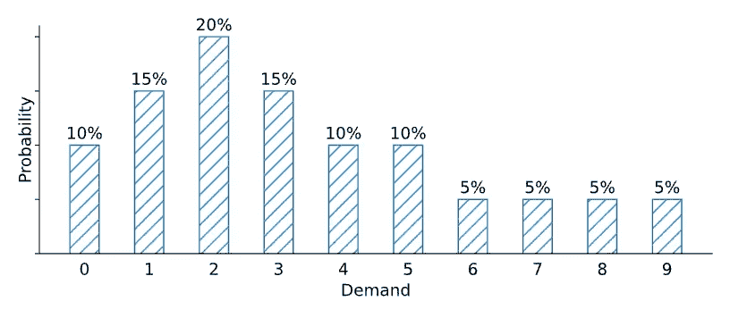
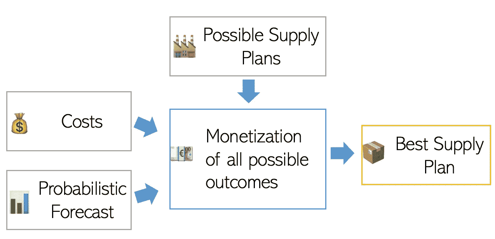
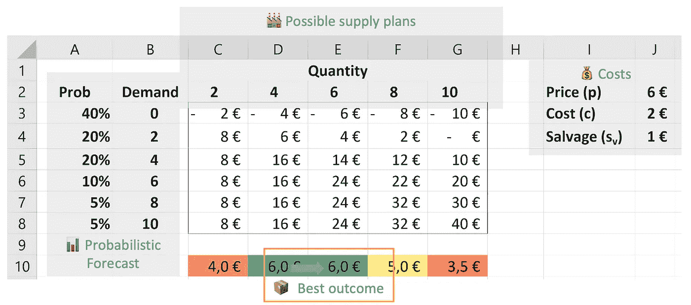

# 概率预测和库存优化

> 原文：<https://towardsdatascience.com/probabilistic-forecasting-and-inventory-optimization-70edbb8f4a81?source=collection_archive---------14----------------------->

## 预测只能帮助你做出正确的供应链决策。

在接下来的 1000 个单词中，我将向你展示**为什么点预测不足以**做出供应决策。相反，你会明白为什么**你需要概率预测来做出明智的决定**。

先说个例子；我们以后再讨论理论。

# 基于需求预测的运营决策

你在经营一家面包店。每天清晨，你需要决定一天要烤多少。作为面包店经理，这是你需要做出的最重要的经营决策。你需要每天都这样做。

让我们假设你预测你今天要卖 10 块面包。你应该烤多少个？

credit:[https://en . Wikipedia . org/wiki/Bakery #/media/File:magasindandoy . jpg](https://en.wikipedia.org/wiki/Bakery#/media/File:MagasinDandoy.jpg)

好吧，如果你花两分钟思考这个[库存优化](/a-framework-for-inventory-optimization-71d4496aec75)问题，你会意识到你错过了大部分拼图。

*   烤一个面包要花多少钱？
*   每块面包的利润是多少？
*   面包日常**需求分布**是什么？

*(为了简洁起见，我们将提前期的问题排除在本文之外)*

## 成本/盈利能力影响

让我们想象一下，烤一个面包要花 0.5€，而你每个要卖 1.5€。基于这一信息，看起来你最好多拿几块面包(0.5€的生产成本)，而不是少拿几块(1€的机会成本)。

但是，我们仍然不知道我们应该烤多少个面包:15 个？20?45?

> 产品的利润越高，成本越低，你应该储存的就越多(因为风险低，回报高)。为了评估[你需要多少库存](https://www.amazon.com/Inventory-Optimization-Simulations-Nicolas-Vandeput/dp/3110673940)，很好地理解你的[成本结构](/a-framework-for-inventory-optimization-71d4496aec75)和很好地理解你的需求一样重要。
> 
> 实际上，面包师讨厌扔掉食物。所以，他们通常计划生产没有剩菜。我们可以在我们的模型中包括这种剩余厌恶，作为当有任何[过剩库存](/a-framework-for-inventory-optimization-71d4496aec75)时产生的额外惩罚。

## 概率预测和需求分布

你所缺少的做出正确决定的信息是某一天可能发生的事情的概率视图。

我们需要知道一天卖出 1、2、3–25 块面包的概率。然后我们可以利用这些信息将每一种可能的供应情况货币化(*如果我烤 X 片面包会发生什么？*)。选择我们最喜欢的一个。

> 看看周一的预期需求分布和我的成本，我会烤 15 个面包来最大化我的预期利润。

让我们看看这个理论，以了解我们将如何使用概率预测来优化我们的(库存)决策。

# 点预测与概率预测

*   **点预测**:将未来与单一预期结果联系起来，通常是一个平均预期值(不要与*最有可能*结果混淆)。我们预测下个月会卖出 1000 件。
*   **概率预测**:分配不同事件发生的概率。示例见下图。

概率预测的例子。版权所有:尼古拉斯·范德普特

自然，我们生活在一个随机的世界里，概率预测比点预测更有意义。我们永远无法对未来有绝对的把握。因此，我们今天应该根据一系列可能的未来和它们各自的可能性来下注。扑克玩家非常了解这一点。

*   **举例**。没有人会预测掷骰子的结果是 3.5(平均期望值)。相反，我们明白我们有 1/6 的机会得到 1 到 6 的任何结果。

供应链需求也是如此。对我们的面包的需求可能是 10，但也可能是 5 或 15。重要的是估计所有这些值的可能性。

# 概率预测和库存优化

让我们概述一下你应该如何使用概率预测来优化你的(库存)决策。

如何优化供应(库存)决策。版权所有尼古拉斯·范德普特

1.  生成需求概率预测(显示获得特定需求金额的可能性百分比)。
2.  列出可能的供应计划(*供应多少？*)。供应约束— —比如批量——可能会限制可能情况的数量。
3.  根据所有可能的结果，给每个场景一个期望值(根据发生的可能性进行加权)。
4.  选择你最喜欢的场景。

供应决策优化。版权所有:尼古拉斯·范德普特

## 报童与多阶段计划

你们中的一些人可能已经意识到前面例子中常见的[报童问题](https://www.amazon.com/Inventory-Optimization-Simulations-Nicolas-Vandeput/dp/3110673916)。事实上，为了简洁起见，我们将(随机)交付周期的问题排除在外。然而，如果我们这样描述，故事还是一样的:

> 你是供应计划员。您的主要供应商向您报价 3 个月的交付周期，而您每月都下订单。您目前有 100 件存货。你知道未来几个月的供应计划(新订单)以及未来 6 个月的概率预测。你应该订购多少？

实际上，我在这里解释这个案例:

</how-long-should-the-forecast-horizon-be-2f24a6005b89>  

# 结论:应该用概率预测吗？

当涉及决策时，人们对点位预测不感兴趣。

*你预测下个月销售 1000 件，但这对确定你应该生产多少帮助有限。*

相反，结合相关财务信息的概率预测将让你做出最佳决策。

*你估计下个月的需求分布。你知道你的利润和成本。你可以做出明智的决定，购买多少来优化你的成本。*

## 👉[我们在 LinkedIn 上连线吧！](https://www.linkedin.com/in/vandeputnicolas/)

# 感谢

迈克尔·吉利兰

# 关于作者

icolas Vandeput 是一名供应链数据科学家，擅长需求预测和库存优化。他在 2016 年创立了自己的咨询公司 [SupChains](http://www.supchains.com/) ，并在 2018 年共同创立了 [SKU 科学](https://bit.ly/3ozydFN)——一个快速、简单、实惠的需求预测平台。尼古拉斯对教育充满热情，他既是一个狂热的学习者，也喜欢在大学教学:自 2014 年以来，他一直在比利时布鲁塞尔为硕士学生教授预测和库存优化。自 2020 年以来，他还在法国巴黎的 CentraleSupelec 教授这两门课程。他于 2018 年出版了 [*供应链预测的数据科学*](https://www.amazon.com/Data-Science-Supply-Chain-Forecasting/dp/3110671107)(2021 年第 2 版)和 2020 年出版了 [*库存优化:模型与模拟*](https://www.amazon.com/Inventory-Optimization-Simulations-Nicolas-Vandeput/dp/3110673916) 。

