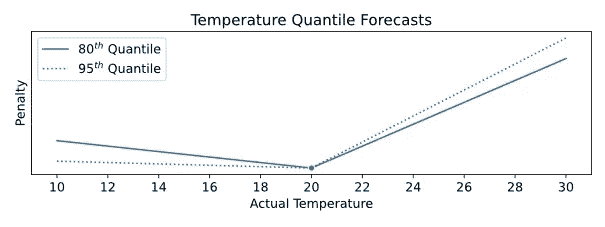
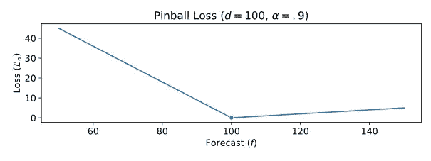
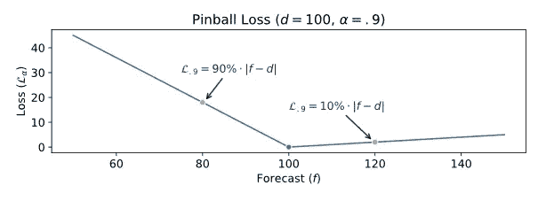
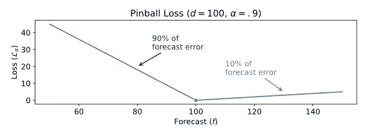
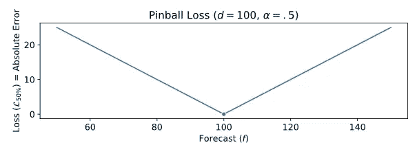

# 概率预测:弹球损失函数

> 原文：<https://towardsdatascience.com/probabilistic-forecasts-pinball-loss-function-baf86a5a14d0?source=collection_archive---------10----------------------->

## 概率预测对于优化供应链和库存目标至关重要。我们如何评估概率预测的质量？


[信用](https://www.piqsels.com/en/public-domain-photo-frhpg)

# 自我评估测验

先问几个问题。在阅读文章之前，先阅读它们*。在你阅读结束时，你应该能够回答这些问题。(答案在最后提供**以及一个 Python 实现**)*

1.  你想预测你的产品的需求。具体来说，您希望预测一个需求有 80%概率低于的值。高估或低估实际需求，哪种情况最糟糕？
2.  您设计了一个减少绝对误差(或 MAE)的预测模型。你的模型的目标是平均需求还是中间需求？
3.  您做了一个 95%分位数的需求预测，您的预测是 150，而观察到的需求是 120。你如何评估你的预测质量？
4.  你销售高利润的产品。最糟糕的是什么:库存过多还是不足？设置安全库存目标时，您应该以高需求分位数还是低需求分位数为目标？

[](/probabilistic-forecasting-and-inventory-optimization-70edbb8f4a81) [## 概率预测和库存优化

### 预测只能帮助你做出正确的供应链决策。

towardsdatascience.com](/probabilistic-forecasting-and-inventory-optimization-70edbb8f4a81) 

# 分位数预测

分位数预测是针对特定需求分位数(或百分点)的概率预测。

**定义:分位数**

分位数α (α是一个百分比，0

```
P(x<=Quantile) = α
```

In other words, the quantile is the distribution’s cumulative distribution function evaluated at α.

```
Quantile α = F^{-1}(α)
```

In simple words, if you do an 80% quantile forecast of tomorrow’s weather, you would say, “There is an 80% probability that the temperature will be 20°C or lower.”

> **边注:**如果你习惯于库存优化和通常的安全库存公式
> 
> Ss = z * σ * √(R+L)
> 
> *z* 是高斯α分位数 z=φ^(-1(α)。不知何故，您可以将安全库存公式视为风险范围内需求的α分位数预测。
> PS:记住[在这个公式中包含评审期](https://www.linkedin.com/posts/vandeputnicolas_inventorymanagement-inventorycontrol-inventoryoptimization-activity-6828222160515997696-I1Ca)。

# 不对称处罚

我们如何评估分位数预测的准确性？让我们再看一下上面的例子:你预测明天的第 80 个温度分位数是 20 摄氏度。第二天，温度是 16 摄氏度。

你的预测有多准确？

在讨论数学之前，让我们直观地了解一下应该如何评估(或惩罚)分位数预测。不知何故，当我们说，“我们预测温度有 80%的机会低于 20 摄氏度”，我们预计温度会低于 20 摄氏度，并会惊讶地发现温度会是 25 摄氏度。

换句话说，如果分位数预测低估了气温，那么它应该比高估气温受到更高的惩罚。



来源:[尼古拉斯·范德普特](https://supchains.com/)

此外，如上图所示，对于更高的分位数，过度预测的惩罚应该更高。例如，如果你的 95%温度分位数预测是 20 摄氏度，如果实际温度是 25 摄氏度，你会*非常*惊讶

# 弹球损失函数

让我们使用**弹球损失函数**(或者分位数损失函数)来形式化这个预测惩罚。

弹球损失函数 *L_α* 针对分位数α、分位数预测 *f、*和需求 *d* 计算如下

```
L_α (d,f) = (d-f) α    if d≥f
            (f-d)(1-α) if f>d
```

该损失函数旨在提供一个预测，其低估需求的概率为α，高估需求的概率为(α-1)。

## 直觉和例子

让我们看看弹球函数在实践中是如何工作的。在下图中，您可以看到一个例子，其中 d=100，α=90%(我们希望预测需求的第 90 个分位数)，弹球损失函数 *L_α* 是针对不同的 *f* 值计算的。



来源:[尼古拉斯·范德普特](https://www.amazon.com/Nicolas-Vandeput/e/B07KL86HMV)

正如你所看到的，弹球损失 *L_α* 是高度不对称的:如果你超过预测(低惩罚)或低于预测(高惩罚)，它不会以相同的速度增加。

我们举个例子:多预测 20 台会造成 10%|f-d|=2 的损失(也就是说多预测并没有太大的惩罚)。但是，另一方面，少预测 20 个单位将导致 90%的损失|f-d|=18。



来源:尼古拉斯·范德普特

基本上，预测不足会受到α|e|(其中 e 是预测误差)的惩罚，而预测过度则会受到(1-α)|e|的惩罚。



来源:[尼古拉斯·范德普特](https://www.skuscience.com/)

## 绝对平均误差

在我的[预测 KPI 文章](/forecast-kpi-rmse-mae-mape-bias-cdc5703d242d)中，我强调了优化预测平均绝对误差(MAE)的最终目的是预测中值需求。

[](/forecast-kpi-how-to-assess-the-accuracy-of-a-product-portfolio-bc38135a6d2a) [## 预测 KPI:如何评估产品组合的准确性？

### 当您处理数千个 SKU 时，如何评估预测的准确性？

towardsdatascience.com](/forecast-kpi-how-to-assess-the-accuracy-of-a-product-portfolio-bc38135a6d2a) 

如下图所示，50%分位数弹球损失函数对应于*常规*绝对误差——它们是可以互换的。请记住，根据定义，预测 50%的需求分位数与预测需求中位数是一样的。这是另一个例子，说明优化 MAE 将导致针对需求中值的预测(和*而不是*需求平均值)。



📘📙[下载免费摘录](https://supchains.com/downloads/)

# 自我评估解决方案

1.  你想预测你的产品的需求。具体来说，您希望预测一个需求有 80%概率低于的值。高估或低估实际需求，哪种情况最糟糕？

> 低估需求是最糟糕的。如果您想要预测第 80 个分位数，您应该以可能高于观察值的值为目标。

2.您设计了一个减少绝对误差(或 MAE)的预测模型。你的模型的目标是平均需求还是中间需求？

> 优化平均绝对误差将最终导致预测预期中值需求，而不是预期平均需求。

3.您做了一个 95%分位数的需求预测，您的预测是 150，而观察到的需求是 120。你如何评估你的预测质量？

> 您可以计算分位数预测的弹球损失。您的预测有 30 个单位的绝对误差(= | 150–120 |)，这是一个过度预测，因此您的弹球损失是 1.5 个单位(=30*0.05%)。

4.你销售高利润的产品。最糟糕的是什么:库存过多还是不足？设置安全库存目标时，您应该以高需求分位数还是低需求分位数为目标？

> 你想拥有大量高利润产品的库存，所以库存不足是一个糟糕的决定。从今以后，在设定股票目标时，你应该瞄准一个高需求分位数。

# 🐍自己做

您可以很容易地在 Python 中用一个表达式实现弹球损失函数(与原始方程相比有一些修改)。

```
**def** **pinball_loss**(d, f, alpha):**return** max(alpha*(d-f), (1-alpha)*(f-d))
```