# 线性回归的概率解释解释清楚

> 原文：<https://towardsdatascience.com/probabilistic-interpretation-of-linear-regression-clearly-explained-d3b9ba26823b?source=collection_archive---------6----------------------->

## 最小二乘法背后的原因

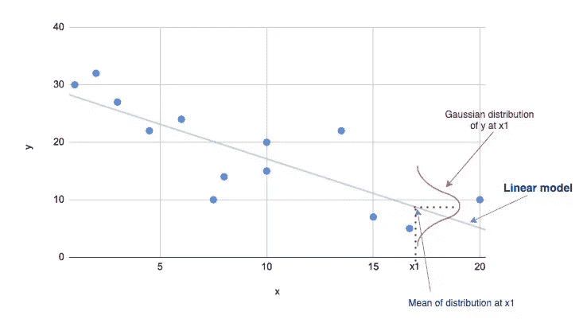

作者图片

首先简单介绍一下线性回归:

**线性回归是寻找最适合给定数据集的线性模型。**

例如，在具有一个输入变量(即一个特征)的简单线性回归中，线性模型是一条具有公式`y = mx + b`的直线，其中`m`是斜率，`b`是 y 截距。

**最佳拟合的线性模型是最小化误差平方和的模型。**

如下图所示，误差是观察值和预测值之间的差异。

作者图片

附:查看这篇介绍线性回归和梯度下降的文章。

 [## 绝对初学者的线性回归和梯度下降

### 梯度下降的简单解释和实现

towardsdatascience.com](/linear-regression-and-gradient-descent-for-absolute-beginners-eef9574eadb0) 

因此，我们知道最佳模型是误差平方和最小的模型。但是为什么呢？为什么平方误差？为什么不是误差的绝对值？

这就是概率解释的用武之地。

概率解释让我们了解为什么我们最小化误差平方和。

在我们继续进行概率解释之前，让我们首先在一些术语上取得一致。

首先，我们用`θ`来象征线性模型的参数。让我们用 h(x)来表示模型。模型是 x 的函数，由`θ`参数化。

在只有一个特征的简单线性回归中，h(x)可以写成:

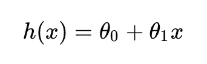

简单线性回归

这里，θ_ 0 是 y 轴截距，θ_ 1 是斜率。

有了“n”个特性，它就变成了:

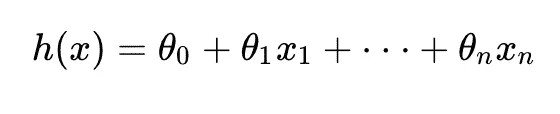

使用线性代数技术，我们可以将所有的θ放入一个向量中，并将输入值放入另一个向量中。因此，h(x)成为这两个向量的乘积。

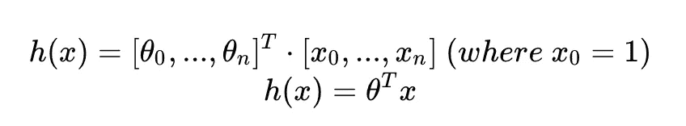

根据模型，第*个*训练样本的估计为:

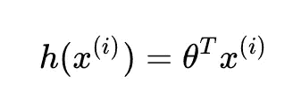

训练样本 I 的模型估计

现在，让我们继续线性回归的概率解释，以及为什么我们使用最小二乘法。

# 线性回归的概率解释

线性回归有两个假设。

1.  对于给定的 x，y 的观测值是预测值加上误差项。

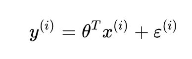

实际 y 是预测值加上误差项

这个误差项是“残差”，或观测值减去预测值。记住，在线性回归中，我们希望最小化误差平方和。

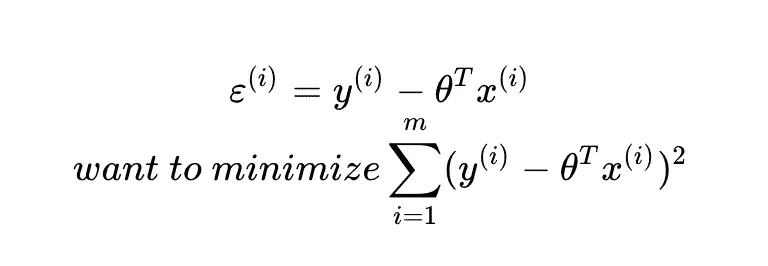

线性回归的目标是最小化误差平方和

2.该误差项独立同分布(IDD)。它具有均值为 0 且方差为 sigma 平方的正态(即高斯)分布。

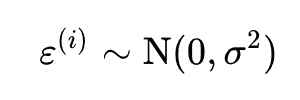

误差项正态分布，均值为 0，方差为 sigma 平方

因为ε(I)具有正态分布，所以ε的概率密度函数可以写成:

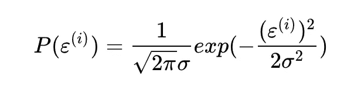

由于ε是 x 和 y 的函数，我们可以将等式改写为:

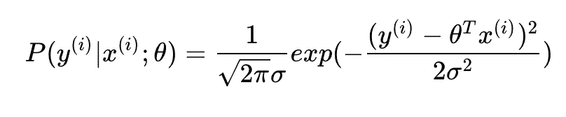

观察第 I 个训练样本的概率

请注意，如果观察值和预测值接近，则方程的指数部分接近 1。如果观察值和预测值相差很远，指数部分接近 0。因此，如果观察值和预测值相差甚远，概率就会降低。

这进一步意味着，对于由θ参数化的给定 x，y 具有θ转置乘以 x 的平均值和σ平方的方差。

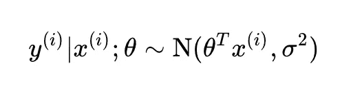

下面是给定 x 的 y 的直观表示:

作者图片

我们有一个训练样本的概率。整个数据集的概率呢？

如果我们假设样本是独立的，根据统计:

`P(A and B) = P(A) * P(B)`。

概括一下，我们有:

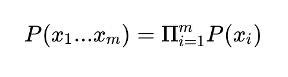

因此，整个数据集的概率是所有单个样本的概率的乘积。

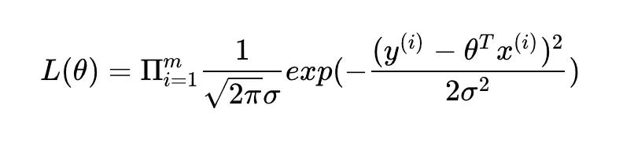

这个等式被称为“参数θ的可能性”。可能性越大，观察到提供给模型的数据集的概率就越高。概率越大，模型越准确。

学习算法所做的就是最大化这种可能性。这被称为最大似然估计，或 MLE。

为了使数学更简单，让我们取可能性的对数。

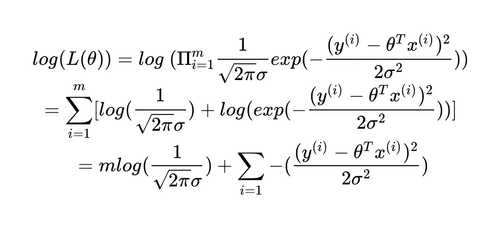

第一项没有θ，所以在估算θ时，它是不相关的。在第二项中，sigma 是一个常数，所以我们可以去掉它。注意第二项中的负号。让我们去掉负号。最大化似然性等同于最小化最大似然性的负值。

进一步简化对数(可能性)，您会得到:

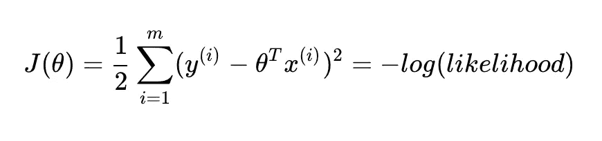

成本函数是对数似然的负数

这个方程和线性回归中的代价函数完全一样，是误差平方和的 1/2 倍。

最后，最小化误差平方和等于最大化数据集的概率。

因此，这就是为什么我们使用平方误差进行线性回归。平方部分来自具有高斯分布的误差项。