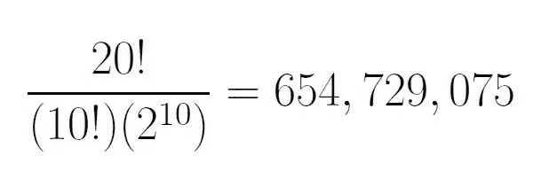
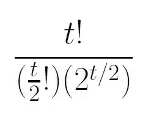
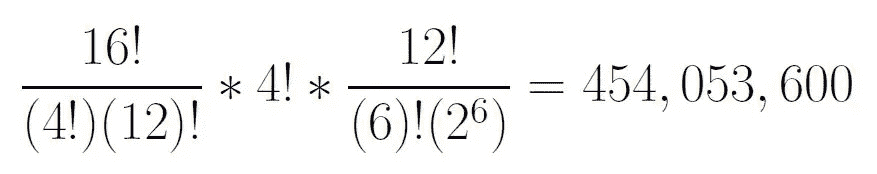
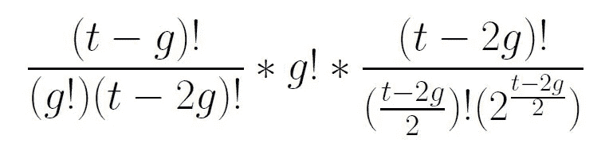
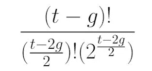
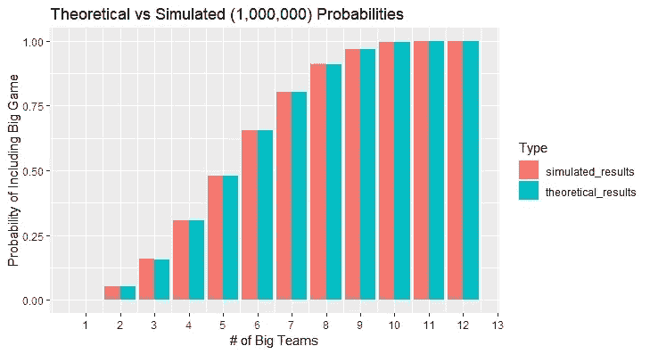
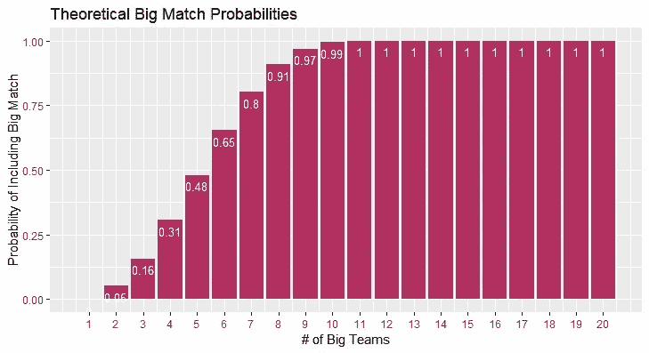

# 概率英超联赛赛程

> 原文：<https://towardsdatascience.com/probabilistic-premier-league-fixtures-9f432976dfc1?source=collection_archive---------52----------------------->

## 这个周末的赛程会有一场轰动的比赛吗？

狂热的足球迷喜欢观看英格兰超级联赛的比赛，这可以说是世界上最好的国内足球(或者对英国读者来说，足球)联赛。但是一个中立的观众可能只喜欢看两支著名的精英球队之间的比赛。一个人多久能看一次这些轰动的游戏？

要回答这个问题，需要对英超联赛的赛程系统做一个简要的概述。每个周末，或比赛日，英超联赛的 20 个俱乐部之间会有 10 场比赛。虽然一些比赛日发生在周中，尤其是在旺季，但为了简单起见，我们将在本文中使用比赛日和周末作为可互换的术语。

在我的童年时期(2000 年代)，英超联赛总共有 20 支球队，其中有 4 支强队:曼联、切尔西、利物浦和阿森纳。包含“大型”比赛的比赛日似乎很少。

如今，有六家顶级俱乐部:上面列出的四家，加上热刺和曼城。只有两个额外的精英队，似乎有更多的周末包括至少一场轰动的比赛。这准确吗？确切地说，现在这种情况比以前多了多少？

在一个温和的假设下，我们可以利用概率论来评估周末有大型比赛的可能性。

假设所有灯具组合(定义如下)的可能性相同。虽然可以想象，制定赛程安排表的管理机构通过“分散”大型比赛来确保尽可能多的周末包括大型比赛，但我认为这不太可能，因为赛程安排者必须记住许多其他因素。一个赛季有许多比赛，每个俱乐部都要参加多项比赛，这些比赛必须协调一致，以免发生冲突，此外，球员必须在必要时可以参加国家队的比赛。

有了合理的基本假设，我们就可以继续研究概率了。在下文中,“赛程组合”或“赛程列表”指的是 20 支球队之间的 10 场比赛，包括整个比赛日。

我们的策略将是评估有多少种比赛组合是可能的，以及有多少种组合不包括轰动性的比赛。这个商将给我们一个周末没有大型比赛的概率。这个的补数(这个概率从 1 中减去)将给出一个比赛日包括至少一场精英赛的概率。

我们如何计算可能的夹具组合的数量？我们设想一个包含所有 20 个团队的列表，并重新排列这些团队在列表中出现的顺序。然后列出的每一对连续的队伍被认为是在互相比赛。这样得出 20！= (20) * (19) * … * (2) * (1)，既然第一个位置的队伍有二十个选项，那么第二个位置有 19 个选项，以此类推。

但是上述计算在两个方面出现了过度计算:

1)它将具有相同 10 个配对但顺序不同的两个夹具列表视为不同的夹具列表，这对于我们的目的来说是不准确的。对于任何夹具清单，有 10 个！安排配对顺序的方法。因为每个夹具列表出现 10 个！20 种不同的方式！组合夹具，一定要分 20 个！10 点前。。

2)我们可以用两种方式安排每个配对:1 队对 2 队，或者 2 队对 1 队。20！计算将这两个装置视为不同的，这是不准确的。因此，我们将每个配对的可能夹具组合增加了一倍，达到 10 对。因此，我们必须除以 2 的十倍。

总之，我们可能的比赛日赛程总数是:



作者图片

一般来说，对于 t 个团队，可能的固定装置数量为:



作者图片

上面的公式假设 t 是一个偶数，世界上大多数联赛都是这样。

如果有 4 支大球队，上述可能的赛程组合中有多少不包括大赛？

为了计算这一点，我们设想 4 个地点，与 4 个顶级俱乐部“相对”，表明 16 个较小的球队中的哪 4 个将与大球队比赛。(如果两个大球队互相比赛，那么这样的赛程列表包含了一场大赛，我们现在不统计这样的赛程列表。)有 16 种选择 4 种方式来选择将与大球队比赛的 4 支球队。(16 选 4 是 16 的数学术语！/(4!*12!).我们还必须记住，每选择 4 个较小的队与大队比赛，较小的队可以安排在 4 个！方法，决定每个小团队和哪个大团队比赛。所以我们乘以 4！。然后，我们乘以我们可以在剩余的 12 支小球队之间安排 6 场比赛的方法的数量。

这最后一个计算遵循上面 20 个团队计算的模板，得出:12！/((6)!)*(2⁶)).

把所有这些放在一起，不包含大型比赛的可能的比赛组合的数量是:



作者图片

一般来说，对于 t 队和 g 队来说，不包含大型比赛的可能赛程列表的数量是:



作者图片

取消后，我们得到以下不包含大型比赛的所有可能赛程列表的公式:



作者图片

上述公式假设 g 小于或等于 t/2。如果 g 大于 t/2，这个公式就不能给出明确的答案。这对应了一个事实，如果 g 大于 t/2，那么一个不包含大赛的赛程列表是不可能的。

为了解释为什么这是真的，考虑一个 20 支球队的联盟中的 11 支(或更多)大球队。在任何一个比赛日，一场大赛都是必然的，因为那时只有 20-11 = 9 支小球队，不足以和所有 11 支强队比赛。每个比赛日至少会有两个大队互相比赛。

用我们上面的 20 支球队的联赛中 4 支大球队的公式，我们计算出一个周末没有大型比赛的概率是 454，053，600/654，729，075 = 0.6934985，或 69.35%的几率。

这使得周末至少有一场大型比赛的概率为 1–0.6934985 = 0.3065015 = 30.65%。

我们使用以下 R 代码获得我们的结果:

```
#Calculate the probability of having at least one big game on a #matchday.prob_of_good = function(t,g){#t total #teams, g good teams
  stopifnot(t%%2==0) #t must be even
  if(g>t/2){ 
    return(1) #since impossible to have no good game
  }
  else{
    #fixture lists with no good games
    negative = factorial(t-g)/(factorial((t-2*g)/2)*2^((t-2*g)/2))
    #total fixture lists
    total = factorial(t)/(factorial(t/2)*2^(t/2))

    #probability of at least one good game
    pos = 1-(negative/total)

    return (pos)
  }
}prob_of_good(20,4)
```

因此，对于一个总共有 t = 20 支球队的联盟中的 g = 4 支好球队，如 2000 年的英超联赛，包括两支精英球队之间至少一场比赛的比赛日的概率是 30.65%。

为了对我们的结果有信心，我们还将通过创建一个由 1 和 0 组成的列表来模拟这个问题，1 表示知名的团队，0 表示较小的团队。然后我们排列这个列表，产生一个比赛列表，并认为每一个连续的配对都是这两个队之间的比赛。然后，我们计算有多少排列包含至少一个两个一的配对，表明两个大队之间的比赛。

```
#simulation
simulate = function(t,g){#t total teams, g good teams 
  ones = rep(1,g)
  zeros = rep(0,t-g)

  list = c(ones,zeros) #produce list of g ones, for big teams and  #t-g zeros for smaller teams
  perm =  sample(list,length(list)) #permute the list

  for (i in 1:(t/2)){
    if(sum(perm[(2*i-1):(2*i)])==2){#If a pairing contains two ones, #for two big teams, return 1,
      return (1) # for big match occurring
    }}
  return(0) # If no pairing contains two ones, return 0, for no big #match occurring.
}#many simulations
mult_sim = function(t,g,k){#k simulations
  results = rep(0,k)
  for (i in 1:k){
    results[i] = simulate(t,g)
  }
  return(mean(results)) #return proportion of fixture lists which          #contain at least one big game
}}set.seed(41)
simulated_results = rep(20,0)for (i in 1:20){
  simulated_results[i] = mult_sim(20,i,1000000)
}
```

模拟 1，000，000 次，我们得到的概率为 30.70%，非常接近我们的理论概率 30.65%

当有 6 支顶级球队时，包括一场精彩比赛在内的比赛日的概率如何，就像目前英超联赛的情况一样？

对于 g = 6，重新运行我们的公式，我们获得了 65.33%的概率，是先前结果的两倍多。运行 1，000，000 次模拟产生 65.32%的概率，几乎与我们的理论概率相同。

为了评估我们的模拟结果(每次 1，000，000 次模拟)是否与我们的理论结果相匹配，我们现在将它们并排绘制，跨越 20 支球队联盟中优秀球队数量的各种输入。



理论概率与模拟概率(图片由作者提供)

我们可以看到，我们的模拟结果与我们的理论结果非常吻合，这让我们相信我们的计算是准确的。

我们也看到，正如预期的那样，只有 1 个大团队，不可能有大游戏，我们定义为 **2 个**大团队之间的游戏。我们重申，有 11 支(或更多)强队，任何比赛日都会有一场大赛。

在确认了我们的结果的准确性之后，我们现在提供一个更详细的图表，描述在任何给定的比赛日看到一场“大型”比赛的理论概率，对于一个由 20 支球队组成的联盟中不同数量的好球队。



重大比赛在特定比赛日发生的理论概率(图片由作者提供)

也许令人惊讶的是，仅增加两支额外的精英球队，就使在特定比赛日看到至少一场精彩比赛的概率增加了一倍多，从 30.65%增加到 65.33%。再添一支精英球队(可能是莱斯特城？)将使大团队的数量增加到 7 个，并将上述概率进一步提高到 80.19%。

虽然人们可能喜欢也可能不喜欢新球队的进步和崛起，但对于中立的观众来说，这无疑是个好消息。

下一次，(在 G-d 的帮助下)，我们将通过评估英超联赛历史上的真实比赛来评估这种概率分析，以及我们随机比赛的基本模型，是否是英超联赛比赛的准确模型。