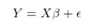
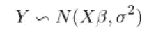
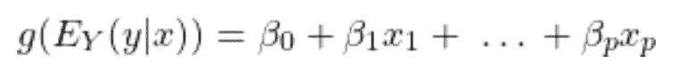
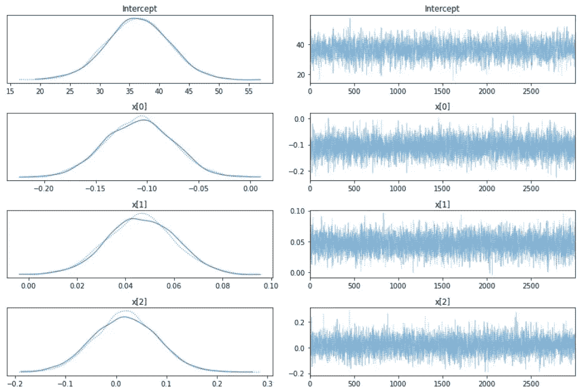

# 概率规划:广义线性模型

> 原文：<https://towardsdatascience.com/probabilistic-programming-generalized-linear-models-b180ac8cfa7e?source=collection_archive---------17----------------------->

## 一种替代的、分布优先的数据建模方法。


在 [Unsplash](https://unsplash.com?utm_source=medium&utm_medium=referral) 上由 [Carlos Muza](https://unsplash.com/@kmuza?utm_source=medium&utm_medium=referral) 拍摄的照片

# **什么是概率编程**

世界存在不确定性。数据科学家的目标是尝试使用过去的数据对世界进行建模，以有效地预测未来。这种策略在许多不同的领域和用例中相对有效。但是，这种不确定性还是存在的。预测未来的结果并理解该模型有多“好”将是有益的。

概率编程已经存在了一段时间，超过十年了。然而，许多人可能以前没有见过、使用过，甚至没有听说过它。那是什么呢？基本上，这是一种根据概率建立模型的方法。然而，它显然不适合那些希望自己的结果是概率性的人。

概率编程是一种将编程框架与贝叶斯统计建模、推理算法和机器学习元素相结合的范式。此外，它基于贝叶斯推理方法。这与大多数模型遵循的常见频率主义方法形成对比。幸运的是，这个帖子不需要每个推理系统之间的细微差别。

## 结构

概率规划有许多不同的选择。

*   ' STAN '在 R 中用' RStan '和 Python 中用' PyStan '得到了很好的支持。框架已经建立。
*   Pyro 是深度概率模型，有 PyTorch 后端。它由优步工程部开发和维护。
*   “TensorFlow Probability”是用 TensorFlow 构建的，由谷歌提供支持。
*   PyMC3 是一个用于概率编程的 python API。

例如，利用概率规划，线性回归被转换成多个分布的组合。起初，这种改变似乎有些矫枉过正。

为什么一切都要用概率来表示？

首先，当术语被概率性地定义时，你就有了从统计学角度理解模型的工具。例如，线性回归的原始公式可以写成



线性回归

其中 Y 是我们要预测的产量，X 是我们的独立数据；系数用β定义，误差项用ϵ.定义对于标准线性回归，误差项被假定为正态分布。

使用概率方法，模型用概率分布来表示。



概率线性回归

这意味着假设数据遵循正态分布。因此，模型的输出是具有分布σ方差的线性模型的平均值。

在线性回归的第二个公式中，术语被定义为概率。这个公式意味着权重被表示为分布，并且您可以测量β的不同值的可能性。因此，例如，当数据较少时，这些权重更不确定。但值得注意的是，这种不确定性在模型中得到了体现。

# **广义线性模型**

线性回归是几个变量和权重的总和，后跟一个误差项。假设该误差项来自高斯分布。

然而，正如您可能已经考虑到的，误差项不需要遵循高斯分布。

在广义线性模型中，分布不必是高斯分布。此外，虽然这些模型中的项总是线性相加的，但是非线性函数也可以应用于线性项。这两个原因导致了“广义”线性模型的出现。

## 制定

当结果不是线性时，这些性质是有益的。例如，逻辑回归是一个线性模型。然而，对于逻辑回归，线性项通过逻辑函数传递。该模型还假设伯努利分布来产生最终的二元结果。

GLMs 的配方反映了这些特性:



广义线性模型公式(作者照片)

在这个公式中，g 被认为是一个可以是非线性的“连接”函数。E 项代表来自指数分布族的分布。这最后一个短语是为了确保公式是通用的。指数族由许多由一组参数定义的不同分布组成。例如，正态分布在指数族中。

正如您可能已经确定的那样，广义线性模型涉及到对底层数据分布的良好理解，非常适合概率编程。

# **Python 中的概率编程**

在 Python 中，一个名为 PyMC3 的概率编程包允许用户使用各种数值模型来拟合贝叶斯模型。用 PyMC3 进行概率编程适用于广泛的问题。重要的是，该功能包括汇总输出和模型诊断。

PyMC3 有许多不同的教程和所有可用功能的演练。这些例子为许多不同的概率定义的模型提供了一些快速的开始。PyMC3 包括许多不同的模型、分析和方法，如自回归模型、生存分析、标准化流、马尔可夫链蒙特卡罗抽样、高斯过程和分层线性回归。仅举几个例子。

这篇文章的重点是广义线性模型。

## 实验

在这篇文章中，我将使用波士顿住房数据集。这个数据集由 506 条记录组成。该数据集旨在使用人均犯罪率、每个城镇的非零售商业用地比例和全价值财产税率等特征来预测房价。

要在 PyMC3 中生成 glm，设置相对简单。但是，对于更复杂的模型(即自定义链接功能和交互术语)，结构会更复杂。

首先，将数据放入一个字典中，分别用键“x”和“y”表示输入和输出数据。

```
import arviz as az
import matplotlib.pyplot as plt
import pymc3 as pm
from pymc3 import *
import pandas as pd
import numpy as np
from sklearn.datasets import load_bostondata = load_boston()
df = pd.DataFrame(data.data, columns=data.feature_names)
df['target'] = data.target
X = df.drop(['target'], axis=1)
y = df['target'].astype(float)
data = {'x': X, 'y': y}
```

接下来，使用 PyMC3，每个模型规范都被包装在一个“with”语句中。然后指定 GLM 模型，并传入数据。此步骤确保所有参数都添加到模型中。最后，通过获取许多后验样本来产生模型。

```
with Model() as model:
    glm.GLM.from_formula("y ~ x", data)
    trace = sample(3000, cores=2)  # draw 3000 posterior samples 
```

## **模型分析**

模型生成后，我们就可以分析模型了。首先，用分布对参数建模，为我们提供可能参数的完整后验分布。

```
plt.figure(figsize=(7, 7))
traceplot(trace)
plt.tight_layout();
```

仅显示了波士顿住房数据集中的前三个要素以及截距。

1.  CRIM——城镇人均犯罪率
2.  ZN——面积超过 25，000 平方英尺的住宅用地比例。制成
3.  印度河——每个城镇非零售商业用地的比例。



来自波士顿住房数据集的 CRIM、ZN、INDUS 和 CHAS 的边缘后部

左侧显示了我们的边际后验概率——对于 x 轴上的每个参数值，我们在 y 轴上得到一个概率，它告诉我们该参数值的可能性有多大。

这里有一些需要注意的地方。单个参数的采样链(左侧)似乎很好地收敛且稳定。似乎没有任何大的漂移或其他异常现象。

# **结论**

概率编程是数据科学中令人兴奋的领域。

当使用大型复杂模型时，可解释性和简单性可能会丧失。虽然线性回归肯定有其局限性，但广义线性模型提供了一种替代方法。

当对这些模型使用概率规划时，可以有效地测量模型周围的不确定性。这一特性导致模型以可解释的线性方式进行预测，并提供关于模型本身的不确定性的度量。

*如果你有兴趣阅读关于新颖的数据科学工具和理解机器学习算法的文章，可以考虑在 Medium 上关注我。*

如果你对我的写作感兴趣，并想直接支持我，请通过以下链接订阅。这个链接确保我会收到你的会员费的一部分。

[](https://zjwarnes.medium.com/membership) [## 通过我的推荐链接加入 Medium-Zachary Warnes

### 阅读扎卡里·沃恩斯(以及媒体上成千上万的其他作家)的每一个故事。您的会员费直接支持…

zjwarnes.medium.com](https://zjwarnes.medium.com/membership)