# 概率统计面试问答

> 原文：<https://towardsdatascience.com/probability-and-statistics-interview-questions-and-answers-e7cfa35aeb96?source=collection_archive---------4----------------------->

## *重要概念和技巧的终极指南，你可以用它来提高你的概率和统计数据科学面试问题*

作者在 [Canva](https://canva.com/) 上创建的图片

众所周知，如今去[找一份数据科学工作](https://www.stratascratch.com/blog/how-to-get-a-data-science-job-the-ultimate-guide/?utm_source=blog&utm_medium=click&utm_campaign=medium)的旅程比以往任何时候都要艰难。数据科学越来越受欢迎，这意味着我们有更多的竞争来争夺这一工作。因此，每次我们得到面试机会时，恰当地准备合适的东西是至关重要的。

在[数据科学面试准备](https://www.stratascratch.com/blog/5-tips-to-prepare-for-a-data-science-interview/?utm_source=blog&utm_medium=click&utm_campaign=medium)期间，大多数人会将注意力更多地转移到编程和 SQL 技能，或者深度学习、计算机视觉或自然语言处理等高级概念上。然而，公平地说，统计和概率也是需要掌握的非常重要的概念，尤其是当你在寻找一个数据分析师或产品数据科学家的角色时。

在这篇文章中，我们将带你了解一些重要的概念和技巧，你可以用它们来提高你的概率和统计面试问题。

# 掌握统计学的重要性

作为数据分析师或数据科学家，统计学几乎是每个概念的核心，无论你将在哪个行业工作。

想象你在一家电子商务公司工作。为了最大化利润和客户体验，您被指派使用一种聚类方法进行客户细分。嗯，聚类的核心是统计，在统计中，属于同一分布的对象被紧密地分组在一起。

当你在一家科技公司工作，你的公司想要推出一项新功能或产品时，他们会指派你对两种不同的产品进行 A/B 测试。但是你怎么知道一个产品优于另一个产品呢？再次强调，你需要有扎实的统计学知识，因为我们需要假设检验、误差幅度、置信区间、样本大小、统计功效等等来判断我们观察的质量。

此外，我们用于项目的花哨的深度学习架构的基础也来自统计数据。例如，看看变分自动编码器(VAE)或贝叶斯神经网络(BNN)。VAE 和 BAE 都使用概率分布来近似神经网络的参数，而不是使用确定性的值。

拥有扎实的统计学知识，让我们更容易理解不同深度神经网络架构是如何工作的。此外，如果我们知道机器学习中不同的统计学概念，如过拟合、欠拟合或偏差-方差权衡，我们在实现神经网络时就更容易调试问题。

现在我们知道了统计学在我们作为数据分析师或者数据科学家的日常生活中有多重要，那么我们就来看看我们面试要准备的统计学和概率中的各种概念。

# 数据科学面试中你应该知道的概率概念

概率可以说是数据科学面试的圣杯。扔硬币、掷骰子、等公共汽车来、预测是否会下雨，应有尽有。许多面试问题都与各种公司提出的概率有关，因此，根据问题的不同，准确了解应该使用哪个概念非常重要。

在这一部分中，我们将深入探讨你应该知道的概率概念，以便在[数据科学面试](https://www.stratascratch.com/blog/data-science-interview-guide-questions-from-80-different-companies/?utm_source=blog&utm_medium=click&utm_campaign=medium)中胜出。

## 概率基础

在这一节中，将涵盖所有关于概率概念的基础知识。你可能知道，概率是统计学的关键概念，因此，理解概率的基本概念很重要。

**符号和操作**

谈到概率，你可能会遇到不同的符号和运算。这些符号和运算代表了我们试图解决的概率问题中的特定事件。不同的符号和操作有不同的含义，当然也有不同的解决方案。

下面是你在概率面试题中可能遇到的常用符号和操作:

***联盟***

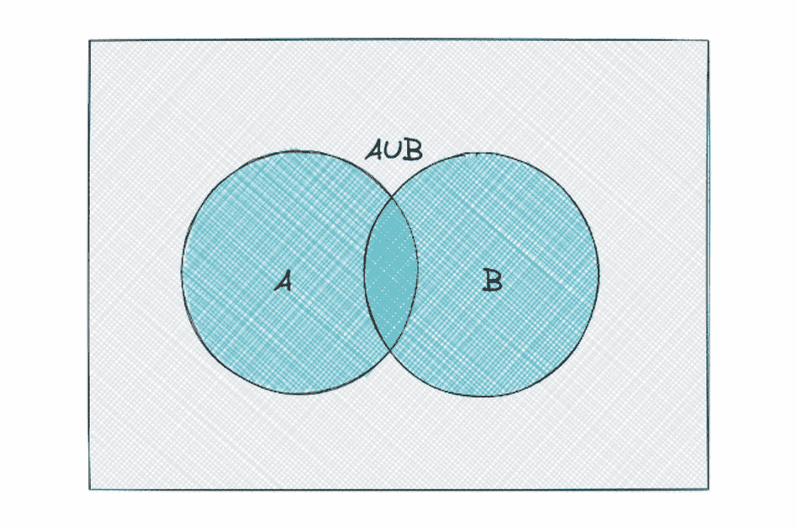

假设我们有两个事件: **A** 和 **B** 。 **A** 和 **B** 的并集由事件 **A** 、 **B** 或两者的所有结果组成。

当有一个概率问题:“至少一个事件发生的概率是多少？”，我们总是需要使用一个工会。

在符号中，两个事件 **A** 和 **B** 的并集通常表示为 **A ∪ B** 。

***交点***

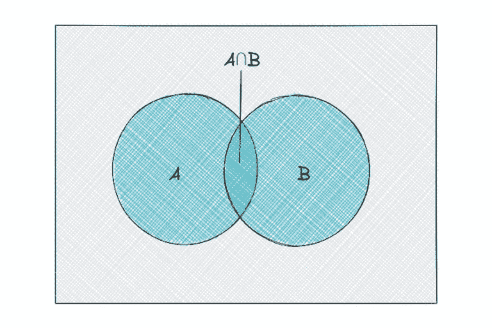

当我们有两个事件: **A** 和 **B** 时， **A** 和 **B** 的交集只包含同时存在于 **A** 和 **B** 中的结果。

当有一个概率问题:*“事件* ***A*** *和* ***B*** *同时发生的概率是多少？”*，我们总是需要用到一个路口。

在符号中，两个事件 **A** 和 **B** 的交集通常表示为 **A ∩ B** 。

***互斥***

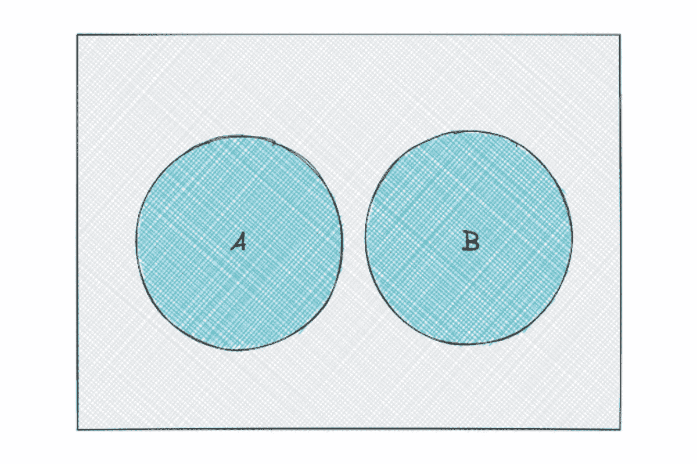

当我们有两个事件: **A** 和 **B** 时，当事件 **A** 的任何结果与事件 **B** 的任何结果不匹配时，我们可以说这两个事件是互斥的。

在一个符号中，我们可以说互斥事件有 **A *∩* B = 0**

## 概率属性

概率有一些我们应该永远记住的重要性质:

***概率范围***

概率的范围总是在 0 到 1 之间。

如果一个事件的概率是 1，这意味着该事件是保证发生的。同样，如果一个事件的概率为 0，这意味着该事件保证不会发生。

概率越接近 1，事件发生的可能性就越大。

实际上，事件 **A** 发生的概率可以表示为 **P(A)** ，其中 **P(A)** 应该在 0 和 1 之间的范围内:

***概率补码***

如果事件 **A** 发生的概率是 **P(A)** ，那么事件 **A** 不发生的概率将等于:

假设我们知道明天下雨的概率是 0.8，那么明天不下雨的概率就是 1–0.8 = 0.2。

***两个事件结合的概率***

两个事件 **A** 和 **B** 合并的概率可以数学定义为:

如果两个事件互斥，这意味着 **P(A∩B)** = 0。因此，在这种情况下，两个事件合并的概率是:

*例题:*

[脸书](https://platform.stratascratch.com/technical/2001-different-card?utm_source=blog&utm_medium=click&utm_campaign=medium)在他们的一次数据科学访谈中，问了一个关于两个事件联合概率的问题。问题是:

*“从一副洗好的 52 张牌中抽出一张不同颜色或形状的牌的概率是多少？”*

要回答这个问题，首先让我们定义两个事件:

**答**:从一副洗好的牌中抽出一张不同颜色的牌

**B** :从一副洗好的牌中抽出一张不同形状的牌

由于一副 52 张牌中有两种不同的颜色(每副 26 张)和四种不同的形状(每副 13 张)，那么在我们从这副牌中抽出一张牌后，我们抽出一张不同颜色的牌的概率将是:

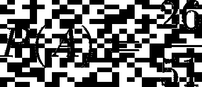

同时，我们抽出不同形状的牌的概率是:

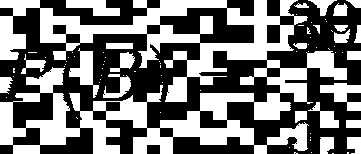

现在，我们抽一张不同形状和颜色的牌的概率是:

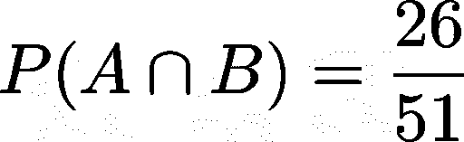

因为假设我们在第一次抽牌中得到一颗红心，那么如果我们在第二次抽牌中得到一张黑桃或一张黑梅花，则条件 **P(A∩B)** 将被满足，因此总共 51 张牌中有 26 张。

现在我们有了所有的信息，我们可以将这些值代入两个事件联合的概率公式:

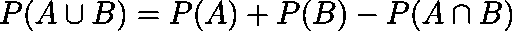

***条件概率***

条件概率是数据科学面试中常见的概率概念之一。好的一面是，条件概率的概念并不难理解。

条件概率可以描述为一个事件发生的概率，假定另一个事件已经发生。

作为一种记法，假设事件 B 已经发生，事件 A 发生的概率可以写成 P(A|B)。

下面是条件概率的公式。

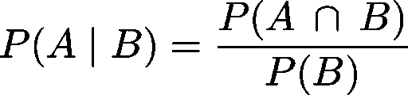

***依赖和独立事件***

如果一个事件发生的概率影响另一个事件发生的概率，则两个事件可以被描述为相关事件。

举个例子，假设你想从一副牌中抽两张牌，并且你希望在其中一张中得到一张红心 5。

在第一次抽牌时，你的概率是 1/52，因为一副牌中有 52 张牌。现在，在第一次抽牌之后，你注意到你没有得到一张红心 5。在第二次抽牌中，你拿到 5 红心的概率不再是 1/52，而是 1/51。你第一次抽牌的结果会影响你第二次抽牌的概率。这意味着这两个事件是相关事件。

如果两个事件是相关事件，那么在事件 **B** 已经发生的情况下，事件 **A** 发生的概率与条件概率没有什么不同:

同时，如果一个事件发生的概率对另一个事件发生的概率没有任何影响，则两个事件可以被描述为独立事件。

举个例子，你想掷硬币两次，你希望在其中一次掷中得到一条尾巴。在第一次投掷中，你得到一条尾巴的概率是。在第一次投掷之后，你注意到你没有得到一条尾巴。但是，你在第二次抛的时候得到一条尾巴的概率还是。你在第一次投掷中没有得到一条尾巴的事实对你在第二次投掷中得到一条尾巴的概率没有任何影响。

如果两个事件是独立事件，那么在事件 **B** 已经发生的情况下，事件 **A** 发生的概率可以定义为:

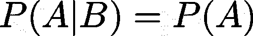

因为

*例题:*

[脸书](https://platform.stratascratch.com/technical/2011-n-dices?utm_source=blog&utm_medium=click&utm_campaign=medium)在他们的一次数据科学访谈中提出了一个与条件概率和相关/独立事件相关的问题。问题是:

*“你有 2 个骰子。至少得一个 4 的概率有多大？”*

为了回答这个问题，让我们想象两个事件:

**A** :用骰子 1 得到 4

**B** :用骰子 2 得到一个 4

因为在一次掷骰子中我们可以得到 6 种可能的结果，那么我们在一次掷骰子中得到 4 的概率就是⅙.因此:

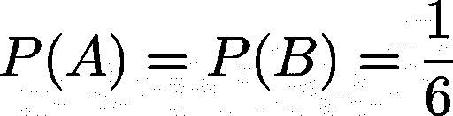

现在的问题是，事件 **A** 和事件 **B** 同时发生 **(P(A∩B))** 的概率是多少？

首先，我们需要知道该事件是属于从属事件还是独立事件。不管掷骰子 1 的结果如何，我们用骰子 2 得到 4 的概率不会改变。因此，我们可以说我们在这个问题中的事件是一个独立的事件。

既然这是一个独立的事件，那么我们可以说:

接下来，有了所有这些信息，我们可以将这些值代入两个事件联合的概率方程:

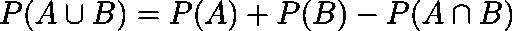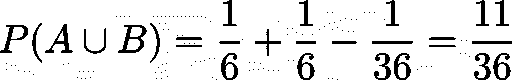

## 排列和组合

尽管它们并不相同，但人们经常互换使用术语排列和组合。这是可以理解的，因为他们有一个非常相似的概念，只有细微的差别。以下是它们之间的主要区别:

在排列中，我们关心顺序，而在组合中，顺序并不重要。

这意味着什么呢？我们用一个例子来阐述一下。

***排列***

假设我们附近有一场网球比赛。本次比赛共有 8 名运动员参赛，最终将颁发 3 枚奖牌。

在第一个场景中，将颁发的 3 枚奖牌是第一名获奖者的金牌、第二名的银牌和第三名的铜牌。由于颁发的奖牌因运动员的最终位置而异，因此在这种情况下，顺序很重要。如上所述，当顺序很重要时，我们就要处理排列。

因为我们有 8 名运动员:

*   对于金牌，我们有 8 个可能的选择:运动员 1，2，3，4，5，6，7，8。假设运动员 1 赢得了金牌。
*   对于银牌，我们有 7 个可能的选择:运动员 2，3，4，5，6，7，8。假设运动员 2 获得银牌。
*   对于铜牌，我们有 6 个可能的选择:运动员 3，4，5，6，7，8。

因此，我们可以将上面的场景写成 **8 x 7 x 6 = 336** 。这意味着我们有 336 种可能的运动员排列。

解决排列问题的一般方程是:

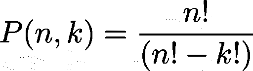

其中 **n** 是项目总数， **k** 是要订购的项目总数。

在上面的例子中，由于我们有 8 名运动员，那么 **n** 就是 8。与此同时，由于我们有 3 个不同的奖牌需要订购，那么 **k** 将是 3。因此:

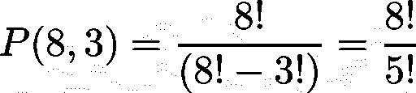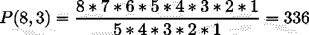

*例题:*

[Peak6](https://platform.stratascratch.com/technical/2288-combinations-of-three?utm_source=blog&utm_medium=click&utm_campaign=medium) 在他们的一次数据科学访谈中，问到了排列的基本概念。问题是:

*“一场比赛有三个人，一、二、三名，有多少种不同的组合？”*

因为有三个人，有三个地方需要排序，这些顺序很重要，所以我们需要使用排列的一般方程。

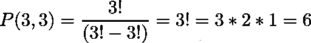

***组合***

让我们回到前面的网球比赛的例子。但是现在我们不再给他们颁发金牌、银牌和铜牌，而是给他们颁发纪念品。所有三名获胜者都将获得同样的纪念品。

在这种情况下，顺序不再重要，因为所有三个获胜者都收到了相同的纪念品。这意味着如果三名获胜者是运动员 **A** 、 **B** 和 **C** ，我们有以下条件:

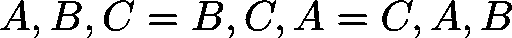

请注意，上述条件不适用于排列，因为在排列中，获胜者的顺序很重要。

组合的一般等式为:

与上述排列相同， **n** 是项目总数， **k** 是要订购的项目总数。

在某些情况下，上面的等式 **C(n，k)** 可以写成

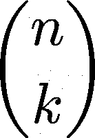

也就是著名的二项式系数，你会在下一章的二项式分布中看到。

*例题:*

[Kabbage](https://platform.stratascratch.com/technical/2027-essay-writing-cheaters?utm_source=blog&utm_medium=click&utm_campaign=medium) 在他们的一次数据科学采访中，问到了组合的基本概念。问题是:

*“如何在一个 200 人的小组里发现谁在论文写作上作弊？”*

这就是组合的概念。

既然我们有 200 名学生，那么我们的项目总数 **n** = 200。接下来，找出谁作弊的解决方案之一是逐一比较一对学生的考试，它们的顺序无关紧要，即一对学生 A 和学生 B 的考试与一对学生 B 和学生 A 的考试相同。

由于我们希望在两人一组的基础上比较考试，因此需要订购的项目总数 **k** 为 2。因此，我们有:

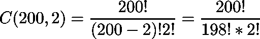

# 概率分布

在抛公平硬币之前，我们知道我们只能得到两种可能结果中的一种，不管是正面还是反面。在掷骰子之前，我们知道我们只能得到 6 种可能结果中的 1 种。现在问题来了:

*   如果我们掷 5 次硬币，得到一条尾巴的概率是多少？
*   如果我们扔一枚硬币 100 次，我们能得到多少条尾巴？
*   我们需要掷多少次骰子才能得到 4？

上述所有问题都可以借助概率分布来回答。

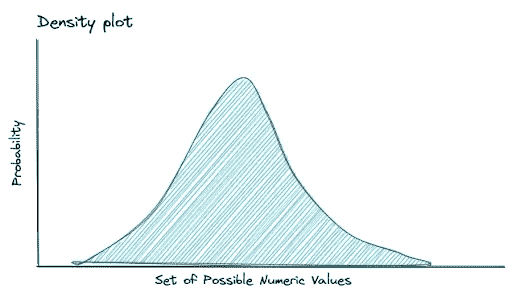

顾名思义，概率分布描述了每个结果的概率，如果数据是连续的，通常用概率密度函数(PDF)来表示，如果数据是分类/离散的，则用概率质量函数(PMF)来表示。x 轴描述了一组可能的数字结果，y 轴描述了它们出现的概率。

我们可以从概率分布中得出两个重要的性质:**期望值**和**方差**。

*   **期望值**衡量在给定的概率分布下，如果我们长期重复试验，我们期望得到的样本平均值。
*   **方差**测量当样本大小接近无穷大时，给定分布中样本可变性的理论极限。

有许多不同种类的概率分布，不可能记住每一种。如果你有兴趣了解所有的概率分布，请查看这个[链接](http://www.math.wm.edu/~leemis/chart/UDR/UDR.html)。

在本节中，我们将引导您了解一些在面试中最常被问到的概率分布及其使用案例。

## 离散概率分布

离散概率分布是一种分布类型，如果我们的数据是分类的，它可以用来可视化我们的数据的分布。这种分布的特征是一组离散的可能结果，每个结果的概率可以用概率质量函数(PMF)来建模。

PMF 的 x 轴代表事件的可能结果，y 轴代表每个事件发生的概率。在准备数据科学面试时，您应该了解几种离散概率分布。先说伯努利分布。

***伯努利分布***

伯努利分布在单次试验中只有两种可能的结果，0(失败)或 1(成功)。如果成功的概率是 **p** ，那么根据概率补码，失败的概率是 **(1-p)** 。

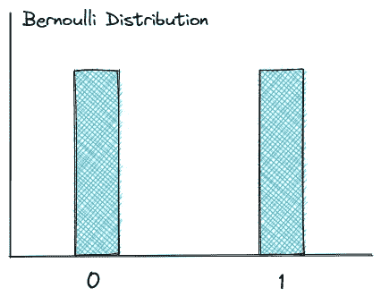

如果我们掷一枚公平硬币，我们知道得到一条尾巴的概率是 0.5。因此，获得正面的概率也是 0.5，如上图所示。

然而，需要注意的是，两种结果的概率不一定相等。如果我们有一个不公平的硬币，有可能得到正面的概率是 0.7，而得到反面的概率是 0.3。

伯努利分布中随机变量的期望值是:

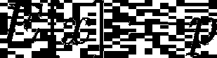

而具有伯努利分布的随机变量的方差是:

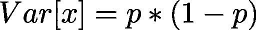

*例题:*

[脸书](https://platform.stratascratch.com/technical/2012-three-ants?utm_source=blog&utm_medium=click&utm_campaign=medium)在他们的一次数据科学采访中问到了伯努利分布。问题是:

三只蚂蚁坐在一个等边三角形的三个角上。每只蚂蚁随机选择一个方向，开始沿着三角形的边移动。没有蚂蚁相撞的概率是多少？”

这是伯努利分布的一个例子。三只蚂蚁只有在向同一个方向移动时才不会发生碰撞，要么都向左(0)，要么都向右(1)。我们只有两种可能的结果。

此外，每只蚂蚁都可以向任一方向移动，这对另一只蚂蚁没有任何影响，因此我们可以将这种情况归类为独立事件。

要回答这个问题，我们需要使用我们在上一节讨论过的概率论。

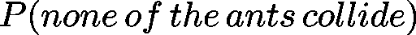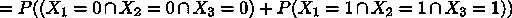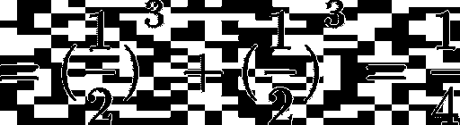

***离散均匀分布***

离散均匀分布可以有 **n** 种可能的结果，每种结果发生的概率是相等的。

离散均匀分布最著名的例子是滚动骰子。当你掷骰子时，有 6 种可能的结果，其中每一种都有相等的⅙概率。这就是为什么均匀分布具有平坦的 PMF，如下图所示。

离散均匀分布中随机变量的期望值为:

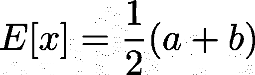

其中 **a** 是最小可能结果，而 **b** 是最大可能结果。

离散均匀分布中随机变量的方差为:

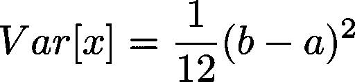

*例题 1:*

在他们的一次数据科学采访中，Spotify 问到了离散均匀分布。问题是:

*“给定均匀分布[0，d]的 n 个样本，如何估计 d？”*

要回答这个问题，我们需要看一看均匀分布的随机变量的期望值。我们知道期望值的公式是:

从题中我们还知道 ***a*** = 0 和***b***=***d***。将这些信息代入公式，我们得到:

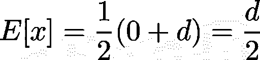

如果我们有 n 个*样本，正如问题提到的，那么我们可以估计*与:**

****

**即随机变量 ***X*** 对于 ***n*** 样本乘以 2 的平均值。**

***例题 2:***

**[Jane Street](https://platform.stratascratch.com/technical/2274-dice-expectations?utm_source=blog&utm_medium=click&utm_campaign=medium) 在他们的一次数据科学访谈中提出了一个关于掷骰子的问题:**

***“掷骰子的期望是什么？”***

**众所周知，掷骰子是一个均匀分布的例子。**

**要计算掷骰子的期望值，我们只需将该值代入期望值公式:**

****

**其中在我们这里， ***a*** = 1 或可能结果的最小值，而 ***b*** = 6 或可能结果的最大值。**

**因此，掷骰子的期望值是:**

**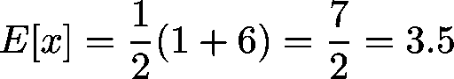**

*****二项分布*****

**二项式分布是伯努利分布的扩展。我们不再扔一次硬币，而是扔 100 次。在这 100 次投掷中，有多少次硬币正面朝上？**

**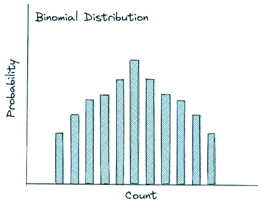**

**这是遵循二项式分布的示例。它测量在*n 次试验中成功的概率。需要注意的一点是，每次投掷都是相互独立的，也就是说，一次硬币投掷的结果不会影响下一次投掷结果的概率。***

***二项分布的一般方程如下:***

***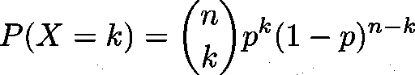***

***其中 ***n*** 为试验次数， ***k*** 为成功次数。注意，这里有一个二项式系数，我们在组合部分讨论过。***

**具有二项分布的随机变量的期望值是:**

**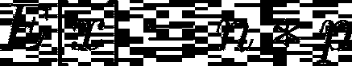**

**而方差是:**

**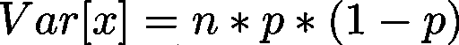**

**关于二项分布的面试问题很常见，所以你肯定需要了解这个分布的概念。**

***例题:***

**[威瑞森无线](https://platform.stratascratch.com/technical/2175-throwing-dice?utm_source=blog&utm_medium=click&utm_campaign=medium)在他们的一次数据科学采访中问到了二项分布。问题是:**

***“掷骰子 7 次得 5 的概率有多大？”***

**这个问题可以用二项分布来回答。在这种情况下，试验次数 ***n*** 为 7，成功次数 ***k*** 为 1(五分之一)。**

**将这些信息代入二项分布方程，我们得到:**

******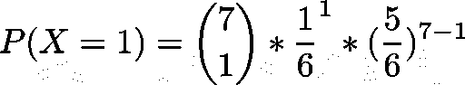**

*****超几何分布*****

**超几何分布与上面的二项式分布非常相似。它们有或多或少相同的概率密度函数(PMF)，你可能会在下面注意到。**

**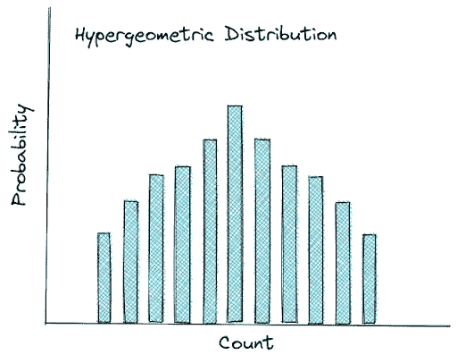**

**假设我们有一副牌，我们想从那副牌中依次抽出 10 张牌。问题是，你会得到多少次心脏？这个用例非常类似于二项式分布，但是二项式分布和超几何分布之间有一个主要的区别。**

**在超几何分布的情况下，我们在下一次抽牌中拿到红心的可能性受到我们在上一次抽牌中拿到的牌的影响。**

**在第一次抽签之前，我们有 13/52 的概率得到一颗心脏。现在，假设我们在第一次抽牌中拿到了一张黑桃，那么我们在第二次抽牌中拿到红桃的概率不再是 13/52，而是 13/51，因为我们已经从一副牌中取出了一张。这意味着每次抽牌都不是相互独立的，因为当我们抽更多的牌时，这副牌的数量会减少。**

**二项式分布和超几何分布都是衡量在*试验中***【k】***的成功次数。不同的是，二项式分布中的试验是 ***带*** 替换，而超几何分布中的试验是 ***不带*** 替换。***

***例题:***

**[脸书](https://platform.stratascratch.com/technical/2001-different-card?utm_source=blog&utm_medium=click&utm_campaign=medium)在他们的一次数据科学采访中问到了超几何分布的概念。问题是:**

**从一副洗好的 52 张牌中抽出一张不同颜色或形状的牌的概率是多少**

**为了回答这个问题，让我们想象两个事件:**

****A** :选择不同颜色卡片的概率**

****B** :选择不同形状卡片的概率**

**从一副洗好的牌中随机抽出一张牌后，第二张牌具有不同颜色或形状(没有任何替换)的概率可以用数学方法定义为:**

****

**选择不同颜色卡片的概率:**

**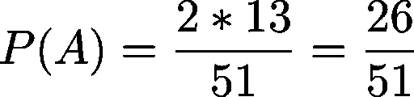**

**选择不同形状卡片的概率:**

**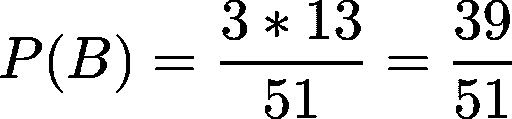**

**选择不同颜色和形状的卡片的概率:**

**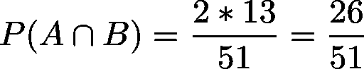**

**因此，选择不同颜色或形状的牌的概率是:**

******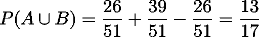**

*****几何分布*****

**几何分布也与二项分布密切相关。下面是几何分布的概率质量函数(PMF)。**

**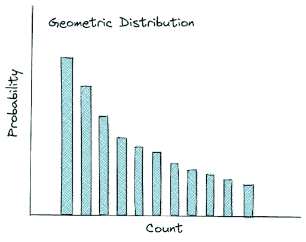**

**你可能会注意到几何分布和二项分布之间的 PMF 是不同的。然而，他们有一个非常相似的概念。让我们以抛硬币为例。**

**假设我们想在掷硬币中得到一条尾巴。利用二项式分布，我们可以估计出从 ***n*** 次抛硬币中我们将得到的反面数量。同时，利用几何分布，我们可以估计投掷硬币的次数，直到我们最终得到第一条尾巴。**

**二项分布测量在*n 次试验中获得 ***k*** 次成功的概率。几何分布也衡量成功的概率，但试验次数本身就是它的结果。这个分布更感兴趣的是找出在我们获得第一次成功之前的试验次数。***

**如果二项分布问:“在 ***n*** 次试验中有多少次成功？”，几何分布问:“我们要经历多少次失败才能获得第一次成功？”。这就是为什么几何分布的 PMF 有这样的形状。观察越多，你没有获得任何成功的可能性就越小。**

**具有几何分布的随机变量的期望值是:**

**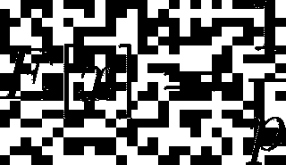**

**其中方差可以计算为:**

**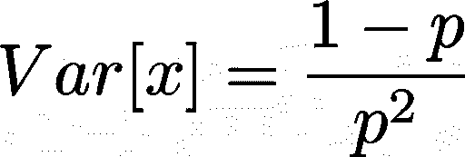**

***例题:***

**脸书在他们的一次数据科学采访中问到了几何分布的概念。问题是:**

***“你在一个赌场，有两个骰子，如果你掷出 5，你赢了，并得到 10 美元。你的预期支出是多少？如果你一直玩到赢为止(不管花了多长时间)，然后停止，你的预期回报是多少？”***

**要回答这个问题，让我们考虑以下情况:**

**-每次我们想玩都要花 5 美元。**

**-如果我们掷出两个骰子得到一个 5，我们就能得到 10 美元。**

**我们的目标是通过掷两个骰子得到一个 5。这意味着我们在 36 种不同的组合中有 4 种可能性: **{4，1}** ， **{2，3}** ， **{3，2}** 和 **{1，4}** 。**

**我们掷出两个骰子得到 5 的概率是:**

****

**几何分布的期望值可以定义为:**

**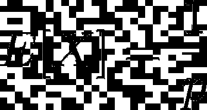**

**其中 ***X*** 为首次成功前的试验次数。**

**由于我们有一个获胜的概率= 1/9，我们可以假设我们需要 9 次尝试才能成功获得 5。预期支出将是:**

**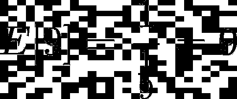**

**我们可以用下面的等式来模拟这个场景:**

**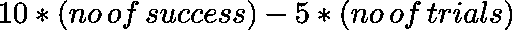**

**因此，预期支出将是:**

**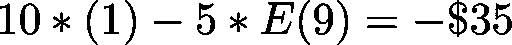**

*****负二项分布*****

**负二项分布基本上是几何分布的延伸或推广。**

**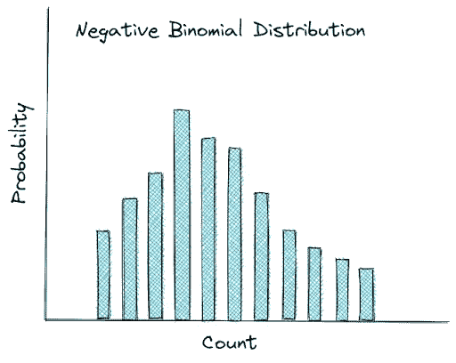**

**如果几何分布问:“到第一次成功，要经历多少次失败？”，负二项分布问:“多少次失败，直到 ***n*** 次成功？”。负二项分布通过测量失败次数来扩展这一概念，而不是直到第一次成功的失败次数，直到我们达到 ***n*** 次成功。**

**负二项分布的随机变量的期望值是:**

**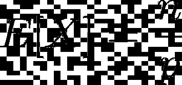**

**其中 ***n*** 是我们要寻找的成功次数，而 ***p*** 是成功的概率。**

**同时，负二项分布的随机变量的方差为:**

**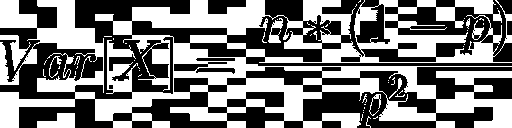**

***例题:***

**[Chicago Trading Company(CTC)](https://platform.stratascratch.com/technical/2268-toss-till-achieved?utm_source=blog&utm_medium=click&utm_campaign=medium)在他们的一次数据科学访谈中，问到了负二项分布的概念。问题是:**

***“扔硬币直到你得到两个头。达到这个目标的预期投掷次数是多少？”***

**这是一个负二项分布的例子，我们应该找到试验的次数，直到我们第一次发现成功的试验。**

**这种二项式分布的期望值可以用数学方法定义为:**

****

**其中 ***X*** 是掷硬币，结果是正面，而 ***n*** 是成功的次数。**

**既然硬币是公平的，那么在掷硬币中我们得到正面的概率是，我们的目标是掷硬币直到我们得到 2 个正面(2 次成功)。有了这些信息，我们可以将这些值代入上面的等式。**

****

**因此，在我们得到两个正面之前，预期的投掷次数是 4 次。**

## **连续概率分布**

**顾名思义，如果我们的数据是连续的，连续概率分布是一种可以用来可视化我们的数据分布的分布类型。与离散概率分布不同，连续概率分布不能用 PMF 建模。相反，用概率密度函数(PDF)来模拟连续的概率分布。**

**PDF 可以定义为区间 A 和 B 之间曲线下的面积，如下图所示。**

****

*****A*** 和 ***B*** 之间的间隔可以用积分来计算，但大多数编程语言库或统计软件会替你这么做。**

*****正态分布*****

**正态分布是最著名的分布，它有一个钟形曲线，如上图所示。正态分布中有两个重要的参数:平均值和标准差。**

**由于这种分布的重要性质，它被广泛用于推断统计，这就是所谓的经验法则。**

**经验规则是定义正态分布的规则，它们是:**

*   **大约 68%的观察值在平均值的一个标准偏差范围内**
*   **大约 95%的观察值位于平均值的两个标准偏差之内**
*   **大约 99.7%的观察值位于平均值的三个标准偏差之内**

****

**平均值可以是任何非负的实数，标准偏差也应该是非负的。**

*****标准正态分布*****

**顾名思义，标准正态分布基本上就是正态分布，只是均值为 0，方差为 1。许多人也将这种分布称为 z 分布，这是一种在已知总体标准差的情况下，当人们想要将他们拥有的样本数据的平均值与整个总体的平均值进行比较时使用的分布。**

**您将在统计一章中看到更多关于 z 检验和 z 分布的内容。**

****

*****学生 t 分布*****

**学生 t 分布具有与标准正态分布相似的钟形曲线形状，但是该分布比正态分布具有更重的尾部。**

**这种分布的形状将根据称为自由度(DOF)的参数而改变。这个 DOF 可以定义为样本量减一， ***n-1*** 。样本量越大，这种分布就越像标准的正态分布。**

****

**当总体的标准偏差未知时，如果要测试样本数据的平均值是否对应于总体平均值，通常会使用这种分布。**

**你会在统计学一章中看到如何进行这个学生 t 检验。**

# **数据科学面试中你应该知道的统计概念**

**在这一部分，我们收集了所有你应该知道的在面试中经常出现的关于统计学的技术概念:从基本概念到贝叶斯定理。让我们从基础开始。**

## **基本统计:中心的测量(平均值、中间值、众数)**

**顾名思义，**意为**，**中位数**，**众数**衡量数据的集中趋势。换句话说，它们衡量我们数据的中心在哪里。**

**你可能会问，如果他们测量的是我们数据的中心，那他们有什么区别？这是他们用来寻找我们数据中心的方法。**

*   ****平均值**:我们数据点的平均值**
*   ****中间值**:我们排序后的数据点的中间点**
*   ****模式**:我们的数据点中最频繁出现的数字**

**为了更好地理解它们之间的区别，让我们来看看不同分布的数据，如下所示。**

****

**如果数据呈正态分布，那么平均值、中值和众数都是相同的，正如您在上面的中间图像中所看到的。如果数据分布是左偏的，那么平均值将低于中位数。同时，如果数据分布是右偏的，那么平均值将高于中位数。**

**上图向我们展示了一件重要的事情:平均值是一个高度敏感的度量标准，用来衡量我们数据的中心。如果我们的数据中有异常值，平均值可能会比中值拖得更远。因此，在使用平均值来衡量数据中心之前，检查数据中是否存在异常值是非常重要的。**

***例题 1:***

**[脸书](https://platform.stratascratch.com/technical/2013-mean-median-age-in-mexico/?utm_source=blog&utm_medium=click&utm_campaign=medium)在他们的一次数据科学采访中，问到了均值和中位数的概念。问题是:。**

***“在墨西哥，如果取平均值和中值年龄，哪个会更高，为什么？”***

**要回答这个问题，我们需要找出墨西哥的年龄分布是什么形状，是正态分布，右偏，还是左偏。**

**根据统计数据显示，墨西哥在 2010 年至 2020 年间一直存在右偏的年龄分布。因此，我们可以说平均数高于中位数。**

***例题 2:***

**虽然与均值、众数和中位数的概念没有直接关系，但 [Airbnb](https://platform.stratascratch.com/technical/2158-impute-missing-information?utm_source=blog&utm_medium=click&utm_campaign=medium) 在他们的数据科学采访中提出了以下问题:**

***“你如何估算缺失的信息？”***

**虽然这个问题没有明确地谈论中心的措施，但是它的概念对于回答这个问题是非常重要的。假设我们有数字数据，其中一小部分包含缺失值。如果我们想估算缺失值，我们可以用数据的平均值或数据的中位数来填充它们。但是我们应该选择哪一个呢？**

**我们首先需要检查数据的分布，看看是否存在异常值。如果有异常值，那么选择平均值来填充缺失值会在我们的数据中引入偏差，这不是我们想要实现的。如果我们的数据中有异常值，使用中位数来填充缺失值将是更好的选择，因为中位数对异常值更稳健。**

**现在，如果我们有分类数据，那么如果我们用模式估算数据，这将是有意义的，这意味着我们只需用数据中出现最频繁的类别来填充缺失值。**

## **基本统计:分布的度量(标准差和方差)**

**顾名思义，分布度量值衡量数据的分布程度。一般来说，我们可以使用 4 种不同的指标来测量数据的分布:范围、**方差**、**标准差**和**四分位数**。**

*****范围*****

**范围是衡量数据分布的最简单的指标。假设我们有一个公司员工年薪的数据。假设最低工资 35000 美元，最高 105000 美元。这个范围就是最高工资和最低工资之间的差值。因此，在这种情况下，范围是 70，000 美元。**

*****差异*****

**方差衡量我们的数据在平均值周围的离差。然而，方差在实际应用中并不常用，因为我们从方差中得到的值是平方的，即**

****

**其中 ***S*** 为方差， ***x*** *i* 为一次观测值， ***x_bar*** 为所有观测值的平均值， ***n*** 为观测值总数。**

**这意味着方差和平均值具有不同的单位，例如，如果平均值以米为单位( **m** )，那么方差将以平方米为单位( **m** )。这使得方差在定义数据与平均值的差距时不够直观。**

*****标准差*****

**标准差可以帮助解决方差问题，因为它也可以测量数据在平均值周围的离差。区别在于，标准差是方差的平方根，即**

****

**这一小小的调整使得均值和标准差之间的观察单位变得相等，从而使我们更容易量化数据在均值周围的分布范围。**

**如果我们的数据是正态分布的，即有一个完美的钟形曲线，标准差就成为一个重要的度量标准，用来估计数据点相对于平均值接近程度的比例。**

****

**举个例子，假设我们知道数据是正态分布的，员工的平均年薪是 60000 美元。由此，我们可以推断，68.2%的员工工资位于 60，000 美元的 1 个标准差之间，约 95%位于 60，000 美元的 2 个标准差之间，99.7%位于 60，000 美元的 3 个标准差之间(参见正态分布部分的经验法则)。**

*****四分位数*****

**四分位数通过将数据分布分为 4 部分来衡量数据的分布:下四分位数(数据的 25%)、两个四分位数(数据的 25%-50%和 50%-75%)和上四分位数(数据的 75%)。通常，四分位数的概念可以通过以下箱线图可视化更容易理解:**

****

**在数据科学访谈中，关于传播度量的问题非常常见，例如，Travelport 提问:*“什么是标准差？我们为什么需要它？”*微软问:*“方差的定义是什么？”*。到目前为止，我们已经讨论了这两个问题的答案。**

***例题:***

**[微软](https://platform.stratascratch.com/technical/2231-new-observation-is-outlier?utm_source=blog&utm_medium=click&utm_campaign=medium)在他们的一次数据科学采访中询问了测试我们对传播度量的知识的概念。问题是:**

***“如何检测一个新的观察值是否是异常值？”***

**虽然问题没有明确提到传播的度量，但是它的概念对于回答这个问题非常重要。为了检测异常值，我们可以查看数据点在分布中的位置。如果我们有正态分布的数据，那么我们可以得出结论，如果一个数据点位于平均值的 3 个标准偏差之外，那么它就是异常值。**

**我们也可以使用如上所示的箱线图来检测数据点是否是异常值。如果一个数据点位于箱线图的最大值或最小值之上或之下，那么我们可以断定它是一个异常值。**

## **推断统计学**

**在数据科学领域，推理统计的知识变得非常重要。这是我们通过观察数据中的一些模式来获得对我们试图解决的问题的洞察力的强大工具。**

**在推断统计的范围内，您需要了解几个步骤和术语。先说假设检验。**

*****假设检验*****

**通过进行假设检验，你基本上是通过观察你所拥有的样本数据来检验你对一般人群的假设或信念。**

**这意味着在假设检验中，你通常会有:**

*   ****无效假设**:假设一切都是正常的假设，或者是怀疑的假设。**
*   ****替代假设**:一种反假设，假设原假设中的任何陈述都不正确。**

**举个例子，你想知道一个学校的男女生智商是否有显著差异。在这种情况下，假设是:**

*   ****零假设**:男女学生智商相同**
*   ****另类假设**:普通学生和女学生的智商不同**

**假设检验的主要目的是找出哪个假设更合理。**

**但是，需要注意的是，在假设检验中，原假设永远是现状，也就是说原假设永远是默认的真值。这意味着我们要么拒绝零假设，要么不拒绝。这也是为什么我们从来不说我们“接受”零假设的原因。**

**现在的问题是，我们如何知道我们是否应该拒绝零假设？让我们在下一节中找出答案。**

*****显著性水平*****

**显著性水平是我们在假设检验时需要设置的一个重要概念。这是因为在我们决定拒绝一个无效假设之前，显著性水平将作为我们的容忍度。**

**显著性水平的数量可以变化，这取决于您的兴趣。然而，显著性水平的经验法则是 5%或 0.05。**

**显著性水平越低，在拒绝零假设时就越谨慎，反之亦然。**

**我们将在下面的章节中进一步阐述显著性水平的概念。**

*****置信区间*****

**置信区间可以描述为总体参数值的合理范围。**

**如果我们进行双尾假设检验，我们可以说置信区间补充了显著性水平。这意味着，如果我们的显著性水平是 5%，那么置信区间将是 95%，如下图所示。**

****

**如果你的显著性水平是 1%，那么置信区间就是 99%，如果你的显著性水平是 10%，那么置信区间就是 90%**

**计算置信区间本身的公式可以写成:**

****

**其中 ***x_bar*** 为样本均值， ***Z*** 为置信水平值，***【σ】***为样本的标准差， ***n*** 为样本数。**

*****Z*** 的值直接对应你的置信区间。如果置信区间是 95%，那么 ***Z*** 就是 1.96。**

**此外，重要的是要注意，置信区间值、标准偏差和上述观察次数之间的等式可以由两个不同的参数描述:**误差幅度**，即:**

****

**或标准误差，即:**

****

***例题 1:***

**[特斯拉](https://platform.stratascratch.com/technical/2093-confidence-interval?utm_source=blog&utm_medium=click&utm_campaign=medium)在他们的一次数据科学采访中，问到了置信区间的概念。问题是:**

**“有 100 种产品，其中 25 种是坏的。置信区间是多少？”**

**要回答这个问题，我们需要结合我们在概率一节中学到的置信区间和二项分布的知识。**

**如果有 100 件产品，我们知道其中有 25 件是坏的，那么在这种情况下我们就要处理二项分布。**

**为了更新，二项式分布的平均值或期望值和方差可以计算如下:**

********

**其中 ***n*** 为实验总数 ***p*** 为产生不良产品的概率。**

**不合格产品的产出概率可以计算如下:**

****

**将这个概率值代入上面的均值和方差方程，我们得到:**

********

**同时，我们知道标准差是方差的平方根，因此:**

********

**标准误差是标准偏差除以实验总数的平方根。**

************

**现在我们有了确定置信区间所需的所有值。**

********

***例题 2:***

**[Google](https://platform.stratascratch.com/technical/2315-margin-of-error?utm_source=blog&utm_medium=click&utm_campaign=medium) 在他们的一次数据科学采访中询问了误差幅度和样本量的概念。问题是:**

***“对于样本量 n，误差幅度为 3。我们还需要多少样本才能将误差幅度降至 0.3？”***

**正如我们在上面看到的，误差幅度可以用数学方法定义为:**

****

**从上式中，我们知道误差幅度与样本量成反比，即:**

****

**如果样本大小为 ***n*** 的误差幅度为 3，那么为了将误差幅度降低到 0.3，我们需要:**

************

**这意味着我们需要 100 个* ***n*** 更多的样本来将误差幅度降低到 0.3**

*****p 值*****

**在统计学中，p 值代表概率值。p 值代表假设零假设为真时，观察结果出现的可能性有多大。**

**p 值越低，考虑到零假设为真，您的观察就越令人惊讶。**

**p 值和显著性水平的组合为您提供了是否应该在假设检验中拒绝零假设的概述。**

**假设你观察到的 p 值是 0.02，你的显著性水平是 0.05。因为 p 值小于显著性水平，所以我们拒绝零假设，支持替代假设。同时，如果你的 p 值是 0.02，但你的显著性水平是 0.01，那么我们不能拒绝零假设。**

***例题:***

**[State Farm](https://platform.stratascratch.com/technical/2043-p-value?utm_source=blog&utm_medium=click&utm_campaign=medium) 在一次数据科学访谈中询问了 p 值的概念。问题是:**

***“什么是 p 值？如果您有一个不同的(大得多，例如 300 万条记录),您对 p 值的解释会改变吗？)数据集？”***

**你可以从上面的定义中回答什么是 p 值。现在的问题是，如果我们有一个更大的数据集，我们对 p 值的解释会改变吗？**

**我们对 p 值的解释永远不会改变，不管我们的数据集是大还是小。然而，如果我们有更多的数据，标准误差就越小，因此，得到的 p 值就越稳健。**

*****统计测试*****

**现在我们知道在假设检验中有三个常见的术语:**显著性水平**、**置信区间**和 **p 值**。**

**为了选择我们是否应该拒绝零假设，我们做统计测试，最后，我们得到 p 值。接下来，我们将 p 值与我们的显著性水平进行比较。如果 p 值小于显著性水平，那么我们拒绝零假设，支持替代假设。**

**但是我们如何进行统计测试来得到这个 p 值呢？这就是事情变得有点棘手的地方，因为有不同的统计测试，这取决于你想观察什么。以下是你应该知道的常见统计测试。**

*****总体均值的 Z 检验*****

***何时使用该统计测试:***

**如果我们想检验平均样本量是否与平均总体量一致。**

***要满足的条件:***

*   **总体的标准偏差是已知的**
*   **样本是随机选择的**
*   **样本明显小于总体**
*   **变量需要具有正态分布**

**正如您可能已经猜到的，这个测试中的变量应该遵循标准的正态分布或 z 分布。为了获得 p 值，我们需要首先计算 ***Z*** 值。**

**下面是计算 ***Z*** 值的公式:**

****

**其中 ***x_bar*** 为样本均值， ***μ*** 为总体均值， ***σ*** 为总体标准差， ***n*** 为观察次数。**

**在我们得到 ***Z*** 值后，我们可以使用 Python 或 R 中的 Z 表或更方便的统计库来得到相应的 p 值。**

**在现实生活中，不经常进行 Z 检验，因为总体的标准偏差通常是未知的。**

*****总体均值的单样本 t 检验*****

***何时使用该统计测试:***

**如果我们想检验样本数据的平均值是否符合总体平均值。使用 t 检验，我们有一个假设，即我们不知道总体标准差，这在现实生活场景中更现实。**

***需要满足的条件:***

*   **样本是随机选择的**
*   **如果样本量很小(15 左右)，那么数据应该呈正态分布**
*   **如果样本量相当大(大约 40)，那么即使数据有偏差，进行测试也是安全的。**

****

**其中 ***x_bar*** 为样本均值， ***μ*** 为总体均值， ***s*** 为样本的标准差， ***n*** 为观察次数。**

**t 检验背后的直觉与 Z 检验相似，只是我们不知道总体标准差。因此，我们使用样本标准差。**

**还有，t-test 中还有一个额外的参数，就是自由度(DOF)。DOF 正好是样本量减 1，或者说 ***n-1*** 。**

**一旦我们知道了 t 值和自由度，我们就可以使用统计软件找到相应的 p 值。**

*****配对 t 检验*****

***何时使用该统计测试:***

**如果我们想用不同的处理方法测试同一个样本，然后检查这种处理方法是否会在同一个样本中产生统计学上不同的结果。**

**一般来说，要满足的条件与上面的单样本 t 检验相同。计算 t 统计量的公式也是一样的。唯一的区别是我们如何解释 t 检验的结果。**

**之前，t 检验测量我们感兴趣的变量的平均值。同时，在这个配对 t 检验中，我们更感兴趣的是我们感兴趣的变量的均值或标准差。**

*****双样本 t 检验*****

***什么时候使用这个统计测试:***

**如果我们想用不同的处理方法测试两个不同的样本，然后检查两个样本之间的处理方法是否会产生统计上的不同结果。**

***要满足的条件:***

*   **与单样本 t 检验列表相同**
*   **两个样本的分布是相似的**
*   **如果两个样本的大小相同，结果会更可靠**

****

**其中索引 1 和 2 分别表示您的第一个和第二个样本。**

**这里 t-统计的直觉与配对 t-检验相同，这意味着 t-统计测量两个不同样本的均值和标准差差异。**

*****ANOVA*****

****何时使用该统计测试:****

**如果我们想用不同的处理方法测试两个以上的不同样本，然后检查这些处理方法是否会在不同的样本中产生统计上不同的结果。**

**一般来说，要满足的条件与上面的双样本 t 检验相同，但在 ANOVA 中，不是只有两个样本，而是有两个以上的样本。**

**一般来说，下面是如何进行方差分析的步骤:**

*   **计算所有样本的平均值(总体平均值)**
*   **计算组内偏差，即样本中每个成员相对于相应样本均值的偏差**
*   **计算组间方差，即每个样本与所有样本平均值的偏差**
*   **计算 F 统计量，即组间变异和组内变异的比率**

**方差分析是一个耗时的手工计算测试。因此，通常在统计软件或编程语言的统计库的帮助下进行这种测试。**

**查看我们的帖子' [*数据科学面试的概率和统计问题*](https://www.stratascratch.com/blog/probability-and-statistics-questions-for-data-science-interviews/?utm_source=blog&utm_medium=click&utm_campaign=medium) '，了解如何使用 Python 解决概率和统计问题。**

*****卡方拟合优度*****

***何时使用该统计测试:***

**如果我们想测试样本数据是否能很好地代表总体。然而，我们不是看平均值，而是看比例。**

**例如，假设我们有 10 包 M&M 巧克力，每包有五种不同的颜色，比如蓝色、红色、黄色、绿色和棕色。我们可能想测试每包中这五种颜色的比例是否相等。**

***需要满足的条件:***

*   **样本是随机选取的**
*   **我们的数据应该是分类的或名义上的。既然我们对比例感兴趣，那么这个测试就不适用于连续数据**
*   **样本量足够大，每个数据类别至少有 5 个项目。**

**下面是卡方拟合优度检验的公式:**

****

**其中 ***O*** 为每个类别中的观察频率计数， ***E*** 为每个类别中的期望频率计数， ***k*** 为类别总数。**

**在计算了拟合优度之后，最后我们将得到 p 值，与上面提到的其他测试一样，这使我们能够洞察我们是否应该拒绝零假设。**

*****卡方独立性检验*****

***何时使用该统计测试:***

**如果我们想测试两个或多个样本数据是否相关。这个想法类似于方差分析。**

**然而，如果在 ANOVA 中我们对平均值感兴趣，那么在这个测试中我们对比例更感兴趣。举个例子，假设我们拥有一家电影院。我们想知道电影的类型和人们购买零食的数量是否相关。电影的类型是我们的第一个样本数据，零食的数量是我们的第二个样本数据。**

**一般来说，要满足的条件与上面的拟合优度相同，除了不是只有一个样本，在这个测试中我们应该有两个或更多的样本。**

**下面是独立性卡方检验的公式:**

****

**其中 ***r*** 和 ***c*** 是你观察到的两个不同的类别，即从上面的例子来看， ***r*** 可能是电影的类型， ***c*** 可能是小吃。**

**在计算了上面的公式之后，我们将在最后得到 p 值，我们可以用它来决定我们是否应该拒绝零假设。**

***例题:***

**在他们的一次数据科学采访中， [Amazon](https://platform.stratascratch.com/technical/2055-random-bucketing?utm_source=blog&utm_medium=click&utm_campaign=medium) 询问了一个将我们关于不同统计方法的知识付诸行动的概念。问题来了。**

**在 A/B 测试中，你如何检查分配到不同的桶是否真的是随机的？**

**既然我们这里有一个 A/B 测试，那么假设我们有两个变量叫做 ***A*** 和 ***B*** 。如果分配确实是随机的，那么两个变量之间应该没有统计上的显著差异。**

**既然我们感兴趣的是检查赋值是否真的是随机的，那么我们可以比较两个变量的平均值，如果它们是连续变量的话。如果只有一种处理方法，那么我们可以使用双样本 t 检验。同时，如果有多种治疗方法，那么我们可以使用方差分析。**

**如果我们想知道变量 ***A*** 和变量 ***B*** 是否相互关联，它们是分类变量，那么我们可以使用独立性的卡方检验。**

*****假设检验的步骤*****

**现在我们知道了所有关于推断统计学的事情！让我们总结一下，收集正确进行假设检验所需的所有必要步骤:**

*   **首先，建立假设:原假设和 T2 假设**
*   **选择您的重要性级别**
*   **进行适合你观察类型的统计测试**
*   **从统计检验中找出 p 值**
*   **决定是否拒绝零假设**

***例题:***

**在他们的一次数据科学访谈中，脸书问到了推断统计学的端到端概念。问题是:**

***“我们的产品被两个不同的群体以不同的方式使用。你的假设是什么，为什么以及你将如何去测试它？”***

**当我们的产品被两个不同的群体使用时，我们需要首先收集数据，然后我们可以使用双样本 t 检验来分析结果。**

**1.我们把我们的假设表述如下:**

**- **零假设**:两组间的平均使用率相同**

**- **替代假设**:两组之间的平均使用率不同。**

**2.我们选择显著性水平，通常在 0.05 左右**

**3.从数据中，我们可以得到每组的平均值和标准差。**

**4.然后，我们使用双样本 t 检验来计算 t 统计量。**

**5.如果得到的 t 检验低于我们的显著性水平(< 0.05), then we can reject our null hypothesis in favor of our alternative hypothesis, i.e the average used rate between the 2 groups is different.**

**6\. If the resulting t-test is above our significance level (> 0.05)，那么我们可以坚持我们的零假设，即两组之间的平均使用率大致相同。**

*****统计能力*****

**正如您已经知道的，当您在进行统计测试后获得 p 值时，您将有权力通过与您的显著性水平进行比较来决定是否拒绝零假设。**

**然而，统计推断总是会伴随着不确定性。这种不确定性主要来自您的显著性水平，您可以根据您的研究以及您为统计测试收集的样本数据质量进行微调。**

**这意味着你在假设检验过程中容易犯两种错误，在统计学中通常被称为第一类错误和第二类错误**。****

*   ****第一类错误意味着你错误地拒绝了零假设****
*   ****第二类错误意味着你不能拒绝零假设****

********

****统计能力是你正确拒绝零假设的概率。这也意味着犯第二类错误的可能性更小。统计能力越高，你犯第二类错误的概率就越低。****

*******力量分析*******

****现在你知道在进行假设检验时，你可能会遇到两种类型的错误。如前所述，误差的一个常见来源是数据质量。这意味着您可能没有足够的样本数据来产生一个 p 值，以令人信服地得出您是否应该拒绝零假设的结论。****

****功效分析中经常出现的问题是:*“要确保我们得到的 p 值有足够的说服力让我们拒绝零假设，最少需要多少样本？”*****

****功效分析计算中通常考虑 4 个参数:**效果大小**、**样本大小**、**显著性水平**和**统计功效**。****

****从上面几节中，您已经知道了样本大小、显著性水平和统计功效。然而，效应大小通常是使用统计方法来计算的，例如，如果您想测量变量之间的关系，可以使用皮尔逊相关；如果您想确定变量之间的差异是否显著，可以使用科恩的 d 相关。****

****在功效分析中，您需要预先定义效应大小、显著性水平和统计功效的值，以找出所需的样本大小。****

****显著性水平的默认值是 0.05，Cohen 的 d 发现大效应大小的默认值是 0.80，统计功效的默认值也是 0.8。但是，您可以根据您的研究对这些值进行微调，这需要对主题有所了解。****

****功耗分析是一项令人望而生畏的手工计算任务，因此通常用编程语言在统计库中实现。****

## ****贝叶斯定理****

****在上一节中，我们讨论了频率主义者观点中常用的推断统计。在这一节中，我们将讨论推理统计学的另一个视角，它利用了贝叶斯定理。****

****贝叶斯定理是一种应用概率论进行统计的方法。在某种意义上，这个定理与人类在现实生活中对事物的推断有相似之处。它对事件的发生有一个先验的信念，并且这个信念将随着新的证据或数据的提供而更新。最终产生一种后验信念。****

****贝叶斯定理背后的基本概念通常被称为贝叶斯法则。这个规则类似于你在上面的条件概率部分看到的。****

****下面是贝叶斯法则的等式:****

********

****其中 ***A*** 和 ***B*** 是事件。****

****我们可以定义 ***P(A|B)*** 为事件 ***A*** 发生的概率，假设事件 ***B*** 已经发生。同样，我们可以定义 ***P(B|A)*** 为事件 ***B*** 发生的概率，假设事件 ***A*** 已经发生。****

****除此之外，上面的贝叶斯法则也展示了这个法则的基本概念:**先验**，**似然**，**边际**，以及**后验**，如下图所示:****

********

****更详细地说，以下是后验概率、可能性、先验概率和边际概率试图回答的问题:****

*   ****根据观察到的证据，我们的假设有多大的可能性？****
*   ******可能性**:给出的证据表明我们的假设是正确的可能性有多大？****
*   ****在我们看到任何观察结果或证据之前，我们的假设有多大的可能性？****
*   ****在所有可能的假设下，证据的可能性有多大？****

*****例题:*****

****在他们的一次数据科学采访中，脸书问到了贝叶斯定理的概念。问题是:****

****“你即将登上去西雅图的飞机。你想知道你是否应该带一把伞。你打电话给住在那里的三个朋友，分别问他们是否在下雨。你的每个朋友都有 2/3 的机会对你说真话，1/3 的机会用谎言来搞乱你。三个朋友都告诉你“是的”下雨了。西雅图真的下雨的概率有多大？”****

****为了回答这个问题，让我们首先假设各种事件:****

****西雅图正在下雨****

****西雅图没有下雨****

******- Xi** :具有伯努利分布的随机变量，使得****

****Xi:如果一个朋友说“是的，西雅图会下雨”****

****Xi = 0，如果一个朋友说“不，西雅图不会下雨”****

****现在，由于我们没有任何关于西雅图下雨概率的信息，让我们假设它是 0.5，因此:****

********

****在问题中，三个朋友都说*“是的，西雅图会下雨”*。我们可以这样表达:****

********

****我们知道我们的朋友说真话的概率是⅔.****

****我们可以将朋友告诉我们*“是的，西雅图会下雨”*的概率表示为:****

********

****我们的朋友告诉我们*‘不，西雅图不会下雨’*的概率，因为现在西雅图没有下雨:****

********

****现在我们得到了我们需要的信息，假设我们的三个朋友用贝叶斯定理说*【是的】*，我们可以得到西雅图下雨的概率，如下所示:****

************************

# ****概率统计面试备考小技巧****

****我们都同意，学习统计学，无论是为了考试还是为了面试，都不容易。正如你从上面的章节中看到的，为了至少对统计学和概率有一个大致的了解，我们需要涵盖很多主题。****

****下面的提示可能有助于你在概率统计面试中脱颖而出。****

## ****学习概念****

****如果你学习的是公式而不是概念，那么你学习统计学的方式是错误的。问题是，如果你忘记了公式，你可以随时回头看课本。然而，如果你忘记了这个概念，那么你就不能用正确的方法来回答这个问题。****

****最好学习这个概念，因为这样你就能正确地处理每个问题，也就是说，我们是否认为这个问题可以用二项分布、几何分布或负二项分布来解决。****

****举个例子，当你得到一个问题，问在 20 次抛硬币中得到 5 个反面的概率是多少，你应该知道这个问题可以用二项分布来回答。如果你忘记了二项分布的方程式也没关系，因为你总是可以在网上或教科书上找到它。最重要的是你知道这个问题可以用二项分布来解决。****

****永远学习概念，而不是公式。****

## ****使用笔和纸****

****让我们现实一点，当我们处理统计和概率问题时，我们是在处理数学。因此，不要试图在头脑中直接解决概率和统计面试问题。相反，使用传统的方式，比如用笔和纸来集思广益。****

****每当你把你的想法写在一张纸上，那么你就更容易以一步一步的方式解决问题，你会以更简洁的方式思考问题和如何解决它。****

## ****不要一口气学会所有的概念****

****掌握统计学就像试图增肌或减肥一样，不可能在一次静坐或一次健身中完成。相反，它是建立在特定时间段内的持续练习的基础上的。****

****每天留出大约一个小时，在你选择的时间内尝试解决概率和统计面试问题，并且不要忘记休息一段时间。最重要的是学习的一致性。****

****一段时间后，保证你会习惯统计学的问题，你将能够看到概率和统计面试问题中有重复出现的模式。你将能够理解在每个问题中你应该应用哪个概念，例如，你应该使用方差分析还是卡方分析，你应该使用几何分布还是超几何分布，等等。****

## ****仔细阅读或听问题****

****当你得到概率和统计面试问题时，确保你理解你试图解决的问题是非常重要的。但是我们如何确保这一点呢？****

****诀窍是:你可以用自己的话向受访者解释这个问题，然后问他们你的解释是否符合被问的问题。这种方法有两个目的:确保你正确理解了问题，也为你赢得了一点时间来思考解决方案。****

## ****总是要求澄清****

****理解了所提的问题后，如果你觉得问题不完整，需要更多的背景信息，一定要问清楚或假设。****

****这是因为概率和统计面试问题充满了你需要注意的假设，即一个事件是否独立或依赖于另一个事件，数据是否连续或分类，我们是否在寻找 A/B 测试中的平均值或比例，等等。只有在你完全理解这个问题之后，你才能提供正确的解决方案。****

*****最初发表于*[*【https://www.stratascratch.com】*](https://www.stratascratch.com/blog/probability-and-statistics-interview-questions-and-answers/?utm_source=blog&utm_medium=click&utm_campaign=medium)*。*****