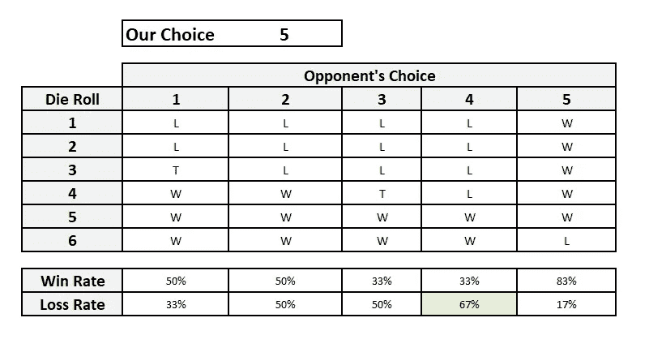

# 数据科学面试的概率和统计问题

> 原文：<https://towardsdatascience.com/probability-and-statistics-questions-for-data-science-interviews-69820cb28c11?source=collection_archive---------34----------------------->

## *如何使用 Python 解决数据科学面试的概率统计问题。*


图片来自 [Canva](https://canva.com/)

数据科学是数学、计算机科学和商业专业知识的交叉。许多人害怕接触数据科学，因为他们害怕高中和大学的代数、矩阵和组合学。虽然我们无法逃避这些，但我们可以通过使用 Python 中的各种库来解决数据科学面试中经常出现的概率和统计面试问题，从而使我们的生活变得愉快并提高我们的 Python 技能。

# 概率统计面试问题的 Python

Python 的一个优势是可以为世界上几乎所有的东西提供大量的库(或包)。在 PyPi 上，我们有超过 30 万个图书馆。它们中的大多数都是开源的，其源代码可以在 GitHub 和其他在线存储库中找到。我们将讨论几个可用于解决概率统计面试问题的方法。我们将主要出于三个目的使用这些库-

1.  列举场景。虽然我们可以列出掷硬币三次的所有可能情况，但在从一副牌中抽取三张牌或掷出五个骰子时，可能无法检查所有情况。我们还可以快速地将结果可视化，以帮助我们更好地理解主题。
2.  计算准确的概率。我们可以通过使用 Python 中的各种科学计算库(SciPy、NumPy 等)来交叉检查我们的分析解决方案，以防解决方案不存在或者我们想要检查我们的工作。
3.  模拟场景和计算经验概率。有时不可能精确计算值。因此，我们可以进行试验，找出观察到的或经验的概率。如果我们适当地设置了实验，那么正如我们将观察到的，结果惊人地接近解析解。这是测试您的解决方案是否正确的好方法。

我们将在这里使用的主要库是-

*   itertools:计算组合学
*   Numpy:用于快速数学计算和生成随机数
*   SciPy:用于使用内置分布函数分析计算概率。
*   Matplotlib 和 Seaborn:快速可视化结果。

# 概率和统计面试问题中测试的领域

数据科学面试问题在概率和统计领域测试的广泛领域包括-

*   组合学
*   例如，概率游戏:掷骰子、掷硬币、从一副牌中抽取
*   条件概率
*   概率分布
*   了解基本的统计术语
    -均值、中位数、众数
    -方差、标准差
*   处理异常值
*   阅读统计图表，如直方图、箱线图等。

StrataScratch 平台有超过 150 个这样的[数据科学面试问题](https://www.stratascratch.com/blog/data-science-interview-guide-questions-from-80-different-companies/?utm_source=blog&utm_medium=click&utm_campaign=medium)，你可以练习并在下一次面试中胜出。

## 五分之二(容易)

*找出在 5 次掷硬币中恰好得到两个反面的概率？*


截图来自 [StrataScratch](https://www.stratascratch.com/?utm_source=blog&utm_medium=click&utm_campaign=medium)

你可以在这里解决这个问题:[https://platform . stratascratch . com/technical/2283-五选二](https://platform.stratascratch.com/technical/2283-two-out-of-five?utm_source=blog&utm_medium=click&utm_campaign=medium)

**解决方案**

这是一个简单的问题。让我们看看所有可能的情况。每次抛硬币有两种结果。结果会像下面的树一样生长出来。


作者创造的形象

抛 n 次硬币后的结果数将是 2 n。这里我们有五次投掷，所以总的可能结果将是 2x2x2x2 = 32。

让我们计算一下有利的结果。我们需要获得两条尾巴。因此，一些有利的结果包括 H-T-H-T-H，H-T-T-H-H，H-H-T-T-H 等。但是 H-T-H-H-H 和 H-T-H-T-T 不会是有利的，因为我们分别有一条和三条尾巴。

因此，为了得到有利的案例，我们需要从五次翻转中选择两次来展示尾部。其余的会露出头来。这可以通过 5C2 或 10 种方式来实现。这些是有利的情况。

我们需要的概率是


***二项分布***

这些类型的布尔值结果，即正面或反面、真或假、是或否等，在概率和统计中非常常见。这些遵循二项式分布，其中 n 次中恰好有 k 次成功的概率由下式给出


在哪里


p 是每个结果中成功的概率,( 1-p)是失败的概率。

在我们的例子中，我们有 n = 5，p =和 k = 2。直接代入，我们得到


让我们用 Python 来计算这些结果。

**使用 itertools**

我们可以使用 itertools 库来枚举所有可能的情况和有利的情况。让我们从所有可能的情况开始。我们需要通过五次抛硬币来找出所有的可能性。我们可以使用 itertools 中的 product()方法来生成这个。

```
flips_5 = list(itertools.product('HT', repeat = 5))
flips_5[:10][('H', 'H', 'H', 'H', 'H'),
 ('H', 'H', 'H', 'H', 'T'),
 ('H', 'H', 'H', 'T', 'H'),
 ('H', 'H', 'H', 'T', 'T'),
 ('H', 'H', 'T', 'H', 'H'),
 ('H', 'H', 'T', 'H', 'T'),
 ('H', 'H', 'T', 'T', 'H'),
 ('H', 'H', 'T', 'T', 'T'),
 ('H', 'T', 'H', 'H', 'H'),
 ('H', 'T', 'H', 'H', 'T'),
 ('H', 'T', 'H', 'T', 'H')]
```

我们可以通过查看清单的长度来核实案例的数量。

```
len(flips_5)32
```

从 flip_5 结果中，我们需要找出有利的结果。所以我们只保留尾部正好为 2 的结果。您可以使用内置的 itertools 方法— filterfalse()为此传递一个 lambda 表达式。

```
favorable_flips = [flip_outcome for flip_outcome in flips_5 if 
len(list(itertools.filterfalse(lambda x : x !='T', flip_outcome))) == 2]
favorable_flips[('H', 'H', 'H', 'T', 'T'),
 ('H', 'H', 'T', 'H', 'T'),
 ('H', 'H', 'T', 'T', 'H'),
 ('H', 'T', 'H', 'H', 'T'),
 ('H', 'T', 'H', 'T', 'H'),
 ('H', 'T', 'T', 'H', 'H'),
 ('T', 'H', 'H', 'H', 'T'),
 ('T', 'H', 'H', 'T', 'H'),
 ('T', 'H', 'T', 'H', 'H'),
 ('T', 'T', 'H', 'H', 'H')]len(favorable_flips)10
```

我们现在可以很容易地计算概率。

```
prob_2T_5flips = len(favorable_flips) / len(flips_5)
prob_2T_5flips0.3125
```

***使用 SciPy***

我们可以使用 SciPy 中内置的二项式分布生成器函数来实现相同的结果。

```
stats.binom.pmf(k = 2,n = 5, p = 0.5)0.3125
```

***使用 NumPy*** 计算经验结果

如果我们不知道如何使用公式计算，也可以尝试模拟许多场景的结果。为此，我们模拟了一百万次投掷五枚硬币的场景。我们在 NumPy 的 random 模块中使用 choice()方法。

```
outcomes = np.random.choice(['H', 'T'], (1000000, 5))
outcomes[:10]array([['T', 'T', 'H', 'H', 'H'],
       ['T', 'H', 'H', 'T', 'H'],
       ['T', 'T', 'H', 'H', 'H'],
       ['T', 'H', 'T', 'T', 'T'],
       ['H', 'H', 'T', 'H', 'H'],
       ['T', 'H', 'T', 'T', 'H'],
       ['H', 'H', 'H', 'H', 'T'],
       ['T', 'T', 'T', 'T', 'H'],
       ['T', 'H', 'T', 'T', 'H'],
       ['H', 'H', 'T', 'T', 'H']], dtype='<U1')
```

有利的结果现在可以通过只设定两个尾部出现的情况来产生。

```
fav_outcomes = [outcome for outcome in outcomes if sum(outcome == 'T') == 2]
fav_outcomes[:10][array(['T', 'T', 'H', 'H', 'H'], dtype='<U1'),
 array(['T', 'H', 'H', 'T', 'H'], dtype='<U1'),
 array(['T', 'T', 'H', 'H', 'H'], dtype='<U1'),
 array(['H', 'H', 'T', 'T', 'H'], dtype='<U1'),
 array(['H', 'T', 'H', 'T', 'H'], dtype='<U1'),
 array(['T', 'H', 'T', 'H', 'H'], dtype='<U1'),
 array(['T', 'H', 'H', 'H', 'T'], dtype='<U1'),
 array(['H', 'T', 'H', 'H', 'T'], dtype='<U1'),
 array(['T', 'H', 'H', 'H', 'T'], dtype='<U1'),
 array(['T', 'H', 'H', 'T', 'H'], dtype='<U1')]
```

最终概率可以像前面一样找到。

```
len(fav_outcomes) / len(outcomes)0.311937
```

可以看出，我们不会得到确切的答案，但我们可以非常接近它。

我们可以将所有的场景(没有尾巴，只有一个尾巴，等等)与使用 SciPy 获得的精确答案进行比较。我们明白了。


作者创造的形象

经验概率与分析计算值非常接近。让我们来看一个更复杂的问题。

## 不同的卡(中号)

*求从一副洗好的 52 张牌中抽出两张属于不同颜色或不同形状(花色)的牌的概率？*


截图来自 [StrataScratch](https://www.stratascratch.com/?utm_source=blog&utm_medium=click&utm_campaign=medium)

你可以在这里解决这个问题:[https://platform . stratascratch . com/technical/2001-异卡](https://platform.stratascratch.com/technical/2001-different-card?utm_source=blog&utm_medium=click&utm_campaign=medium)

**解决方案**

让我们确定所有可能的情况。我们必须一张一张地抽两张牌。因此，可能情况的数量将是 52P2 = 52 * 51 = 2652

现在让我们找出有利的情况。我们需要两张不同颜色或形状(花色)的牌。因此，我们不能画两张黑桃或两张红心。但是我们可以画一个梅花和一个黑桃或者一个心形和一个菱形，因为即使颜色相同，花色却不同。虽然直接计算有利案例的数量并不太困难，但在许多涉及组合学和概率的案例(包括本案例)中，更容易的是计算不利案例，然后从总案例数中减去有利案例数。

我们有哪些不利的案例？让我们否定我们有利的情况。

```
Unfavorable cases = Not (Two cards are not of the same color or shape)
```

从布尔代数中，Not (A 或 B)既不产生 A 也不产生 B。这可以从下面的维恩图中看出。


作者创造的形象

Not(两张卡片颜色或形状不同)可以写成

not(两张卡片颜色不同)和 Not(两张卡片形状不同)

解决双重否定，我们得到

不利情况=两张牌颜色相同，花色相同。

这简单地分解为两张相同花色的牌。(因为同一花色的任意两张牌必须是相同的颜色)

现在我们可以很容易地计算这个。

首先，我们找到一套衣服，它可以用 4C1 = 4 种方式来搭配。

然后我们从这个花色中抽两张牌。每种花色有 13 张牌。因此，路的数量将是 13P2 = 156 路。

两者相加，不利情况数= 4×156 = 624

因此，有利案例的数量将为 2652–624 = 2028 种方式。

概率= 2028 / 2652 = 13 / 17

***替代方法:***

只有抽完第二张牌，我们才会进行比赛。这决定了它是否匹配。在我们从这副牌中抽出任何一张牌后，还会剩下 51 张牌。在这 51 张牌中，有 12 张属于我们已经抽过的同一套牌。我们需要避开这 12 张牌。

因此，有利案例数= 51 -12 = 39，所有可能案例数= 51

因此，概率= 39 / 51 = 13 / 17

***求解使用 Python*** **精确计算:**

使用 itertools，我们首先模拟一个甲板。

```
suits = ['S', 'C', 'D', 'H']
ranks = [2, 3 ,4, 5, 6, 7, 8, 9 , 'T', 'J', 'Q', 'K' , 'A']
cards = [str(rank) + suit for suit in suits for rank in ranks]
cards[:20]['2S',
 '3S',
 '4S',
 '5S',
 '6S',
 '7S',
 '8S',
 '9S',
 'TS',
 'JS',
 'QS',
 'KS',
 'AS',
 '2C',
 '3C',
 '4C',
 '5C',
 '6C',
 '7C',
 '8C']len(cards)52
```

让我们从这 52 张牌中抽出两张。为此，我们将使用 permutations()方法。

```
outcomes = list(itertools.permutations(cards, 2))
len(outcomes)2652
```

这与我们通过分析计算得到的数字相同。现在我们可以计算不利的结果

```
unfavorable_cases = len(list(itertools.permutations(suits, 1))) * 
len(list(itertools.permutations(ranks, 2)))
unfavorable_cases624
```

我们现在可以像前面一样计算概率。

```
probability = 1 - unfavorable_cases / len(outcomes)probability0.7647058823529411
```

**使用 NumPy 进行模拟**

让我们从一副牌中抽出两张牌一百万次。

```
any_two_cards = np.random.choice(cards, (1000000,2))
any_two_cards[:10]array([['QC', '3D'],
       ['5C', 'JS'],
       ['3H', 'AH'],
       ['KS', '6C'],
       ['7S', '5C'],
       ['KC', 'KS'],
       ['4S', '3D'],
       ['4S', 'TD'],
       ['5H', '8D'],
       ['5C', '8S']], dtype='<U2')
```

计算花色(牌串的最后几个字符匹配)的不利情况

```
unfavorable_cases = [selection for selection in any_two_cards if 
(selection[0][-1] == selection[-1][-1]) ]
unfavorable_cases[:10][array(['3H', 'AH'], dtype='<U2'),
 array(['TC', '5C'], dtype='<U2'),
 array(['QH', '6H'], dtype='<U2'),
 array(['9C', 'TC'], dtype='<U2'),
 array(['4S', '8S'], dtype='<U2'),
 array(['8D', '9D'], dtype='<U2'),
 array(['7C', '7C'], dtype='<U2'),
 array(['9D', 'AD'], dtype='<U2'),
 array(['QD', 'QD'], dtype='<U2'),
 array(['AD', '8D'], dtype='<U2')]
```

最后，我们可以像之前一样计算概率。

```
emp_probability = 1 - (len(unfavorable_cases) / len(any_two_cards))
emp_probability0.749957
```

再次，接近实际答案。让我们尝试一个困难的方法来结束这件事。

## 12 面骰子(硬)

*装有 12 个面的骰子有 40%的概率得到 12。剩下的 60%平均分布在骰子的其余面上。两个人各自选择两个不同的数字。数字更接近实际掷骰子的人将获胜。他们应该选择哪个数字？*


截图来自 [StrataScratch](https://www.stratascratch.com/?utm_source=blog&utm_medium=click&utm_campaign=medium)

你可以在这里解决这个问题:[https://platform . stratascratch . com/technical/2280-dice-with-12-faces](https://platform.stratascratch.com/technical/2280-dice-with-12-faces?utm_source=blog&utm_medium=click&utm_campaign=medium)

这是一个极好的问题，可以测试你对概率的理解。这也涉及到一些博弈论。为了解决这个问题，让我们拿一个普通的骰子，有六个面，编号为 1 到 6。我们的目标是选择一个最大化我们获胜机会的号码。如果掷骰子上的数字比对手的数字更接近我们选择的数字，我们就赢了。我们还需要考虑对手的行动，因为结果也取决于她的选择。

让我们假设我们选择了数字 6。我们的对手还有五个选择(从 1 到 5)。她和我们能力相当，所以她会尽量扩大自己的机会。让我们看看是什么情况。


作者创造的形象

我们对手的最佳选择是选择 5，因为在这种情况下，她 6 次中有 5 次获胜。

让我们选择 5 个。我们对手现在的选择是(1，2，3，4，6)。让我们描绘一下场景。



作者创造的形象

与先前的情况相比，我们的机会增加了。现在我们对手的最佳选择是 4，她三次赢了两次。让我们看看如果我们选择 4 会发生什么。我们对手现在的选择是(1，2，3，5，6)。场景是。


作者创造的形象

这对我们来说更好，因为我们至少每次都有均等的机会获胜。我们对手的最佳选择现在是 3，现在是掷硬币决定谁赢。

剩下的三个选项 3、2 和 1 将是 4、5 和 6 的镜像。那么我们从中学到了什么呢？

1.  随着我们向中间移动，我们的机会增加了。这是因为我们留下的数字比我们的对手少，而我们的对手有优势。当我们在角落(1 或 6)时，我们的对手有充分的选择。但当我们走向中心时，我们是在强迫她选择一边，把另一边留给我们。更多的模具辊现在对我们有利。
2.  对我们的对手来说，最好的选择是选择一个与我们最接近的数字，并站在数字更大的一边。如果对手在我们的选择和她的选择之间留下了差距，那么差距中的数字我们双方都可以争夺，例如当她选择 2 而我们选择 4 时，那么 3 导致平局。更糟的是，如果她选 1 而我们选 4，当 3 出现时她就输了。

让我们看看它背后的数学原理。下表显示了我们选择的两边的概率。如上所述，我们需要优化我们选择的两个方面。


作者创造的形象

当我们只为一方优化时，我们的对手可以押注于另一方，赢得的机会更大。因此，对我们和我们的对手来说，最佳选择是 3 和 4。这大致遵循[霍特林关于商店和手推车位置的](https://en.wikipedia.org/wiki/Hotelling%27s_law)定律。

既然我们知道了要计算什么，我们现在可以将它扩展到我们的装载骰子。

我们的目标是牢记对手的行动，最大化我们的机会。所以我们尽可能地覆盖两侧。


作者创造的形象

如果我们选择 9，那么我们的对手可以选择 8 赌骰子掷得更低，或者 10 赌骰子掷得更高。10 是一个更好的选择。此外，获得 9 及以下点数的机会比获得 10 及以上点数的机会小。所以这不是最优选择。如果我们选择 10，那么我们的对手能做的最好的就是 9，与之前的情况相反。

因此，10 是我们的最佳选择，9 是我们的对手的最佳选择。

让我们通过用 Python 模拟来尝试解决这个问题。

我们首先通过传递概率来模拟骰子。我们看了一百万卷这样的骰子。如下图所示，得到 12 的概率是 40%,其余的平均分配。

```
outcomes = np.random.choice(np.arange(1,13), size = 1000000, p = 
np.array([0.6/11] * 11 + [0.4]))
```


作者创造的形象

现在我们把我们的选择和对手的选择公式化，并计算每组选择的结果。最后，我们发现在多少情况下我们的选择比对手的好。正如我们所看到的，当我们选择 10 时，那么在对手的 11 个选择中，我们都有更大的胜算。

```
choices = list(itertools.permutations(np.arange(1,13), 2))
results = []
for choice in choices:
    wins = (abs(outcomes - choice[0] ) < abs(outcomes - choice[1] )).sum()
    losses = (abs(outcomes - choice[0] ) > abs(outcomes - choice[1] )).sum()
    ties =  (abs(outcomes - choice[0] ) == abs(outcomes - choice[1] )).sum()
    results.append([choice[0], choice[1], wins, losses, ties])

results_df = pd.DataFrame(results, columns = ['my_choice','opp_choice', 'wins', 'losses', 'ties'])
results_df['better_choice'] = results_df['wins'] > results_df['losses']
results_df
```


截图来自 [StrataScratch](https://www.stratascratch.com/?utm_source=blog&utm_medium=click&utm_campaign=medium)

```
summ_df = results_df[['my_choice', 'wins', 'losses', 'ties', 
'better_choice']].groupby(by = ['my_choice']).sum()
summ_df
```


截图来自 [StrataScratch](https://www.stratascratch.com/?utm_source=blog&utm_medium=click&utm_campaign=medium)

您可以在此查看用于生成这些统计数据和可视化结果的[整个笔记本](https://github.com/viveknest/statascratch-solutions/blob/main/Using%20Python%20for%20Probability%20and%20Stats%20Questions.ipynb)。

*查看我们的* [*综合统计备忘单*](https://www.stratascratch.com/blog/a-comprehensive-statistics-cheat-sheet-for-data-science-interviews/?utm_source=blog&utm_medium=click&utm_campaign=medium) *了解统计和概率的重要术语和等式*

# 结论

在本文中，我们向您展示了如何使用 Python 中的库来帮助解决数据科学面试中的概率和统计问题。我们通过列出所有案例、使用概率分布函数计算精确的解析解以及模拟场景来近似求解来解决问题。

掌握这些库是获得一份涉及 Python 的数据科学工作的基本要素。通过充分的练习，您可以熟练使用这些库和许多其他库。立即加入 StrataScratch，与 20，000 多名其他有抱负的数据科学家竞争和协作，努力在全球顶级科技公司和最热门的初创公司实现他们的梦想工作。

*最初发表于*[*【https://www.stratascratch.com】*](https://www.stratascratch.com/blog/probability-and-statistics-questions-for-data-science-interviews/?utm_source=blog&utm_medium=click&utm_campaign=medium)*。*