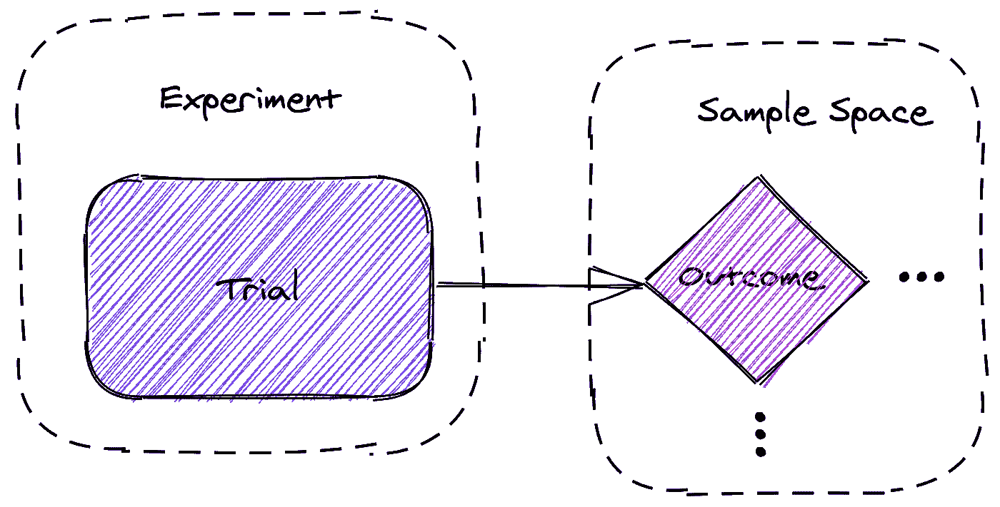
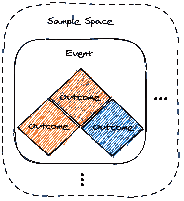
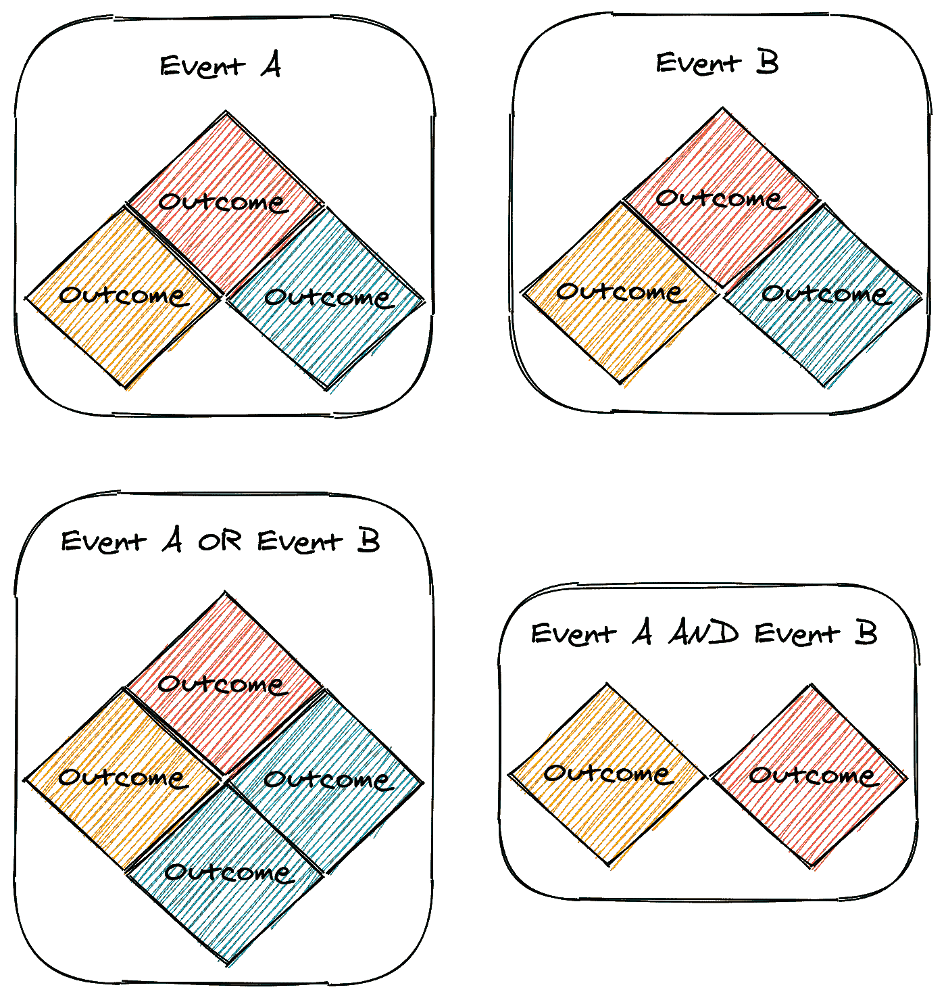
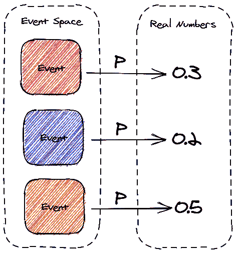
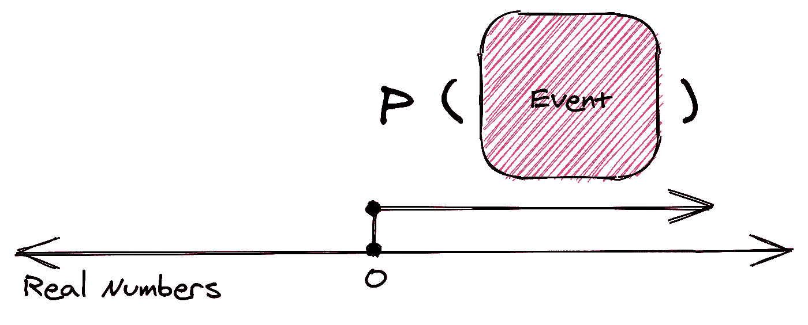
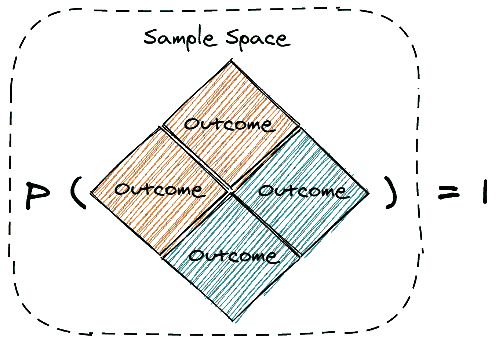
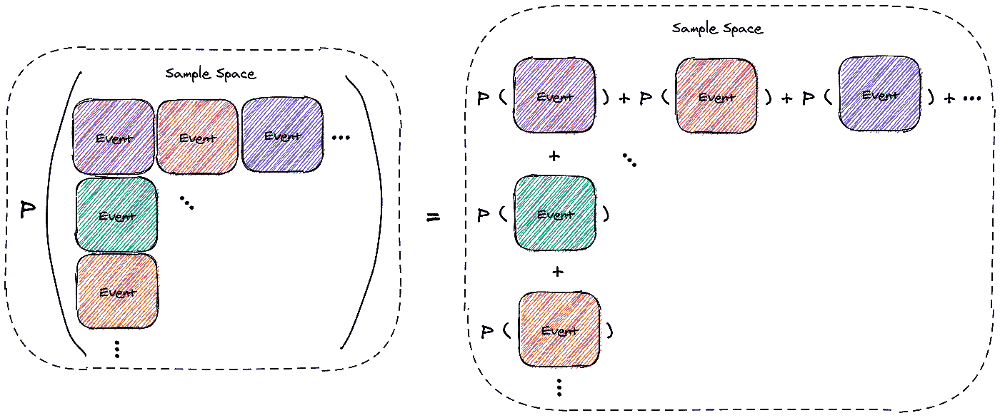

# 图片中的概率公理

> 原文：<https://towardsdatascience.com/probability-axioms-in-pictures-2de96880c868?source=collection_archive---------32----------------------->

## 通过图片呈现的概率三大公理。

三个 [Kolmogorov 公理](https://en.wikipedia.org/wiki/Probability_axioms)支撑着[概率论](https://en.wikipedia.org/wiki/Probability_theory)。在探讨公理之前，先介绍一些常见的概率语言。

一个**实验**是一个观察过程，由于随机效应，其输出不能被确定地预测。*举例:掷骰子。*

试验**是一项实验的单次发生。一个实验的多次尝试可以形成一个新的实验。*例:一个实验由两次掷骰子组成，试验是两次掷骰子实验的一个实例。***

**结果**是试验的观察输出。*例:两次掷骰子实验中掷出 3 或掷出 1 和 5。*

**样本空间**ω是一个实验所有可能结果的集合。*例子:骰子的每一面或有序双掷骰子的实验。*

试验产生结果。图片作者。

一个**事件**T22 一个是样本空间ω中结果的子集。*例子:滚小于 4 的边，滚偶数或滚 2 再滚 3。*

一个事件是一组结果。图片作者。

集合论的运算适用于事件。事件的**联合**是 *A* 、 *B* 或两者中的一组结果。事件的**交集**是 *A* 和 *B* 的结果集合。

两个事件的并集和交集。图片作者。

不包含任何结果的事件称为**空事件**。如果事件 *A* 和 *B* 没有共同的结果，那么 *A* 和 *B* 就是**不相交事件**(互斥)。

概率测度 *P* 是为每个可测量事件分配一个实数的函数。概率度量必须遵循概率公理。

概率度量将事件映射到必须遵循概率公理的实数。图片作者。

现在我们将探讨概率的三个公理。

**第一公理:非负，实数**

事件的概率是一个非负的实数。

概率必须是非负实数。图片作者。

这个公理意味着一个事件的最小概率为零。它没有规定上界，但是概率定理规定了上界。

**第二个公理:单一性**

样本空间中至少有一个结果出现的概率是 1。

结果发生的概率是 1。图片作者。

这个公理意味着，观察一个实验必然会产生一个结果。

**第三公理:可数可加性**

如果在样本空间ω中有一个无限的不相交事件集，那么事件联合的概率等于所有事件的概率之和。

不相交事件的并集的概率等于所有事件的概率之和。图片作者。

该公理在样本空间中的一组不相交事件和每个事件的个体概率之间形成了一种关系。一个概率定理展示了不相交事件的有限集也可以表示为一个无限集。

概率公理随后可以用来推导概率定理。