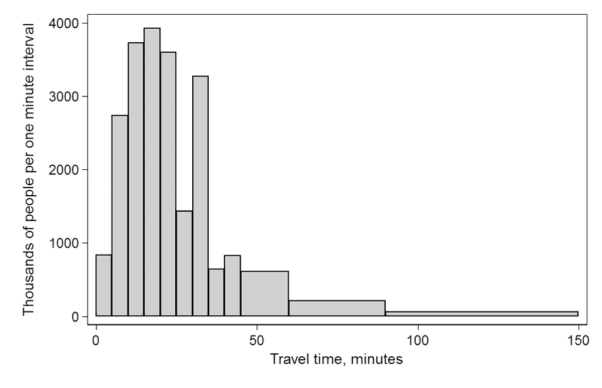
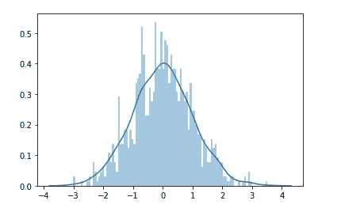
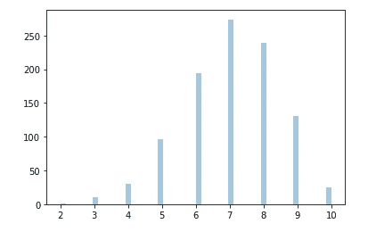
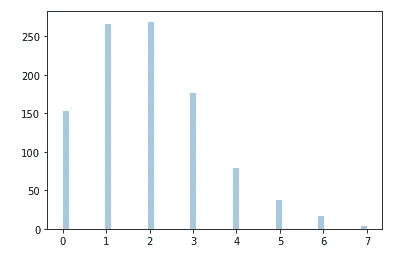

# 概率分布:数据科学家的直觉

> 原文：<https://towardsdatascience.com/probability-distribution-an-intuition-for-data-scientists-72d68a8feb4?source=collection_archive---------29----------------------->


艾米丽·莫特在 [Unsplash](https://unsplash.com?utm_source=medium&utm_medium=referral) 上的照片

## **高斯、二项式和泊松分布的直觉和使用案例**

作为一名数据科学家，如果你被要求找出客户的平均收入，你会怎么做？拥有所有的客户数据当然是“最好的”，但在现实中，它从来不存在，也不可行收集。

取而代之的是，你得到一个小样本，对它进行测量，然后对整个人口进行预测。但是你对你的样本统计数据代表总体有多大把握呢？

统计分布在测量这种不确定性和给你信心方面起着重要的作用。简单来说，概率分布是描述一个变量的特定结果(值)的可能性的函数。平均收入是一个连续变量，这意味着它可以取任何值——2 万美元/年或 8.09 万美元/年或介于两者之间的任何值。这种连续变量可以用特定的概率函数来描述。

然而，并不是所有的变量都是连续型的。一些变量具有二元结果(例如，下雨/不下雨)，而其他变量只是离散的数字(例如，游客数量/小时)。因此，根据变量的类型，概率分布对结果的描述是不同的。

有多少种概率分布？可能是无穷无尽的——看看这个[维基百科页面](https://en.wikipedia.org/wiki/List_of_probability_distributions)就知道了，但是人们很少知道它们全部！在本文中，我将讲述代表三种不同数据类型的三种常见统计分布:

*   **连续变量的正态分布**
*   **二元结果变量的二项式分布**
*   **泊松分布**为计数数据类型

如果您对这三个发行版有了很好的直觉，那么其他发行版应该很容易理解。

那里的大多数资料本质上都是学术性的，充满了数学和方程式，但是我尽量避免它们。相反，我的兴趣是给出这些分布及其关键特征的直觉。额外收获——我还会添加一些用例。

# **正态(高斯)分布**

在理解什么是正态分布之前，让我们看看什么不是正态分布。

根据 2000 年美国人口普查，1 . 24 亿人花费大量时间上下班。如果你做一张人们平均旅行时间的直方图，你会得到下面的分布。



通勤者上班旅行时间直方图。来源:[维基百科](https://en.wikipedia.org/wiki/Histogram)授权: [CC BY-SA 3.0](https://creativecommons.org/licenses/by-sa/3.0)

正如你所看到的，很多人的通勤时间在 10-30 分钟之间，很少有人花不到 10 分钟或超过 50 分钟。

现在将该直方图与以下正态分布的假想变量的理论分布进行比较。如果行驶时间呈正态分布，分布的形状应该是这样的。


数据的理论正态分布。[来源](https://en.wikipedia.org/wiki/Normal_distribution#/media/File:Standard_deviation_diagram.svg):

如果你喜欢玩数字，有一个奇妙的 Python 模块叫做`scipy.stats`，它使用`norm.rvs()`方法生成不同种类分布的随机数据。你也可以用你最喜欢的可视化库(又名`seaborn`)来可视化这个分布。

```
# import libraries
from scipy.stats import norm
import seaborn as sns
import matplotlib.pyplot as plt# generate poisson distributed variable 
# here loc = mean, scale = SD
data_norm = norm.rvs(size=1000, loc=0, scale=1) # visualize
sns.distplot(data_norm, bins = 100, kde=True)
```



均值= 0 的正态分布

## **特性**

正态分布是描述随机变量对称分布的概率函数。也就是说，在正态分布的变量中，数据在均值的两侧是对称的。如果我们从正态分布中随机选取一个观察值，它很可能位于平均值附近。

一些关键特征是:

*   它是连续变量的分布
*   正态分布的曲线是钟形的
*   集中趋势的三个关键指标——均值、中值和众数——都是相等的
*   大约 68%的数据落在平均值的 1 个标准偏差内，95%落在 2 个标准偏差内
*   两种统计方法——偏斜度和峰度——告诉我们一个分布与正态分布有多远。

## **用例**

日常生活中有很多正态分布的例子。人的身高、GRE/SAT 和其他测试分数、测量误差等。通常呈正态分布。以下是一些实际使用案例:

*   正态分布表明某些测量值是错误的还是在预期测量值的范围内
*   它可用于检测异常值和极值，这些异常值和极值位于分布的任意一个尾部
*   z 分数或标准分数是在假设数据呈正态分布的情况下计算的
*   许多假设的统计检验要求检验统计量或误差是正态分布的
*   正态分布是许多机器学习算法中的隐含假设

# **二项式(伯努利)分布**

顾名思义，二项分布是二元结果的概率分布。二元结果的一个例子是询问顾客是否喜欢某个特定的产品。他们的答案——是/否——将形成二项分布。在统计学中，二项分布的一种特殊情况称为伯努利分布。

二项式分布由两个参数描述:

*   *n* ，试验次数
*   *p* ，每次试验成功的概率

我们可以使用`scipy.stats`模块生成生态分布，并使用`seaborn`库将其可视化，如下所示:

```
# import libraries
from scipy.stats import binom
import seaborn as sns
import matplotlib.pyplot as plt# generate poisson distributed variable
data_bin = binom.rvs(n=10, p=0.7,size=1000)# visualize
sns.distplot(data_bin, bins = 50, kde=False)
```



*n=10 次*试验的二项分布

## 特征

对于描述结果概率分布的二项式分布，必须满足以下条件:

*   存在固定/已知数量的观察值，并且这些观察值彼此独立
*   只有两种可能的结果:例如对/错
*   在所有的试验中，获得任何结果的可能性都是一样的

## **用例示例**

*   调查 300 人，询问他们是否对产品满意(是/否)
*   订阅时事通讯的人中有 65%是女性；如果我们想选出 30 名女性，你需要联系多少订阅者？

# 泊松分布

泊松分布模拟/预测/预测某一事件在某一区间内可能发生的次数。每天看医生的病人数量可以被认为是一个泊松过程。

泊松分布仅由一个参数描述，即μ，也称为速率参数。μ代表事件发生的平均速率。

我们可以使用`scipy.stats`模块再次生成泊松分布。`poisson.rvs()`方法只接受速率参数——μ。

```
# import libraries
from scipy.stats import poisson
import seaborn as sns
import matplotlib.pyplot as plt# generate poisson distributed variable
data_pois = poisson.rvs(mu=2, size=1000)# visualize
sns.distplot(data_pois, bins = 50, kde=False)
```



μ = 2 的泊松分布

## 用例

*   在医疗保健中，估计下午 1 点至 2 点间去诊室的病人数量
*   在金融中，预测下个月的保险索赔数量
*   在交通运输中，估计公共汽车在接下来的 10 分钟内到达车站的概率

# 摘要

综上所述，概率分布是描述一个变量发生特定结果(值)的可能性的函数。有不同类型的概率分布，但在本文中，我们描述了三种代表连续、计数和二元结果数据的概率分布:

*   **正态分布**适用于连续变量，在平均值的两侧对称
*   **二项式分布**适用于二元结果，可用于调查二元反应，如真/假、是/否等。
*   **泊松分布**适用于计数数据类型，可以预测某一事件在某一区间内可能发生的次数

我希望这篇文章是有用的。如果你有意见，请随意写在下面。你也可以通过[媒体](https://mab-datasc.medium.com/)、[推特](https://twitter.com/DataEnthus)或 [LinkedIn](https://www.linkedin.com/in/mab-alam/) 与我联系。