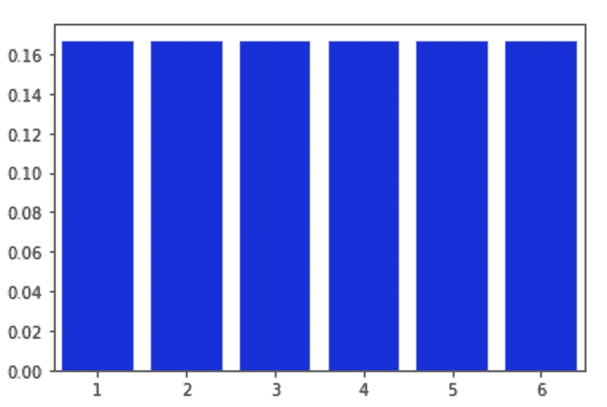
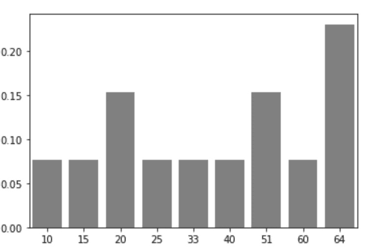
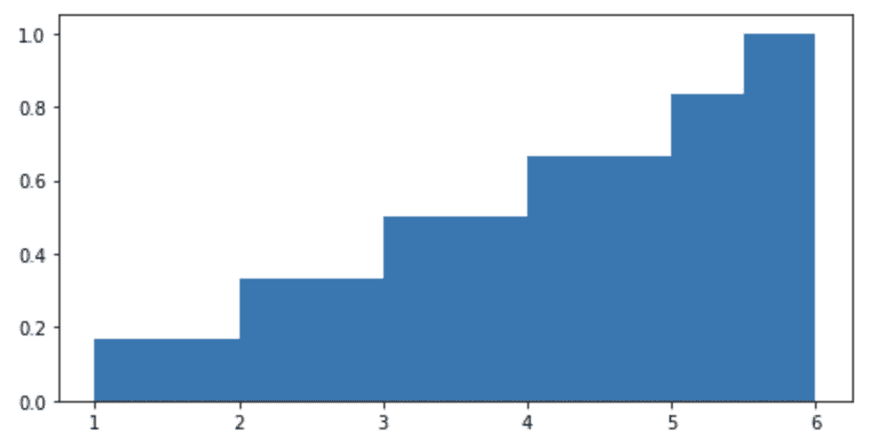
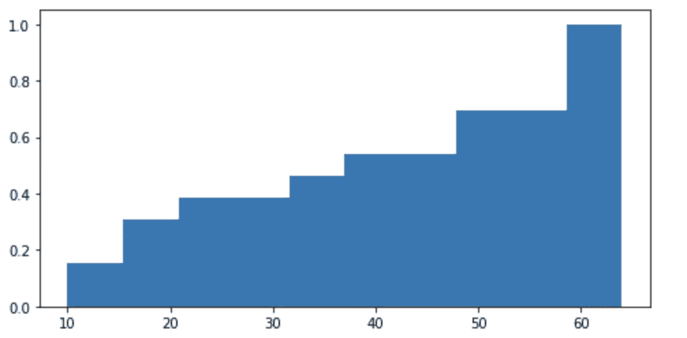
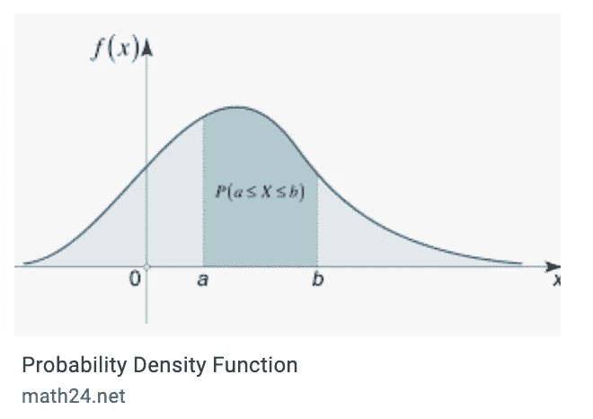
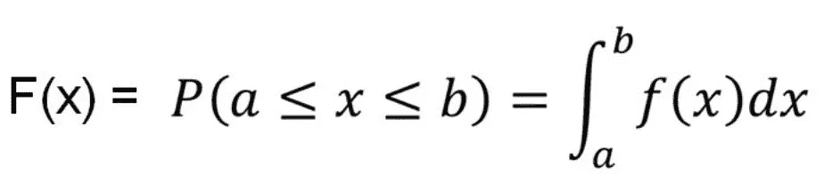

# 去神秘化的概率分布函数

> 原文：<https://towardsdatascience.com/probability-distribution-functions-demystified-a6e882759af3?source=collection_archive---------25----------------------->

## 试图将概率密度函数分解成最基本的原理


(图片由作者提供)

我最近决定尝试使用 Twitter 来谈论数据科学话题。我的目标是从统计学开始，随着我的学习，转移到数据科学中更复杂的主题，并简洁地解释这些主题。以下是我在这里整理的一些关于概率分布函数的帖子。

## **概率质量函数或 PMF:**

*   概率是以样本量“n”的分数表示的频率。为了从频率中推导出概率，你用“n”除频率。这个过程称为规范化。
*   概率质量函数(PMF)将每个值映射到其对应的概率。PMF 是针对离散分布绘制的。对于连续分布，我们有 PDF 或概率密度函数，我们将在后面看到。
*   离散数据采用有限数据集的形式，而连续数据采用无限数据集的形式。
*   让我们举一个离散分布的数据的例子，就像一个无偏差骰子的滚动。样本集看起来会像这样:[1，2，3，4，5，6]。每个数字出现的概率会是 1/6 或者 0.167。这是一个均匀分布，因为样本中所有值的概率都是相同的。所以 PMF 看起来会像这样:

```
import seaborn as sns
from pandas import DataFrame
sample1 = [1,2,3,4,5,6]
df2 = DataFrame (sample1,columns=['DiceRolls'])probabilities = df2['DiceRolls'].value_counts(normalize=True)    
sns.barplot(probabilities.index, probabilities.values, color='blue')
```



掷骰子的 PMF

*   再举一个下面这个例子:【10，15，20，20，25，33，40，51，51，60，64，64，64】。PMF 将如下所示:

```
sample2 = [10,15,20,20,25,33,40,51,51,60,64,64,64]
df3 = DataFrame(sample2,columns=['Sample'])probabilities = df3['Sample'].value_counts(normalize=True)    
sns.barplot(probabilities.index, probabilities.values, color='grey')
```



样本数据的 PMF

*   要从 PMF 中得出平均值，需要计算概率和相应值的乘积之和
*   PMF 有它的局限性。当样本中有太多的值时，阅读和解释 PMF 图就变得很困难。随着每个值的概率降低和随机噪声的影响增加。解决这个问题的一个方法是对数据进行分类。宁滨将数据划分为非重叠值范围。但是很难确定箱子的大小。
*   因此，为了解决这两个问题，我们使用 CDF 或累积分布函数。

## 累积分布函数或 CDF:

*   CDF(x)是随机值“X”小于或等于 X 的概率，或者 CDF(x)表示小于或等于 X 的值的分数
*   让我们举一个标准化测试的例子。如果班上有 A、B、C、D、E 五个人，他们对应的分数是 10、20、30、40、50。CDF(30)表示得分低于或等于 30 的学生百分比，等于(3/5)*100，即 60%。
*   假设你需要找出 x1 和 x2 之间的值的分数，其中 x1>x2，那么你应该找到 CDF(x2)-CDF(x1)。
*   类似地，为了找到特定值大于 x1 的概率，我们做 1-CDF(x1)。
*   让我们看看 PMF 部分中以前的样本的 CDF 是什么样的:

**a .掷骰子**

```
fig, ax = plt.subplots(figsize=(8, 4))
ax.hist(df2.DiceRolls, density = 1, histtype='barstacked',cumulative=True, label='CDF')
plt.show()
```



骰子滚动的 CDF

**b .样本:[10，15，20，20，25，33，40，51，51，60，64，64，64]**

```
fig, ax = plt.subplots(figsize=(8, 4))
ax.hist(df3.Sample, density = 1, histtype='barstacked',cumulative=True, label='CDF')
plt.show()
```



样本数据的 PMF

**PDF 的概率密度函数:**

*   我们前面看到，PMF 是为离散分布定义的。对于连续分布，我们画出一种叫做 PDF 或概率密度函数的东西。
*   根据定义，x 的概率密度是 x 的每单位概率的度量。
*   在 PMF 中，如果选择一个值，比如说 1(在掷骰子的例子中),并试图找到它出现的相应概率，那么我们可以很容易地找到它的概率是 0.167。然而，在 PDF 中，这并不那么简单。
*   在 PDF 的情况下，我们发现 x 的概率位于某个值的范围内，任何单点的概率密度为零，原因是:
*   PDF 计算为图表下的面积，一般来说，面积通过乘以长度和高度来计算。任何一个点的长度都为零。然而，如果我们考虑许多单点的范围或集合，我们可以发现其相应的概率密度是非零的。



便携文档格式

*   让我们考虑另一个连续分布的例子，比如年降雨量
*   假设我们需要找到 3 厘米降雨量的可能性，实际上我们无法精确确定 3 厘米降雨量的概率，因为在任何特定的一天，它可能不精确为 3，它可能是 3.3，3.5，3.001，2.9999——所以我们想找到的是 x 在某个范围内的概率或(3-0.1)的概率
*   Think of it another way, random variable x in case of a continuous variable can take infinite possible values, and in that case probability of x being any single value is very very small or zero
*   Conversely we can say any distribution that can be defined by a PDF is a continuous random variable
*   Just as the sum of all probabilities in a PMF equal 1, the total area under a PDF equals 1



PDF formula

**如果你喜欢这个内容并寻找更多，那么请继续关注，不要忘记关注我的 Twitter 帐户以获得类似的内容【T5**

## 参考

如果没有艾伦·b·唐尼的《Thinkstats》这本书和像汗学院[https://www.youtube.com/user/khanacademy](https://www.youtube.com/user/khanacademy)和奇妙的 zed statistics[https://www.youtube.com/channel/UC6AVa0vSrCpuskzGDDKz_EQ](https://www.youtube.com/channel/UC6AVa0vSrCpuskzGDDKz_EQ)这样的 youtube 频道，这种概率分布函数的汇编是不可能的