# 使用 Python 的 SciPy 介绍概率分布和分布拟合

> 原文：<https://towardsdatascience.com/probability-distributions-with-pythons-scipy-3da89bf60565?source=collection_archive---------0----------------------->

## 如何用分布来模拟随机过程，并使它们适合观察数据

[针线缝纫线眼——pix abay](https://pixabay.com/photos/needle-threads-sewing-thread-4854847/)上的免费照片，由 Myriams-Fotos 拍摄

以下示例教程:

*   SciPy 的概率分布及其性质和方法
*   通过拟合威布尔极值分布来模拟组件寿命的示例
*   一个自动化的拟合程序，从大约 60 个候选分布中选择最佳分布

概率分布描述了受随机过程影响的现象:

*   自然发生的随机过程；
*   或者知识不全导致的不确定性。

随机过程的结果称为随机变量 x。分布函数将概率映射到 x 的出现次数。

SciPy 统计了 104 个连续分布和 19 个离散分布，这些分布可以在它的 *stats.rv_continuous* 和 *stats.rv_discrete* 类中实例化。*离散*分布处理可计数的结果，例如顾客到达柜台。*连续*分布计算 x 轴上两个结果或点之间发生的概率，如高度、温度或时间的变化。

近年来，在传感器数据和其他大量可量化信息来源的快速增长的推动下，与工程和技术相关的分布已经蓬勃发展，这些分布试图对设备的寿命或故障时间以及生物学和药剂学进行建模。SciPy 包括威布尔和极值分布的几种变体，以及对数正态和疲劳寿命或伯恩鲍姆-桑德斯分布，它们适用于可靠性工程中的任务。在文献中，人们可以找到更多最近的合并，如 Weibull-Birnbaum-Saunders 或 Kummer-beta-Birnbaum-Saunders 分布等，用于生产、供应链、建筑、生物、水文和工程等领域。因此，概率分布不仅是股票和期权交易者的主要工具。除了我们经常遇到的均匀分布和正态分布之外，我们还应该看一看。我们的许多数据科学方法依赖于正态分布的数据或残差。然而，为了模拟真实世界的随机过程，我们需要准备识别和评估可选的随机模型。

SciPy 中提供了 123 个发行版:

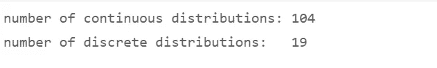

我已经将 60+的 Scipy 连续分布导入到下面将要描述的 fitter 脚本中。不可否认的是，当我看到 fitter 可以相对较快地处理我导入的最初 10 个发行版时，我感到非常高兴。我的结论是，我可以在几分钟内追加 50 个，看看拟合过程是否会在一个或另一个更具外来参数化的分布上出错。到目前为止，它工作得很顺利。

# 0.属国

我们首先引入——除了我们的全天候核心库如 pandas 和 numpy——SciPy 的 *stats* 类。

应该添加两个常数:Kolmogorov-Smirnov 拟合优度检验将从选定的分布中抽取的样本数；显著性水平为 0.05。

接下来，我们编写了一个大约 60 个 SciPy 发行版的列表，我们希望为 fitter 实例化并导入它们。

Python 在其导入语句中不接受像*发行版*这样的列表对象，因此相同的发行版名称必须列出两次。像 AST 这样的库理论上可以帮助自动读取和重新插入导入的内容，但是这些循环比将导入的发行版复制到列表*发行版*需要更多的代码行。

列表*分布*包含我们想要作为我们选择的候选分布传递给 fitter 程序的选择。当然，您可以将列表缩减到更少的候选人，以便从中搜索最合适的候选人。

# 1.SciPy 分布及其性质

在我们深入研究钳工的构造之前，让我们围绕 SciPy 的分发对象进行一次快速的观光旅行，以了解它们是如何工作和交互的。

## 1.1 选择并实例化一个发行版

我们选择β分布作为第一个例子，并通过将其两个形状参数 a(α)和 b(η)设置为 2 和 6 来对其进行参数化。

贝塔分布有非常灵活的形状，比正态分布更灵活。它的默认支持或域是区间[0；下面，我们将看到如何通过向两个共享参数添加位置和比例参数来将支持扩展到更宽的区间。我们对形状参数的选择将使它看起来类似于正态分布的钟形曲线，但并不完全与之一致——它将有点正偏，右边有一条拉长的尾巴。

我们通过应用 *rvs()* 函数生成 1000 个遵循 Beta(2，6)分布的随机变量 x，然后将它们绘制成直方图。

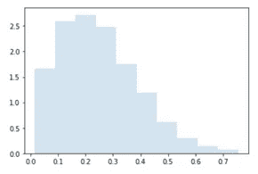

1，000 个随机变量的 Beta(2，6)

SciPy 的 beta 是一个类型为*分布生成器 beta_gen* 的对象，继承自它的连续分布类。

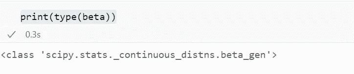

## 1.2 分布的属性

让我们检索 Beta(2，6)的更多属性:矩和形状参数。我们分别计算它们，然后将它们收集在字典 *stats* 中，在那里我们将它们与描述性名称配对，最后我们使用列表理解来逐行美化字典。

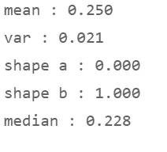

为了一次获得四个核心统计量，即阶为 4 的矩，我们使用了带有关键字*矩=‘mvsk’:*均值、方差、偏斜度和峰度的*统计量*方法。

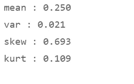

我们观察到一个**偏斜度**不同于我们从标准正态分布中得到的尺度 0。偏斜度衡量分布关于其平均值的不对称性。Beta(2，6)是中度正偏、右尾或右偏的。它的曲线看起来是左倾的，但偏度指的是尾巴的不对称。尾部不会相互平衡，相反，分布的主体或质量集中在平均值的左边，而右边的尾部被拉长。

1，000 个随机变量的 Beta(2，6)

峰度是对分布“尾部”的度量(不是它的“峰值”，与各种来源提供的解释相反)。偏斜度测量尾部之间的不平衡*。相反，峰度高的分布在*或*尾部有产生更多异常值的倾向；它相对于中心是尾部加权的，因此它的中心看起来更薄。尾部比正态分布的平均值的三个标准差延伸得更远，这构成了其质量的 99.7%。在金融或工程中，高峰值表示经历非常小或非常大的观察值的风险较高。*

作为衡量标准，正态分布的峰度为 3.0。但是 SciPy 使用了*过度*峰度并将正态分布的度量校准为 0。过度峰度衡量尾部与正态分布的差异程度。

Beta(2，6)有一个 0.11 的小正超额峰度。接近于零的值表示它是*中间型*-它的尾部仅比正态分布略重，因此其极值模式将是相似的。一个更有特色的正峰度使分布*变细*，意为“瘦”；它在 x 轴上的异常值离中心更远，因此看起来没那么大。相比之下，具有负峰度的宽峰分布有短尾巴；与正态分布相比，它表现出降低的极值倾向。它的行为更容易预测。我们的β(2，6)变量具有足够接近于零的过度峰度，我们可以认为它是中等峰度，仍然非常类似于正态分布。

## 1.3 冻结参数化

在之前的所有代码行中，我们一次又一次地引用 beta(a，b ),将 Beta(2，6)参数化。如果我们不需要在未来的代码行中修改参数，我们可以将分布对象及其当前参数赋给变量 *rv。SciPy 称之为冻结随机变量对象。*

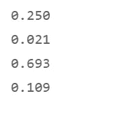

## 1.4 获取概率和分位数

我们引入另外两个函数:概率密度函数 pdf 和百分点函数 ppf。

可移植文档格式文件的扩展名（portable document format 的缩写）

为了绘制概率密度函数 pdf，我们通过让 *linspace()* 绘制一条坐标点线来校准 x 轴。作为端点，我们选择 1%和 99%的分位数:这是β(2，6)分布分别以 1%和 99%的概率不会超过的 x 值。百分点函数 ppf()提供了这些概率下的 x 值。最小值和最大值不适用于具有无界区域的许多分布:理论上，它们的 x 轴可以延伸到正和/或负无穷大，就像正态分布的情况一样；实际上，脚本会报告一个设置为无穷大的轴端点的错误。

## 1.5 发行版的领域或支持

贝塔分布的范围是什么？让我们通过调用它的 *support()* 方法来询问 SciPy。

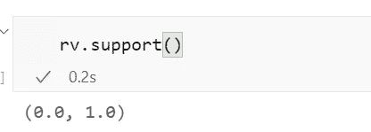

标准的贝塔分布沿着 x 轴从 0 延伸到 1。在这一点上，它与以平均值 0 和标准偏差 1 为中心的标准正态分布没有什么不同，这意味着除了零左右 3 个偏差之外，标准正态分布只携带其质量的极小部分——尽管其尾部理论上确实延伸到无穷大，这些值被观察到的概率越来越小。

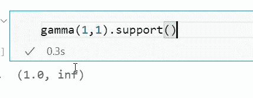

伽马(1，1)分布沿着 x 轴一直延伸到正无穷大。

标准的贝塔分布对于许多实际应用来说太有限了。所以，除了它的两个形状参数，我们再给它配备位置和比例参数。“位置”和“比例”是参数化的，也适用于大多数其他 SciPy 发行版。

## 1.6 重新调整和改变分布

我们通过在行 5 中输入 beta(shape_a，shape_b，loc，scale)来定义移位和重新缩放的 beta 分布，并将结果赋给变量 rv。

可移植文档格式文件的扩展名（portable document format 的缩写）

位置参数 *loc* 沿 x 轴将其最小支持移动到值 100；位置和比例之和将其最大值移动到 100+220 = 320。这种分布可以很好地反映一种现实世界的现象，这种现象服从于 100 和 320 边界之间的随机过程或不确定性。

接下来，我们通过应用 stats()计算前四个矩，并将结果元组转换为第 3 行中的一个列表。因为方差很难解释，我们也计算标准偏差，我们把它附加到第 4 行的矩列表中。我们写下五个指标的名称，然后将值列表与字典中的名称列表进行压缩组合 *moments* ，最后将字典交给 list comprehension，它将在第 8 行中一行一行地打印其内容。

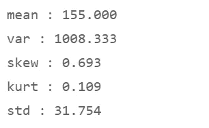

随机过程以平均值 155 为中心，标准偏差为 31.8。因为我们只移动和缩放了曲线，所以它的形状保持不变——它保留了它的偏斜度和过度峰度。

让我们画出累积分布函数 *cdf* 和它的逆函数，百分点或分位数函数 *ppf* 。

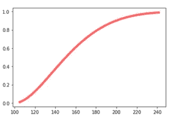

累积分布函数（Cumulative Distribution Function 的缩写）

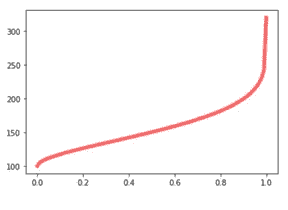

反向 cdf 或 ppf

我们将 x 轴上选定的点(第 2 行中的均值、中值、1%和 99%分位数)提供给 cdf 和 pdf 函数，以获得比浏览图表更精确的结果。第 5 行中的字典理解将 x 值(用作键)与 cdf 和 pdf 值组合，然后打印它们，cdf 在左边，pdf 在右边。

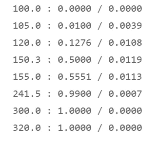

*   在 x = 150.3 时，我们观察到中位数:50%的观察值 x 低于 150.3。
*   在 x = 241.5 时，我们观察到 99%的分位数-99%的 x 值不超过 241.5。

最后，我们将 cdf 的累积概率传递给百分点函数 ppf。第 5 行中的字典理解用 ppf 函数返回的分位数列表压缩了我们上面评估的 x 值。ppf 计算的 x 值应该与我们传递给 cdf 的原始 x 值相匹配。在下表中，我们看到左侧列中的 x 值和右侧的匹配分位数。因此，我们证实了它们的一致性。

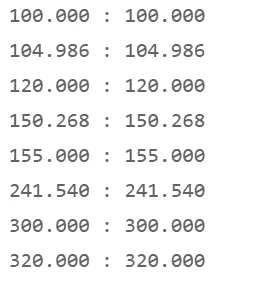

# 2.分布拟合

## 2.1 原则

描述随机过程时，首先想到的分布是正态分布。尽管它在教科书中占主导地位，但它不符合大量随机过程的条件:

*   正态分布关于它的平均值和中间值是对称的。但通常，观察数据表明，产生它们的随机过程是左偏或右偏的，尤其是如果定义域是有界的，例如，如果它在零处有一个硬最小值。
*   正态分布是无界的:它的定义域延伸到正负无穷大。大多数真实的现象都无法用无限的增长或数量来描述；或者它们不能假设负值，这使得正态分布的概率质量的一半无效。
*   正态分布不是重尾的。许多随机过程，例如金融市场中的随机过程，表现出所谓的长尾效应:极端结果发生的概率——对工程或金融决策至关重要——高于正态分布本身的预测。

我们希望符合观测日期的候选分布应根据以下标准进行选择:

*   随机过程的**性质**如果我们能辨别它的话。在现有的 200 多种分布模型中(是的，真的——甚至 SciPy 也没有列举出所有这些模型),许多模型都是为描述特定类型的随机过程而定制的。示例:为了模拟设备故障前的时间——如果故障取决于设备运行的时间——威布尔分布应该是拟合过程中选择的候选分布之一；疲劳寿命或伯恩鲍姆-桑德斯分布是模拟设备寿命的另一种方法。然而，排队——一种不同的随机过程——需要泊松变量来描述。
*   分布的**域**或**支持**代表定义它的 x 值的区间。例如，大多数自然现象和大多数技术过程不能假定为负值。技术故障间隔时间不能为负数。这些过程的候选分布需要有一个非负域。对他们中的一些人来说，这个领域是他们数学定义中固有的。其他的可以进行变换:它们可以被截断或移位，并重新缩放以将其重新校准到非负域，例如半正态分布。SciPy 提供了位置和比例参数，用于将分布的域移动到适当的区间。大多数正态变量代表标准正态分布的移位和重标度变量:平均值从 0 移位到观察值或估计值；标准偏差已从 1 重新校准为围绕移动平均值的重新调整区间，因此，3 个偏差范围内包含约 99.7%的所有事件。
*   观测数据的**形状**。如果随机过程的性质不能被先验地描述，那么直方图的形状将提供关于例如对称、左偏或右偏分布是否将是更好的拟合的线索。
*   **多模型验证:**当我们运行数据科学模型时，我们不会将调查局限于单个模型。相反，我们将**几个备选模型**或至少备选超参数元组应用于数据。类似地，我们需要在拟合过程中尝试几种可选的分布。我们将传递给 fitter 的大量 60+候选人将有助于确定我们不会因为缩短搜索而最终得到一个次优的模型。
*   **拟合优度测试**，如 Kolmogorov-Smirnov 测试，为我们提供了比图表更精确的测试结果，这些图表将观察值的直方图与拟合的分布曲线进行比较。

## 2.2 设备故障时间:拟合威布尔分布

在我们构建自动拟合器之前，我们希望了解如何将选定的个体分布拟合到观测数据中。让我们举一个例子，用威布尔分布来拟合设备寿命问题。

我们将使用一个虚构的数据集:电子电路板的故障时间，该数据集将用于第一艘将宇航员送往火星的宇宙飞船。因此，在地球轨道之外的一些卡车停靠站将没有容易的方法来获得替换零件。

威布尔模型可以从数学上推导为平行失效过程中最薄弱环节出现的时间。它被广泛应用于可靠性工程、水文学、生物学或风能分析等领域。

SciPy 的“威布尔最小极值”分布([威布尔最小极值分布—SciPy 1 . 7 . 1 手册，与 SciPy 的“威布尔最大极值”变量相对)](https://docs.scipy.org/doc/scipy/reference/tutorial/stats/continuous_weibull_min.html)相当于 NIST 解释的威布尔分布(美国国家标准与技术研究所， [1.3.6.6.8)。威布尔分布(nist.gov)](https://www.itl.nist.gov/div898/handbook/eda/section3/eda3668.htm))和维基百科([威布尔分布—维基百科](https://en.wikipedia.org/wiki/Weibull_distribution))。您会发现，用于参数的符号在不同的源之间有很大的不同，将它们标识为形状、比例和位置更安全。

SciPy 以标准化的形式表达它的分布对象。weibull_min 分布只有一个形状参数 c(在维基百科中称为 k，在 NIST 称为 gamma，在其他来源中称为 beta)。比例和位置参数是可选的。

*   如果形状< 1: the failure rate decreases with time, after a kind of burn-in phase
*   if shape =1: constant failure rate =>威布尔分布符合指数分布
*   如果形状> 1:故障率随时间增加

比例参数——在各种来源中表示为λ、α或β——也称为*特征寿命*。随着比例的增加，威布尔分布变得更加对称，类似于正态分布。

一个位置参数，如果包括在内形成一个三参数威布尔变量，也被称为*等待时间:*在 L 小时之前不会发生故障，L ≥ 0。

首先，在等待电路板制造商提供真实数据的同时，我们创建了一组合成观察数据来准备我们的模型。我们希望模拟 1000 个组件的故障时间，以小时为单位，这些组件的测试数据很快就会到达。

我们选择 1.5 的形状——因此，故障率随时间增加——和 50，000 小时的特征寿命或标度。

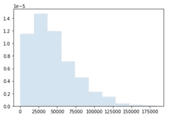

右长尾表明实际数据相当右偏，高于 1.0，而正态分布为 0。故障从时间零点开始，因此不涉及等待时间或位置参数——相反，质量问题会在第一批电路通过工厂大门并在航天中心制成原型后立即出现并开始淘汰。

接下来，我们将实际数据输入到第 6 行中 weibull_min 分布对象的 *fit()* 函数中。

注意参数 *floc = 0* 。 *floc* 表示我已经通过输入带有前缀‘f’的参数名称将位置参数的值固定为 0。fit()函数将搜索形状和比例值，以便威布尔分布反映实际数据；但是它会将位置保持在 0 不变。原因是灵活的位置参数可以极大地影响形状和比例的值。如果我们不阻止 fitter 访问 location 参数，它会在所有三个参数之间寻找最佳折衷。如果我们没有关于随机过程的先验知识，我们可能会对位置犹豫不决。但是，如果我们知道故障可能从时间零点开始发生，即使实际记录开始得稍晚一些，我们也应该将位置设置为零，并让验配员专注于形状和比例，而不受不准确的位置值的不当干扰。验配员不应在较高的位置值与较高或较低的比例或形状值之间进行权衡。

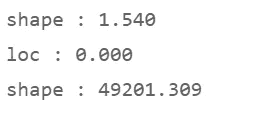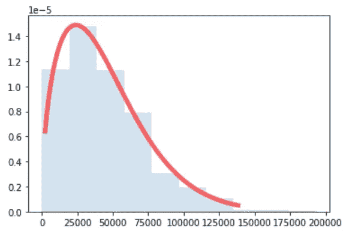

pdf 曲线紧密地跟踪直方图的轮廓。让我们用一个拟合优度的假设检验来确认视觉印象:Kolmogorov-Smirnov KS 检验。

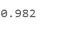

KS 检验非常高的 p 值几乎肯定地证实了三参数威布尔最小值(1.54，0，49201)变量反映了实际数据的结构。

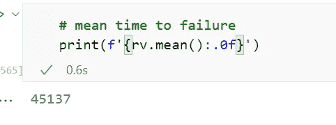

平均无故障时间为 45，137 小时。

让我们假设一个阈值时间点位于 T = 20，000 小时。在时间 T 之后，电路不再被认为是任务关键的，它们将完成它们被分配的任务。

*   下面，我们计算累积分布函数 cdf，它告诉我们在 20，000 小时后，所有电路的 22.4%将已经烧坏。
*   生存函数 sf(T)也可以计算为 1 — cdf(T)。它报告说，在 20，000 小时时，77.6%的电路仍将起作用。
*   在 10，000 小时时，91.4%的电路将会存活。
*   我们还观察到，在最初的 500 小时测试中，只有前 0.1%的电路会出现故障。
*   百分点函数 ppf 告诉我们，直到 1.0%的组件出现故障，需要 2329 个小时。因此，生产后立即进行 500 小时甚至 2300 小时的延长测试不会显著减少故障数量。大多数电路稍后会断开，即不会在地面条件下断开。
*   我们的结论是，我们需要大量的备件库存来替换在最初的 20，000 小时内会烧毁的 22.4%的电路；并且需要训练宇航员安装它们。或者，我们可以尝试提高电路设计的鲁棒性或减少使用时间。

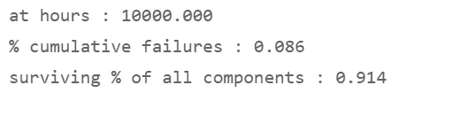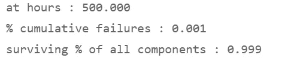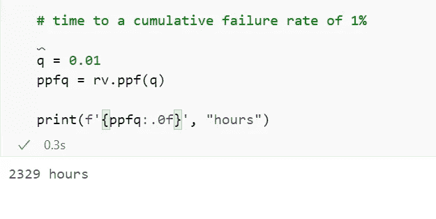

# 3.自动装配工

SciPy 提供了一种方法。分别为每个分布对象安装()。为了建立多模型评估流程，我们将为自动验配程序编写一个脚本。我们将把 60 个候选人的列表输入到装配员的嘴里，让它找到一个与实际观察最接近的随机变量。

我们从 KS 拟合优度测试的函数开始，该函数将被调用 60 次，以比较给定候选分布与实际数据的距离。

接下来，我们编写一个短函数 *fitdist()，*，它适合所选的候选项，然后调用 KS 测试。和以前一样，我们将所有候选对象的位置参数冻结为 0:*floc = 0*。这是一个默认设置，如果您想扩大解决方案的范围，可以选择修改它。

第二行让列表理解发挥作用。理解从脚本顶部的列表*分布、*中提取每个分布对象，并将其传递给 fitter 函数。

comprehension *res* 返回所有拟合分布的参数，以及它们各自 KS 测试的 p 值，并将它们列表在数据框中。

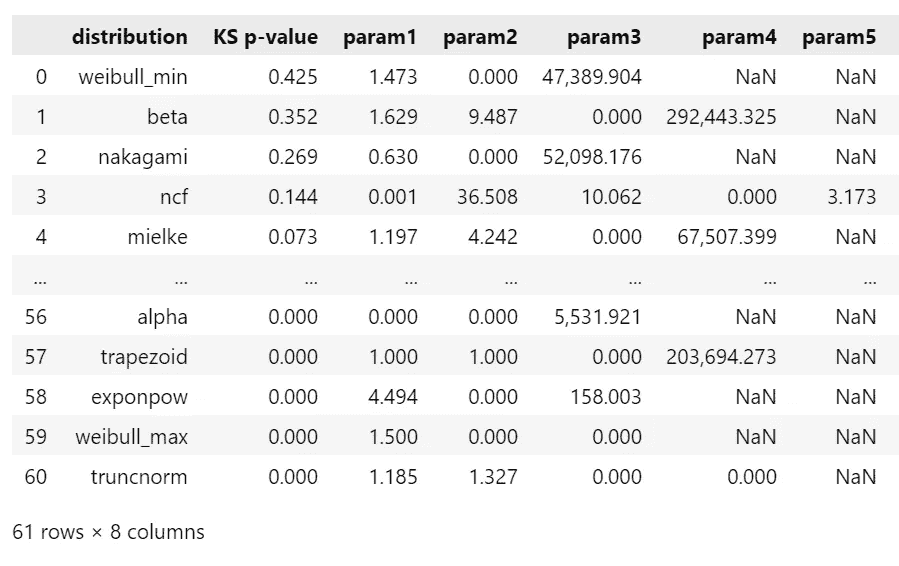

数据框包含 61 个拟合分布及其参数。

我们准备了一个绘图函数，可以绘制出函数调用方传递给它的所有分布。

绘图功能

*   确定绘制数据帧中的所有分布需要多少行，每行三个子图，
*   从数据帧中提取分布的行及其参数，
*   忽略具有 NaN 值的参数，
*   将 x 轴的端点校准到 1%和 99%分位数，
*   绘制实际观察值的直方图，
*   并绘制所选分布的 pdf。

在调用绘图函数之前，我们在第 2 行中进行选择:我们只需要那些显示 KS 测试结果的候选分布的图表，其 p 值高于显著性水平 ALPHA = 0.05。我们忽略提供更差匹配的候选人。在这个例子中，61 个候选人中只有 6 个成功通过了 KS 测试。在代码调用绘图仪函数 *plot_fitted_pdf()* 之前，脚本创建一个数据帧 df_ks，该数据帧仅限于这六个 ks 批准的发行版。

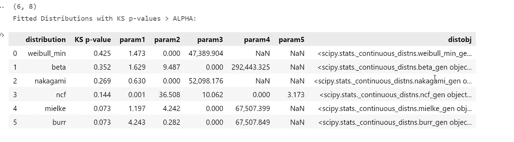

*   不出所料，双参数威布尔最小分布以 42.5%的 p 值领先该领域。
*   具有 2 个形状值和 1 个比例值的 3 参数 Beta 分布达到 35.2%。
*   双参数 Nakagami 分布是 Gamma 家族的亲戚，达到 26.9%的固体 p 值。
*   非中心 f 分布、Mielke 分布和 Burr 分布是更奇特的候选分布，其 p 值超过了显著性阈值，但与威布尔分布和贝塔分布相比，拟合质量有所下降。

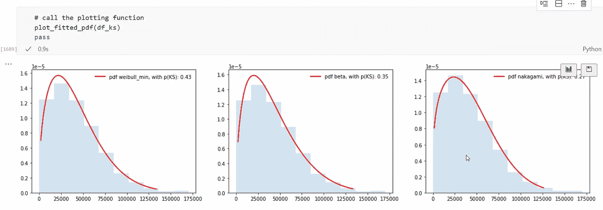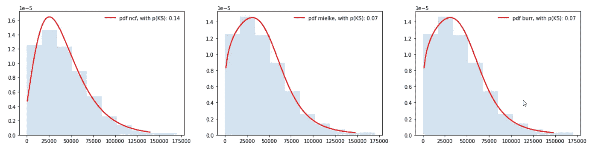

脚本选择具有最高 KS p 值的候选，weibull_min，并将其赋给变量 *D_opt* 。

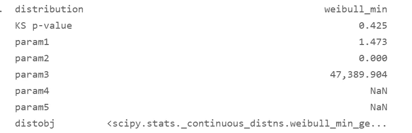

我们可以开始检查和处理这个最佳拟合，就像我们在示例中处理任何其他分布实例一样。

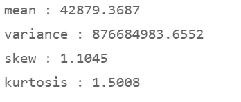

*   stats()函数报告拟合分布的四个主要矩。
*   我们可以获得平均故障时间，并询问在该时间点有百分之多少的组件会发生故障:57.8%。统计和百分点函数告诉我们平均无故障时间将是 42，879 小时。当所有电路的 50%将变暗时，平均故障时间将为 36，949 小时。
*   威布尔最小分布的支持当然是在从时间零到正无穷大的区间内。

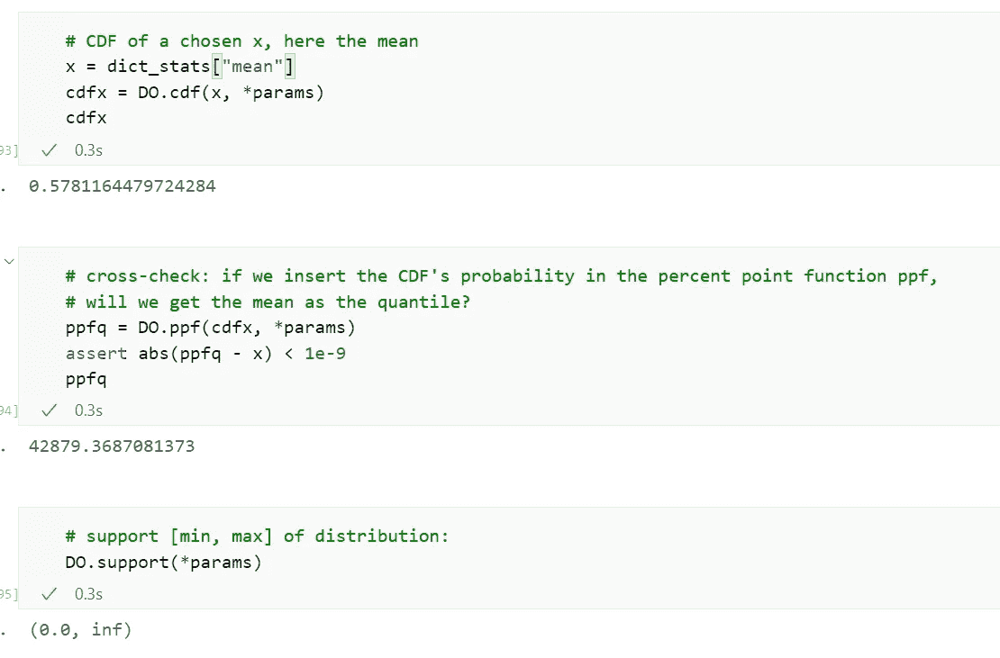

今天的教程到此结束。

*   我们已经回顾了 SciPy 的分布类以及与它们相关的方法和属性。
*   我们将选定的分布(威布尔最小值)拟合到一组代表故障时间观察值的合成数据中，从而模拟了可靠性工程中的一个问题。
*   最后，我们编写了一个更合适的过程，根据 61 个候选分布的列表测试实际分布，其中三个在我们的示例中提供了非常好的拟合，当我们对它们运行 Kolmogorov-Smirnov 测试函数时，p 值超过 20%。

Jupyter 笔记本可以在 GitHub 上下载:[h3ik0th/dist fitter:SciPy distribution fitting(github.com)](https://github.com/h3ik0th/DistFitter)

*   标题图片:皮查拜的 Myriams-Fotos
*   所有其他图片:作者