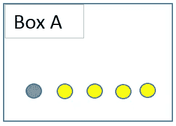
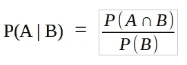
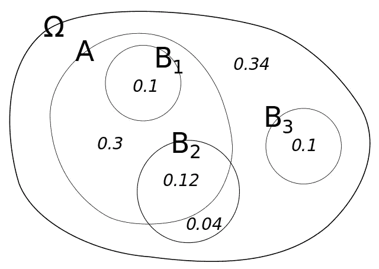
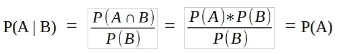
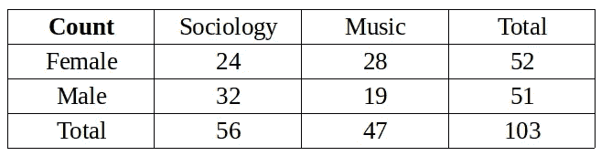
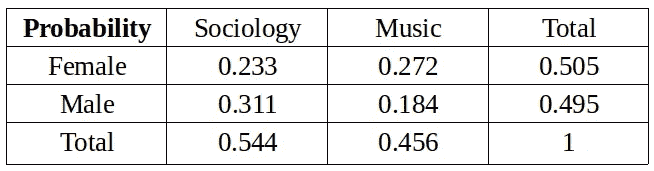

# 数据科学家的概率论

> 原文：<https://towardsdatascience.com/probability-theory-for-data-scientists-fcfa7be05291?source=collection_archive---------28----------------------->

## 概率、条件概率和联合概率

莫里茨·金德勒在 [Unsplash](https://unsplash.com/s/photos/dice?utm_source=unsplash&utm_medium=referral&utm_content=creditCopyText) 上拍摄的照片

生活充满了惊喜，所以我们永远不知道事情会如何发展。但是，我们可以根据以前的经验或逻辑进行猜测。根据一个事件的特征，我们的猜测可能会非常成功。

在数学中，我们不做猜测。相反，我们计算概率。生活也充满了数学的惊喜，所以有一个计算的概率值并不能保证正确的答案。但是，我们会知道，我们的猜测是基于数学的，客观的，没有偏见的。

概率论对于数据科学非常重要。要成为一名出色的数据科学家，需要对概率论有全面的理解。例如，概率分布在预测分析中起着关键作用。

概率只是指事件发生的可能性，通常取 0 到 1 之间的值(0 和 1 包括在内)。事件 A 的概率被表示为 **p(A)** ，并且被计算为期望结果的数量除以所有结果的数量。例如，当你掷骰子时，得到小于 3 的数字的概率是 2 / 6。期望结果的数量是 2 (1 和 2)；总结果数为 6。

(图片由作者提供)

我有一个盒子，里面有 1 个蓝色的球和 4 个黄色的球。如果我从这个盒子里随机选择一个球，它很可能是黄色的。

选到黄球的概率 p(黄色)是 4 / 5，等于 0.8(或 80%)。期望结果的数量是 4，总结果的数量是 5。

照片由[Dawid za wia](https://unsplash.com/@davealmine?utm_source=unsplash&utm_medium=referral&utm_content=creditCopyText)在 [Unsplash](https://unsplash.com/s/photos/cloudy?utm_source=unsplash&utm_medium=referral&utm_content=creditCopyText) 上拍摄

## 条件概率和联合概率

当有人问你是否认为会下雨时，你的第一反应通常是看天空。如果有乌云，你更有可能回答“是”。你先查条件再给答案。

我们在条件概率的概念后面观察到一个相似的逻辑。假设事件 B 已经发生，事件 A 的概率表示为 **p(A|B)** 。

> 条件概率是在与事件 A 相关的另一事件已经发生的情况下，事件 A 发生的可能性。

条件概率的公式如下所示:

(图片由作者提供)

P(A ∩ B)是事件 A 和 B 都发生的概率。P(B)是事件 B 发生的概率。

让我们通过一个例子来理解条件概率的概念。在下图中，我们看到一个概率空间(ω),表示所有概率的总和为 1。

(图片来源:[维基百科](https://en.wikipedia.org/wiki/Conditional_probability#/media/File:Conditional_probability.svg))

事件 A 的无条件概率，

P(A) = 0.1 + 0.3 + 0.12 = 0.52

给定 B2 事件发生的条件概率 P(A | B2)，

P(A | B2)= P(A∩B2)/P(B2)= 0.12/0.16 = 0.75

假设 B2 发生，事件 A 的概率增加。

条件概率是概率论和统计学中的一个基本概念。例如，贝叶斯统计源于对条件概率的解释。在机器学习中，朴素贝叶斯算法基于贝叶斯定理和条件概率。

关于条件概率，有几个要点需要强调。

*   给定的条件可能对事件没有任何影响，因此条件概率和无条件概率相等(即 P( A | B) = P(A))。在这种情况下，事件 A 和 B 被认为是**独立的**。

换句话说，如果两个事件相互独立，给定 B 的条件概率等于 A 的概率。它来自于**联合概率的一个性质。**

联合概率是两个事件同时发生的概率。如果两个事件是独立的，则联合概率是通过将每个事件的概率相乘来计算的。

P(A ∩ B) = P(A) * P(B)

如果我们把它放到条件概率的等式中:

(图片由作者提供)

*   条件概率通常不可交换，这意味着 P(A | B)不等于 P(B | A)。

例如，我们之前已经计算出 P(A | B2)为 0.75。让我们也计算 P(B2 | A)并比较结果。

P(A | B2)= P(A∩B2)/P(B2)= 0.12/0.16 = 0.75

P(B2 | A)= P(B2∩A)/P(A)= 0.12/0.52 = 0.23

最后，让我们再做一个例子。下表显示了选修社会学和音乐课的男女学生人数。

(图片由作者提供)

有 103 名学生。我们将首先计算无条件概率。

p(女性)= 52 / 103 = 0.505

p(男性)= 51 / 103 = 0.495

p(音乐)= 47 / 103 = 0.456

p(社会学)= 56 / 103 = 0.544

p(女)表示一个学生是女性的概率。

联合概率可以通过将单元中的数字除以学生总数来计算。例如，一个学生是女性并且注册了社会学课程的概率:

p(女性∩社会学)= 24 / 103 = 0.233

我们可以类似地计算其他联合概率。下表包含了这些事件的所有概率。

(图片表格)

我们现在将计算条件概率。

*   假设一个学生注册了音乐班，那么这个学生是女性的概率是多少？

P(女|乐)= P(女∩乐)/ P(乐)

= 0.272 / 0.456 = 0.596

*   假设一个学生注册了社会学课程，那么这个学生是男性的概率是多少？

P(男性|社会学)= P(男性∩社会学)/ P(社会学)

= 0.311 / 0.544 = 0.572

## 结论

不确定性在我们的生活中无处不在。因此，任何科学领域都需要在实践和理论上处理不确定性。

概率论在数据科学领域也是至关重要的。由于我们无法消除不确定性，我们需要积极主动的方法来有效地处理它。例如，变量的概率分布在预测分析中起着关键作用。要成为一名优秀的数据科学家，需要对概率论有全面的理解。

感谢您的阅读。如果您有任何反馈，请告诉我。