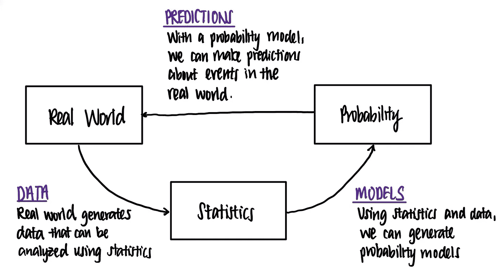

# 数据科学和机器学习的概率与统计

> 原文：<https://towardsdatascience.com/probability-vs-statistics-for-data-science-and-machine-learning-84f00bf67ce1?source=collection_archive---------19----------------------->

## 有什么区别，为什么数据科学家应该知道它们

Wolfgang Hasselmann 在 [Unsplash](https://unsplash.com?utm_source=medium&utm_medium=referral) 上拍摄的照片

# 概率和统计——哪个更重要？

我们几乎总是一起讨论概率和统计。

事实上，学生不知道统计与概率的区别并不少见。

但是哪个先来呢？甚至有什么区别？

这是个先有鸡还是先有蛋的问题。没有统计就不可能有概率，反之亦然。我这么说是什么意思？我会在这篇文章中解释更多。

在这篇短文中，我将强调概率和统计之间的一些差异，以及概率和统计在数据科学中的一些应用。

由此，我希望你能获得或有一个新的视角，为什么数据科学家需要知道概率和统计。

# 可能性

爱德华多·苏亚雷斯在 [Unsplash](https://unsplash.com?utm_source=medium&utm_medium=referral) 上拍摄的照片

概率是数学的一个分支，根据维基百科，它用数字描述一个事件(如抛硬币)发生的可能性。

让我们继续公平抛硬币的例子。

我们*没有实际将要发生什么的数据*，但是我们仍然可以用概率来回答下面的问题——

*   下一次抛硬币是正面的概率是多少？
*   5 次翻转中有 3 次是正面的概率是多少？
*   在我们看到尾巴之前，我们将硬币翻转 9 次的概率是多少？

这些概率问题向我们展示了以下内容—

> 在概率方面，我们从描述随机事件发生可能性的**模型**开始。然后我们预测事件发生的可能性。

在这里，抛硬币的'**模型**'是硬币是公平的，即硬币正面或反面落地的概率是 50%。我们假设这个模型是正确的，反映了事实。

当我们使用概率模型时，我们没有关于*实际上* 会发生什么的数据，但是我们可以量化我们*预期* 会发生什么。

综上所述，**在概率上，我们基于一个没有实际数据的模型来预测未来事件发生的可能性有多大。**

# 统计数字

要做统计，必须先有数据。艾萨克·史密斯在 [Unsplash](https://unsplash.com?utm_source=medium&utm_medium=referral) 上拍摄的照片

这种概率总结与统计学形成对比。**在统计学中，我们根据观察到的实际数据推断出真相或模型。**

事实上*，统计学是一种数学分析的形式，根据维基百科的说法*，它对一组给定的实验数据使用量化的模型、表示和概要。

注意对*的强调，“一组给定的实验数据”。*做任何统计工作都需要我们从一组数据开始。

现在，我们得到了一枚我们一无所知的硬币。假设在 100 次抛硬币中，我们观察到 90 次正面和 10 次正面，我们可以使用统计学中的概念回答以下问题:

*   硬币公平吗？(*大概不会)*
*   我们有多大把握认为这枚硬币是不公平的？(*相当)*
*   从硬币中得到一条尾巴的*实际*概率是多少？(*最有可能 10%)*

从这里，我们可以看到

> 在统计学中，我们查看给我们的一组数据，然后我们对用于生成这组数据的模型做出推断。

在这个例子中，我们不知道硬币的真相，就像概率一样。相反，我们知道一些关于硬币的数据，我们回顾过去对硬币做出推断。

# 概率与统计

概率和统计是硬币的两面。西蒙在 [Unsplash](https://unsplash.com?utm_source=medium&utm_medium=referral) 上的照片

我喜欢把统计和概率看作是两个硬币的不同端——它们有着内在的联系，但彼此相反。

*   概率是从模型到数据的**，而统计是从数据到模型的**。
*   概率讲的是**向前看**(基于事实做出预测)，统计讲的是**向后看**(基于事件理解事实)。

事实上，斯坦福大学统计学教授佩尔西·戴康尼斯很好地总结了这些差异

> *概率*和*统计*考虑的问题是互逆的。在概率论中，我们考虑一些由随机变量模拟的具有随机性或不确定性的潜在过程，并找出发生了什么。在统计学中，我们观察已经发生的事情，并试图找出解释这些观察结果的潜在过程。

# 概率与统计

概率是统计学和机器学习的阶梯。照片由[约瑟夫·阿克布鲁德](https://unsplash.com/@byteforbyte?utm_source=medium&utm_medium=referral)在 [Unsplash](https://unsplash.com?utm_source=medium&utm_medium=referral) 上拍摄

现在我们已经比较了概率和统计，我们是否也可以看到概率和统计是如何相关的？

概率和统计是同床异梦。人们通常先学习概率，然后在此基础上学习统计学，而概率是通向统计学的阶梯。对统计学的深刻理解也会增强一个人对概率的鉴赏能力。

在我最喜欢的一个讲座中，Tsitsiklis 教授在 6.431x [概率系统分析和应用概率](https://ocw.mit.edu/courses/electrical-engineering-and-computer-science/6-041-probabilistic-systems-analysis-and-applied-probability-fall-2010/)中描述了概率和统计之间的关系

> 概率至少给了我们一些系统思考不确定情况的规则。如果我们的概率模型与现实世界有某种联系，那么概率论可以成为一种非常有用的工具，用于做出适用于现实世界的预测和决策。
> 
> 你的预测和决策是否有效取决于你是否选择了一个好的模型。有一个完整的领域，统计学领域，其目的是通过使用数据提出好的模型来补充概率论。*【1】*

下图总结了这种关系。

概率与统计的关系。图片作者。

# 概率、统计、数据科学和机器学习

在这里，我将概述一些概率和统计对数据科学家至关重要的情况。

1.  **计划 A/B 测试或实验**

为了理解 AB 检验，我们需要理解 p 值的概念，这是一个概率概念，它告诉我们当零假设实际上是正确的时候，它是错误的概率。为了获得对 p 值的直观理解，需要很强的概率基础。

AB 测试的另一个步骤是获得实验的样本量。为了将实验结果推广到一般人群，需要一个适当的抽样方案。为了计算所需的样本量，需要理解实验中的*功效和误差类型*的概念，这些概念包含在统计学中。

2.**机器学习建模**

由[在](https://unsplash.com/@hiteshchoudhary?utm_source=medium&utm_medium=referral) [Unsplash](https://unsplash.com?utm_source=medium&utm_medium=referral) 上拍摄的照片

此外，许多有抱负的数据科学家不知道，机器学习的理论基础本质上是先进的统计概念和数学。许多机器学习模型建立在数据遵循特定类型分布的假设上。

如果不了解概率，数据科学家将无法决定数据是否满足机器学习模型的假设，因此可能无法在机器学习模型中做出最佳选择。

例如，线性回归模型假设每个数据点的噪声遵循正态分布。为了理解这意味着什么，数据科学家应该知道什么是正态分布，也就是你在概率中所学到的。

因此，无论你是使用普通的机器学习方法还是深度学习方法来运行回归、分类或聚类模型，你都不能逃避统计。

# 在哪里学习数据科学中的概率

**对于也想学习编程和编码的新学员**，Datacamp *上的 [HarvardX 的数据科学-概率(PH125.3x)将提供一个关于概率的温和介绍，同时允许您在 r 中实现概率。此外，这还附带了一个关于 2007-08 年金融危机的激励性案例研究，这可能是一个您可以进一步研究和展示您的投资组合的项目。](https://www.datacamp.com/courses/harvardx-data-science-probability-ph1253x?tap_a=5644-dce66f&tap_s=1264035-087d1d&utm_medium=affiliate&utm_source=travistang)

**对于进阶学习者，**我建议[参加 HarvardX Stat 110:概率入门](https://tidd.ly/3qe9LLz) *。这个班是迄今为止我参加过的最有收获的一个班。布利茨坦教授是我最喜欢的概率教授之一，他严谨而直观地讲述了这些话题。

这里还有一个完整的指南—

</how-to-learn-data-science-and-probability-in-2021-ee7b5d5e0a49>  

# 在哪里学习数据科学中的统计学

**对于新的学习者，**我推荐[学习 EdX 基础的统计推断和使用 R*](https://tidd.ly/3qvOOvU) 建模。这门课是为统计背景有限且实践经验很少的新学员开设的。它的目的是让学生理解为什么这种方法有效(理论)，如何实现它(使用 R 编程)以及何时应用它(如果特定的方法在特定的情况下不适用，在哪里寻找)。如果你喜欢的话

**对于高级学习者，**我建议[参加 MITx:统计学基础](https://tidd.ly/3qrEQLH) *。这门课是严格的，是为雄心勃勃的学习者设置的研究生水平，这些学习者希望理解高级概念，包括拟合优度测试、一般线性模型和主成分分析，以及上述典型的统计学主题。

这里说的课都是可以免费旁听的。如果你喜欢这门课，你可以追求一个经过验证的证书来突出你在概率方面的知识。

# 结论

概率和统计是数据科学的重要组成部分。事实上，根据 [IBM 数据科学技能能力模型](https://www.ibm.com/downloads/cas/7109RLQM)，以下是数据科学家 28 项主要能力中的 2 项。

> 理解概率论和概率分布
> 
> 展示推理统计学的知识

它们对数据科学家来说都很重要。所以，同时学习这两种语言总是一个好主意。

如果您有任何问题，或者只是想一起学习数据科学，请随时与我联系。

<http://www.linkedin.com/in/travistang> [## Travis Tang —数据分析师

www.linkedin.com](http://www.linkedin.com/in/travistang) 

这是概率系列的一部分。这是一个很小的数据科学，你现在可以在 5 分钟内学会。

1.  [概率模型和公理](https://medium.com/analytics-vidhya/learn-data-science-now-probability-models-3c5fd7863a33)
2.  概率 vs 统计(你来了！)
3.  条件概率(即将推出)
4.  贝叶斯统计(即将推出)
5.  离散概率分布(即将推出)
6.  连续概率分布(即将推出)
7.  平均值和大数定律(即将推出)
8.  中心极限定理(即将推出)
9.  联合发行(即将推出)
10.  马尔可夫链(即将推出)

# 参考文献和脚注

[1]约翰·齐茨克里斯。6.041 概率系统分析和应用概率。【2010 年秋天。麻省理工学院:麻省理工学院开放课件，【https://ocw.mit.edu】T2。许可:[知识共享协议 BY-NC-SA](https://creativecommons.org/licenses/by-nc-sa/4.0/) 。

*这些是我推荐的课程的附属链接。这意味着，如果你点击链接后购买，我会收到一定比例的费用，没有额外的费用给你。