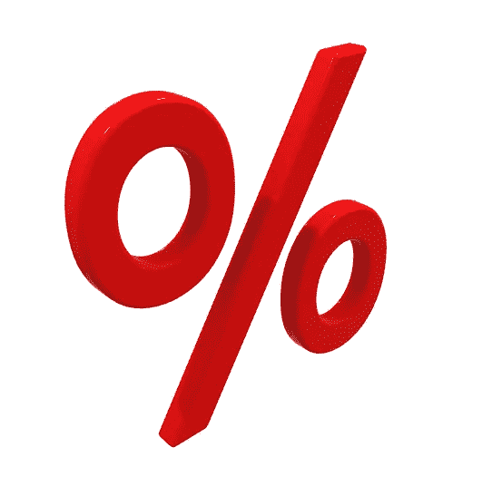
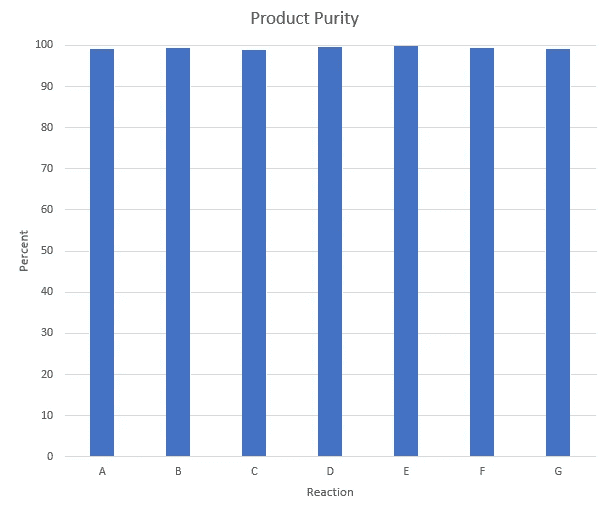
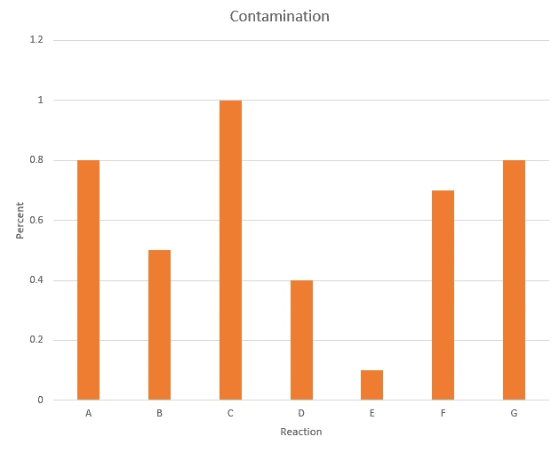
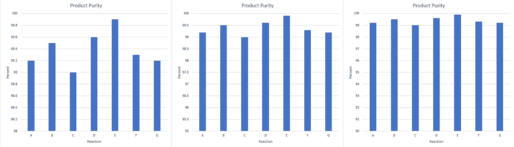

# 图形百分比的问题

> 原文：<https://towardsdatascience.com/problems-with-graphing-percentages-6e61f2db5bd8?source=collection_archive---------42----------------------->

## 有时候你需要知道什么时候打破规则

作者图片

当创建带有数字 y 轴的图形时，我们经常被告知“从零开始”的规则。但是和所有规则一样，我们需要知道什么时候遵守规则，什么时候打破规则。鉴于此，我想谈谈绘制百分比。

我最近参加了一个关于数据可视化的课程，经常听到一些同学提到这个规则(可能不是用那些确切的词)，就像它是福音一样。当我回答时，我通常会说这样的话，“但是百分比很奇怪。”

我的背景是化学，所以当讨论百分比时，我首先想到的是纯度。当谈到化学纯度时，我们通常会报告我们最感兴趣的东西的百分比。因此，如果我们幸运的话，化学合成可能有 90%的纯度，如果我们运气不好，可能有 30%的纯度。这两个数字之间的差异是显而易见的。不那么明显的是 99.0%和 99.9%的纯度有多大区别。这些数字看起来非常接近，差别可以忽略不计。但真的是这样吗？

假设我们用稍微不同的反应条件进行了六次反应，得到的纯度范围为 99.0–99.9%。如果我们要绘制“从零开始”的图，我们会得到这样的图:

作者图片

从这个图表中，看起来不同的反应之间几乎没有区别。事实是，如果我们看事物的另一面(污染物)，从 99.0%纯度到 99.9%纯度意味着污染物从 1.0%下降到 0.1%，这意味着我们的污染物下降了一个数量级。如果污染物是水，这可能没什么大不了，但如果污染物是砷，那就麻烦了。现在，如果我们知道只有一种污染物，我们可以创建一个污染物浓度图，如下所示:

作者图片

但是如果污染是由多种物质混合造成的呢？好吧，你可以像上面的图一样画出污染物总量，但是如果你想关注纯度，那么你可能想画第一张图。但是，如果我们想显示反应之间的差异，那么我们需要以某种方式调整尺度。在这种情况下，我们抛出“从零开始”的规则，从更合理的东西开始。在这一点上，你的问题是决定最好的规模。这是最难的部分。你想展示不同之处，但又不想表现得太极端。这里有三个选择。

作者提供的图片

你会选择哪个？你想讲什么故事？小心不要过度推销你的想法。

正如我在开头所说的，百分比很奇怪，也很棘手。

看看我以前的文章。

 [## 用拨浪鼓来帮助你学习 R

### 初学者指南

towardsdatascience.com](/use-rattle-to-help-you-learn-r-d495c0cc517f)  [## 创建自定义的 R 包

### 为所有用户定义的函数创建一个中心位置。

towardsdatascience.com](/creating-a-custom-r-package-9a2e303d3332)