# 使用 Vaex 处理具有 2 亿行的数据集

> 原文：<https://towardsdatascience.com/process-dataset-with-200-million-rows-using-vaex-ad4839710d3b?source=collection_archive---------18----------------------->

## 使用 vaex 数据框对大型数据集执行操作


图片由[皮克斯拜](https://pixabay.com/?utm_source=link-attribution&amp;utm_medium=referral&amp;utm_campaign=image&amp;utm_content=895567)的 Gerd Altmann 提供

**Pandas** 是最受欢迎的用于数据科学案例研究的图书馆之一。是 ***探索性数据分析*** 和 ***数据角力*** 的最佳工具之一。Pandas 可以高效地处理最适合内存的小型或中型数据集。对于非核心数据集或大型数据集，pandas 执行操作的效率很低。人们需要花费大量时间使用 pandas 数据框对大型数据集进行探索性数据分析。

在这里，Vaex 进入了救援阶段，它有一个类似于熊猫的 API，在执行内存不足的数据集时非常有效。

# Vaex 是什么？

**Vaex** 是一个替代 pandas 的高性能 Python 库，它使用**表达式系统**和**内存映射**，允许开发人员在标准机器上对内存不足或大型数据集执行操作。它涵盖了一些熊猫的 API，更侧重于数据探索和可视化。

***Vaex 并不完全兼容 Pandas API*** ，但是大部分数据争论和探索功能 Vaex 也是可用的。数据集特征的可视化是使用直方图、密度图和 3d 体绘制完成的。

## Vaex 的效率如何？

与 Pandas 相比，Vaex 在大型数据集上执行操作时效率非常高。在下一篇文章中，我们将看到 Vaex 大规模数据争论实验的基准数据。Vaex 的一些关键效率包括:

*   能够在您的机器上立即读取大约 1.2TB 的数据。
*   可以在您的笔记本电脑上轻松处理和执行超过 10 亿行的操作
*   与 pandas 相比，能够加快字符串处理速度**10–1000 倍**。

## Vaex 怎么这么高效？

Vaex 可以加载非常大的数据集(几乎 1.2TB)，并且能够在您的机器上执行探索和可视化。Vaex 不是将整个数据加载到内存中，而是内存映射数据并创建一个表达式系统。

> [来自 Vaex 文档:](https://vaex.readthedocs.io/en/latest/)
> 
> Vaex 使用内存映射、零内存复制策略和惰性计算来获得最佳性能，因此不会浪费内存。每次您对数据框进行任何更改时，它实际上都引用相同的数据，只是向表达式添加了一个新的状态。

# 实验:


图片由 [ar130405](https://pixabay.com/users/ar130405-423602/?utm_source=link-attribution&amp;utm_medium=referral&amp;utm_campaign=image&amp;utm_content=2081168) 发自 [Pixabay](https://pixabay.com/?utm_source=link-attribution&amp;utm_medium=referral&amp;utm_campaign=image&amp;utm_content=2081168)

我生成了一个人工数据集，有 **2 亿行**和 **4 列(' id '，' name '，' x '，' y')** ，以'**时间戳**'作为索引。数据集的总大小为 **12GB** 。

```
**timestamp**: index, 1s time frequency from [2014-09-01, 2020-12-31]
**id**: int
**name**: string
**x**: float
**y**: float
```

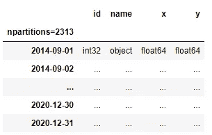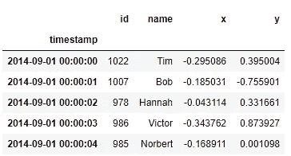

(图片由作者提供)，**左:**数据集结构，**右:**数据集的前 5 行

一些流行的数据探索实验是在 **windows 操作系统**和 **8GB 内存**上对 **2 亿行数据集**进行的:

*   ***读取数据***
*   ***数据形状***
*   ***数据描述***
*   ***数值计数***
*   ***【按列分组】和***
*   ***第 10 百分位计算***
*   ***可视化一列***
*   ***应用功能***
*   ***添加新列***
*   ***过滤数据帧***

## **读取数据:**

该实验的设计遵循了每种工具的最佳实践，即对 Vaex 使用二进制格式 HDF5。需要将 CSV 文件转换为 HDF5 格式，以便 Vaex 能够发挥最佳性能。Vaex 需要 33 分钟将 CSV 文件的 2313 个分区转换为 HDF5 格式。

现在从磁盘读取 HDF5 数据:

```
**df = vaex.open("200M_data_hdf5/analysis_*.hdf5")**
```

Vaex 需要 **6 分钟**来读取整个数据集。

## 数据形状:

使用 Vaex 计算数据集中的行数需要 **no time (0 ns)** 。整个数据大约有 2 亿行。

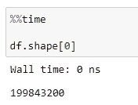

(图片由作者提供)

## 数据描述:

使用`**.describe()**` 函数生成描述性统计数据，包括数据集分布的集中趋势、离差和形状，不包括`NaN`值。

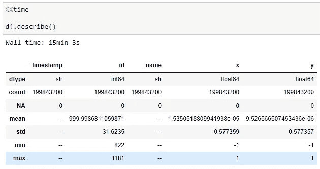

(图片由作者提供)，描述函数的结果

Vaex 花费了大约 **15 分钟**来计算每一列的描述性统计数据。

## 数值计数:

使用 Vaex 数据框中的函数`**.value_counts()**`计算分类列“名称”的频率分布。

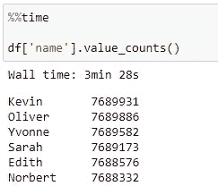

(按作者分类的图片)，名称列的前 6 个频率分布

Vaex 用了大约 **3.5 分钟**返回“名称”列的频率分布。

## 分组依据:

与 pandas API 类似，Vaex 也提供了一个计算分组和聚合的函数。以下命令对“name”列进行分组，并聚合“x”列的平均值。

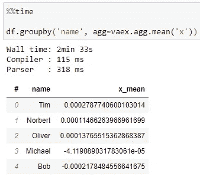

(按作者排序的图像)，按名称排序的结果列

Vaex 花费了大约 **2.5 分钟**来计算上面的分组和聚合命令。

计算“id”列的分组以及“x”和“y”两列的平均聚合。

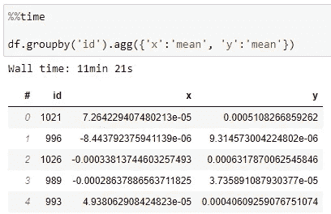

(按作者排序的图片)，按姓名排序的结果列

Vaex 花费了大约 **11.5 分钟**秒来计算上述分组和聚合命令。

## 第 10 百分位计算:

Vaex 有 percentile_approx 函数来计算给定百分位数的近似值。

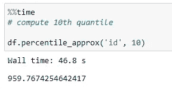

(图片由作者提供)

Vaex 用了 **46.8 秒**来计算“id”列的第 10 个百分位。

## 可视化列:

绘制大规模数据的直方图是有问题的，因为传统的数据分析工具没有优化来处理它们。

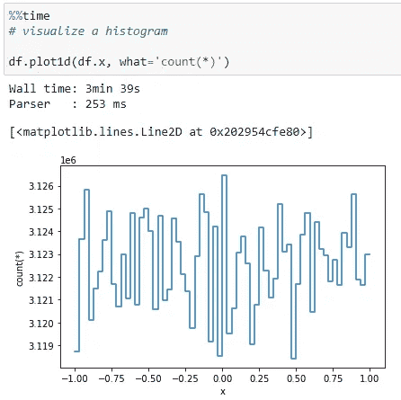

(图片由作者提供)，列“x”的直方图

使用 Vaex 中的 plot1d 函数绘制数值向量的直方图，用了**3.5 分钟**返回图。

## 应用功能:

类似于 Pandas API，Vaex 有`apply`函数来沿着数据帧的轴应用一个函数。返回名称列中元音列表的函数:

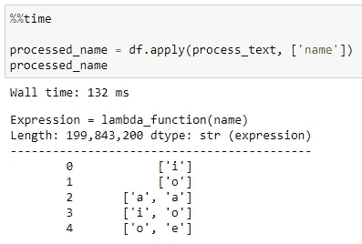

(图片由作者提供)

Vaex 几乎没花多少时间( **132 ms** )就处理了姓名列的 2 亿条记录。

## 添加新列:

Vaex 实际上不需要花时间向数据集添加列，因为它不会立即添加新列，而是使用表达式系统来生成新列的表达式。

添加新列 Vaex 花费了将近**251 毫秒**。

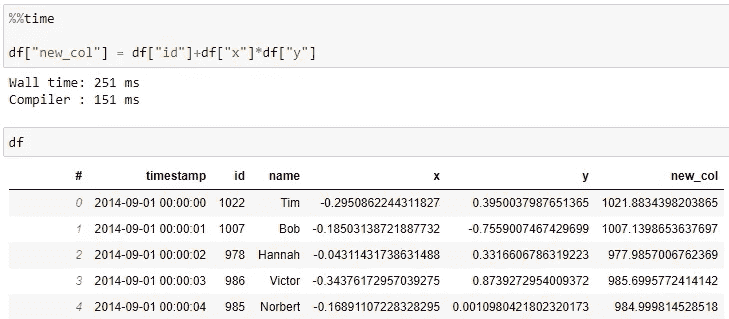

(图片由作者提供)，添加新列后的结果

## 过滤数据帧:

与 pandas API 类似，Vaex 也有类似的选择概念，根据任何给定的条件过滤数据。Vaex 不会立即过滤数据帧，而是生成一个表达式。

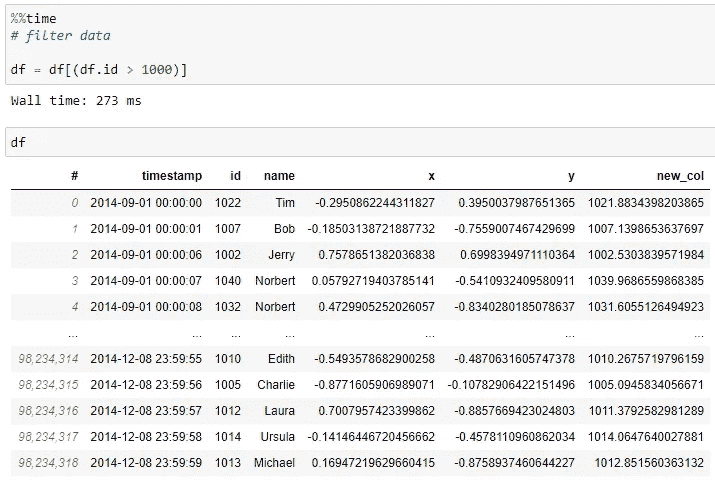

(图片由作者提供)，过滤后的结果

Vaex 几乎不需要任何时间( **273 ms** )来应用过滤器，从上图可以看出，数据帧的形状从 2 亿减少到了 9800 万。

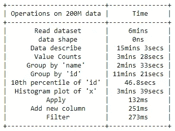

(图片由作者提供)，2 亿数据集上 Vaex 操作的时间约束

# 结论:

在本文中，我们已经生成了 2 亿条时间序列模拟数据记录，这些数据有 4 列，大小接近 12GB。使用熊猫图书馆不可能读取数据集并对其进行探索和可视化。

Vaex 数据框架可以轻松读取数据，并执行所需的探索和可视化。这是对 Vaex 数据帧的唯一要求，适用于 HDF5 数据。因此，CSV 文件需要转换为所需的 HDF5 格式。

此外，Vaex 库中提供了大多数流行的 Pandas API，因此它是处理大型数据集最有用的库。

# 参考资料:

[1] Vaex 文件:[https://vaex.readthedocs.io/en/latest/](https://vaex.readthedocs.io/en/latest/)

> 感谢您的阅读