# 从点击流数据中评估应用用户行为的流程挖掘

> 原文：<https://towardsdatascience.com/process-mining-to-assess-app-user-behavior-from-clickstream-data-8e53a71428a4?source=collection_archive---------9----------------------->

## 对 pm4py python 库的深入介绍


图片由 [Gerd Altmann](https://pixabay.com/users/geralt-9301/?utm_source=link-attribution&utm_medium=referral&utm_campaign=image&utm_content=1087845) 从 [Pixabay](https://pixabay.com/?utm_source=link-attribution&utm_medium=referral&utm_campaign=image&utm_content=1087845) 拍摄

不久前，我写了一篇[文章](/using-bigquery-firebase-analytics-to-engage-attract-and-assess-your-app-users-da02980daffa)，描述了一些有用的查询，人们可以对点击流事件的数据进行查询，以收集一些可操作的见解。这篇文章可以被认为是它的自然继任者，因为(a)我们将在类似的数据集(点击流)上工作，以及(b)具有相同的潜在动机(收集一些见解)。然而，我们将从应用程序上的`maximum_time_spent`和`most_played_podcasts`等原始分析转向更全面的相关流程视图——从用户打开应用程序开始，到收听、评级、分享，最后关闭/卸载应用程序。

## 流程挖掘

> 流程挖掘可以被认为是用户在你的应用上做什么的可视化描述。

流程挖掘可以用来描绘用户如何在应用程序中导航的画面。它可用于指向:

*   主要的棘手问题包括应用程序安装和用户参与播客应用程序之间的长时间延迟，
*   可以提高效率的流程，例如优化购物应用程序中的结账体验，
*   经常被触发的事件，例如紧随*播客下载*事件之后的*应用卸载*，

诸如此类…

虽然有许多流程挖掘算法可供使用，其中一些在本文[中做了很好的总结，但是我们在](/introduction-to-process-mining-5f4ce985b7e5) [Podurama](https://podurama.com/) 的团队发现直接遵循 Graph (DFG) &启发式挖掘器(HM)最适合上面定义的用例。随后，这些就是我们将在本教程中重点关注的内容！

## 直接跟随图表

dfg 是探索事件数据的很好的第一手段。它们背后的基本思想非常简单——它是一个图，节点对应于事件/活动，有向边对应于直接跟随关系。例如，连接事件`e1`和`e2`的边对应于观察到事件`e1`紧接着事件`e2`的*。连接两个事件的边可以用额外的信息来修饰，例如有多少实例沿着这条边被发现，或者每个实例从`e1`到`e2`花费的平均时间是多少。*

## 启发式挖掘器

HM 是一种流行的流程挖掘算法，用于对事件流进行建模。与 DFG 的替代方案相比，HM 试图找到事件遵循的规则。更具体地说，该算法能够滤除异常边缘，甚至检测两个事件(如`sleeping`和`snoring`)何时同时发生。因此，这些在图*中没有联系，即使*在事件日志中一个可能直接跟随另一个。在某种程度上，HM 更适合处理日志中的噪音，并找到公共的结构(两个活动之间的依赖)。

让我们看看他们的行动吧！

*注意:在我们开始编码之前，请确保已经使用* `*pip install pm4py*` *安装了 pm4py 库。*

# 让我们直接进入编码..

## 装置

```
import pm4py
import pandas as pd
import numpy as np
from pm4py.objects.conversion.log import converter as log_converter
from pm4py.objects.log.util import dataframe_utils
from pm4py.algo.discovery.heuristics import algorithm as heuristics_miner
from pm4py.algo.discovery.dfg import algorithm as dfg_discovery
from pm4py.visualization.heuristics_net import visualizer as hn_visualizer
from pm4py.visualization.dfg import visualizer as dfg_visualization
```

## 日常数据集

在我们看到实际数据集上的结果之前，我将使用一个(非常)小的虚拟事件数据集，因为我希望能够显示每个阶段的中间输出。如果你想跟着去，这里有一本 [Jupyter 笔记本](https://github.com/V-Sher/ProcessMining)。

*注意:请随意用您选择的数据集替换虚拟数据集，只要它遵循我们稍后将讨论的命名约定。*

```
dummy = pd.DataFrame(np.array([['A', '06/10/2021' , 'waking' ],
['A', '06/11/2021' , 'eating'],
['A', '06/12/2021' , 'sleeping'],
['B', '06/12/2021' , 'waking'],
['B', '06/13/2021' , 'eating'],
['B', '06/14/2021' , 'sleeping'],
['C', '06/06/2021' , 'waking'], 
['C', '06/11/2021' , 'sleeping'],
['C', '06/12/2021' , 'eating'],
['D', '06/15/2021' , 'eating'],
['D', '06/16/2021' , 'eating'],
['E', '06/15/2021' , 'eating'],
['E', '06/26/2021' , 'eating'],
['F', '06/11/2021' , 'waking'],
['F', '06/15/2021' , 'sleeping']]),columns=['case:concept:name', 'time:timestamp', 'concept:name'])
```

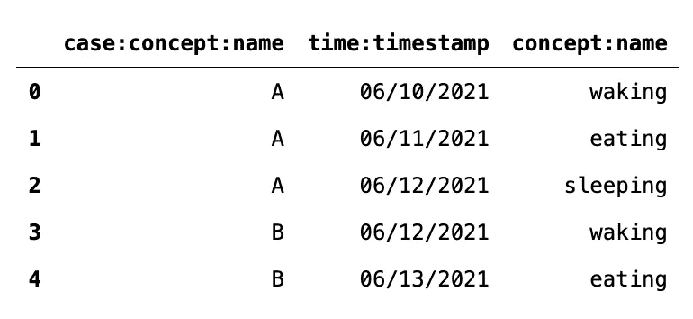

它包含三个主栏— `case:concept:name`、`time:timestamp`和`concept:name`。这些分别对应于用户名、时间戳和事件类型。为简单起见，我们将处理六个用户— `A` : `F`和三种事件类型，即`waking`、`eating`和`sleeping`。

现在您可能想知道— *为什么要使用神秘的列名！为什么不简单地分别命名为“用户标识”、“时间戳”和“事件类型”?简短的回答是——因为 pm4py 喜欢那样。如果您的列有不同的名称，我强烈建议在进行进一步分析之前重命名它们。*

需要记住的另一件重要事情是时间戳列应该遵循`MM/DD/YYYY`格式。也就是说，用户`A`决定在 6 月 10 日`wake`起床，然后在 6 月 11 日`eat`起床，接着在 6 月 12 日`sleep`起床。原因是——pm4py 对数据集中的时间戳列进行了一些预处理，从而自动转换为`YYYY-MM-DD HH:MM:SS+MS:MS`格式。为了让这个预处理正确工作，它期望日志中使用`MM/DD/YYYY`格式。

```
dummy = dataframe_utils.convert_timestamp_columns_in_df(dummy)
dummy.head()
```

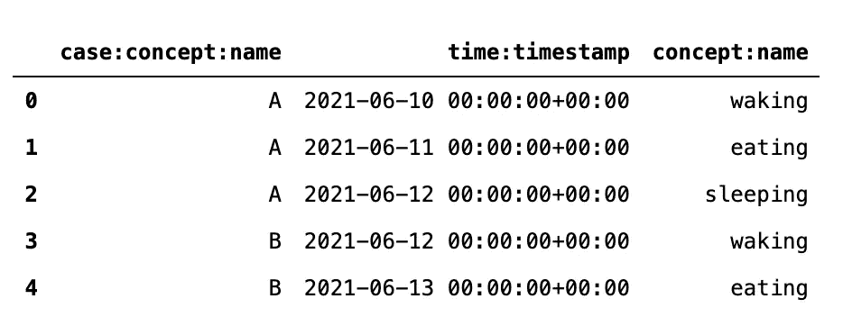

*注意:不要认为 pm4py 会根据列中的值自动确定时间戳格式。它盲目地将所有内容转换为* `*MM-DD-YYYY*` *格式，这可能会导致一些时间戳被错误地转换！*

# 直接跟随图表

```
log = log_converter.apply(dummy)
variant=dfg_visualization.Variants.FREQUENCY
dfg = dfg_discovery.apply(log)gviz = dfg_visualization.apply(dfg, log=log, variant=variant)# display viz
dfg_visualization.view(gviz)
```

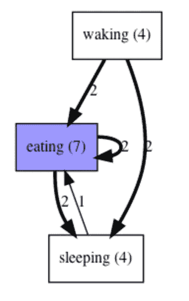

作者图片

左边的 DFG 有几件事需要注意:

*   这些框表示事件类型，并遵循基于框内值的热图颜色。
*   方框内的值指示数据集中有多少行包含该特定事件。例如，event_type = `waking`在`dummy`数据集中出现了四次(在第 0、3、6 和 13 行)。
*   箭头/边上的数字表示*频率*，即该特定有向边观察到多少个实例。例如，围绕`eating`的边缘刻有`2`的循环指的是来自用户 D 和 e 的两个实例。类似地，在日志中只有一个实例，我们观察到一个`sleeping`事件后跟一个`eating`事件，即来自用户`C`。最后，箭头越亮，意味着沿着这条路径找到的实例越多。

注意:请记住**而非**的频率并不对应于遵循该路径的唯一用户数量。换句话说，如果我们在日志中为用户`D`增加了两行数据，那么:

```
dummy = pd.DataFrame(np.array([
.
.
.
['D', '06/16/2021' , 'eating'],
['D', '06/16/2021' , 'eating'],
.
.
.]),columns=['case:concept:name', 'time:timestamp', 'concept:name'])
```

如果我们创造了新的 DFG，它会是这样的:

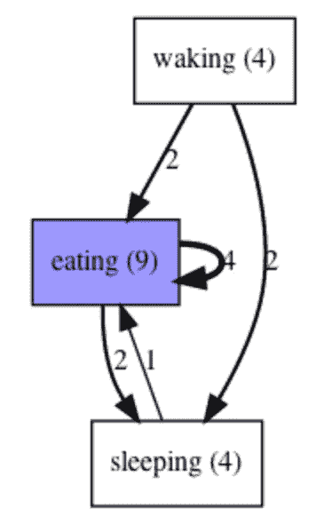

作者图片

注意围绕`eating`的循环现在如何将频率值显示为 4(而不是 2 ),因为现在有 4 个`eating`事件的实例，后面跟着另一个`eating`事件，一个来自用户`E`,三个来自用户`D`。

如果您想在 edges 的顶部打印平均**时间**(而不是**频率**)，那么需要对代码进行一点修改，我们在`apply`方法中引入一个名为`variant`的参数，并将其值设置为`PERFORMANCE`而不是`FREQUENCY`:

```
log = log_converter.apply(dummy)
**variant=dfg_visualization.Variants.PERFORMANCE** dfg = dfg_discovery.apply(log, **variant=dfg_discovery.Variants.PERFORMANCE**)gviz = dfg_visualization.apply(dfg, log=log, variant=variant)# display viz
dfg_visualization.view(gviz)
```

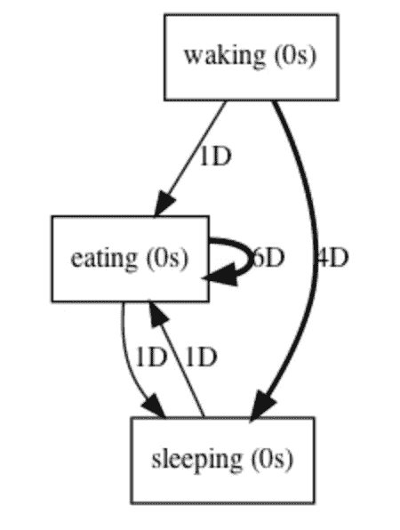

作者图片

produce 树看起来与前面的树非常相似，但是，现在边对应于时间(以天`D`和秒`s`表示)。例如，根据 DFG，刚吃完饭平均需要 6 天才能回到正餐，即`eating->eating`(围绕`event = eating`的循环)。让我们从`dummy`数据集中验证这一点。

在那里，只找到了这个特定跟踪的两个实例(用户`D`和`E`各一个),分别花费了前一个用户一天的时间(6 月 15 日-6 月 16 日)和后十一天的时间(6 月 15 日-6 月 26 日)。平均花费的时间是(1+11 / 2) = 6 天。

## dfg 中的过滤边

有时候，你的 DFG 看起来会像一个意大利面条模型，尤其是当你要处理很多事情的时候。在这种情况下，我喜欢通过设置`MAX_NO_EDGES_IN_DIAGRAM`参数来限制输出树中的边数。此外，通过分别设置`START_ACTIVITIES`和`END_ACTIVITIES`参数，根据事件日志标记开始和结束活动也是有用的。

```
log = log_converter.apply(dummy)
**_, start_activities, end_activities = pm4py.discover_dfg(log)**
variant=dfg_visualization.Variants.FREQUENCYdfg = dfg_discovery.apply(log)**parameters = {
dfg_visualization.Variants.FREQUENCY.value.Parameters.MAX_NO_EDGES_IN_DIAGRAM: 3,** **dfg_visualization.Variants.FREQUENCY.value.Parameters.START_ACTIVITIES: start_activities,****dfg_visualization.Variants.FREQUENCY.value.Parameters.END_ACTIVITIES: end_activities
}**gviz = dfg_visualization.apply(dfg, log=log, variant=variant, **parameters= parameters**)dfg_visualization.view(gviz)
```

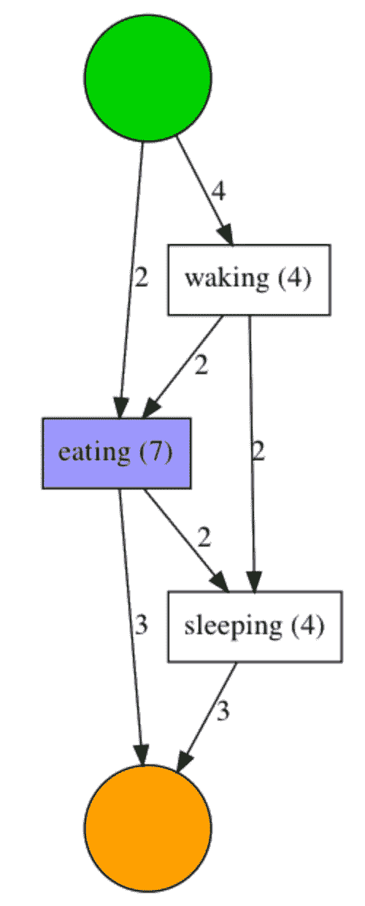

作者图片

正如你所看到的，我们已经成功地去除了一些混乱，只保留了那些权重最高的边。还有两个额外的节点—绿色和橙色。这些圆圈分别对应于流程流的开始和结束状态。这些可以解释为—观察到 4 个实例，其中`waking`是第一个调用的事件。查看`dummy`数据集，我们可以验证这对于用户`A`、`B`、`C`和`F`都成立。

*记住:尽管上图中看起来可能有 3 条以上的边，但请注意来自* `*start_activity*` *的所有边* ***和进入*** `*end_activity*` *的所有边都被排除在过滤过程之外。排除它们，我们可以确认只存在 3 条边:* `*waking->eating*` *、* `*waking->sleeping*` *和* `*eating->sleeping*` *。*

# 启发式挖掘器

为了确定是否有可以为日常日志建模的事件流，让我们生成一个启发式网络。

```
log = log_converter.apply(dummy)
heu_net = heuristics_miner.apply_heu(log)gviz = hn_visualizer.apply(heu_net)hn_visualizer.view(gviz)
```

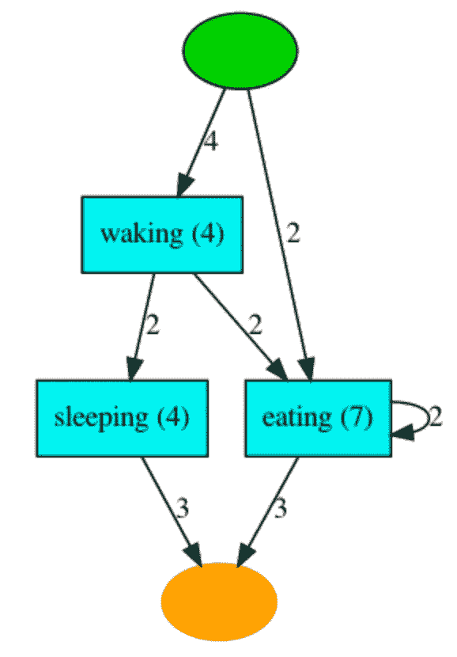

作者图片

启发式网络的输出可以用和 DFG 一样的方式来解释。正如前面介绍中所述，主要区别在于算法试图确定事件遵循的一些规则。它不仅考虑了边沿的*频率*，还考虑了边沿的*重要性*。如果你想知道显著性是如何计算的，公式和算法可以在[这里](https://www.futurelearn.com/info/courses/process-mining/0/steps/15639)找到。

根据上述启发式网络，在典型的日常工作流程中，用户通过`waking`或`eating`开始他们的一天。在后一种情况下，这是他们在一天结束前唯一做的事情(橙色圆圈),而在前一种情况下，他们决定在完成日常工作前做`sleep`或`eat`。

如果你仔细观察，该算法已经发现了这样一个事实，即`sleeping`和`eating`是并发活动，因此它们之间没有边。

## 在 HM 中过滤边缘

HN 经常变得太乱，无法提供任何有用的见解。在这种情况下，我们可以基于最小频率值，仅过滤并保留一些边，同时保持所有节点(正方形块)完好无损。例如，在上面的启发式网络中，为了只保留 DFG 出现次数至少为 4 的边，我们将引入`MIN_DFG_OCCURRENCES`参数。由于只有一条边`START->waking`带有权重为 4 或更大的箭头，这应该是输出 HN 图中出现的唯一的*边:*

```
log = log_converter.apply(dummy)
heu_net = heuristics_miner.apply_heu(log, **parameters={ heuristics_miner.Variants.CLASSIC.value.Parameters.MIN_DFG_OCCURRENCES: 4}**)gviz = hn_visualizer.apply(heu_net)hn_visualizer.view(gviz)
```

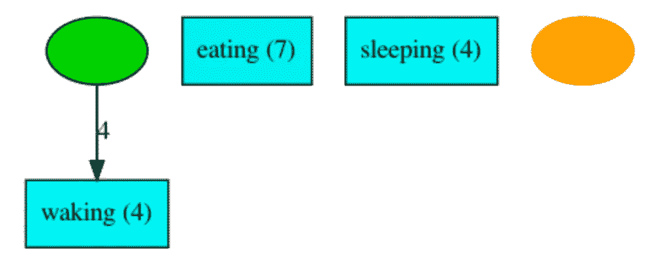

作者图片

虽然修剪边缘的好处在这个虚拟示例中无法直接观察到，但我发现它在现实世界的数据集中非常有用。仅当边缘超过特定阈值时才过滤边缘，这有助于理解意大利面条模型。让我们来看看实际播客事件数据集上的流程挖掘结果。

# 播客数据集

在 Podurama，我们有兴趣使用流程挖掘来解决两个特别有趣的问题— (a)用户流失，以及(b)冷启动推荐。对于前者，我们决定对安装后 15 天内离开应用程序的(大约 4k)用户进行进程发现，看看我们是否可以得出一些见解。对于后者，我们使用活跃用户的日志生成了一个 DFG，以直观地检查他们在特定流派中收听的播客流。

## 用户流失

我们没有调查所有记录的事件，而是决定把重点放在主要的事件上，比如`app_open`、`search`、`podcastseries_click`和`app_remove`。

事件数据的前几行如下所示:

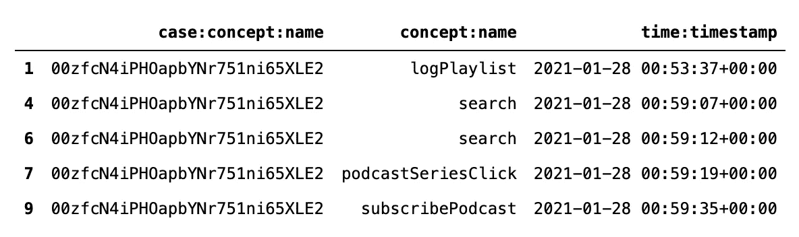

在不修剪边的情况下生成 DFG 会产生意大利面模型:

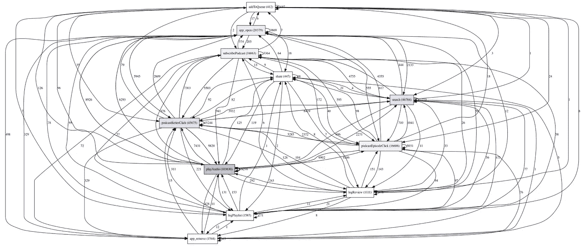

作者图片

将最大边数设置为 10 后，我们观察到:

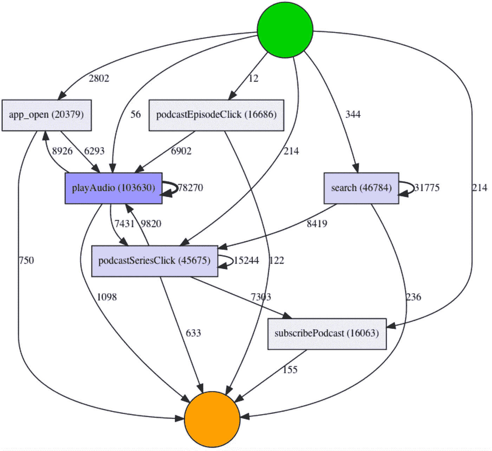

作者图片

快速浏览一下，很明显存在大量重复使用搜索功能的情况。然而，即使许多用户都在搜索播客，即*搜索*事件(~ 31k)，但只有少数情况(~ 8k)是通过点击任何搜索结果直接跟随的，即*播客系列点击*事件。同样，我们观察到在应用程序已经打开( *app_open* )之后，播放播客( *playAudio)* 的情况非常少(~ 6k)。

另一个有趣的观察是(在最大边上过滤后)，我们在图中没有发现`app_remove`事件，这意味着它不经常被触发。换句话说，没有多少用户明确卸载应用程序，而是在一段时间后停止登录应用程序。这可能表明需要一个及时的(非侵入性的)轻推来提醒人们使用我们的应用。

另一个值得注意的观察是关于到达流程流中的最终状态(橙色圆圈)。我们观察到大多数实例从 *playAudio* 事件到达结束状态，很少从 *subscribePodcast* 事件到达结束状态。这不太理想，因为这意味着用户在决定退出之前不会通过我们的应用程序订阅播客(这可能表明对我们的应用程序的长期承诺)，而是简单地浏览一下，看看它是否坚持下来！总的来说，我们的目标是让新用户在加入应用程序的第一周订阅至少 10 个播客，因为他们订阅的播客越多，他们继续使用应用程序收听他们订阅的播客的新发布剧集的机会就越高！

## 冷启动建议

虽然使用流行的 python 库肯定有更好的方法来解决推荐系统的冷启动问题，但我们决定使用 dfg 来可视化用户收听的播客。这背后的主要思想很简单——一旦我们知道一个用户收听了播客 A，尝试并推荐来自相同流派的其他播客，基于在 DFG 具有最高频率的输出优势。

为了简洁起见，我们过滤了日志，删除了用户暂停并在下一次继续播放相同播客的事件。这允许我们摆脱事件周围的循环(类似于我们看到的`eating`事件)

这是真实犯罪类型的 DFG 奖:

```
mask = (~usr_podcast['concept:name'].isna()) & (usr_podcast.genre == '**True Crime**')
log = log_converter.apply(usr_podcast.loc[mask])parameters = {
dfg_visualization.Variants.FREQUENCY.value.Parameters.MAX_NO_EDGES_IN_DIAGRAM: 10
}variant=dfg_visualization.Variants.FREQUENCY
dfg = dfg_discovery.apply(log)
gviz = dfg_visualization.apply(dfg, parameters=parameters, variant=variant)# display viz
dfg_visualization.view(gviz)
```

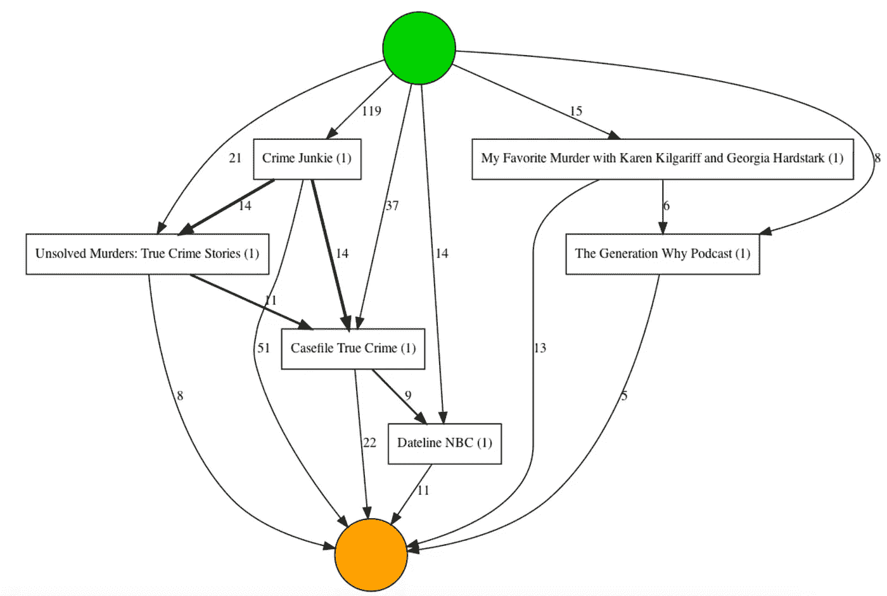

作者图片

从上面的图表中，很明显有更多的例子表明*犯罪爱好者*是用户收听的第一个真实犯罪播客。这是可以理解的，因为我们在主页上为新加入的用户提供了建议。基于边缘权重(越黑越好)，似乎有相当多的情况下，用户在犯罪爱好者之后收听*案件档案真实犯罪*和*未破谋杀案*。这是一条有用的信息，因为现在，在我们数据库中的所有真实犯罪播客中，我们可以开始向观看历史有限的用户推荐这两个播客(以及其他类似于*我最喜欢的谋杀*和**一代为什么*)推荐系统可能不会为他们提供有用的推荐。*

*作为另一个不同类型的例子，这是 DFG 科技播客的样子:*

*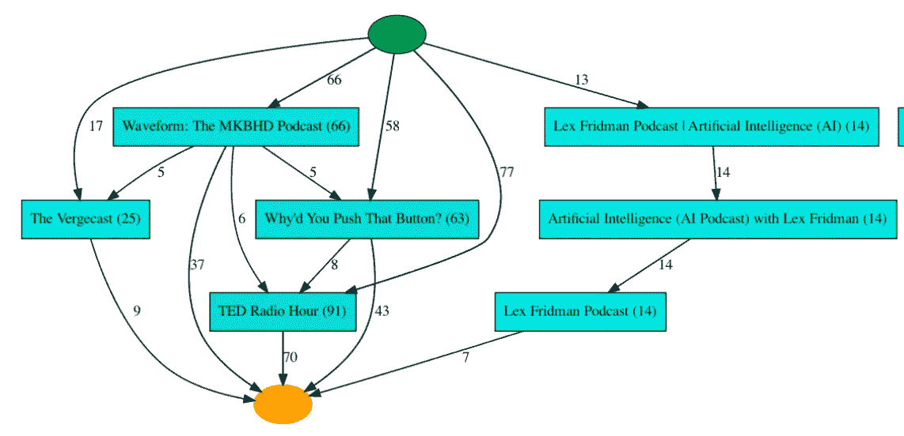*

*作者图片*

# *结论*

*让用户参与到你的应用中是相当棘手的，尤其是当 80-90%的应用在试用一周内被删除。从用户那里评估事件的顺序会给你一个新的视角，让你明白为什么这个应用对他们不起作用。调查也有帮助，但是对于那些刚刚使用你的应用一周的用户来说，可能会显得很烦人。*

*流程建模的内容比本文所涵盖的要多得多，但这应该给你一个良好的开端，让你开始分析你的事件日志，并收集有用的见解，以提高保留率。*

*直到下次:)*