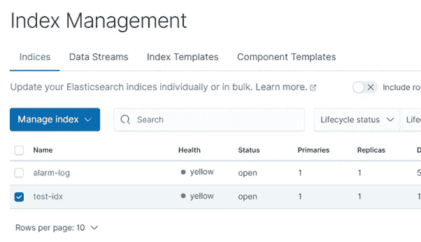

# 用 ELK 离线处理 SCADA 报警数据

> 原文：<https://towardsdatascience.com/processing-scada-alarm-data-offline-with-elk-7ab9b475ffb9?source=collection_archive---------29----------------------->

## 工业自动化的开源工具


[德国 Steag](https://commons.wikimedia.org/wiki/File:Leitstand_2.jpg)，通过[维基共享资源](https://commons.wikimedia.org/wiki/File:Leitstand_2.jpg)

本文是一个系列的开始，在这个系列中，我们将使用开源数据科学工具来分析 SCADA 系统产生的警报和事件日志。但是首先，什么是 SCADA 系统，为什么需要分析它们的警报？

工业控制系统(ICS，又名 SCADA 系统)用于控制发电站、水处理厂、面包店、啤酒厂等生产设施。工业自动化系统将由传感器、控制器和 HMI(人机界面)组成。

SCADA 系统生成大量的警报和事件数据(在准备本文时分析的系统在 12 个月内生成了超过 5700 万个警报和事件)。数据科学工具非常适合处理这些大型数据集，本文探讨了使用 ELK 堆栈进行 SCADA 警报数据分析。

# 什么是 SCADA？

SCADA 是基于计算机的工业控制系统的通称。SCADA(监控和数据采集)系统可用于监测和控制工业过程，包括水处理、制造、发电站、食品和饮料等。事实上，任何使用自动化制造设备的工业过程。

## 典型系统架构

工业控制或 SCADA 系统的目的是监测或控制物理过程。我们系统的最低层，I/O(输入输出)层包括传感器和执行器。

传感器测量温度、压力、液位等物理参数。而致动器是像马达、阀门或螺线管等装置。影响身体运动。

传感器和执行器与过程控制器或 PLC(可编程逻辑控制器)通信。过程控制器通常是用于运行软件来控制过程参数的专有计算机硬件。

SCADA 服务器使用工业协议与过程控制器通信，并执行许多功能，

*   维护传感器和致动器参数值(通常称为点)的数据库。
*   存储过程参数的历史值(趋势)
*   基于与阈值相比的参数值创建警报和事件。
*   提供 HMI(人机界面),其通常是包括动态传感器和致动器数据的图形过程表示。HMI 允许过程操作员与控制系统交互(启动和停止设备和过程，确认警报等)。).


图片来源于 Flaticon.com

## 人机界面

SCADA 系统的 HMI 允许操作员监控过程和远程操作设备。HMI 的一个重要部分是报警系统，该系统提醒过程操作员需要他们干预的异常过程条件。


[hhdgomez](https://commons.wikimedia.org/wiki/File:Libro-sistemas-scada-3ra-ed-mecatronica-automatizacion-22680-MLM20234441553_012015-F.jpg) ，通过[维基共享](https://commons.wikimedia.org/wiki/File:Libro-sistemas-scada-3ra-ed-mecatronica-automatizacion-22680-MLM20234441553_012015-F.jpg)

# 什么是警报和事件？

## 警告

警报的目的是提醒操作员需要干预的异常或危险过程条件。

ICS 中的每个测量参数通常都配置了阈值，当参数超过阈值时，就会产生一个事件，称为报警。

实现过程警报的最常见方式是将过程变量 *x(t)* 与恒定的高和/或低阈值*xₜₚ*【1】进行比较，


作者图片

报警系统是所有现代 SCADA 系统的一部分。这些系统提供报警事件通知、确认、显示和过滤功能。

## 事件

事件类似于警报，主要区别在于警报是意外的，可能需要采取纠正措施，而事件通常不需要任何操作员措施，并且被捕获以支持审计、维护和事件调查。

一些 SCADA 系统具有独立的报警和事件系统，而其他系统将事件存储在低优先级的报警处理系统中。

# 为什么报警管理很重要？

特别是警报管理和警报洪水[2]，几年来一直是个问题[3]。对警报洪水问题的反应导致了几个国家和国际标准的发展[4-6]。

性能不佳的报警系统与许多重大的加工工业灾难有关；埃索朗福德、三里岛、德士古米尔福德港湾和深水地平线，仅举几例。除了重大事故之外，有证据表明，报警系统性能不佳会给设施所有者带来持续的重大损失。霍尼韦尔过程解决方案公司估计，在一个典型的 100，000 BPD 炼油厂，报警系统性能的改进将每年节省 589 万美元[8]。

有人认为[9]报警泛滥的主要原因是过程状态变化，因为报警系统通常是为稳态条件设计的。在过程状态改变期间，前一个或两个警报是关键的，并指示根本原因；随后的警报是必然的，仅仅是噪音。这种噪音会极大地分散过程操作员的注意力，以至于无法确定事件的根本原因。


图片由作者使用以下图片；(左)[美国能源部](https://commons.wikimedia.org/wiki/File:Three_Mile_Island_(color).jpg)，公共领域，经由[维基共享](https://commons.wikimedia.org/wiki/File:Three_Mile_Island_(color).jpg)(中)[科林·贝尔](https://www.geograph.org.uk/profile/23409)，从彭布罗克码头看到的米尔福德港炼油厂，经由[维基共享](https://commons.wikimedia.org/wiki/File:Milford_Haven_oil_refinery_seen_from_Pembroke_Dock_-_geograph.org.uk_-_845073.jpg)(右)[美国海岸警卫队](https://en.wikipedia.org/wiki/United_States_Coast_Guard)，公共领域，经由[维基共享](https://commons.wikimedia.org/wiki/File:Deepwater.Horizon.Response.jpg)

*在多个标准中定义为触发 10 个以上新警报的 10 分钟周期(每个控制台操作员)。*

# 麋鹿是什么？

[ELK](https://www.elastic.co/) (Elasticsearch、Logstash 和 Kibana)堆栈是一个开源的数据收集和可视化堆栈，主要用于收集和监控服务器和应用程序日志，尽管也可以容纳许多其他用例，如商业智能和 web 分析。堆栈的主要组件是，

## **弹性搜索**

基于 Apache Lucene 搜索引擎的开源全文搜索和分析引擎。

Elasticsearch 通过分片和聚类支持非常大的数据库。

## **日志存储**

一个日志收集、转换和聚合工具。

## 基巴纳

基于网络的弹性研究分析和可视化工具。

## **跳动**

轻量级数据转发代理或日志运送者。

# 安装 ELK

## Windows 操作系统

1.  从下载页面下载 Elasticsearch 和 Kibana(我们在这里执行的分析不需要 Logstash)
2.  将文件解压缩到您选择的文件夹中(文件非常大，尤其是 Kibana，所以这可能需要一些时间)
3.  确保您已经安装了 [Java](https://www.java.com/en/) 并且设置了 ES_JAVA_HOME 环境变量(注意:如果在您的系统上设置了 JAVA_HOME 变量，Elasticsearch 将使用该变量，但它已被弃用，因此将来某个时候该选项将不起作用)
4.  通过打开命令提示符启动 Elasticsearch，导航到解压安装文件的文件夹，将目录改为 bin 并运行 elasticsearch.bat
5.  类似地，通过打开命令提示符启动 Kibana，导航到解压安装文件的文件夹，将目录改为 bin 并运行 kibana.bat
6.  在以下地址打开网页浏览器， [http://localhost:5601/](http://localhost:5601/) 您应该会看到基巴纳主页，


作者图片

## 其他平台

对于在其他平台上的安装，[参见](https://www.elastic.co/start)。

# 准备和加载报警数据

## 数据格式

我手头的报警日志文件是由施耐德电气 CitectSCADA 产品生成的。

这些文件被命名为`AlarmLog.NNN`，其中`NNN`是一个从 001 到 365 的零填充整数，在我们的例子中每天一个文件。

这些文件是以空格分隔的文本文件，下面是一个典型文件的前五条记录的示例，


作者图片

# 数据准备

数据准备非常简单，包括将空格分隔的文件转换为 CSV 文件，并清除一些无效记录。

Python 脚本用于初始转换和清理。

第一步是导入所需的库，

*   pandas——一个数据分析库，我们将使用它来读写数据文件，并使用数据帧来操作数据
*   glob 检索输入数据文件的文件名。
*   日期时间—用于日期和时间值操作
*   tqdm —一个进度条实用程序，用于显示长时间运行的作业的进度(如处理多个 GB 的数据文件)

```
import pandas as pd
import glob
from datetime import datetime
from tqdm import tqdm
```

宽度数组是定义的，包含输入文件中每个固定宽度字段的字符宽度。names 数组包含将包含在 CSV 文件中的字段名称。

```
widths = [
    12, #date
    12, #time
    4,  #pirority
    20, #status
    12, #state
    32, #tag
    64, #description
]names = [
    'date',
    'time',
    'priority',
    'status',
    'state',
    'tag',
    'description'
]
```

在下面的代码中，我们处理文件夹`./1-raw/`中的所有原始日志文件，创建 CSV 文件并将其写入`./2-csv/`。

使用 glob 函数可以获得原始输入文件路径的集合。

我们使用 for 循环来遍历每个文件。因为这是一个长时间运行的过程，所以在 for 循环中使用 tqdm 函数来显示进度条。


作者图片

对于每个文件，

*   使用 pandas read_fwf 函数读取文本文件。这个函数读入一个空格分隔(固定宽度)的文件，并返回一个数据帧
*   日志文件包含一些日期和/或时间字段值为“0”的无效记录。日期或时间值为零的记录将被删除。
*   从单独的数据和时间字段创建 ISO 格式时间戳字段，并将其添加到数据帧中
*   CSV 文件被写入磁盘

```
files = glob.glob("./1-raw/AlarmLog.*")for f in tqdm(files):
    d = "./2-csv/" + f.split("\\")[1] + ".csv"
    log = pd.read_fwf(f, widths=widths, names=names)# Some errors present in the log files where 0 values present for date 
    # and time columns
    log = log.drop(log[log.date=="0"].index)
    log = log.drop(log[log.time=="0"].index)log['[@timestamp](http://twitter.com/timestamp)'] = log.apply(
        lambda row: datetime.strptime(
            row.date + " " + row.time, '%d/%m/%Y %I:%M:%S %p').isoformat(),    axis=1)
    log.drop(['date','time'], axis=1).to_csv(d,index=False)
```

## 装载到基巴纳

数据可以从用户界面直接加载到 Kibana 中( [http://localhost:5601](http://localhost:5106) )。这用于在处理整整 12 个月的数据之前测试预处理脚本(超过 8GB，需要另一种方法来上传数据，这将在后面描述)。

要通过 Kibana 手动上传数据，首先通过点击煎饼图标打开左侧菜单。从侧面菜单中选择`Analytics > Machine Learning`。


作者图片

点击`Select file`按钮，


作者图片

选择或拖动一个生成的 CSV 文件到下面屏幕上的目标，


作者图片

按`Import`选择默认选项，


作者图片

下一个屏幕要求我们输入一个索引名，数据将被加载到这个索引名中。输入一个索引名称并按下`Import`


作者图片

几秒钟后数据将被加载，按下`View index in Discover`按钮，


作者图片

我们刚刚上传了一天的警报事件。在 discover 应用程序中，我们可以看到我们上传的数据摘要，涵盖时间范围从 6 月 12 日 00:00:01 到 6 月 13 日 00:00:02。摘要图表将数据分成 30 分钟的间隔。


作者图片

如果我们将鼠标悬停在任何条形上，我们可以看到该桶中日志条目的计数。下面我们看到从 11:30 到 12:00 有 2765 个警报事件。


作者图片

Kibana 有一种查询语言(KQL，Kibana Query Language)，允许我们对 ElasticSearch 数据库中的数据应用复杂的过滤器。下面，我们使用 KQL 应用了一个过滤器，将我们的记录限制为“介质过滤器 5”的优先级 1 警报。


作者图片

## 删除数据

我们已经证明了我们的 CSV 数据上传正确。由于我们有 365 个文件，我们不希望手动上传到数据库中。我们现在将删除手动添加的数据，并创建一个 Python 脚本来以编程方式加载整个数据目录。

在搜索栏中输入“索引”,然后从下拉列表中单击“数据/索引管理”。


作者图片

选中我们需要删除的索引旁边的复选框。



作者图片

从`Manage index`按钮打开下拉列表，选择`Delete index`。


作者图片

## 使用 Python 将数据加载到弹性搜索

之前，我们将 365 Citect 警报日志文件处理为 CSV 格式。这些文件非常大(365 个文件，总共 6.15 GB)。在上一节中，我们将一天的数据加载到 ElasticSearch 中，以验证文件格式。我们现在将创建一个 Python 脚本来加载整个数据集。

使用 Python 将数据直接加载到 ElasticSearch 相当简单，因为 ElasticSearch 已经提供了一个官方的[客户端](https://elasticsearch-py.readthedocs.io/en/v7.13.4/)，可以使用 pip 安装，

```
python -m pip install elasticsearch
```

代码重复如下，由以下内容组成:

1.  在 ElasticSearch 中创建“警报日志”索引
2.  打开 data 文件夹中的每个 CSV 文件，并使用批量上传功能将其上传到 ElasticSearch。body 参数定义 CVS 列名到 ElasticSearch 数据类型的映射。

```
import pandas as pd
import globfrom tqdm import tqdm
from elasticsearch import Elasticsearch
from elasticsearch.helpers import bulkindexName = "alarm-log"body = {
  "settings": {
    "number_of_shards": 1
  },
  "mappings": {
    "properties": {
        '[@timestamp](http://twitter.com/timestamp)': {'type': 'date'},
        'description': {'type': 'text'},
        'priority': {'type': 'long'},
        'state': {'type': 'keyword'},
        'status': {'type': 'keyword'},
        'tag': {'type': 'keyword'}
    }
  }
}client = Elasticsearch()
client.indices.delete(index=indexName)
client.indices.create(index=indexName,body=body)files = glob.glob("./2-csv/AlarmLog.*")
for f in tqdm(files):
    df = pd.read_csv(f)
    documents = df.to_dict(orient='records')
    bulk(client, documents, index=indexName, raise_on_error=True)
```

# 首次分析

## 日志条目的结构

我们将使用 Kibana，Discover 工具来检查我们使用之前的 Python 脚本创建的索引的结构，以便批量加载我们的警报条目。

打开 Kibana([http://localhost:5601](http://localhost:5601)，打开左侧菜单，从分析组中选择发现。


作者图片

选择`alarm-log`作为索引模式。完成此操作后，警报日志索引的所有属性都会显示在索引选择器下方的面板中。


作者图片

## 即席分析

我们从 SCADA 系统收集的数据包含报警和事件。警报的优先级为 1-3，而事件的优先级为 4 和 5。过程报警有一个生命周期，由于状态变化和操作员确认，会导致生成和记录多个事件(这将在以后的帖子中详细解释，我们将把多个报警生命周期事件合并到一个报警记录中，该记录将包括整个报警生命周期的信息，并允许进行更详细的分析。

下面的 KQL 查询过滤警报事件，只显示警报启动，


作者图片


作者图片

## 仪表盘

除了允许您以交互方式查询和分析数据，Discover 还允许使用各种可视化方式将查询保存并显示在仪表板中。在基巴纳术语中，保存的观想是已知的，是一个透镜。

下面的仪表板包含四个镜头组件(从左上角开始按顺时针顺序描述)，

*   度量—显示一个数字，在这种情况下是所选时间段内的警报计数
*   垂直条形图—在这种情况下显示每日报警计数
*   树形图—在这种情况下，按标签和报警优先级(1–3)显示前十个报警计数
*   水平条形图—在这种情况下，显示每个标签的前十个报警计数(报警标签是唯一的 id，用于识别产生报警的设备)


作者图片

# 洞察力

现在我们已经创建了我们的仪表板，它告诉我们什么？

## 每日警报计数

从每日警报计数图表中，我们可以看到每天有 500 到 3000 个警报。由于生成这些警报日志的 SCADA 系统由 1 到 2 名操作员监控，这对于操作员来说是不切实际的管理工作量。


作者图片

## 前十名

前 10 个图表用于识别频繁触发的警报。我们可以看到 AIT0411203_aH 警报在 90 天内被激活了大约 18，000 次(大约。每天 200 次)。该警报明显配置错误，需要调查和补救。


作者图片

## 优先级分布

从树形图中我们可以看到,“其他”警报分布在 22%优先级 1、61%优先级 2 和 16%优先级 3。这表明系统很可能配置了太多优先级为 1 和 2 的警报(这将在以后关于警报系统管理和性能指标的帖子中详细解释)。


作者图片

# 结论

ELK 已被证明是分析 SCADA 系统中可用的报警事件日志数据的有用工具。虽然在这一初步分析中获得的见解是有用的，但它受到我们使用原始警报记录这一事实的限制。

当原始报警事件在加载到 ELK 之前被转换成覆盖报警生命周期的报警记录时，更高级的分析将是可能的。

在以后的文章中，我们将探讨，

*   [ICS 警报管理标准和性能指标](/scada-alarm-standards-metrics-56512db128b0)
*   处理 SCADA 报警记录
*   使用 ELK 在线处理 SCADA 报警记录
*   先进的 SCADA 警报分析技术(序列挖掘和时间序列分析)

# 参考

1.  工业报警系统概述:报警过载的主要原因、研究现状和存在的问题。2016 年 IEEE 自动化科学与工程汇刊。 **13** (2):第 1045–1061 页。
2.  Vancamp，k .，*通过数字进行报警管理。*化学工程，2016。第 50–55 页。
3.  ASM，ASM 财团。
4.  ISA， *ANSI/ISA‐18.2‐2009:流程工业报警系统的管理*。2009 年:国际自动化学会。
5.  EEMUA， *EEMUA-191:报警系统——设计、管理和采购指南*。2013 年:英国伦敦工程设备和材料用户协会。
6.  IEC， *IEC 62682 流程工业报警系统管理*。瑞士日内瓦国际电工委员会。2014 年:国际电工委员会。24–26.
7.  戈埃尔、p .达塔和 M.S .曼南，*工业报警系统:挑战和机遇。*流程工业损失预防杂志，2017 年。T21:第 23–36 页。
8.  Ayral，J. Bilyk 和 K. Brown，*案例:量化警报管理的好处。*碳氢化合物加工，2013 年。 **92** (2013)。
9.  Beebe，d .、S. Ferrer 和 D. Logerot，*峰值报警率与工厂事故的关系以及如何尽量减少事故。*工艺安全进展，2013 年。 **32** (1):第 72–77 页。
10.  Lucke，m .等人，*警报数据分析的进展以及在线警报洪水分类的实际应用。*过程控制杂志，2019。 **79** :第 56–71 页。

# 进一步阅读

感谢阅读，希望你喜欢这篇文章。

为了进一步探索，

*   [订阅电子邮件通知](https://patrickberry.medium.com/subscribe)
*   点击文章顶部的“关注”按钮
*   对于工业 4.0 的所有内容，请查看我的[工业数字化转型&工业 4.0](https://medium.com/industrial-digital-transformation-industry-4-0) 出版物
*   欢迎在 LinkedIn 上加入我的社交网络(记得提到你已经读过这篇文章)

为了支持中型作者，可以考虑[订阅](https://patrickberry.medium.com/membership)。

记得点击订阅和关注按钮，


作者图片