# 使用 Python 优化采购流程

> 原文：<https://towardsdatascience.com/procurement-process-optimization-with-python-a4c7a2e3ba76?source=collection_archive---------8----------------------->

## 使用非线性规划来寻找使资本、运输和存储成本最小化的最优订购策略

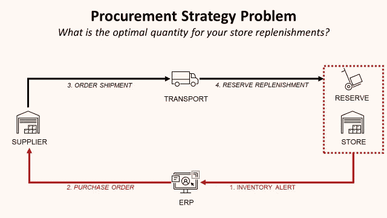

优化商场采购策略—(图片由作者提供)

**采购管理**是在您确定的预算范围内，在特定的截止日期或之前，从**首选供应商处获取商品或服务**的战略方法。

你的目标是平衡**供应**和**需求**，确保**最低库存水平**满足你的商店需求。

在本文中，我们将介绍一种使用**非线性规划**为**中型零售店**设计**最优库存补充策略**的简单方法，考虑:

*   从**供应商仓库**到**商店储备****($/箱)**的运输成本
*   库存融资成本**(占库存价值的百分比，单位为美元)**
*   储备(商场的仓库)存储租赁费用**($/箱)**

💌新文章直接免费放入你的收件箱:[时事通讯](https://www.samirsaci.com/#/portal/signup)

```
**SUMMARY**
**I. Scenario** As a Supply Planning manager you need to optimize inventory allocation to reduce transportation costs.
**II. Build your Model
1\. Declare your decision variables**
*What are you trying to decide?* **2\. Declare your objective function** *What do you want to minimize?*
**3\. Define the constraints**
*What are the limits in resources?* **4\. Solve the model and prepare the results** What is the suggestion of the model?
**III. Conclusion & Next Steps**
```

# 一、如何用 Python 实现采购自动化？

## 问题陈述

作为一家中型零售点的商店经理，您负责在 [ERP](https://www.youtube.com/shorts/v0_R8P6MLQ0) 中设置补货数量。

对于每个 SKU，当库存水平低于某个阈值时，您的 [ERP](https://www.youtube.com/shorts/v0_R8P6MLQ0) 会自动向您的供应商发送**采购订单(PO)** 。

您需要平衡库存容量、运输成本和库存成本的限制，以便为您的 PO 确定正确的数量。

*   **1 供应商**通过 [EDI 连接](https://www.youtube.com/shorts/9_4483PuAko) *(与您的*[*ERP*](https://www.youtube.com/shorts/v0_R8P6MLQ0)*)*接收您的订单，并使用第三方运输公司运送，费用由您承担
    *注:本文中我们不考虑任何交付时间*
*   **60 个有效库存单位(SKU)** 采购价格**(美元/箱)**和年销售数量**(箱/年)**
*   **运输**使用第三方公司进行包裹递送，每箱发票**($/箱)**
*   **储存位置**(商场储备)，容量 **480 箱**上架储存

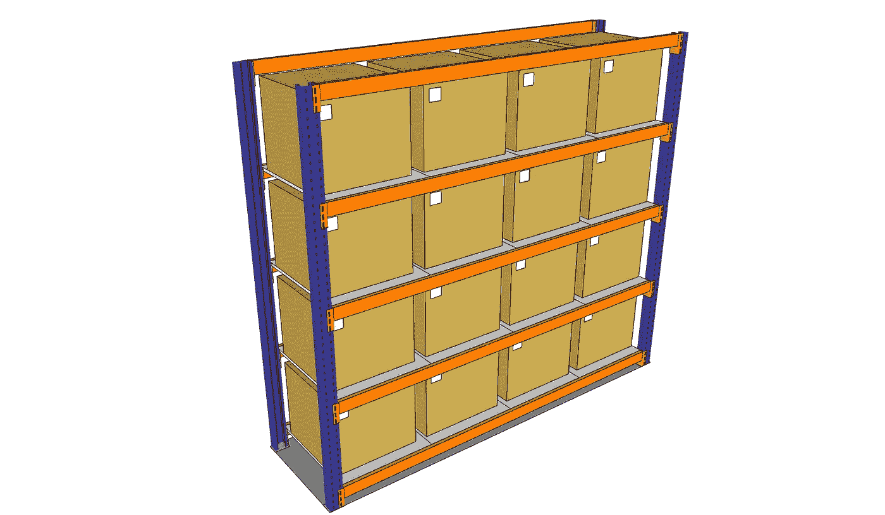

容量为 16 盒的细胞—(图片由作者提供)

为了简化理解，让我们介绍一些符号

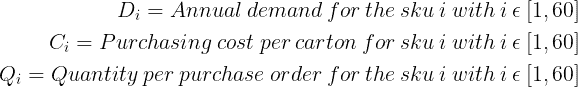

符号—(作者提供的图片)

**每个 SKU 的年度需求**

**运输**

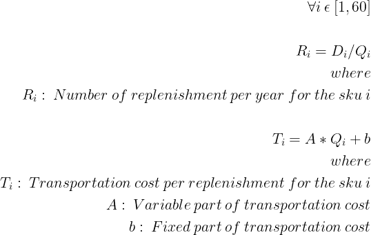

方程式—(图片由作者提供)

> b = 42.250 美元
> A = -0.3975 美元/箱

**资本成本**

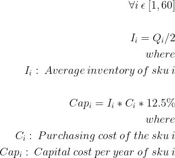

方程式—(图片由作者提供)

作为一家中型企业，我们认为你的资本成本相当高:12.5%。

**仓储费用**

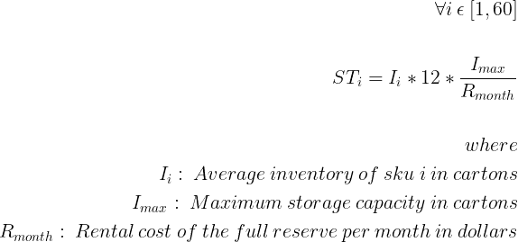

方程式—(图片由作者提供)

在这个模型中，我们假设我们有世界上最好的房东。她按纸箱数量给我们开发票，取每年的平均值。我们不会为空的位置付钱。

> IMAX = 480
> Rmonth = 2000 美元/月

**问题**

> 您应该在 [ERP](https://www.youtube.com/shorts/v0_R8P6MLQ0) 中设置每个补货 Qi 的哪个**数量以最小化总成本？**

[](http://samirsaci.com) [## 萨米尔·萨奇

### 数据科学博客，专注于仓储，运输，数据可视化和机器人流程自动化…

samirsaci.com](http://samirsaci.com) 

# 二。构建您的模型

与本系列的前一篇文章不同，我们不会使用 PuLP，因为我们没有遇到线性规划问题。我们将使用 SciPy 优化函数来解决这个非线性最小化问题。

> *你可以在这个 Github(跟我来:D)资源库里找到完整的代码:* [*链接*](https://github.com/samirsaci/procurement-management) *。
> 我与其他项目的投资组合:* [*小萨奇*](https://samirsaci.com/)

## 1.声明您的决策变量

你想决定什么？

我们想设置由我们的 [ERP](https://www.youtube.com/shorts/v0_R8P6MLQ0) 发送给供应商的每个补货订单的数量。

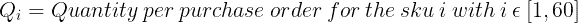

方程式—(图片由作者提供)

**然而**，为了简化我们的计算，我们将使用每年的补货数量 **Ri** 作为决策变量。

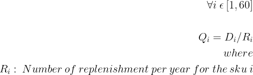

方程式—(图片由作者提供)

补货数量将使用以下公式计算。

*注意:我们接受非整数的补货箱数量。*

## 2.宣布你的目标函数

*你想最小化什么？*

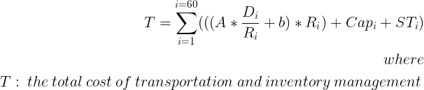

方程式—(图片由作者提供)

采购成本本身不包括在目标函数中，因为它超出了我们的优化目标范围。

**代码**

## 3.定义约束

*决定你可行区域的资源限制是什么？*

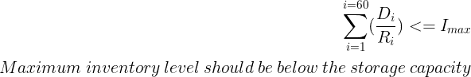

方程式—(图片由作者提供)

这是问题开始的地方，因为我们有一个非线性约束(1/Ri)。

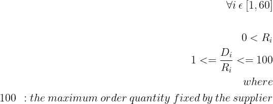

方程式—(图片由作者提供)

## 4.求解模型并准备结果

你模拟的结果是什么？

**初步猜测**

与线性规划不同，我们需要为算法的第一次迭代提供一个潜在解的初始向量来启动它。

这里，我们假设所有 SKU 每年 2 次补充是一个很好的选择。

```
**$63,206.7** total cost for initial guessing
Hopefully the optimal solution will be lower
```

**求解**

**评论**

*我找不到任何使用 Scipy 解算器实现整数非线性编程的方法。如果你有一个解决方案，比这种快速和肮脏的舍入更好，使用 python 的另一个库，可以请你在评论部分分享吗？*

```
For 100 Iterations
-> Initial Solution: **$28,991.9**
-> Integer Solution: **$29,221.3** with a maximum inventory of 356 cartons
```

[](http://samirsaci.com) [## 萨米尔·萨奇

### 数据科学博客，专注于仓储，运输，数据可视化和机器人流程自动化…

samirsaci.com](http://samirsaci.com) 

# 三。结论和后续步骤

*关注我的 medium，了解更多与供应链数据科学相关的见解。*

## 结论

这一优化解决方案比最初猜测的所有参考每年 2 次补货的**高出 56%。**

## 需求分布

如果我们有你的需求的随机分布，我们想避免缺货怎么办？在下面的文章中，您可以找到一种简单的方法来建立补货规则，假设您的需求是随机分布的。

[](https://www.samirsaci.com/inventory-management-for-retail-stochastic-demand-2/) [## 零售库存管理——随机需求

### 供应链优化模拟安全库存水平对库存管理绩效指标的影响…

www.samirsaci.com](https://www.samirsaci.com/inventory-management-for-retail-stochastic-demand-2/) 

## 后续步骤

我们可以看到，我们的解决方案主要是由运输成本决定的，因为我们的最大库存为 **356 箱**。

在下一篇文章中，我们将执行探索性数据分析，以了解我们的决策变量的分布，并了解是什么驱动了每个参考的结果。

我们还将尝试理解从连续决策变量到整数决策变量的转换会产生什么影响。

最后，我们将尝试几个场景，看看模型如何反应:

*   高租赁成本和低运输成本
*   非线性采购成本
*   更高的最小订购量

[](https://samirsaci.com) [## Samir Saci |数据科学与生产力

### 专注于数据科学、个人生产力、自动化、运筹学和可持续发展的技术博客

samirsaci.com](https://samirsaci.com) 

*欢迎随时联系我，我愿意就数据科学和供应链相关话题进行分享和交流。*

# 关于我

让我们连接上 [Linkedin](https://www.linkedin.com/in/samir-saci/) 和 [Twitter](https://twitter.com/Samir_Saci_) ，我是一名供应链工程师，正在使用数据分析来改善物流运作和降低成本。

如果你对数据分析和供应链感兴趣，可以看看我的网站

[](https://samirsaci.com) [## Samir Saci |数据科学与生产力

### 专注于数据科学、个人生产力、自动化、运筹学和可持续发展的技术博客

samirsaci.com](https://samirsaci.com) 

# 参考

[1] SciPy 优化库，官方文档，[链接](https://docs.scipy.org/doc/scipy/reference/generated/scipy.optimize.minimize.html)

[2] [Samir Saci](https://medium.com/u/bb0f26d52754?source=post_page-----308c258cb66f--------------------------------) ，使用 Python 进行线性规划的供应计划，[链接](/optimizing-warehouse-operations-with-python-part-2-clustering-with-scipy-for-waves-creation-9b7c7dd49a84?sk=95043aee5f3dffd8e7469cda2b7a9a73)