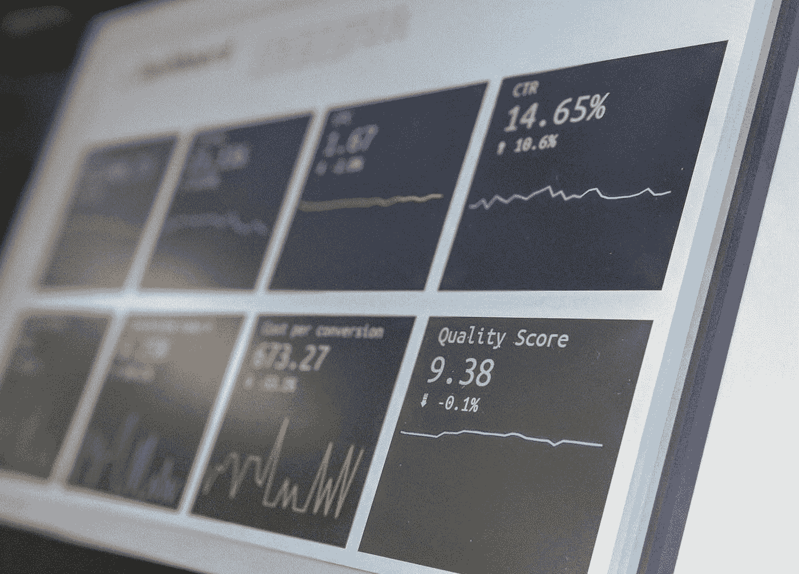

# 产品分析师，那是什么？

> 原文：<https://towardsdatascience.com/product-analysts-what-is-that-936978e5c215?source=collection_archive---------0----------------------->

## 总结产品分析师的工作，以及这项工作所必需的技能，并提供一些学习资源。

斯蒂芬·道森在 [Unsplash](https://unsplash.com?utm_source=medium&utm_medium=referral) 上拍摄的照片

在过去的三年里，我一直是一名产品分析师，最近，很多人问我在日常工作中做些什么。由于在技术领域，他们经常要求记录一切，我想在这里总结一下我的答案，希望能帮助其他人了解产品分析是否可能是他们职业生涯的下一步。

快速**免责声明**:这篇文章将涵盖我对这个角色的体验，不一定代表我现在或以前的雇主的想法。我的经历可能和其他人不同，尤其是产品分析师这个头衔往往很模糊:在一些公司，同样的职位被称为数据科学家或业务分析师。在一个公司内，可能会发生这样的情况，一些产品分析师的角色更接近于数据工程师，而另一些则更接近于产品经理。此外，我只在科技行业工作过，在其他行业，这个角色可能会有很大不同。

我将从我对产品分析师的定义开始，然后我将谈论一些产品分析师的职责(度量、细分、实验和探索性数据分析)，以及这份工作的一些基本技能(沟通、商业知识和技术技能)。我将以为什么我喜欢做产品分析师来结束我的演讲。

这篇文章的目的是给你一个角色的概述，所以我不会给出不同职责和技能的细节，但我为不同的主题添加了一些资源，欢迎在评论中提问。

# 什么是产品分析师

我最喜欢的定义是，产品分析师是用户的拥护者。他们确保用户享受并从产品中获得价值。他们用数据去理解如何让产品惊艳，如何取悦用户，如何让产品有用，对用户有帮助。数据有助于了解所有用户的需求，不仅仅是那些给你发长篇大论的电子邮件或者更有可能回答 CSAT 调查的用户。

产品分析师通常分析大量的汇总数据，了解用户的痛点，他们的[啊哈时刻](https://medium.com/parsa-vc/how-to-discover-your-apps-aha-moment-5f75dd7b6536)，他们喜欢什么，产品的哪些部分没有意义，什么让用户留下来，什么让用户离开，以及这些东西如何因国家、类型、年龄等而变化。

# 产品分析师的职责

产品分析师使用定量数据为产品团队的产品决策提供支持，为后续步骤提供信息。例如，如果需要营销活动，产品分析师可能会建议构建哪些新功能，或者建议保留策略。经常听到“基于数据的决策”或“数据驱动的公司”。我更喜欢“见多识广”这个词，因为我认为知道数据不能提供全貌是很重要的，因此需要某种程度的产品直觉，这就是为什么产品分析师通常需要有很强的商业敏锐性(我将在后面谈到)。

在这一部分，我想解释一下产品分析师的一些职责。我将该部分分为:度量、细分、实验和探索性数据分析。

## 指标创建和监控

衡量的内容会得到改进。度量有助于理解产品的变化是否达到了预期的结果。这就像当你试图减肥时:如果你从不检查体重，很难决定少吃美味的冰淇淋是否是一个有效的策略，或者你在拒绝自己应得的零食。

类似地，产品分析师经常创建度量标准，或者使用现有的度量标准，并监控它们以评估产品方向是否让用户满意。分析师必须深刻理解指标，因为为什么指标以某种方式变化并不总是显而易见的。例如，你可能不是在减肥，而只是因为你在练肌肉。这就是为什么经常有大量的指标需要查看。

幸运的是，您总是可以从一些度量标准开始。一个很好的框架是谷歌心脏框架。或者，如果你喜欢不那么浪漫、冒险的海盗， [AARRR 框架](https://medium.com/@ms.mbalke/aarrr-framework-metrics-that-let-your-startup-sound-like-a-pirate-ship-e91d4082994b)是另一个不错的选择。这些框架有助于衡量用户旅程的重要阶段，不同阶段的不良表现需要不同的行动(例如，低采用率可能需要营销活动，而不良的任务成功指标可能表明该功能难以使用)。

这些都是框架，因此你需要让它们适应你的产品。不同的产品、行业和业务类型需要不同的指标。一个有用的练习是选择一个你真正喜欢的产品(它可以是一个应用程序，也可以是一个邮局服务或一个玩具),并根据两个框架中的一个，考虑你将为该产品创建哪些指标。尝试创建特定于该产品的指标，捕捉用户旅程，并考虑如何解释指标变化。

这些框架使用多种度量标准，但是您可能听说过一个经常被单独提及的度量标准:北极星度量标准。每个公司、每个产品、甚至每个特性都有不同的定义。北极星指标是产品和/或功能优化的主要指标，它必须是可操作的、可理解的、可衡量的、敏感的和不可游戏的。我不会说得太详细，但有一点我认为需要记住的是，这个指标必须足够简单，每个人都能理解，这样更容易传播。如果它太难解释，团队就不会使用它，他们不会谈论它，甚至更糟，他们会曲解它。此外，北极星度量通常需要护栏度量，以确保我们没有遗漏其他重要信息。

通常，所有这些指标都是通过仪表板来监控的。不要相信耸人听闻的文章说仪表板已经死了。他们没有，他们还活着。的确，他们通常不会给出足够的细节(例如，为什么指标在第 X 天急剧增加)，但这是分析之旅和产品问题的起点。我不认为你需要任何关于构建仪表板的特定课程，但是知道不同的图表如何改变人们对正在发生的事情的看法是很好的，所以一些数据可视化的基础知识会有所帮助(参见沟通段落)。

## 片段

产品分析师需要理解他们所有的用户，有时这意味着理解为什么一个产品可能对一些人有用而对另一些人没用。因此，分析师通常在他们的分析中包括不同的切片。一些最常见的是人口统计维度，如性别、年龄、国家，还有非人口统计维度，如参与度、客户年龄以及新用户与现有用户的对比。一般来说，它们用于理解为什么产品对某些人有效，而对其他人无效。

有时，由于算法的不公平性，一群用户比其他人更关注产品，在这种情况下，了解对不同群体的影响甚至更重要。几乎总是有简单的解释为什么某些产品更受特定人群的喜爱:例如，一个儿童产品对儿童比对成人更有效。但重要的是，由于算法中的一些偏差，该产品并没有对某些群体产生更好的效果。

细分是理解用户的一个非常强大的工具。不过，考虑用户的隐私:使用包含足够多用户的群组是很重要的，因为不可能对这些用户的数据进行分解，这样可以保护用户的隐私。

## 实验

根据你公司的成熟度和数据成熟度，以及你正在开发的产品类型，你可能会进行大量的实验。在技术方面，我们通常使用 AB 测试，但是不同的技术也可以用于其他产品(例如，自然实验、因果推断等)。).在线 AB 测试的一个非常好的课程是免费课程。它真的做得很好，涵盖了大量的主题，并解释了企业如何使用 AB 测试来做决策(这在理论课程上经常被跳过)。如果任何人对自然实验和因果推断文章有建议，请随时在评论中提出！

## 探索性数据分析(特别请求)

产品分析师经常会收到利益相关者的问题，询问为什么 dashboard X 中的指标 Y 变化如此突然，或者他们的假设是否有数据支持，或者某个项目是否值得投资。这通常会生成需要几个小时(特别请求)到几周才能回答的项目。你通常希望在短期需求和长期项目之间取得平衡，并无情地划分优先级。

这些问题中的大多数需要一些数据探索来回答，通常称为 EDA(探索性数据分析),这是产品分析师工作的一个重要部分。它包括了解存在哪些数据、导入数据、清理数据以及提出大量问题。我认为强烈的好奇心是使 EDA 阶段有效的关键。

有不同的工具可以用于 EDA(后面会有更多的细节)，但是从我的经验来看，你无法避免 SQL。如果你需要学习或者需要复习，我推荐 Udacity 免费课程: [SQL by Mode](https://www.udacity.com/course/sql-for-data-analysis--ud198) 。

## 数据洞察和建议

从根本上说，度量、分割、实验和 EDA 用于获得数据洞察。我在第一份工作中犯的一个错误是展示我从分析中看到的东西，而没有“那又怎样”的跟进。洞察力可以是“度量 X 改进的”，但是大多数时候你想要解释为什么会发生这种情况，以及可以用这些信息做什么。例如，指标的提高可能是由于您可能考虑继续进行的营销活动，或者是您应该考虑进一步发展的一些外部因素。大多数时候，产品分析师处于独特的地位，可以根据数据给出建议。这并不意味着他们将做出最终决定，但通常鼓励他们就下一步措施提出建议。

然而，并非所有的产品分析工作都是如此。我面试了一些职位，公司只要求运行 SQL 查询和显示图表，所有的解释和建议都由利益相关者完成。

这也是我认为分析师和数据科学家之间存在更多差异的领域之一。产品分析师通常希望提供及时的数据见解，而数据科学家可能会从事更长期、更深入的项目。数据科学家可能会处理更复杂的模型，而产品分析师则更接近业务。因此，如果你真的对机器学习感兴趣，产品分析可能不是正确的选择。虽然说到底，这总是取决于你所在的公司和团队。

米利安·耶西耶在 [Unsplash](https://unsplash.com?utm_source=medium&utm_medium=referral) 上拍摄的照片

# 产品分析师技能

在前一部分，我试图列出产品分析的职责。在第二部分，我将重点放在工作所需的技能上。

## 沟通

产品分析师(以及分析师和数据科学家)的一项基本技能也是经常被忽视的技能是沟通。也是我最纠结的一个。产品分析师的价值是通过他们提供的影响来衡量的，如果数据结果沟通不畅，很难推动行动和影响产品。产品分析师非常了解数据，并且他们处于独特的位置，通过阐明用户的观点(或者至少是数据所显示的)来影响产品团队。

关于这个话题，我最喜欢的一本书是《T4 用数据讲故事》。它展示了如何创建强大的可视化和演示，如何使用数据来讲述故事和推动行动。数据可视化经常被忽视，但是一个简单易懂的图表通常比一个复杂的显示每一个可能的数据点的图表更有效。选择要展示的数据，并推荐团队应该采取的最有效的行动，这对于成为一名优秀的分析师至关重要。除了视觉化之外，讲述一个引人注目的故事对于获得人们的认同并提出有影响力的建议也很重要。

## 商业头脑

对业务的良好理解对于产品分析非常重要。首先，并不是所有的事情都可以通过数据推断出来，理解如何解释现有数据和缺失数据(例如，因为它们没有被跟踪，因为产品的用户仍然很少……)是非常重要的。了解业务方向、目标用户和竞争通常会有所帮助。

其次，产品分析师还必须注意产品指标的不良后果。例如，你不想让人们陷入不健康的行为，让他们在你的产品上花费更多不必要的时间。解释数据有时会很困难，人们必须考虑导致分析中显示的数字的所有可能的行为。

第三，企业也需要关注收入，因此有时要求产品分析师也关注收入。收入对产品决策的影响程度取决于公司的成熟度和业务类型。例如，B2B 企业或小公司可能需要关注高付费客户。

对于科技商业新闻，我会遵循 [Stratechery](https://stratechery.com/) ，但你可能想寻找任何与你的行业相关的博客/时事通讯。在我看来，你不需要深入了解所有细节，这在你职业生涯的后期会变得更加相关，但对业务的整体理解会有所帮助。

## 问正确的问题

对于任何分析师来说，提出正确的问题无疑是最重要的技能。良好的业务和产品知识、对产品的热情以及对用户的好奇心是提出正确问题的重要因素。

激情不是你能学会的，但绝对能提高。找到任何产品中你最喜欢的东西，尽可能多地使用它，思考你将如何改进它(如果你不是 100%喜欢这个产品，那就更好了)。进行伟大分析所需的好奇心会自然而然地产生。关于用户的问题会很容易出现。问题应该是是什么推动了你的分析，而不是可用的数据。

## 技术

即使拥有最棒的提问技巧，你也需要能够与数据对话:)。一般来说，工具可以根据公司的不同而改变，但是对统计学的良好理解是必须的。为此，我推荐斯普林格的书[《统计学习及其在 R](https://www.goodreads.com/book/show/17397466-an-introduction-to-statistical-learning?) 中的应用导论》。它用 R 中的例子总结了很多可以用来建模数据的技术(即使我更喜欢 Python，我也认为这本书真的很有帮助)。

我还发现在 [Kaggle](https://www.kaggle.com/) 上回顾探索性数据分析(EDA)的例子很有帮助。它们通常以 Python 笔记本的形式出现(R 也有笔记本),分析师经常使用它们。特别是在 Kaggle 中，有很多 EDA 笔记本使用 pandas 和 matplotlib/seaborn 进行可视化的例子。请注意，Python 中的可视化并不是最好的，有时很难配置(有些人复制电子表格上的最终分析，并从那里创建可视化)，但知道自己能做什么仍然很有帮助。

不同公司使用的大多数工具都会发生变化，但有一些工具是非常通用的:SQL、Python 和/或 R 和电子表格。我仍然不太了解电子表格，但是 SQL 方面的知识对我有帮助。我说过，学习 SQL 我建议 Udacity 免费课程: [SQL by Mode](https://www.udacity.com/course/sql-for-data-analysis--ud198) (顺便说一下 Udacity [免费课程](https://www.udacity.com/courses/all?type=free+courses)还挺多的)。我用那门 SQL 课程为我的第一次产品分析师职位面试做准备(它对许多其他职位也有帮助)。

你也可以加入当地谈论这些语言的聚会或团体(例如 [R-Ladies](https://rladies.org/) )。请注意，与 Python 相比，R 通常更侧重于数据分析，因此，如果您加入了 Python 小组，请确保您加入的小组侧重于数据分析/数据科学。

通常也有工具来构建仪表板，例如 Tableau 或 Looker。Tableau 中有一个关于[数据可视化的 Udacity 免费课程，我在第一份产品分析工作中学习了这个工具。你可能应该参加一个关于你公司使用的工具的课程，但是如果你只是想学习一种工具，Tableau 可以用学生许可证来使用，它对于 EDA 来说非常容易使用，所以你也可以快速测试你的“问正确的问题”技能。](https://www.udacity.com/course/data-visualization-in-tableau--ud1006)

## 其他资源

我想与你分享的一些其他资源是(I)有关于产品分析的伟大文章的[振幅博客](https://amplitude.com/blog/)(但当然他们试图出售产品，所以有时它感觉像一个广告)；(二)[重整](https://www.reforge.com/blog)关于成长的博客真的很有趣，但有点难以导航；(iii)最近推出的由 Eric Weber 撰写的[时事通讯](https://ericdataproduct.substack.com/people/2258741-eric-weber)(并在 [Linkedin](https://www.linkedin.com/in/eric-weber-060397b7/detail/recent-activity/shares/) 上关注他)，它专注于分析和数据产品，我发现它非常有趣和有用。

## 最后的想法

我喜欢这份工作，因为它让我在工作技能、提高沟通能力以及学习商业知识之间找到了平衡点。看到一个产品如何发展也是非常有趣的，帮助产品变得更好并使它们更好地帮助人们也是非常令人兴奋的。

感谢您花时间阅读这篇文章，希望对您有所帮助。欢迎提问或在评论中给我反馈！