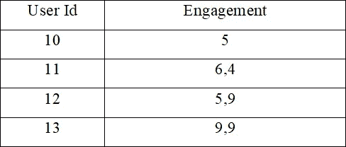
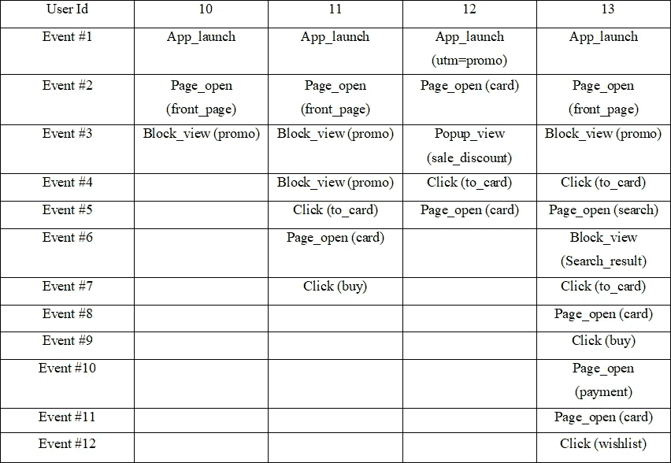
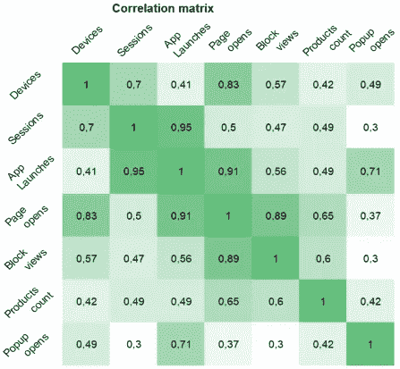
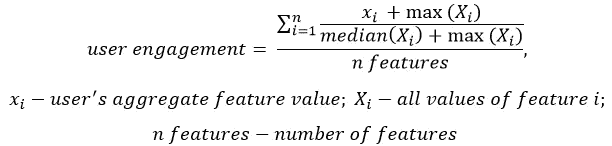
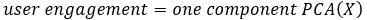
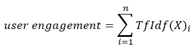
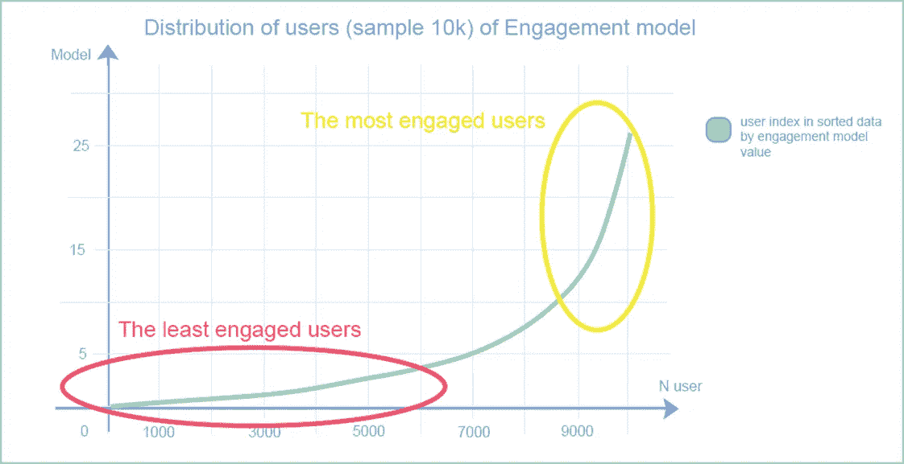

# 产品分析:参与模式

> 原文：<https://towardsdatascience.com/product-analytics-engagement-model-22d53c96d169?source=collection_archive---------9----------------------->

## *创建一个全面的工具来解释产品中的用户行为，并考虑该工具如何帮助发现洞察力*

# **先决条件**

随着产品的发展，用户的某种行为是否与他们退货或购买任何东西的机会有关，这是一个额外的问题。来自不同层次的众多利益相关者的问题包括:如果我们将访问过一个产品十个以上页面的用户与访问过不到十个页面的用户进行比较，ARPU 会更高吗？用户在第一周下了两个以上的订单后，返回某个产品的可能性更大吗？使用特定功能超过五次的消费者寿命更长吗？或者，更好的是，让我们把重点放在影响主要指标的功能上…完成了这一级别的任务和分析的产品分析师将能够立即预测这类问题的答案…

所有上述问题，以及其他类似类型的问题，都可以有把握地回答。用户采取的每一个动作都增加了前进到下一个步骤(转换到目标动作、返回到服务等)的可能性。).这正是参与度的含义:用户在其当前发展水平下对产品采取行动的意愿，如选择 UI 中提供的商品/服务/某些内容，通过主要产品漏斗，并在完成目标行动后继续参与产品。因此，可以通过开发参与度模型来实现用于与其他用户相比评估用户的统一方法。

# **型号**

参与模型分析每个用户关于产品的活动，表明用户参与当前产品的愿望。

*表 1。此类分析如何产生的示例*

这里 id 为 13 的用户参与度最高，id 为 10 的用户参与度最低。

作为这种分析的结果，我们可以将用户分类为那些知道并理解如何使用产品的人，那些有兴趣了解产品当前状态的人，以及那些访问了产品并在执行简单操作后没有发现任何实质性内容就很快离开的人。

最后，正如本文第二部分所展示的，通过参与度的细分，可以将 CR、CTR、留存率、粘性等产品指标和 ARPU、ARPPU、LTV 等业务指标联系起来。

总体而言，敬业度模型在以下方面有所帮助:

1.设计产品开发战略；

2.分析度量在产品和业务度量中的适应性。例如，如果跳出率降低 5 %,产品中的 LTV 会改变多少；

3.深入了解是什么让一个产品成为习惯，或者什么行为表明用户对该产品的参与度正在下降。让你找到顿悟的时刻；

4.跟踪用户对产品兴趣的起伏，以及随之而来的行动。

在接下来的部分中，我们将讨论如何使用约定模型来处理这些任务，在这一部分中，我们将讨论可以根据您的产品的特性、数据的存在或缺乏、实现资源来开发什么样的约定模型，并考虑如何创建它。

# **参数**

该模型的逻辑是基于用户在产品漏斗深处采取行动的可能性(从一个产品点转换到另一个产品点):当打开页面时，用户必须在特定设备上启动应用程序，某些块将被显示。当块被显示时，用户可以看到各种各样的报价(在线商店中的产品，在服务的情况下是专门的内容)，并且很可能用户将打开特定产品的页面，并且最终可能购买某些东西。

可以使用参数来指示与产品的动作、发现和页面上的参与之间的联系。该模型的参数对于一个产品来说是相当通用的，并不严重依赖于它的特性。构建模型时需要考虑的基本参数示例:

*设备/平台* —访问两个或更多平台(通常通过两个设备完成)肯定意味着用户愿意使用产品，例如，使用不同的界面。

*会话* —一段时间内(一天或一周)的访问。例如，在早上和晚上输入产品反映了用户将尝试经历选择产品/内容、支付漏斗和其他具有不同动机的相关动作的阶段。

*App 启动* —打开/关闭应用，让用户再次看到相同的页面，相同的区块但反应可能不同。

*页面打开* —以上所有操作都会以某种方式影响打开页面的数量。

*区块视图* —与网站互动(垂直滚动，或水平滚动单个区块)。

*产品预览计数* —用户已经看到的关于产品/内容的元素(预览、海报)的数量。用户在屏幕上看到的商品越多，他就越有可能被激起兴趣，这将影响转化率和漏斗流量。

*点击* —点击块和元素中的不同组件，既可以转移到另一个页面，也可以滚动浏览元素或打开弹出窗口或打开任何工具提示(或其他信息元素)

*弹出窗口打开* —期间打开的弹出窗口的计数

*等*。指示与产品或界面的接触的其他用户动作可能在特定产品中被突出显示。

一个需要数据的例子，你很可能已经有了(类似的东西):

表二。面向个人用户的事件管道/事件流

表 3。事件管道的聚合数据

所有基本功能的聚合将充分反映用户与产品的交互。可能需要这种类型的数据结构来使用下述方法之一创建模型。

各个特征之间的高度相关性支持了模型中和本节开始时提出的基本原理。考虑描述几个基本行为之间的概率联系的相关性。

表 4。产品中基本行为的成对比较在相关矩阵中进行对比。

也就是说，相关性的分布表明所有的用户行为都是紧密相关的，反映了通过产品中漏斗步骤的概率。

# **车型变化**

根据用于构建模型的选项，可以采用各种方法，这些方法在分析的准确性方面有所不同。在最基本的版本中，在产品中使用一种类型的动作:例如，打开页面。所有的基本动作可以应用在更复杂的模型中，关于该模型的信息存储了所获得的数据。

让我们考虑建立模型的可能方法:

**一个精确动作**的计数器——单个特征的选择，比如打开一个页面(page open)为主的动作。
适用于数据多样性有限的小型项目。这是一种从许多来源获得最多关注的技术，但它的问题是它没有考虑到每个单独页面上的交互，以及用户对屏幕上显示的附带项目的反应。

**所有事件计数器** —对于每个用户，事件的周期计数器，结果数字作为模型。如果您不想进行任何复杂的计算，例如快速的初步评估，或者如果对报告/仪表板的数据输出有各种限制(主要是计算性的)，可以使用这种方法。
缺点包括所有产品的动作具有相同的权重(点击等于打开一个页面)，以及基本活动之间缺乏任何联系。

**特征中值表示。**在这种创建参与模型的技术中，使用了与服务上的所有动作相关的个体用户活动的标准化。用户参与度将反映在最终价值中。以下是粗略的计算公式:

也就是说，我们通过计算用户执行的动作的数量来计算每个模型特征的算术平均值。此外，还可以使用特征的其他归一化缩放方法(如最小最大归一化)。
该方法的优点是相对容易使用分析仪器(通常是对数据库的查询)进行计算，并获得每个用户活动的整体分析。
缺点是仍然忽略了模型中包含的参数之间的概率联系。
模型的输入数据是通过类比表 3 创建的。

**降维方法。**当您希望强调模型中包含的所有指标(特征)的最一般比率时，您可以使用更复杂的计算作为模型。在这种情况下，可以应用一种降维方法来优化计算。

例如，主成分分析(PCA)可用于创建用户执行的最具可比性的活动的数学模型。
PCA 的主要目标是通过将相关性(或者更确切地说，先前归一化值的协方差)与参数的特征向量相交，从 k 个参数中获得 n 个分量。

由于所有的基本参数之前都被认为是概率相关的(从一个点到另一个点的转换变化不大——今天 100 人进入，30 人点击，明天 110 人进入，32 人点击，等等)，所以所有的参数都将具有高水平的相关性，允许我们通过一个分量来计算 PCA。
因此，模型的计算如下:

PCA 有许多计算限制，其中之一是所有参数都必须缩放，这意味着在计算 PCA 之前必须对数据进行标准化。

这种方法创建的模型的主要优点是，它包括了服务上的主要活动之间的交互，这使它有别于以前的方法。

这可能是创建敬业度模型的最佳技术，因为它允许您根据模型更准确地比较具有相似敬业度值的用户。类似的方法，如独立成分分析或矩阵分解，也可以用于计算模型，但最终结果将非常相似。
模型的输入数据也类似于表 3 中的数据结构。

**基于事件频率的建模。**用户对特定事件在流中出现频率的技术与上一点相反。使用这种方法不需要通过基本参数进行聚合；取而代之的是，获取事件流并对其应用众所周知的 Tf-Idf 文本处理。作为利用这种技术的结果，最不常见的用户活动将被给予更大的权重；例如，5 个已浏览页面的权重将低于 1 个添加意愿列表的权重。

这种技术的好处是，它允许我们从最重要的方面来衡量参与度，无论是特定的搜索功能，特定产品的评级，还是对特定部分的访问。

这种技术需要使用来自事件管道的数据来构建参与模型。(见表 2)

使用上面的任何一种方法，计算的可视化结果应该是用户的分布(如图 1 所示),根据方法的不同，从执行较少活动的反弹用户到熟练使用产品并具有独特功能的超级参与用户都有不同程度的准确性。

极高(> 0.99)和极低(< 0.01) quantiles can also be excluded, depending on the quality of the input data.

Chart 1: Value distribution according to the engagement model

The preliminary phase can be finished here. At the moment, we have considered the data used for modeling, ways of building the model. The most interesting and important information about using the model will be discussed further in the second part of the article.

[https://medium . com/@ sqweptic/product-analytics-engagement-model-part-2-1733 b460 e68](https://medium.com/@sqweptic/product-analytics-engagement-model-part-2-1733b460e68)