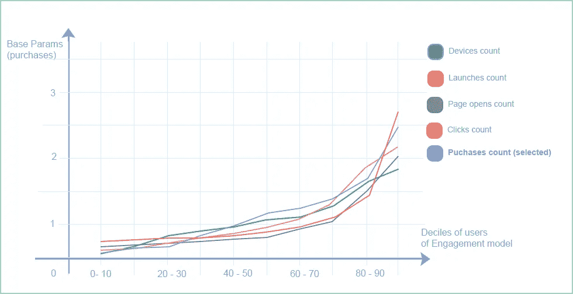
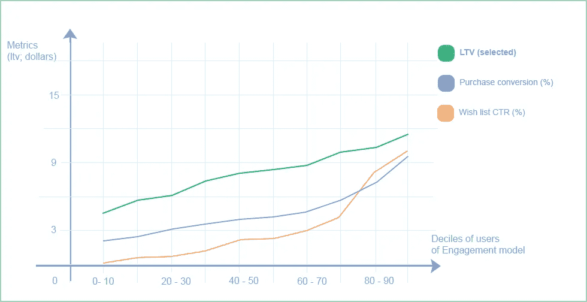
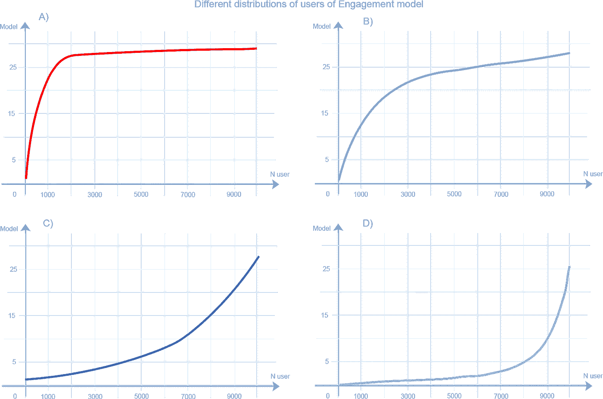
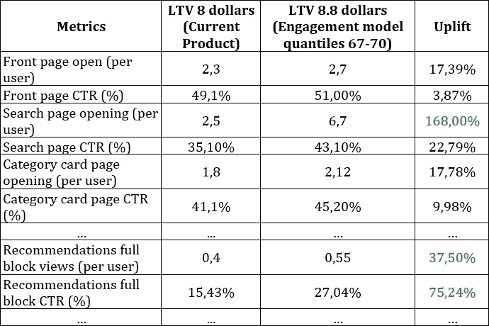
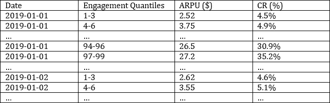
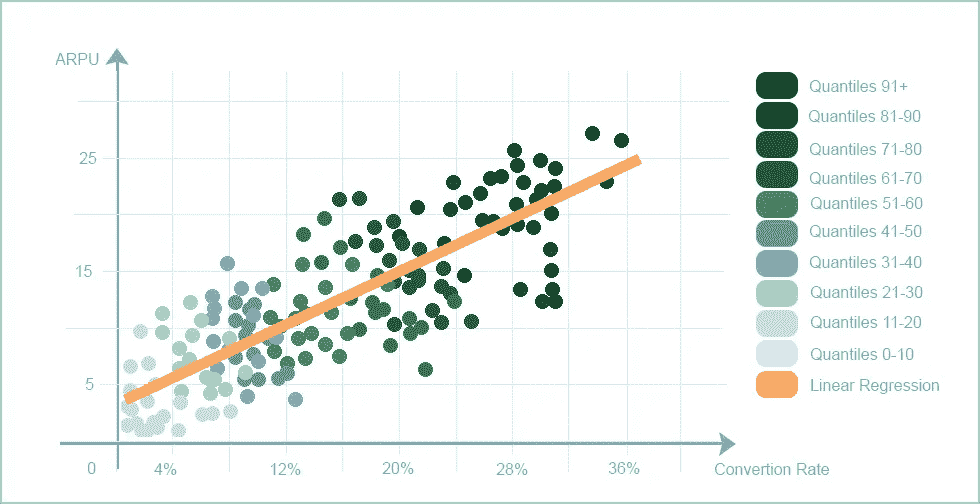
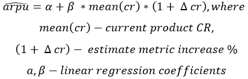
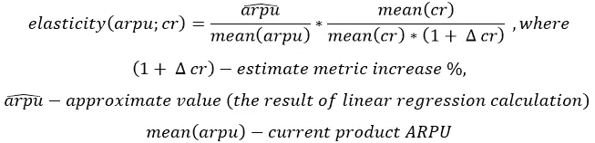
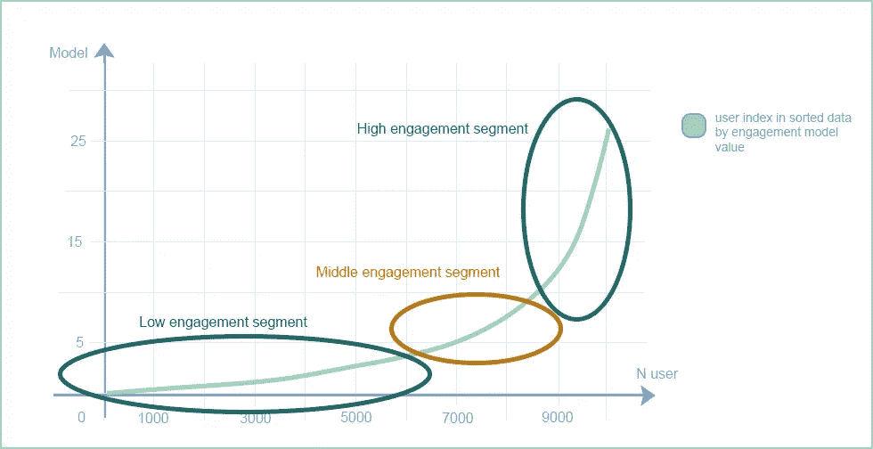
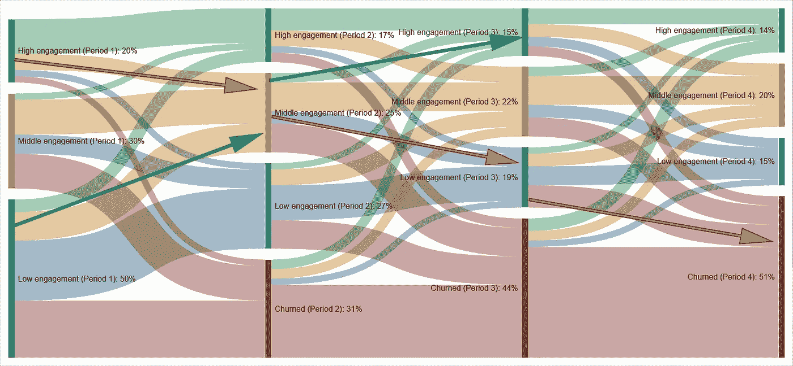

# 产品分析:参与模型(第 2 部分)

> 原文：<https://towardsdatascience.com/product-analytics-engagement-model-part-2-1733b460e68?source=collection_archive---------19----------------------->

## *使用参与模型了解产品开发的当前状态并获得产品洞察力。*

这是关于参与模型的文章的后续，其中我们将讨论构建的模型如何有助于产品知识、产品开发目标、洞察力的搜索和啊哈时刻的选择。为了便于理解，所有的挑战都将使用抽象市场的例子来完成；绝大多数读者都会熟悉这种服务，所以它会简单明了。

第一部分:[https://medium . com/@ sqweptic/product-analytics-engagement-model-22d 53 c 96d 169](https://medium.com/@sqweptic/product-analytics-engagement-model-22d53c96d169)

# **这个模式为什么有效？**

首先，确保创建的模型能够正常运行。以前假设基本参数有密切的联系(除其他外，表现为高度相关)，表明所有参数都有可比较的模式。因此，通过根据用户模型强调细分(例如，通过将所有用户分成十分之一)，可以追踪每个细分中所有参数的动态，从而允许测试和验证模型。

图表 1。用于建立模型的基本参数的分布

因为基本参数是模型的一个直接元素，所以预计所有参数都会同步上升，但所有指标也会从十分位数上升到十分位数。

图表 2。按模型的十分位数划分的主要产品指标分布

所有其他指标，如 ARPU、保留率和生存期(LT)也在增加。因此，该模型准确地反映了用户在项目中的参与度，并且因为这直接反映在群组中。

# 产品的目标应该是什么？

在将参与模型付诸实践之前，考虑用户在模型中的分布如何揭示产品的当前状态是很重要的。

首先考虑以下分布变化:

图表 3。展示了不同的敬业度模型分布

a) **理想的产品**假设大多数用户愿意学习和使用产品的所有功能；他们成功地通过了漏斗，当问题出现时没有负面影响；并且用户在完成预期活动后感到满意。所有的指标都非常高:跳出率(对于付费客户)接近 0%，保留率接近 80%-100%，粘性系数接近 1。折扣的影响微乎其微，而新开发的功能对所有细分市场的影响都是一样的，因为用户已经形成了使用该产品的习惯，这使得它几乎成为一个必不可少的产品。

由于产品范围或内容的有限和持续波动、定价和营销策略的定期修订、外部条件的变化、风险等等，这种程度的参与几乎是不可行的。

或许这种参与度的一个例子是谷歌搜索，它是大多数互联网用户的必备产品，用户与产品的互动在一段时间内都是如此。

b) **a** **饱和产品** —大多数用户认为产品不错，有相当数量的用户是忠诚的，产品的结构和可用性对大多数用户来说是显而易见的。

指标:目标行动的转化率非常高，跳出率低，用户群表现良好，尽管在最初阶段略有下降，但稳定期正在形成。

产品分类和内容之间的联系以及提供的便利性是维持和吸引用户的基础(用户理解并使用推荐，搜索总是导致各种选择，即使没有可用的产品，目录也不会限制用户，并且总是为当前请求和未来提供产品替代)。营销运营有效地吸引了新用户(回头客不会回应，因为他们熟悉产品)，其中大部分人参与了产品。大幅价格优惠对新用户来说更成功，对老用户来说就没那么有效了。

c) **一个** **优化的产品**——产品拥有稳定且显著的用户群，这种用户群表现在特定的有限细分市场(用户被某些功能或优惠所留住)，消费者愿意与其他页面进行互动。

度量标准包括期望行为的平均转换率、平均跳出率和愿意返回产品的人数。

在这一点上，相当比例的消费者已经准备好与产品进行互动，这种效果开始在 a/b 实验中更加明显地显现出来。

d)**a****conversation product**—只有极小比例的用户养成了使用产品的习惯，大多数用户对产品的功能不感兴趣(或者不知道如何利用这一功能)，忠实受众不稳定，易受外部影响(竞争对手的活动、负面评价)。

衡量标准:低保留率、期望行动的平均转化率和高跳出率。产品不能有效留住消费者；营销努力和价格优惠是获得受众的最重要因素。

因为只有极小比例的访问者访问产品的子页面，在基本流程之外使用 a / b 测试的假设测试的影响是最小的，a / b 测试很少使用。例如，对于 100，000 个用户的 DAU，从 1000 个人访问的子部分获得 2%的转化率，在管理和开发支出方面很难补偿。因此，通过提高产品参与度，增加章节/页面之间的切换，以及产品参与度，您可以通过实验(a/b 测试)扩展评估产品假设的选项。

# **在产品开发过程中确定优先级**

让我们更深入地了解一下互动模式如何使您能够确定产品中应该改变的内容。为此，让我们回到与敬业度模型十分位数相关的目标指标分布。例如，这是 LTV。

图表 4。通过模型的分布选择估计的 LTV。

假设我们需要提高产品 10%的生命周期价值；根据敬业度模型的分布，我们寻找价值相似的分位数；这样的 LTV 水平有 67-70 个分位数。

通过将这些分位数划分为一个精确的细分市场，您可以表征该细分市场的指标，也就是说，分析它们如何参与产品，并将其与现有平均值进行比较。考虑下面这个抽象市场的度量表。

表 1。产品中用户行为模式的差异

比平均水平提升 10%的用户更有可能与搜索和推荐互动。例如，将重点放在与用户向搜索的过渡相关的功能/页面以及作为产品假设的推荐解释上是有意义的。在在线商店的情况下，这可以是“针对特定产品的相似搜索查询”块的功能，其将是推荐，并且也将转移到搜索或其他推荐算法中，例如在为产品/用户构建推荐向量时获取关于用户搜索查询的数据。

因此，采用参与度模型使得确定应该优先考虑哪条产品开发路径以实现指标的预期值变得简单。

在这种情况下，产品负责人、经理和分析师建立指标变化因果关系的能力至关重要(如上表所示)。

通过这样的分析，应该记住，如果我们比较非常不同的细分市场，例如，搅动和返回的细分市场，我们将比较完全不同的细分市场，这将不会给出产品中值得改进的确切点。

# **指标的弹性。财务和产品指标及其关系**

*你知道如果跳出率降低 5%，LTV 会发生多大的变化吗？*

如果用户不在跳出率范围内，他们很可能会通过支付漏斗(CTR)，如果他们通过支付漏斗，则很可能会变成目标行动(CR)。因此，用户将拥有以下二项式参数:bounce — 0，ctr — 1，cr — 1。用户之所以有这些标准，是因为他们对产品感到满意，所以被驱使并渴望使用该产品。使用参与度模型，基于用户参与产品的倾向来识别可比用户是可行的；这种相似用户的细分将在每个动作中具有特定的概率，并且在度量之间具有一定的联系。

通过选择大量这样的细分市场，您可以获得整个产品的指标关系，这非常容易——每个 n 分位数中的客户已经被归类为参与度方面的可比用户。

让我们以两个指标为例:ARPU 和购买转化率(CR)。使用这些指标，我们将通过以下结构收集敬业度模型的日期和分位数的统计数据:

表二。模型分位数度量关系的数据

每天/每周改变度量是有意义的，因为度量会随着时间而波动(季节性—冬季/夏季、营销活动和其他原因)。同样重要的是，要仔细检查分位数部分是否具有适当的代表性，并且该部分中的指标变化相对较小。

收到这些信息后，您可以创建一个图表来描述指标之间的联系。

图表 5。度量关系的可视化。雇佣的分位数

该图表描述了一段时间内(几个月来收集的)指标之间的关系；因此，您可以使用线性回归来近似这种关系，并获得指标每次变化的估计值:

收到最终 ARPU 后，您可以计算指标的弹性:

因此，可以评估产品中所有指标的弹性以及它们与财务和业务指标的关系，从而允许将这种工具用于产品假设的财务评估，并突出产品假设执行中的优先级。线性回归不仅可以基于两个度量的关系来创建，还可以基于许多度量的关系来创建，例如 CR/CTR 和 ARPU。产品和商业指标之间相关性的利用也可以包括在单位经济计算中。

当然，因为它仅仅基于系统内部过程的相互连接，所以这种工具与模拟建模更密切相关，容易受到偏差的影响，并且不能完全反映因果关系。

# **跟踪产品的吸引力并寻求洞察力**

使用参与模型，除了能够识别与产品交互的特定用户之外，还可以跟踪用户与产品的交互如何随时间演变。与任何群体一样，随着时间的推移，一些消费者开始不太积极地使用该产品，而另一些消费者开始更积极地使用它。

通过将用户划分为三个参与度段，相对模型的分布为:高(参与度最高的用户)、中和低(参与度最低的用户)。

图表 6。领料基础接合段

随着时间的推移，参与度最高的用户更有可能留在产品中。那些参与度较低的人更有可能陷入混乱。

图表 7。一段时间内用户参与度的群组。

结果，存在用户状态的两种动态:一种是用户与以前的访问相比开始采取较少的活动，与其他用户相比降低了他的参与度(红色箭头)，另一种是用户增加了他的活动(绿色箭头)。

与昨天相比，对今天增加了产品参与度的用户的分析，使我们能够确定哪些因素，例如与产品的哪个功能或部分的参与度，影响度量的增长，从而导致使用产品的习惯的形成。

因为在这种分析中，有可能形成开始更多地与产品互动的用户的准确细分，以研究该细分在产品中影响产品回报和参与度增加的活动和行为。

另一方面，继续与产品交互的用户，尽管不太活跃(红色箭头)，也容易受到通过 ui 的产品内保留方法的影响，而不是主要集中在搅动用户的邮件/推送通知/警报。

# 其他用途

*敬业度模型是一种可在多种情况下使用的工具。*

该模型可以展示产品假设在不同参与细分市场中对产品的影响。例如，影响值可以在高度参与的用户的子集上进行评估，这些用户更专注于界面并且更好地准备参与界面。或者，评估对产品不感兴趣的消费者对新功能的反应。

该模型还允许您比较执行和未执行相同操作的相似用户。例如，如果您通过与产品的接触来获取相同的细分市场，并将那些加入意愿列表的人与那些没有加入的人进行比较，您可以更精确地说出该功能对一个或多个指标的影响。这种机会的获得是因为与产品的交互是与特征相似的用户进行比较的(比较的是更具代表性的群体)，因此降低了偏差。

例如，高参与度用户的动态指标可以成为 NPS 分析的定量对应物，允许更快速地跟踪和检查最投入的用户的行为。

为了理解用户在产品中的行为、使用模式、特征和交互方式，有必要进行各种各样的研究，然而，有一种研究可以使用本文描述的工具来完成。

当然，可以提供更多关于参与模式的信息。在文章中，我想简化许多要点，并讲述更多关于通过构建模型可以获得的结果，因此，也许文章在某些部分变得令人困惑。