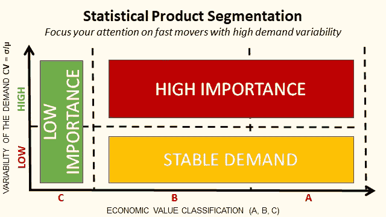
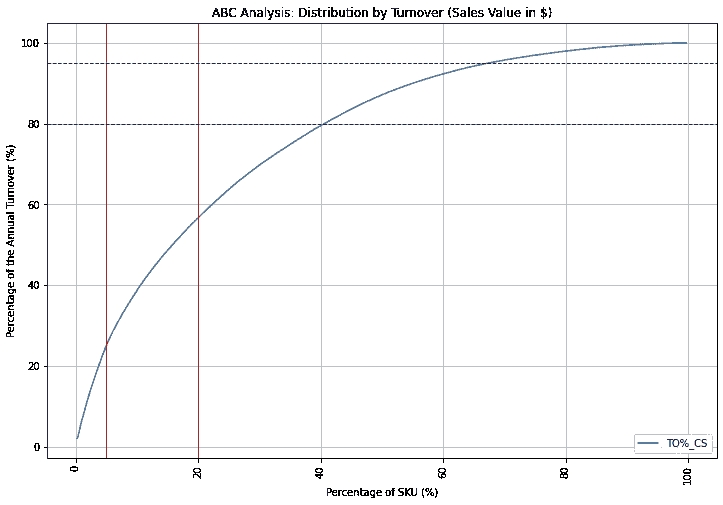
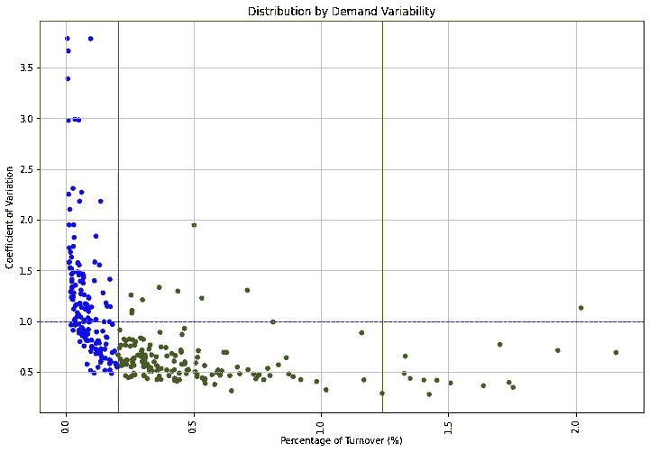
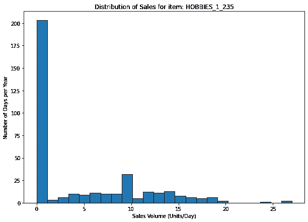
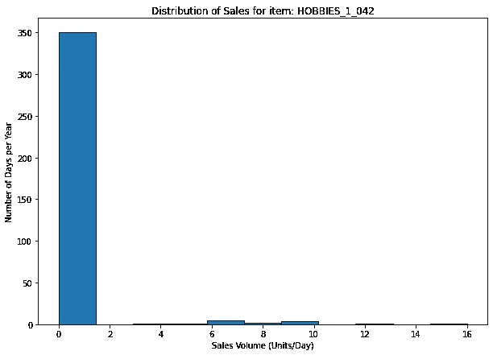

# 使用 Python 进行零售产品细分

> 原文：<https://towardsdatascience.com/product-segmentation-for-retail-with-python-c85cc0930f9a?source=collection_archive---------8----------------------->

## 根据营业额和需求变化对产品进行细分的统计方法



使用统计数据进行产品细分—(图片由作者提供)

**产品细分**是指**将具有相似特性**和**服务于相似市场**的产品分组的活动。通常与营销*(销售类别)*或制造*(生产流程)*有关。

但是，**作为物流经理**，你在管理货流的时候很少关心产品本身；*危险和超大产品除外。*

你的注意力主要集中在**销量分布**(快速/慢速移动)**需求可变性**和[**交货提前期**](https://www.youtube.com/watch?v=ssdni_n6HDc) 。

您希望努力管理具有以下特征的产品:

*   对你总营业额的最高贡献: **ABC 分析**
*   最不稳定的需求:**需求可变性**

在本文中，我们将介绍简单的**统计工具来结合 ABC 分析和需求可变性**来执行**产品细分。**

💌新文章直接免费放入你的收件箱:[时事通讯](https://www.samirsaci.com/#/portal/signup)

```
**SUMMARY**
**I. Scenario** 1\. Problem Statement
2\. Scope Analysis
3\. Objective
**II. Segmentation** ABC Analysis
Demand Stability: Coefficient of Variation
Normality Test **III. Conclusion**
```

# 一、如何用 python 做产品细分？

> *你可以在这个 Github 资源库中找到完整的代码:* [*链接*](https://github.com/samirsaci/product-segmentation) *我与其他项目的作品集:* [*萨米尔萨奇*](https://samirsaci.com/)

## 1.问题陈述

你是当地 [**配送中心(DC)**](https://www.youtube.com/watch?v=XejgbF2m_8g) 的运营总监，为 **10 家大卖场**发货。

在您的职责范围内，您有责任

*   [商场补货订单](https://www.youtube.com/watch?v=ssdni_n6HDc)的准备和交付
*   需求计划和[库存管理](https://www.youtube.com/watch?v=U1HqjHZzgq4)

## 2.范围分析

该分析将基于沃尔玛商店销售记录的 M5 预测数据集([链接](https://www.kaggle.com/c/m5-forecasting-accuracy))。

我们假设我们只有第一年的数据(D1 到 365):

*   **10 家店**在 **3 个州(美国)**
*   **一千八百七十八**独一无二的 SKU
*   **3 个类别**和 **7 个部门(子类别)**

除了仓库布局之外，类别和部门对您的订购、提货或运输流程没有任何影响。

**代码—数据处理**

## 3.目标

> 什么会影响您的物流绩效？

**产品轮换** *推动您大部分销售的参考资料是什么？*

*   快速移动者:前 5%(A 级)
*   以下 15%的快速行动者(B 级)
*   其余 80%的非常缓慢的移动者(C 类)

这种分类将影响，

*   仓库布局:使用 Python 根据帕累托原则减少仓库空间

*   提货流程:使用 Python 的订单批处理提高仓库生产率

**需求可变性** *你客户的需求有多稳定？*

*   平均销售额:
*   标准偏差:
*   变异系数:CV = σ/

对于 CV 值**高的 SKU，您可能会面临**不稳定的客户需求**，这将导致工作量高峰、预测复杂性和缺货。**

密码

*   筛选第一年销售的爱好 SKU
*   计算销售额的平均值、标准差和 CV
*   ABC 分析的排序(降序)和累计销售额计算

<http://samirsaci.com>  

# 二。产品细分

这项分析将在 SKU 的爱好类别中进行。

## 1.ABC 分析

推动您大部分销售的参考资料是什么？



爱好 ABC 分析 SKU —(图片由作者提供)

```
**Class A: the top 5%** - Number of SKU: 16
- Turnover (%): 25%**Class B: the following 15%** - Number of SKU: 48 
- Turnover (%): 31%**Class C: the 80% slow movers** - Number of SKU: 253 
- Turnover (%): 43%
```

在这个例子中，我们无法清楚地观察到[帕累托定律](https://studio.youtube.com/video/BRjhhdWjPc4/edit) **(20%的 SKU 制造 80%的营业额)**。

然而，我们仍然有 80%的投资组合实现了不到 50%的销售额。

**代码**

## 2.需求稳定性:变异系数

*您客户的需求有多稳定？*

从物流经理的角度来看，处理销售高峰比全年统一配送更具挑战性。

为了了解哪些产品会带来规划和分销方面的挑战，我们将计算每个参考的年度销售分布的变异系数。



CV = f(%TO)对于爱好 SKU —(图片由作者提供)

```
**Class A** Fortunately, most of the A SKU have a quite stable demand; we won't be challenged by the most important SKUs.
```


低 CV 的 A 类参考—(图片由作者提供)

```
**Class B** The majority of SKUs are in the stable area; however we still spend effort on ensuring optimal planning for the few references that have a high CV.
```



高 CV 的 B 类推荐人—(图片由作者提供)

```
**Class C** Most of the SKUs have a high value of CV;
For this kind of reference a cause analysis would provide better results than a statistical approach for forecasting.
```



CV 非常高的 C 类参考—(图片由作者提供)

**代码**

## 3.正规性检验

*我们可以假设销售额服从正态分布吗？*

大多数简单的库存管理方法都是基于需求服从正态分布的假设。

**为什么？** 因为容易。

**健全性检查** 在开始实施规则和执行预测之前，最好验证这个假设是不可反驳的。

我们将使用夏皮罗-维尔克检验来检验正态性；它可以使用 [Scipy 库](https://docs.scipy.org/doc/scipy/reference/generated/scipy.stats.shapiro.html)来实现。零假设将是 *(H0:需求销售服从正态分布)*。


红色(p 值< alpha) — (Image by Author)

```
**Bad News** For an alpha = 0.05, we can reject the null hypothesis for most of the SKUs. This will impact the complexity of inventory management assumptions.
```

**代码**

# 三。结论

*关注我的 medium，了解更多与供应链数据科学相关的见解。*

这种运营驱动的细分让我们深入了解了您的运营在规划和管理物流以满足商场需求时将面临的挑战。

# 关于我

让我们在 [Linkedin](https://www.linkedin.com/in/samir-saci/) 和 [Twitter](https://twitter.com/Samir_Saci_) 上连线，我是一名[供应链工程师](https://www.samirsaci.com/blog/)，正在使用数据分析来改善物流运作和降低成本。

如果你对数据分析和供应链感兴趣，可以看看我的网站

<https://samirsaci.com>  

# 参考

[1] Scipy stats Shapiro 测试文档，[链接](https://docs.scipy.org/doc/scipy/reference/generated/scipy.stats.shapiro.html)