# Python 中制造系统的生产计划和资源管理

> 原文：<https://towardsdatascience.com/production-planning-and-resource-management-of-manufacturing-systems-in-python-5458e9c04183?source=collection_archive---------7----------------------->

## 高效的供应链、生产计划和资源分配管理比以往任何时候都更加重要。Python 是一个极好的平台，可以模拟我们的需求和约束，甚至可以可视化我们的级联通信时间表。


作者在谷歌地球上拍摄的制造工厂照片

众所周知，供应链管理是当今全球经济中最需要改进的领域之一。将货物从目的地 A 运送到目的地 B 已经够有挑战性了，但是制造足够的材料却是相当困难的，硅芯片和制药组件的短缺也会成为头条新闻。

对这些制造过程建模需要对生产线固有的约束和依赖性有充分的了解。一些混合整数规划模型，如 [CPLEX](https://www.ibm.com/docs/en/icos/12.8.0.0?topic=cplex-setting-up-python-api) 或 [Google 的 OR framework](https://developers.google.com/optimization/introduction/python) 导出优化目标函数的解决方案，如最小化成本或将资源分配给具有明确约束和优先级的固定班次。然而，这些模型难以模拟连续系统，并且需要缩放以确保输入在数学上甚至可能实现。

我们可以使用众所周知的包(如 Pandas)在 Python 中相对容易地开发一个带有资源平衡的基本生产计划，并且可以使用 Plotly 以图形方式展示一个交互式甘特图，以显示我们垂直级联到管理层和车间的计划。

首先，让我们列出我们将在本练习中使用的案例研究。在这个应用中，我们将讨论制药行业的生物制品生产。许多疫苗，如今天生产的 COVID 疫苗，都是从微生物中获得的，这些微生物被修饰以产生引发预防疾病传播和疾病所必需的免疫反应的大量物质。这些过程的[细节](https://www.ema.europa.eu/en/documents/presentation/presentation-manufacturing-process-biologics-kowid-ho-afssaps_en.pdf)通常是专有的并且非常复杂，但是对于我们今天的练习，让我们假设我们正在制造一种从发酵过程中的微生物生长的产品，使用过滤器和离心机彻底净化，然后在添加辅料和灌装到小瓶中之前灭菌。下图所示的过程是通用的，可以在实验室规模和工业规模的许多不同组织中找到。

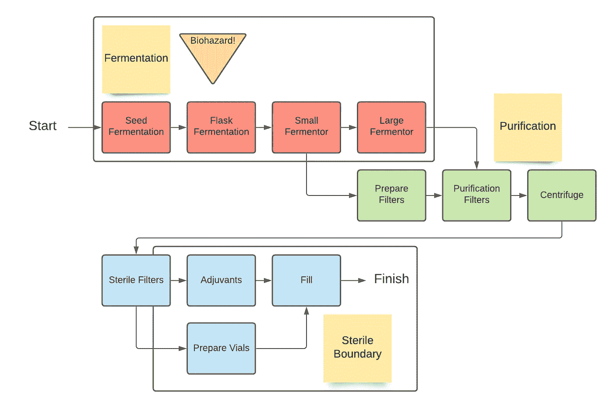

按作者划分的模拟案例研究流程图

真正的制造过程会有数百个相互关联的约束和依赖的任务。对于我们的模型，我们将有一个或两个前面的任务的渐进依赖性，以及技术操作人员劳动力和可用设备的限制。我们将在 JSON 文件中以下列格式对这些任务和约束进行建模。

**任务:**

```
"Items": [
    {
      "ID":1,
      "Name":"Seed",
      "Description":"Start fermentation from vial of seed material.",
      "Process":"Fermentation",
      "ResourcesRequired":
      {
        "Operator":2,
        "SafetyCabinet":1
      },
      "Dependencies":[0],
      "Duration":2
    },
    {
      "ID":2,
      "Name":"Flasks",
      "Description":"Ferment seed material in flasks.",
      "Process":"Fermentation",
      "ResourcesRequired":
      {
        "Operator":2,
        "SafetyCabinet":1
      },
      "Dependencies":[1],
      "Duration":3
    },
    {
      "ID":3,
      "Name":"Small Fermentor",
      "Description":"Ferment in small fermentation vessel.",
      "Process":"Fermentation",
      "ResourcesRequired":
      {
        "Operator":2,
        "SmallFermentor":1
      },
      "Dependencies":[2],
      "Duration":3
    },
    {
      "ID":4,
      "Name":"Large Fermentor",
      "Description":"Ferment and inactivare in large fermentation vessel.",
      "Process":"Fermentation",
      "ResourcesRequired":
      {
        "Operator":2,
        "LargeFermentor":1
      },
      "Dependencies":[3],
      "Duration":4
    },
    {
      "ID":5,
      "Name":"Prepare Filters",
      "Description":"Prep purification filters for next step.",
      "Process":"Purification",
      "ResourcesRequired":
      {
        "Operator":1,
        "PurificationTank":1
      },
      "Dependencies":[3],
      "Duration":1
    },
    {
      "ID":6,
      "Name":"Purification Filters",
      "Description":"Start purification in first purification assembly.",
      "Process":"Purification",
      "ResourcesRequired":
      {
        "Operator":3,
        "PurificationTank":1
      },
      "Dependencies":[4,5],
      "Duration":4
    },
    {
      "ID":7,
      "Name":"Centrifuge",
      "Description":"Separate material in centrifuges.",
      "Process":"Purification",
      "ResourcesRequired":
      {
        "Operator":2,
        "Centrifuge":2
      },
      "Dependencies":[6],
      "Duration":4
    },
    {
      "ID":8,
      "Name":"Sterile Filter",
      "Description":"Start sterilization of material.",
      "Process":"Sterile Boundary",
      "ResourcesRequired":
      {
        "Operator":3,
        "SterileAssembly":1
      },
      "Dependencies":[7],
      "Duration":2
    },
    {
      "ID":9,
      "Name":"Adjuvants",
      "Description":"Add adjuvants to bulk material.",
      "Process":"Sterile Boundary",
      "ResourcesRequired":
      {
        "Operator":2,
        "SterileAssembly":1
      },
      "Dependencies":[8],
      "Duration":2
    },
    {
      "ID":10,
      "Name":"Prepare Vials",
      "Description":"Sterilize bulk vials.",
      "Process":"Sterile Boundary",
      "ResourcesRequired":
      {
        "Operator":2,
        "VialFiller":1
      },
      "Dependencies":[8],
      "Duration":1
    },
    {
      "ID":11,
      "Name":"Fill",
      "Description":"Fill vials with bulk material.",
      "Process":"Sterile Boundary",
      "ResourcesRequired":
      {
        "Operator":2,
        "VialFiller":1
      },
      "Dependencies":[9,10],
      "Duration":3
    }
  ],
```

请注意，我们批次的每一步都包括:

*   ID —整数值
*   名称-字符串简短描述
*   描述—字符串详细描述
*   流程-字符串(步骤的三个类别之一)
*   所需资源—所需资源和整数计数的字典
*   依赖项-依赖的 ID 整数列表
*   持续时间—所需小时数的整数(不必是整数)

**约束:**

```
"ResourceCapacities":{
      "Operator":3,
      "SafetyCabinet":1,
      "SmallFermentor":1,
      "LargeFermentor":1,
      "PurificationTank":1,
      "Centrifuge":3,
      "SterileAssembly":1,
      "VialFiller":1
  }
```

请注意，我们的约束是来自任务的资源和我们的案例研究模型团队可用资源的字典。我们的生产套件有 3 名操作员、1 个安全柜、1 个小型发酵罐等，随时可供使用。

如果我们把所有任务的持续时间加起来，我们认为我们的每一批任务大约需要两天，但是，我们注意到一些任务依赖于两个前置任务。如果我们有足够的可用资源，这些可以同时进行！**我们程序的目标将是调度运行时间最短的批处理。**理论上，该生产计划可用于安排一系列生产，并让管理层更清楚地了解在一段时间内有限的资源下可实现的目标。

要开始在 Python 中开发我们的模型，我们首先必须导入我们将使用的库。

```
import pandas as pd
import datetime
import numpy as np
import plotly.figure_factory as ff
import json
import random
import plotly.express as px
```

Pandas 将是用于多种数据框架和操作的主要库。Plotly 将是我们以后可视化的主要库。导入我们的数据 JSON 文件很简单。

```
with open('tasks.json') as json_file:
    data = json.load(json_file)
```

然后，我们可以用这些加载的数据初始化我们的任务数据框架。

```
TasksDF = pd.DataFrame.from_dict(data['Items'])
CapacitiesDict = data['ResourceCapacities']
```

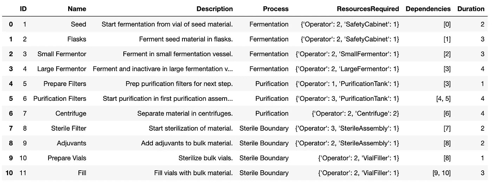

TasksDF 加载的数据帧

我们的数据框看起来非常类似于您在 excel 或其他基于表的工具中看到的数据框，但是，我们的 ResourcesRequired 列包含字典，我们的 Dependencies 列包含一个或两个元素的列表。我们希望将容量字典直接初始化为该对象。

接下来，我们希望初始化一个时间间隔列表，该列表涵盖了我们期望流程达到的整个范围。我们的持续时间列的总和是 29 小时，所以让我们取整为两天。

```
start_date = datetime.datetime(2021, 1, 1,0,0,0)
number_of_days = 2intervals = []
for minute in range(number_of_days*96):
    interval = (start_date + datetime.timedelta(minutes = 15*minute)).isoformat()
    intervals.append(interval)
```

我们区间的粒度是十五分钟组块，一天有 96 个十五分钟组块。因此，我们的整个列表将是这些 15 分钟间隔中的 192 个。我们还可以将时间间隔扩大到 30 分钟或 1 小时，以节省处理时间，或者以 5 分钟或 10 分钟的较低时间间隔获得更精确的时间表；确定粒度的一个决定性因素是 duration 列的特殊性。

接下来，我们需要制作一个矩阵，列出我们需要加载的所有时间和资源。请注意，我们的列是所有资源名称和 capacities 字典中的键。

```
headings = list(CapacitiesDict.keys())
loading = pd.DataFrame(columns = headings)
loading['index']=intervals
loading = loading.fillna(0)
```

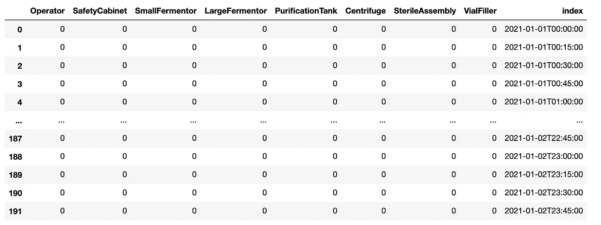

加载没有加载资源的数据帧

然后，我们将对最大负载矩阵进行同样的操作，但这一次，我们的内容将是在该时间间隔内我们可以加载的最大资源数。如果试图调度任何任务，但在该时间间隔内资源不可用，则应将其推迟到下一个有可用资源的时间间隔。为简单起见，在本练习中，我们将保持我们的值不变(三名操作员全天候可用)，但实际上，这些值预计会随着班次和设备可用性而变化。不管在什么情况下，我们后面的算法都将起同样的作用。

```
loadingMax = pd.DataFrame(columns = headings)
loadingMax['index']=intervals
for item in headings:
    loadingMax[item] = CapacitiesDict[item]
```

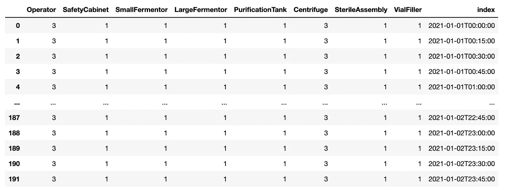

加载最大数据帧

我们的任务现在需要追加一些额外的数据。我们需要知道还需要调度多少分钟，并考虑它们的资源，然后在我们的间隔索引内初始化一些开始和结束时间。

```
jobsToAdd = TasksDF.copy()
jobsToAdd['TimeAddedToSchedule']=jobsToAdd['Duration']*60
jobsToAdd['Start'] = start_date
jobsToAdd['End'] = start_date
```

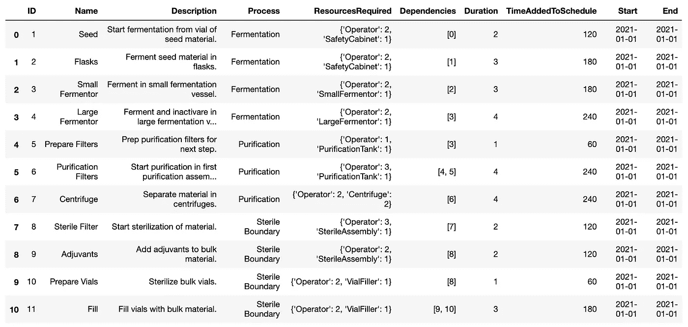

添加数据框的作业

我们现在已经准备好了所有要处理的数据。现在到了具有挑战性的部分:处理我们在资源和依赖性方面的各种约束，并安排我们的任务。

我们的算法将按以下顺序运行:

*   逐行加载加载矩阵
*   按作业的任务加载任务以添加任务
*   检查当前作业是否还需要添加；如果是，请继续
*   检查资源在加载矩阵的当前时间间隔内是否可用；如果是，请继续
*   检查依赖关系是否已经计划，并且不会在下一个间隔结束；如果它们是完整的，请继续
*   如果这是计划的第一个时间间隔，则取开始时间的时间戳
*   扣除剩余的计划时间并分配资源
*   如果没有更多的剩余时间要被安排，则取结束时间的时间戳

本质上就是这样。要深入研究代码，请复制代码块并将其粘贴到 Atom 或 Visual Studio 等开发环境中，以查看突出显示的所有语义。

```
for i in range(len(loading.index)): # Go through loading schedule time by time
    print(str(round(i/len(loading.index)*100,2))+'%')
    for j in range(len(jobsToAdd.index)): # Go through list of jobs, job by job
        if jobsToAdd['TimeAddedToSchedule'][j]>0: # Continue if job needs to be scheduled still
            available = True
            for resource in list(jobsToAdd['ResourcesRequired'][j].keys()): # Continue if all required resources are available
                if loading[resource][i] + jobsToAdd['ResourcesRequired'][j][resource] > loadingMax[resource][i]:
                    available=False
            if available:
                dependenciesSatisfied = True
                if jobsToAdd['Dependencies'][j][0] == 0: #Skip checking dependencies if there are none
                    pass
                else:
                    for dependency in jobsToAdd['Dependencies'][j]: # Check if a task's dependencies have been fully scheduled
                        if jobsToAdd.loc[jobsToAdd['ID'] == dependency]['TimeAddedToSchedule'].item() > 0:
                            dependenciesSatisfied = False # Check if fully scheduled
                        if jobsToAdd.loc[jobsToAdd['ID'] == dependency]['End'].item() == datetime.datetime.strptime(loading['index'][i],'%Y-%m-%dT%H:%M:%S')+ datetime.timedelta(minutes = 15):
                            dependenciesSatisfied = False # Check that dependent end time isnt after the start of this time
                if dependenciesSatisfied:
                    if jobsToAdd['TimeAddedToSchedule'][j]==jobsToAdd['Duration'][j]*60: # Set the start time
                        jobsToAdd['Start'][j]=datetime.datetime.strptime(loading['index'][i],'%Y-%m-%dT%H:%M:%S')
                    for resource in list(jobsToAdd['ResourcesRequired'][j].keys()): # Allocate Resources
                        loading[resource][i] = loading[resource][i] + jobsToAdd['ResourcesRequired'][j][resource]
                    jobsToAdd['TimeAddedToSchedule'][j] = jobsToAdd['TimeAddedToSchedule'][j]-15 # Reduce needed time
                    if jobsToAdd['TimeAddedToSchedule'][j] == 0: # Set the end time
                        jobsToAdd['End'][j]=datetime.datetime.strptime(loading['index'][i],'%Y-%m-%dT%H:%M:%S')+ datetime.timedelta(minutes = 15)
```

运行我们的算法应该只需要一两秒钟，因为我们的任务数量有限。正如我们可以想象的那样，如果要调度更多的任务，或者间隔更长的时间，时间会明显变长。

算法运行完成后，我们可以看到添加数据帧的工作已经完成，占位符时间戳被替换。没有剩余的时间需要安排。

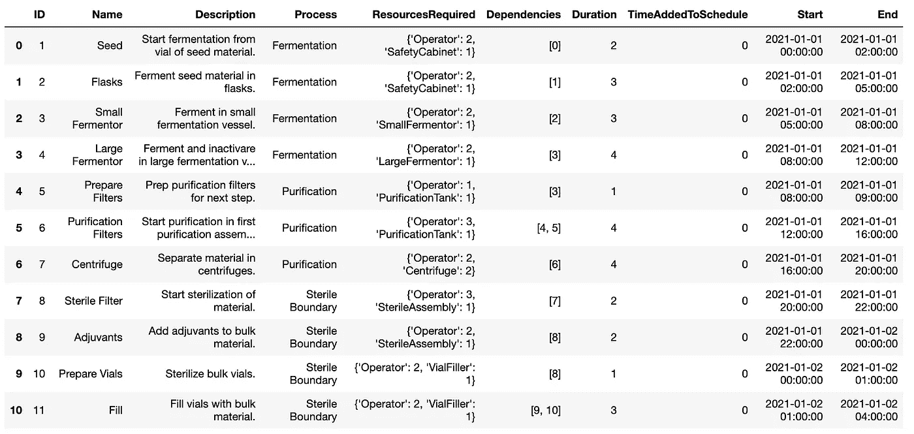

添加数据框的已完成作业

在检查我们的加载数据帧时，我们还可以看到我们的资源已经被分配到或低于最大加载数据帧的容量。

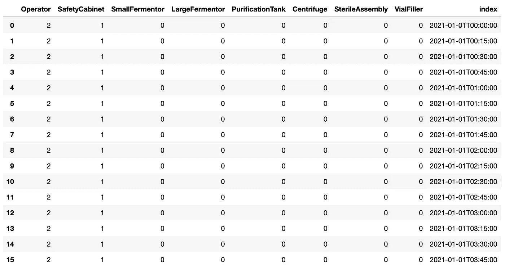

加载数据框已完成，任务已加载资源

虽然我们的时间表现在已经完成，但数据很难以一种容易向观众呈现的形式呈现，无论是在车间还是在上层管理。为了更好地说明我们的时间表，让我们用 Plotly 建立一个甘特图。

首先，我们需要将我们的数据配置成一种可由 [plotly](https://medium.com/u/5fdd6522cd45?source=post_page-----5458e9c04183--------------------------------) figure factory 读取的形式。

```
x = jobsToAdd[['Name','Start','End','Process']].copy()
x = x.rename(columns={'Name':'Task','Process':'Resource','End':'Finish'})
```

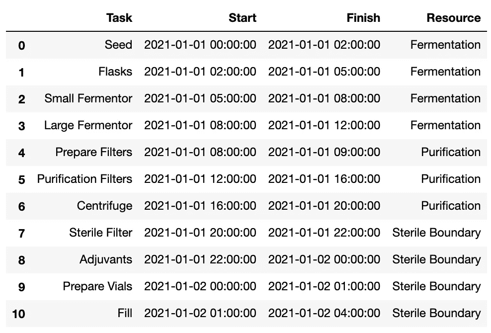

在 Plotly 图形工厂中实现的 x 数据框架

```
# Configure data for data frame formatting
df = []
for r in range(len(x.index)):
    df.append(dict(Task=x['Task'][r],Start=x['Start'][r],Finish=x['Finish'][r],Resource=x['Resource'][r]))# Assign color pallete randomly for dynamic number of resource categories
r = lambda: random.randint(0,255)
colors = ['#%02X%02X%02X' % (r(),r(),r())]for i in range(len(x.Resource.unique().tolist())):              
    colors.append('#%02X%02X%02X' % (r(),r(),r()))fig = ff.create_gantt(df, colors=colors, index_col='Resource', show_colorbar=True, group_tasks=True)
fig.show()
```

我们可以在下面看到交互式甘特图。

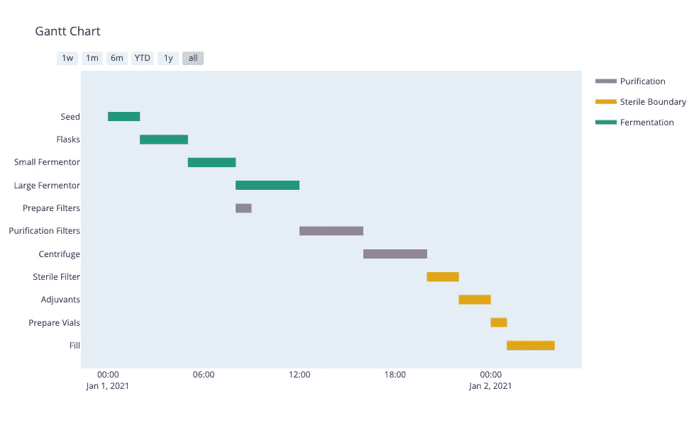

生产计划甘特图

这个生产计划可以导出到我们需要的任何地方，我们可以在屏幕上选择我们想要深入研究的区域。我们现在还可以直观地看到，我们可以在大型发酵罐中分批发酵，同时准备用于纯化的过滤器，因为我们有足够的操作人员，纯化需要完成这两项任务才能进行，但是由于缺乏可用的操作人员资源，准备小瓶和添加佐剂无法同时进行。

如果我们想为数据收集一些统计数据，比如资源利用率，该怎么办？所有这些数据都在我们的加载数据框中捕获，并可用于报告。

```
loading.describe()
```

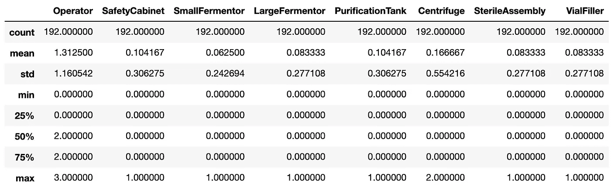

加载数据框统计数据

使用 Pandas describe()函数，我们可以看到可用的最大资源利用率。这对于确定完成工作所需的正确资源量非常有用。我们看到，至少在短时间内，我们的可用操作员数量已经达到极限。如果我们有四个可用的，我们将能够完成我们的添加佐剂和准备小瓶在同一时间，并完成我们的过程更早。

```
fig = px.line(loading, x="index", y="Operator")
fig.show()
```

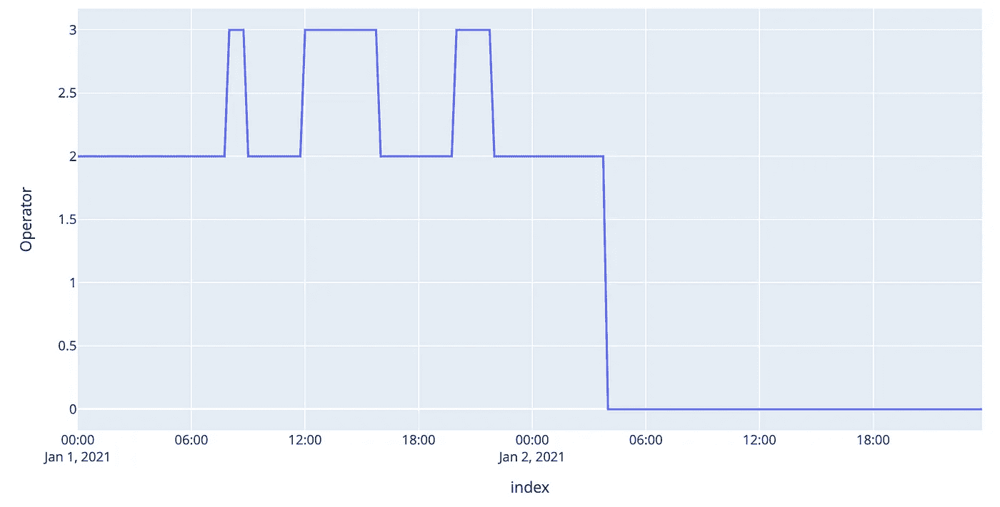

间隔时间内的运算符使用

与包含数百个任务和数十个要加载的资源的实际制造车间批处理相比，我们在这里一起工作的案例研究范围相对较小。这些数据会很快累积起来，并且会因行业而异。然而，我们的代码是可伸缩的，可以处理这些依赖性，尽管代价是更长的处理时间。我们的算法需要改进的地方还包括其他项目管理套件中的功能，如延迟开始、库存跟踪和批处理，以及添加/跟踪延迟。我们还可以在以后补充我们的数据，并在我们的工作中添加进一步的要求，甚至是材料清单或成本，以开发次级目标函数和进一步可视化。因为我们在 Plotly 中开发了我们的视觉效果，我们也可以使用企业数据托管或制作我们自己的 Dash 仪表板。

请让我知道你的想法，并欢迎[通过 LinkedIn](https://www.linkedin.com/in/will-keefe-476016127/) 联系我，提出反馈、问题或看看我们如何将这些工具和思维方式引入你的组织！点击这里查看我关于数据分析和可视化的其他文章[！](https://medium.com/@willkeefe)