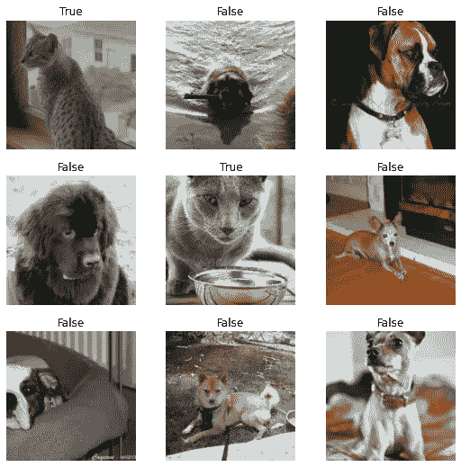
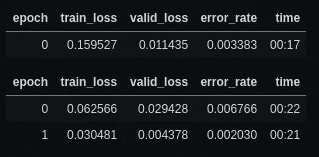
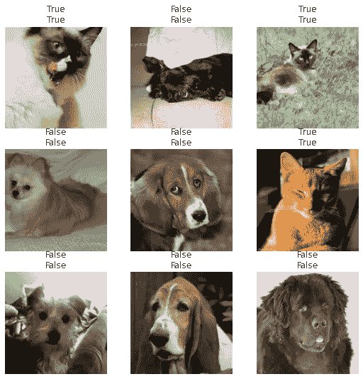

# 用 BentoML 制作 Fastai 模型

> 原文：<https://towardsdatascience.com/productionizing-fastai-models-with-bentoml-1ae27c60f760?source=collection_archive---------16----------------------->

**Fastai+BentoML =🔥**

我欠 FastAI 社区很多，我很确定我认识的很多人也会这么说。整个 ML 工程师军团都是在杰里米的指导和他自上而下的方法下成长起来的。

FastAI 库是社区的另一个贡献，它封装了他们采用的自顶向下的方法。它足够简单，您可以从几行代码开始，但仍然足够强大，可以处理您在 ML 之旅中可能遇到的大多数用例。它设计得非常好，以至于有人说

> 我认为杰瑞米·霍华德是机器学习领域的唐·诺曼。— [马克·萨鲁菲姆](https://marksaroufim.substack.com/p/machine-learning-the-great-stagnation)

但是有一件事我觉得需要多做一些工作，那就是部署。有了 FastAI，你将得到一个训练有素的模型，但你必须编写自己的后端来为模型服务，或者使用其他服务来为你做这件事。在这篇博客中，我将介绍一个我发现可以很好地与 FastAI 配合使用的堆栈

# Intro BentoML

在之前我已经讲过 BentoML [。我认为它是你训练好的模型的包装器，这使得部署和管理 API 变得非常容易。它很容易上手，并且内置了许多最佳实践，所以从一开始你就有了一个相当高性能的 API。BentoML 支持广泛的 ML 框架(完整列表](/pytorch-bentoml-heroku-the-simple-stack-65196aad181c)[在此](https://docs.bentoml.org/en/latest/frameworks.html))并支持大量部署选项(列表[在此](https://docs.bentoml.org/en/latest/deployment/index.html))。这使得它非常容易与您现有的工作流程一起使用，并且仍然可以获得所有的好处。

在这篇博客中，我将向您展示如何在 BentoML 的帮助下，将 FastAI 模型作为一个完善的 API 轻松地投入生产。然后我们可以使用 [BentoML 支持](https://docs.bentoml.org/en/latest/deployment/index.html)的各种部署选项。

现在，让我们构建一个有用的模型来开始训练

# 法斯泰狗 v/s 猫

所有参加过本课程的人都已经建立了这个模型，并看到了它的实际应用。这是一个简单的模型，识别给定的图片是狗还是猫。这是官方 [FastAI 教程](https://docs.fast.ai/tutorial.vision.html#Single-label-classification)的一部分，你可以查看一下，深入了解一下。(那些没有浏览过教程或不熟悉 Fastai 库的人，我建议先浏览一下 FastAI 教程，以便更好地理解)

首先，让我们来设置数据加载器



dls.show_batch()的输出。(来源——牛津-IIIT 宠物数据集)

现在我们已经准备好了数据，让我们对学习者进行培训。



(上图)学习器的输出显示了两个时期的训练和验证损失。(下图)模型的预测，正如你所见，我们有一个训练有素的好模型。(来源:牛津-IIIT 宠物数据集)

通过几行代码，我们有了一个非常强大的狗 v/s 猫分类器。它的速度很快。

# 准备发货

现在你已经有了一个训练有素的好模特，让我们开始派对吧！我们将首先尝试用 FastAI `export`函数保存模型，并对其进行推理。默认情况下，`learner.export(fname)`函数将保存`learner`的内容，不包含数据集项和优化器状态，以便推断到`learner.path`目录中。要加载模型，可以调用`load_learner(learner.path/fname)`。现在这里要知道的一件事是`export()`使用 python 的 pickles 实用程序来序列化`learner`，因此任何用于模型、数据转换、损失函数的自定义代码都不会被保存，并且必须在调用`load_learner().`之前加载。在我们的适度示例中，我们使用了一个`label_func()`来将图像标记为狗或猫。这是一个与学习者相关的自定义功能，因此当我们加载模型时，我们必须将它添加到同一个模块中。为了使这更容易，我们将所有这些自定义代码移动到另一个文件中，我们称之为`dogvscat_utils.py.` Bento，它将在导出时打包这个实用函数。

```
Saved to:  /home/jithin/.fastai/data/oxford-iiit-pet
```

现在您已经加载了模型，您必须创建一个`test dataloader`来获取预测，并使用学习器`get_preds()`来获取数据加载器中所有项目的预测。下载一堆猫和狗的图片并保存在文件夹中，我们将对它们进行预测。

```
(#6) [Path('images/c1.jpg'),Path('images/d2.jpg'),Path('images/c2.jpg'),Path('images/d3.jpg'),Path('images/c3.jpg'),Path('images/d1.jpg')]<fastai.data.core.TfmdDL at 0x7fea7d4d6710>(tensor([[4.7564e-06, 1.0000e+00],
         [9.9999e-01, 1.1712e-05],
         [5.6602e-12, 1.0000e+00],
         [9.9947e-01, 5.2984e-04],
         [2.6386e-18, 1.0000e+00],
         [9.9998e-01, 1.9747e-05]]),
 None)
```

现在您已经了解了如何使用 FastAI 进行推理，下一个目标是在 API 背后实现这一点。你可以使用类似 FastAPI 的东西，它很容易设置，但我们将使用便当，因为它包括电池。要在模型中使用 BentoML，首先必须将模型的预测函数包装在 BentoService 中。便当服务用于指定一些事情

1.  使用哪个框架来训练模型。`bentoml.frameworks`
2.  API 期望的输入类型以及如何处理它。`bentoml.adapters`
3.  API 应该如何接受输入，进行推理和处理输出。可能有这样的情况，一个模型的输出可能是另一个模型的输入，所以所有的逻辑都在那里。`predict()`功能内功。

根据以上信息，Bentoml 将决定包装和服务您的模型的最佳方式。我已经为我们的 FastAI 模型构建了一个样本 BentoService，让我们来看看，我将对它进行分解和解释。

如果你想要更深入的介绍，查看他们的[核心概念](https://docs.bentoml.org/en/latest/concepts.html)页面。现在您已经保存并准备好了一个 bentoservice 文件。使用它，我们可以打包并保存 FastAI 模型。

包装的理念就是便当。它接受您的模型及其所有依赖项，并将其打包成标准格式，这样就可以轻松地部署到您想要的任何服务。为了打包我们的`DogVCatService,`，我们必须初始化服务并调用它的`pack()`函数。这将检查所有的依赖项，构建 docker 文件并将其打包成标准格式。现在可以调用`save()`函数将打包的服务保存到自己的版本中。

```
[2021-01-19 23:20:42,967] WARNING - BentoML by default does not include spacy and torchvision package when using FastaiModelArtifact. To make sure BentoML bundle those packages if they are required for your model, either import those packages in BentoService definition file or manually add them via `@env(pip_packages=['torchvision'])` when defining a BentoService
[2021-01-19 23:20:42,970] WARNING - pip package requirement torch already exist
[2021-01-19 23:20:42,971] WARNING - pip package requirement fastcore already exist
[2021-01-19 23:20:42,974] WARNING - pip package requirement fastai>=2.0.0 already exist
[2021-01-19 23:20:44,734] INFO - BentoService bundle 'DogVCatService:20210119232042_EF1BDC' created at: /home/jithin/bentoml/repository/DogVCatService/20210130121631_7B4EDB
```

搞定了。现在，您已经创建了第一个 BentoService。要查看它的运行情况，请进入命令行并运行`bentoml serve DogVCatService:latest.`,这将启动开发服务器，如果您前往`localhost:5000`,您可以看到模型的 API 在运行。

# 部署您的打包模型

正如我前面提到的，BentoML 支持各种各样的部署选项(您可以在这里查看整个列表)。您可以从中选择适合您的部署。在这一节中，我将向您展示如何将 Bentoml 模型容器化，因为这是一种流行的分发模型 API 的方式。

如果您有 docker 安装程序，只需运行

```
bentoml containerize DogVCatService:latest
```

来生成准备好为我们的 DogVCatService 服务服务的 docker 容器。

```
[2021-01-31 12:40:24,084] INFO - Getting latest version DogVCatService:20210130144339_7E6221
Found Bento: /home/jjmachan/bentoml/repository/DogVCatService/20210130144339_7E6221
Containerizing DogVCatService:20210130144339_7E6221 with local YataiService and docker daemon from local environment\WARNING: No swap limit support
|Build container image: dogvcatservice:20210130144339_7E6221
```

现在，您可以通过运行以下命令来运行 docker 容器

```
docker run --rm -p 5000:5000 dogvcatservice:{container version}
```

转到 localhost:5000 来查看 swagger UI，或者运行 curl 来获得响应

```
curl -X POST \
--data-binary [@test_images/d1](http://twitter.com/test_images/d1).jpg \
localhost:5000/predict
```

它应该为猫返回 true，为狗返回 false。

# 结论

现在，您已经成功地用几行代码为 FastAI 模型创建了一个生产级 API(真正的 FastAI 风格😉).伴随这篇博客的还有一篇 [GitHub repo](https://github.com/jjmachan/fastai-bentoml-azure-tutorial) 。如果你想尝试完成的版本，请查看它。