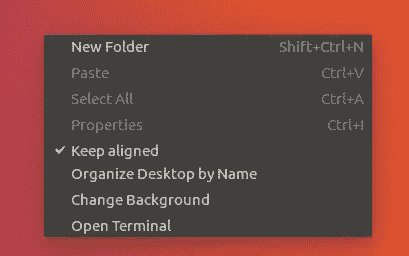
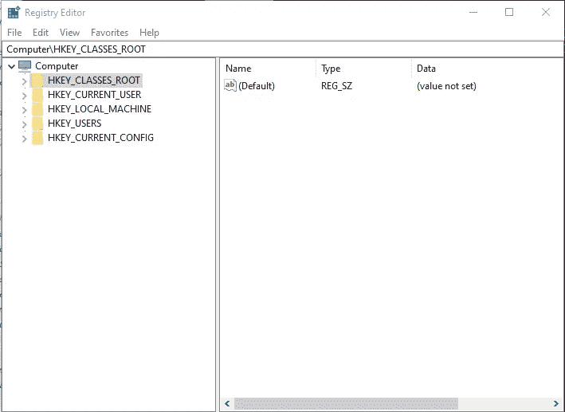
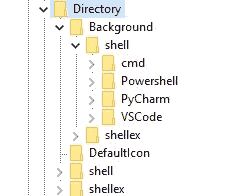
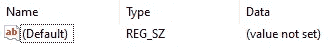
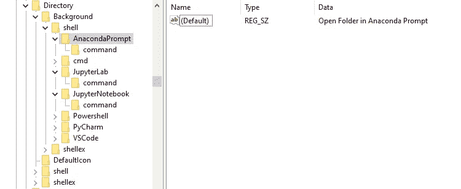
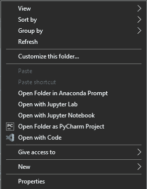
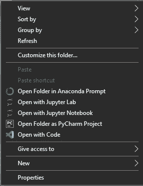

# 生产率提示:在 Windows 的右键上下文菜单中添加 Jupyter 和 Anaconda 快捷方式

> 原文：<https://towardsdatascience.com/productivity-tip-adding-jupyter-and-anaconda-prompts-to-windows-right-click-context-menu-39465550d5f5?source=collection_archive---------18----------------------->

## 创建有用的快捷方式来加速您的环境设置


马修·布罗德在 [Unsplash](https://unsplash.com/) 上拍摄的照片

这将是一个快速的过程，如果你和我一样，习惯于使用 Linux 计算机进行开发，你会发现这很有用。正如我刚才所说，在我生命的大部分时间里，我主要使用 Ubuntu 系统来完成几乎所有的编程工作。但是最近我有点厌倦了一些兼容性问题，决定尝试一下老式的 Windows。

因此，我开始安装全新的 Windows 系统，配置必要的编程环境，下载并安装 Anaconda 包等等。然后我注意到缺少一个我在 Ubuntu 上经常使用的简单但非常方便的工具:右击上下文菜单上的**“在终端中打开”**选项。



这可能看起来没什么大不了的(老实说，这甚至可能不是哈哈)，但当我在不同的文件夹中处理多个 Jupyter 笔记本时，它节省了我很多时间。有了它，我可以直接导航到想要的文件夹，直接从那里打开一个新的终端窗口，运行 Jupyter，然后开始工作，而不是必须从终端本身导航到每个文件夹。

所以，我不知道这对大多数人来说是多大的“缺失功能”，但对我来说肯定是这样的！如果你已经读到这里，很有可能它也适合你，所以让我们开门见山，好吗？

# 将自定义命令添加到上下文菜单中

在网上搜索可能性后，我发现这并不是那么简单，但也没有那么复杂，所以请耐心等待！

要做的第一件事是找到您的 **Anaconda** 安装路径。如果您在安装过程中使用了默认位置，它应该位于如下位置:

```
C:\Users\**<your_user>**\anaconda3
```

我们需要知道这个位置，因为我们将使用**脚本**文件夹中的 **activate.bat** 批处理脚本来打开 Anaconda 提示符。

接下来你需要做的是运行**注册表编辑器**。要做到这一点，只需在 Windows 搜索中输入**regedit.exe**，它应该会在你完成输入之前弹出。



Windows 的注册表编辑器

你应该密切关注接下来的步骤，因为你不想在这里惹上麻烦。所以要注意！

说完这些，让我们回到正题。如您所见，左侧有一堆文件夹，您必须导航至以下文件夹:

```
HKEY_CLASSES_ROOT **>** Directory **>** Background **>** shell
```

您可以通过向左导航文件夹树或在顶部的地址栏中键入相应的路径来找到它。打开后，您应该会在左侧面板上看到类似这样的内容:



目录

您可以在这里向上下文菜单添加自定义命令。如您所见，由于我安装了 VSCode 和 PyCham，它们都有一个命令列在这里，因为它们都有一个列在右键上下文菜单中的**“打开方式…”**选项。

因此，在 **shell** 文件夹中，您应该创建 3 个新的**键**，每个键对应一个我们想要添加的新命令:**anaconda promp**、 **JupyterLab** 和 **JupyterNotebook** 。右击**外壳**文件夹，选择**新建>键**。这些键应该与系统中出现的 *cdm、PowerShell* 以及任何其他键在同一级别，否则它将无法工作。

当您选择其中一个新密钥时，您应该会在右侧面板上看到类似这样的内容:



新的关键属性

双击*默认*属性，并在*值数据*字段中填入您希望出现在该键的上下文菜单中的文本:“在 AnacondaPrompt 中打开文件夹”、“用 JupyterLab 打开”和“用 Jupyter Notebook 打开”。

之后，你应该在我们创建的每个新键下添加一个名为 **command** 的新键(我知道这很奇怪)。那么您现在应该有这样的东西:



添加新密钥后的 regedit

最后，显然，要使它工作，您必须做的最后一件事是添加实际的命令本身。为此，您将重复向其他键添加文本的过程:编辑**命令**键上的*默认*属性，并填充*值数据*字段，但是您将编写实际的命令，而不是纯文本。对于每个相应的键，它们是:

*   **anacondapromp>命令:**

```
cmd.exe /K C:\Users\**<your_user>**\anaconda3\Scripts\activate.bat
```

*   **JupyterLab >命令:**

```
cmd.exe /K C:\Users\**<your_user>**\anaconda3\Scripts\activate.bat && jupyter-lab
```

*   **JupyterNotebook >命令:**

```
cmd.exe /K C:\Users\**<your_user>**\anaconda3\Scripts\activate.bat && jupyter-notebook
```

不要忘记添加您的实际用户名，或者甚至更改整个 anaconda 路径，以防您的用户名安装在系统的其他地方。重要的是为 **activavate.bat** 脚本提供正确的地址，因为它是用于实际打开 anaconda 提示符的默认脚本。

如果您想了解这些命令是如何工作的，下面是它们每个部分的作用:

*   **cmd.exe**—**打开各自文件夹下的 CMD(你右击的那个)；**
*   ****/K** —告诉 CMD 发出随后的命令，然后保持打开状态，以便您可以查看结果或键入更多命令；**
*   ****C:\…\activate.bat** —运行 *activate.bat* 脚本，打开 AnacondaPrompt 环境；**
*   ****& &** —一个“与”逻辑运算符。在第一个命令成功返回后，它运行该行上的下一个命令；**
*   ****jupyter-lab** 或 **jupyter-notebook** —用于打开 jupyter lab 或 jupyter notebook 的命令，根据您的喜好而定；**

**所以，在所有这些之后，你应该在你的右键快捷菜单上有 3 个全新的工作选项！去某个文件夹中查看一下，它看起来会像这样:**

****

**3 在上下文菜单中添加了选项**

**嗯，太好了，它像一个魔咒！但是菜单看起来确实有点空，不是吗？有些人甚至会说不完整…**

# **添加图标额外的酷！**

**是啊！这样做其实很简单。回到您添加的新键(顶层键，不是**命令**键)，右键单击并选择**新>字符串**。这将在右侧面板上创建一个新的属性行。将该属性命名为 **Icon** ，并提供一个图标文件的路径(。ico 扩展)作为*值数据。***

**我在我的 keys 中使用了 Anaconda 包附带的一些默认图标(多么方便),下面是它们的位置:**

*   ****anacondapromp>图标:****

```
C:\Users\**<your_user>**\anaconda3\Menu\anaconda-navigator.ico
```

*   ****JupyterLab** 和 **JupyterNotebook >图标:****

```
C:\Users\**<your_user>**\anaconda3\Menu\jupyter.ico
```

**然后，你最终的(更酷的)上下文菜单将看起来如下所示，但是如果你喜欢的话，可以随意使用其他图标。**

****

**最终上下文菜单**

**我们结束了这个简短的教程，我希望你喜欢它，甚至可能学到一些新东西！感谢你的阅读！**

# **额外的小提示**

*   **您可以导出这些新创建的密钥进行备份，或者将它们添加到 Windows 的其他安装中。您所要做的就是右键单击所需的键并选择**导出**；**
*   **您也可以使用相同的过程添加其他命令来满足您的特定需求，但是**注意**不要弄乱您不熟悉的其他选项。毕竟，权力越大，责任越大；**