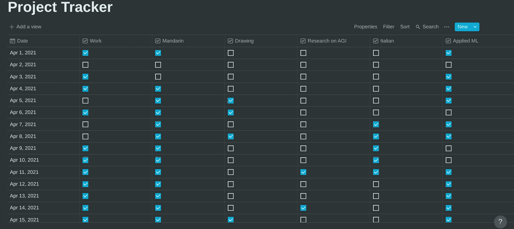
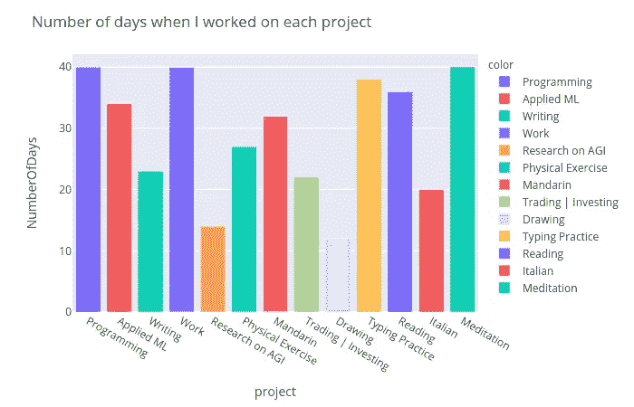
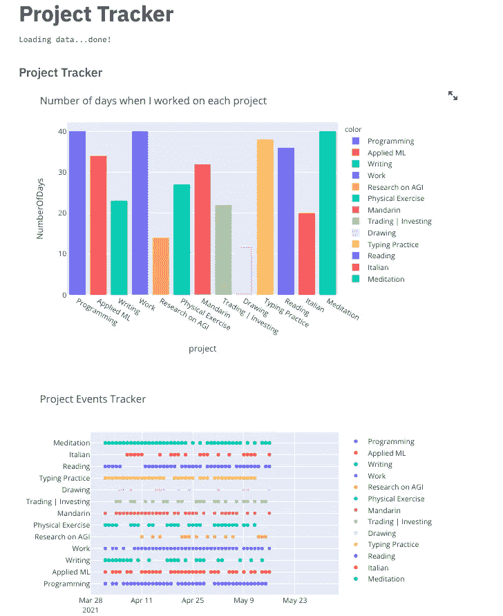

# 使用概念 API 和 Python 进行生产力跟踪

> 原文：<https://towardsdatascience.com/productivity-tracking-with-the-notion-api-and-python-f5f866fe11d8?source=collection_archive---------7----------------------->


照片由[艾萨克·史密斯](https://unsplash.com/@isaacmsmith?utm_source=medium&utm_medium=referral)在 [Unsplash](https://unsplash.com?utm_source=medium&utm_medium=referral) 拍摄

## 使用新发布的概念 API 和 Streamlit 构建一个简单的项目跟踪仪表板

随着最近备受期待的测试版[概念 API](https://developers.notion.com) 的发布，许多应用程序之间的集成现在已经成为可能，整个宇宙的可能性现在为数据科学项目敞开了大门。

在这篇文章中，我将向你展示如何用 Streamlit 和概念 API 构建一个简单的项目跟踪仪表板。

如果你愿意，你可以看看我在 youtube 上关于这个话题的视频:

## 设置概念 API

让我们从[创建关于概念的页面](https://thesweetsetup.com/a-beginners-guide-to-notion/#:~:text=You%20have%20two%20options:%20create,%3E%20Embed%20a%20sub-page%20.)开始。现在，您需要在您的概念页面上创建一个集成令牌，然后与该集成共享您的数据库。关于如何做到这一点的详细教程可以在[这里](https://developers.notion.com/docs/getting-started)找到。

## 设置一个简单的 python API 从数据库中获取数据

现在，您可以设置一个简单的 python API 来与您的概念应用程序中的数据库进行通信，以便您可以获取数据。

在我的例子中，我创建了一个简单的数据库，每个属性(表中的列)引用一个项目，每一行与一个月中的某一天相关，每个条目包含一个复选框，指示该项目是否在给定的那一天工作。在我的概念页面上，看起来是这样的:



作者图片

为了从概念数据库中获取数据，我们可以用三种方法编写一个类:

1.  `query_databases()`从概念应用程序中获取数据；
2.  `get_projects_titles`获取您正在跟踪的项目的名称(它们将是您的概念数据库中的列的标题)；
3.  `get_projects_data`从概念 API 获得的结果字典对象中获取项目跟踪数据。

python API 的完整代码:

让我们快速分析一下每个组件:

*   **查询数据库**

这里，我们使用来自概念 API 的集成令牌向我们的数据库发送一个 post 请求，并以 json 对象的形式返回响应，以便将数据格式化为我们稍后需要可视化的形状。

*   **获取项目名称**

这里，我们只是检索数据库中的所有属性。关于如何使用概念 API 处理数据库的更多细节可以在[这里](https://developers.notion.com/docs/working-with-databases)找到。

*   **获取项目数据**

最后，我们从每个项目以及日期列中获取数据。

## 使用 Streamlit 和 plotly 设置可视化

现在我们已经加载了数据，让我们使用`plotly`包来绘制项目的信息。

让我们做一些简单的事情，绘制一个条形图，显示在跟踪期间(在本例中是过去 45 天)每个项目上花费的天数，以及一个项目事件散点图，显示我的日常活动(我是否参与了每个项目)。

让我们从导入依赖项开始。

```
import plotly.graph_objs as go
import pandas as pd
import plotly.express as px
from notion_api import *
```

现在，我们使用 python API 从概念数据库中获取数据。

```
nsync = NotionSync()
data = nsync.query_databases()
projects = nsync.get_projects_titles(data)
projects_data,dates = nsync.get_projects_data(data,projects)
```

我们用我们想要研究的数据建立了一个数据框架，并绘制了事件跟踪器和条形图。



效果非常好！这个工具真正酷的方面是， ***当我们更新我们的概念页面时，这个图会自动更新*** 而不需要任何额外的努力。

现在， ***让我们绘制一个事件图*** ，告诉我们在给定的时间段内每天都在做什么。

我们需要将数据库中 checkbox 属性的布尔值转换为连续值，我们可以用这种方式绘制这些值，y 轴上的每条线代表一个不同的项目，该线区域上的每个点代表在给定的一天参与了该项目。


作者图片

我们找到了。最后，让我们将这段代码封装在一个 Streamlit 应用程序中，这样我们就可以在任何时候通过在终端上运行一个命令来查看我们的数据。

为此，我们只需要几行代码:

作者图片

`load_data`函数负责直接从我们的概念数据库中获取数据，下面的代码只是使用`plotly`包为要在 Streamlit 中显示的图设置标题和副标题。Streamlit 的极简风格让这变得非常简单。

在终端上，使用`streamlit run app.py`运行 Streamlit 应用程序



作者图片

这个项目的完整源代码可以在这里找到。

# 关于在数据科学项目中使用概念 API 的最终想法

这个新的测试版的概念 API 非常强大。意识到这个应用程序只提供了一个 javascript 版本的 SDK，我写了这段代码来使它很好地与 python 集成。

concept 现在提供的与这个官方 API 的集成真的可以将像这样的生产力项目带到一个全新的水平，我觉得我们会在即将到来的未来看到越来越多真正有趣的功能出现。

如果你喜欢这篇文章，请在 [Twitter](https://twitter.com/LucasEnkrateia) 、 [LinkedIn](https://www.linkedin.com/in/lucas-soares-969044167/) 上联系我，并在 [Medium](https://lucas-soares.medium.com) 上关注我。谢谢，下次再见！:)

# 参考

*   [概念 API 入门](https://developers.notion.com/docs/getting-started)
*   [在概念中使用数据库](https://developers.notion.com/docs/working-with-databases)
*   [检索概念中的数据库](https://developers.notion.com/reference/get-database)
*   [Python API 集成教程](https://realpython.com/api-integration-in-python/)
*   [流线](https://streamlit.io)